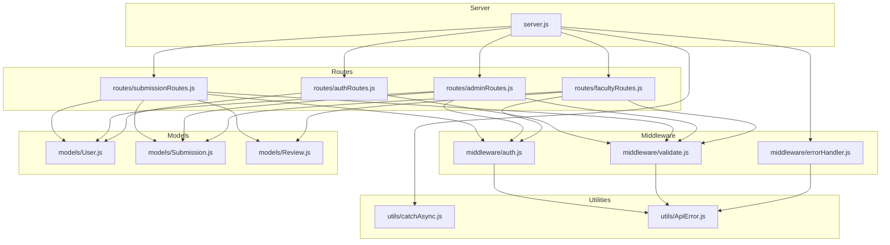
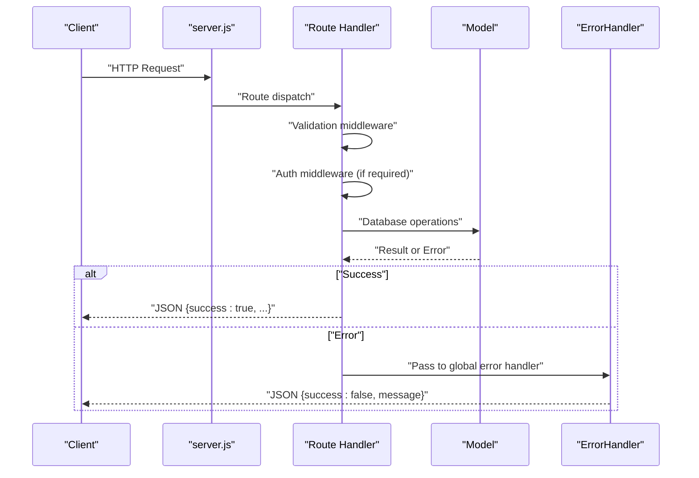
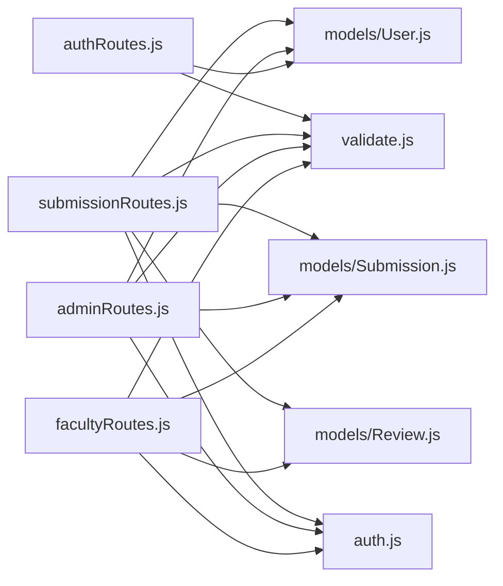

# API Endpoints Reference

<cite>
**Referenced Files in This Document**
- [server.js](file://server.js)
- [authRoutes.js](file://routes/authRoutes.js)
- [submissionRoutes.js](file://routes/submissionRoutes.js)
- [adminRoutes.js](file://routes/adminRoutes.js)
- [facultyRoutes.js](file://routes/facultyRoutes.js)
- [auth.js](file://middleware/auth.js)
- [validate.js](file://middleware/validate.js)
- [errorHandler.js](file://middleware/errorHandler.js)
- [ApiError.js](file://utils/ApiError.js)
- [catchAsync.js](file://utils/catchAsync.js)
- [User.js](file://models/User.js)
- [Submission.js](file://models/Submission.js)
- [Review.js](file://models/Review.js)
</cite>

## Table of Contents
1. [Introduction](#introduction)
2. [Project Structure](#project-structure)
3. [Core Components](#core-components)
4. [Architecture Overview](#architecture-overview)
5. [Detailed Component Analysis](#detailed-component-analysis)
6. [Dependency Analysis](#dependency-analysis)
7. [Performance Considerations](#performance-considerations)
8. [Troubleshooting Guide](#troubleshooting-guide)
9. [Conclusion](#conclusion)

## Introduction
This document provides comprehensive API documentation for the Academic Submission Portal RESTful endpoints. It covers authentication, submission management, admin dashboard, and faculty workflow endpoints. For each endpoint, you will find HTTP methods, URL patterns, request/response schemas, authentication requirements, role permissions, parameter validation rules, and common error scenarios.

## Project Structure
The backend follows a modular Express.js architecture with route handlers organized by feature, shared middleware for authentication and validation, and Mongoose models representing domain entities.

**Diagram sources**
- [server.js](file://server.js#L62-L66)
- [authRoutes.js](file://routes/authRoutes.js#L1-L85)
- [submissionRoutes.js](file://routes/submissionRoutes.js#L1-L159)
- [adminRoutes.js](file://routes/adminRoutes.js#L1-L184)
- [facultyRoutes.js](file://routes/facultyRoutes.js#L1-L172)
- [auth.js](file://middleware/auth.js#L1-L25)
- [validate.js](file://middleware/validate.js#L1-L120)
- [errorHandler.js](file://middleware/errorHandler.js#L1-L53)
- [ApiError.js](file://utils/ApiError.js#L1-L17)
- [catchAsync.js](file://utils/catchAsync.js#L1-L8)
- [User.js](file://models/User.js#L1-L20)
- [Submission.js](file://models/Submission.js#L1-L30)
- [Review.js](file://models/Review.js#L1-L18)

**Section sources**
- [server.js](file://server.js#L62-L66)

## Core Components
- Authentication middleware enforces JWT-based bearer tokens and role checks.
- Validation middleware applies express-validator rules and converts validation errors into ApiError instances.
- Error handling middleware standardizes error responses and handles various database and multer error types.
- Route handlers implement endpoint logic with async wrappers and role guards.

Key behaviors:
- All endpoints return a consistent JSON envelope with a success flag and either data or an error message.
- Authentication is enforced via Authorization: Bearer <token> headers.
- Role-based access control restricts endpoints to specific roles.

**Section sources**
- [auth.js](file://middleware/auth.js#L3-L23)
- [validate.js](file://middleware/validate.js#L4-L16)
- [errorHandler.js](file://middleware/errorHandler.js#L3-L50)
- [ApiError.js](file://utils/ApiError.js#L1-L17)

## Architecture Overview
The API is mounted under /api with four primary route groups:
- /api/auth: Registration, login, and profile retrieval
- /api/submissions: Upload, list, and view individual submissions
- /api/admin: Admin dashboards, user/submission listings, and assignment
- /api/faculty: Assigned submissions, review history, and submission reviews

**Diagram sources**
- [server.js](file://server.js#L62-L82)
- [authRoutes.js](file://routes/authRoutes.js#L8-L26)
- [submissionRoutes.js](file://routes/submissionRoutes.js#L47-L83)
- [adminRoutes.js](file://routes/adminRoutes.js#L9-L18)
- [facultyRoutes.js](file://routes/facultyRoutes.js#L9-L42)
- [errorHandler.js](file://middleware/errorHandler.js#L3-L50)

## Detailed Component Analysis

### Authentication Endpoints
- Base path: /api/auth
- Authentication: Not required for registration and login; current user endpoint requires bearer token.

Endpoints:
- POST /api/auth/register
  - Purpose: Register a new user account.
  - Authentication: None.
  - Role permissions: N/A.
  - Request body:
    - name: string (required, 2–50 chars)
    - email: string (required, valid email)
    - password: string (required, min 6 chars, must include uppercase, lowercase, digit)
    - role: string (optional, one of student, faculty, admin)
    - dept: string (optional, max 50 chars)
    - year: string (optional, max 20 chars)
  - Responses:
    - 201 Created: { success: true, message: string, userId: ObjectId }
    - 400 Bad Request: Validation errors
    - 409 Conflict: Email already exists
  - Example request:
    - POST /api/auth/register with JSON body containing name, email, password, role, dept, year
  - Example response:
    - 201 Created: { success: true, message: "Registered successfully", userId: "<ObjectId>" }

- POST /api/auth/login
  - Purpose: Authenticate user and return JWT.
  - Authentication: None.
  - Role permissions: N/A.
  - Request body:
    - email: string (required, valid email)
    - password: string (required)
  - Responses:
    - 200 OK: { success: true, token: string, role: string, name: string, userId: ObjectId }
    - 401 Unauthorized: Invalid credentials
    - 400 Bad Request: Validation errors
  - Example request:
    - POST /api/auth/login with JSON body containing email, password
  - Example response:
    - 200 OK: { success: true, token: "<jwt>", role: "student", name: "John Doe", userId: "<ObjectId>" }

- GET /api/auth/me
  - Purpose: Retrieve currently authenticated user profile.
  - Authentication: Bearer token required.
  - Role permissions: N/A.
  - Responses:
    - 200 OK: { success: true, user: { id, name, email, role, dept, year } }
    - 401 Unauthorized: Missing or invalid token
    - 404 Not Found: User not found
  - Example response:
    - 200 OK: { success: true, user: { id: "<ObjectId>", name: "John Doe", email: "john@example.com", role: "student", dept: "", year: "" } }

Validation rules:
- Registration: Name length, email format, password strength, optional role/dept/year constraints.
- Login: Email and password presence.

Common errors:
- 400 Bad Request: Validation failures.
- 401 Unauthorized: Invalid or missing token.
- 409 Conflict: Duplicate email during registration.

**Section sources**
- [authRoutes.js](file://routes/authRoutes.js#L8-L55)
- [validate.js](file://middleware/validate.js#L18-L53)
- [auth.js](file://middleware/auth.js#L3-L23)
- [errorHandler.js](file://middleware/errorHandler.js#L28-L37)

### Submission Management Endpoints
- Base path: /api/submissions
- Authentication: Required for all endpoints except public health check.
- Role permissions:
  - Student: upload, view own submissions
  - Faculty: view assigned submissions, submit reviews
  - Admin: manage assignments and dashboards

Endpoints:
- POST /api/submissions/upload
  - Purpose: Upload a PDF report for a student submission.
  - Authentication: Bearer token required; role must be student.
  - Request:
    - Form-data multipart:
      - report: file (PDF only, max 10MB)
    - JSON body:
      - title: string (required, 3–200 chars)
      - type: string (required, one of internship, project, research)
      - domain: string (optional, max 100 chars)
      - companyOrGuide: string (optional, max 100 chars)
  - Responses:
    - 201 Created: { success: true, message: string, submission: Submission }
    - 400 Bad Request: Missing file, invalid file type, invalid PDF content, validation errors
    - 403 Forbidden: Not authorized to upload
  - Example request:
    - POST /api/submissions/upload with form-data file and JSON body
  - Example response:
    - 201 Created: { success: true, message: "Submission uploaded successfully", submission: { ... } }

- GET /api/submissions/mine
  - Purpose: List current student’s submissions with associated reviews.
  - Authentication: Bearer token required; role must be student.
  - Query params:
    - page: integer (default 1, min 1)
    - limit: integer (default 10, min 1, max 100)
  - Responses:
    - 200 OK: { success: true, submissions: Submission[], reviews: Review[], pagination: { page, limit, total, pages } }
    - 400 Bad Request: Pagination validation errors
  - Example response:
    - 200 OK: { success: true, submissions: [...], reviews: [...], pagination: { page: 1, limit: 10, total: 2, pages: 1 } }

- GET /api/submissions/:id
  - Purpose: View a specific submission and its reviews.
  - Authentication: Bearer token required.
  - Permissions:
    - Students can only view their own submissions.
    - Faculty can only view submissions assigned to them.
  - Responses:
    - 200 OK: { success: true, submission: Submission, reviews: Review[] }
    - 403 Forbidden: Permission denied
    - 404 Not Found: Submission not found
  - Example response:
    - 200 OK: { success: true, submission: { ... }, reviews: [...] }

Validation rules:
- Upload: title length/type enum/domain/companyOrGuide constraints.
- Pagination: page and limit constraints.

Common errors:
- 400 Bad Request: File size/type/content issues, validation failures.
- 403 Forbidden: Access to unauthorized submission.
- 404 Not Found: Submission not found.

**Section sources**
- [submissionRoutes.js](file://routes/submissionRoutes.js#L47-L157)
- [validate.js](file://middleware/validate.js#L55-L72)
- [validate.js](file://middleware/validate.js#L101-L109)
- [auth.js](file://middleware/auth.js#L3-L23)
- [Submission.js](file://models/Submission.js#L3-L28)
- [Review.js](file://models/Review.js#L3-L18)

### Admin Dashboard Endpoints
- Base path: /api/admin
- Authentication: Bearer token required; role must be admin.

Endpoints:
- GET /api/admin/faculty
  - Purpose: Fetch all faculty members for dropdown selection.
  - Authentication: admin required.
  - Responses:
    - 200 OK: { success: true, faculty: [{ name, email, dept }] }
  - Example response:
    - 200 OK: { success: true, faculty: [{ name: "Dr. Smith", email: "smith@uni.edu", dept: "CS" }] }

- GET /api/admin/users
  - Purpose: Paginated and searchable user listing.
  - Authentication: admin required.
  - Query params:
    - page: integer (default 1, min 1)
    - limit: integer (default 10, min 1, max 100)
    - search: string (case-insensitive name or email)
    - role: string (filter by role)
  - Responses:
    - 200 OK: { success: true, users: User[], pagination: { page, limit, total, pages } }
  - Example response:
    - 200 OK: { success: true, users: [...], pagination: { page: 1, limit: 10, total: 5, pages: 1 } }

- GET /api/admin/submissions
  - Purpose: Paginated and filtered submission listing.
  - Authentication: admin required.
  - Query params:
    - page: integer (default 1, min 1)
    - limit: integer (default 10, min 1, max 100)
    - status: string (filter by status)
    - type: string (filter by type)
    - search: string (case-insensitive student name or email)
  - Responses:
    - 200 OK: { success: true, submissions: Submission[], pagination: { page, limit, total, pages } }
  - Example response:
    - 200 OK: { success: true, submissions: [...], pagination: { page: 1, limit: 10, total: 3, pages: 1 } }

- POST /api/admin/assign
  - Purpose: Assign a submission to a faculty member.
  - Authentication: admin required.
  - Request body:
    - submissionId: ObjectId (required)
    - facultyId: ObjectId (required)
  - Responses:
    - 200 OK: { success: true, message: string, submission: Submission }
    - 404 Not Found: Submission or faculty not found
    - 400 Bad Request: Validation errors
  - Example request:
    - POST /api/admin/assign with JSON body containing submissionId, facultyId
  - Example response:
    - 200 OK: { success: true, message: "Faculty assigned successfully", submission: { ... } }

- GET /api/admin/stats
  - Purpose: Admin dashboard statistics.
  - Authentication: admin required.
  - Responses:
    - 200 OK: { success: true, stats: { users: { total, students, faculty }, submissions: { total, pending, assigned, approved } } }
  - Example response:
    - 200 OK: { success: true, stats: { users: { total: 100, students: 90, faculty: 10 }, submissions: { total: 45, pending: 20, assigned: 15, approved: 10 } } }

Validation rules:
- Assign: submissionId and facultyId must be valid MongoDB ObjectIds.
- Pagination: page and limit constraints.

Common errors:
- 400 Bad Request: Validation failures.
- 403 Forbidden: Non-admin access.
- 404 Not Found: Resource not found.

**Section sources**
- [adminRoutes.js](file://routes/adminRoutes.js#L9-L184)
- [validate.js](file://middleware/validate.js#L74-L82)
- [validate.js](file://middleware/validate.js#L101-L109)
- [auth.js](file://middleware/auth.js#L3-L23)
- [User.js](file://models/User.js#L3-L18)
- [Submission.js](file://models/Submission.js#L3-L28)

### Faculty Workflow Endpoints
- Base path: /api/faculty
- Authentication: Bearer token required; role must be faculty.

Endpoints:
- GET /api/faculty/assigned
  - Purpose: List submissions assigned to the current faculty member.
  - Authentication: faculty required.
  - Query params:
    - page: integer (default 1, min 1)
    - limit: integer (default 10, min 1, max 100)
    - status: string (filter by status)
  - Responses:
    - 200 OK: { success: true, submissions: Submission[], pagination: { page, limit, total, pages } }
  - Example response:
    - 200 OK: { success: true, submissions: [...], pagination: { page: 1, limit: 10, total: 3, pages: 1 } }

- GET /api/faculty/reviews
  - Purpose: View the faculty member’s review history.
  - Authentication: faculty required.
  - Query params:
    - page: integer (default 1, min 1)
    - limit: integer (default 10, min 1, max 100)
  - Responses:
    - 200 OK: { success: true, reviews: Review[], pagination: { page, limit, total, pages } }
  - Example response:
    - 200 OK: { success: true, reviews: [...], pagination: { page: 1, limit: 10, total: 2, pages: 1 } }

- POST /api/faculty/review
  - Purpose: Submit or update a review for a submission.
  - Authentication: faculty required.
  - Request body:
    - submissionId: ObjectId (required)
    - decision: string (required, one of Approved, Resubmission Required)
    - marks: number (optional, 0–100)
    - remarks: string (optional, max 1000 chars)
  - Responses:
    - 200 OK: { success: true, message: string, review: Review, newStatus: string }
    - 400 Bad Request: Validation errors
    - 403 Forbidden: Submission not assigned to this faculty
    - 404 Not Found: Submission not found
  - Example request:
    - POST /api/faculty/review with JSON body containing submissionId, decision, marks, remarks
  - Example response:
    - 200 OK: { success: true, message: "Review submitted successfully", review: { ... }, newStatus: "Approved" }

- GET /api/faculty/stats
  - Purpose: Faculty dashboard statistics.
  - Authentication: faculty required.
  - Responses:
    - 200 OK: { success: true, stats: { assigned, pending, approved, resubmissions, totalReviews } }
  - Example response:
    - 200 OK: { success: true, stats: { assigned: 5, pending: 3, approved: 1, resubmissions: 1, totalReviews: 2 } }

Validation rules:
- Review: submissionId ObjectId, decision enum, marks numeric range, remarks length.
- Pagination: page and limit constraints.

Common errors:
- 400 Bad Request: Validation failures.
- 403 Forbidden: Submission not assigned to faculty.
- 404 Not Found: Submission not found.

**Section sources**
- [facultyRoutes.js](file://routes/facultyRoutes.js#L9-L172)
- [validate.js](file://middleware/validate.js#L84-L99)
- [validate.js](file://middleware/validate.js#L101-L109)
- [auth.js](file://middleware/auth.js#L3-L23)
- [Submission.js](file://models/Submission.js#L3-L28)
- [Review.js](file://models/Review.js#L3-L18)

## Dependency Analysis
The following diagram shows how route handlers depend on middleware and models.

**Diagram sources**
- [authRoutes.js](file://routes/authRoutes.js#L1-L85)
- [submissionRoutes.js](file://routes/submissionRoutes.js#L1-L159)
- [adminRoutes.js](file://routes/adminRoutes.js#L1-L184)
- [facultyRoutes.js](file://routes/facultyRoutes.js#L1-L172)
- [auth.js](file://middleware/auth.js#L1-L25)
- [validate.js](file://middleware/validate.js#L1-L120)
- [User.js](file://models/User.js#L1-L20)
- [Submission.js](file://models/Submission.js#L1-L30)
- [Review.js](file://models/Review.js#L1-L18)

**Section sources**
- [authRoutes.js](file://routes/authRoutes.js#L1-L85)
- [submissionRoutes.js](file://routes/submissionRoutes.js#L1-L159)
- [adminRoutes.js](file://routes/adminRoutes.js#L1-L184)
- [facultyRoutes.js](file://routes/facultyRoutes.js#L1-L172)

## Performance Considerations
- Rate limiting:
  - General API endpoints: 100 requests per 15 minutes per IP.
  - Authentication endpoints: 5 requests per 15 minutes per IP.
- File upload size limit: 10 MB for PDFs.
- Pagination defaults: page=1, limit=10; maximum limit is 100 per page.
- Bulk operations use Promise.all for concurrent reads to reduce latency.

[No sources needed since this section provides general guidance]

## Troubleshooting Guide
Common error scenarios and resolutions:
- 400 Bad Request:
  - Validation failures: Check request body against validation rules.
  - File size/type issues: Ensure PDF ≤ 10MB and correct MIME type.
  - Duplicate entries: Unique constraints on email.
- 401 Unauthorized:
  - Missing or invalid Bearer token; re-authenticate.
  - Token expired; obtain a new token.
- 403 Forbidden:
  - Accessing resources not owned by the user (student/faculty).
  - Non-admin attempting admin-only endpoints.
- 404 Not Found:
  - Resource not found (user, submission, faculty).
  - Invalid ObjectId format.
- Server errors:
  - Unexpected internal errors; check server logs.

Error response format:
- { success: false, message: string, stack?: string in development }

**Section sources**
- [errorHandler.js](file://middleware/errorHandler.js#L3-L50)
- [ApiError.js](file://utils/ApiError.js#L1-L17)
- [validate.js](file://middleware/validate.js#L4-L16)

## Conclusion
This API provides a secure, validated, and role-aware interface for managing academic submissions. Authentication and authorization are enforced consistently, while validation ensures robust request handling. Admin, faculty, and student endpoints are clearly separated by role, and error handling is standardized across the board.