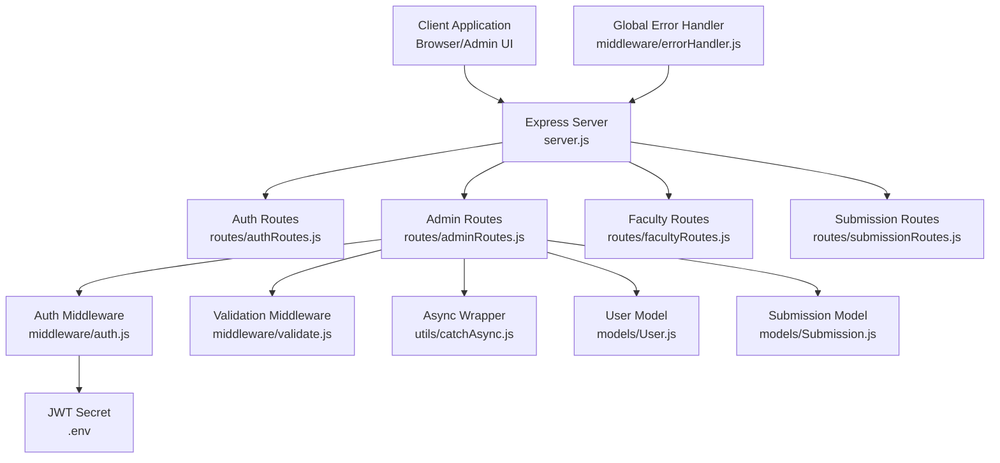
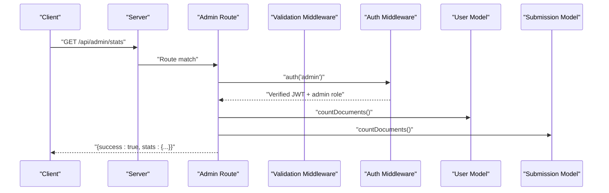
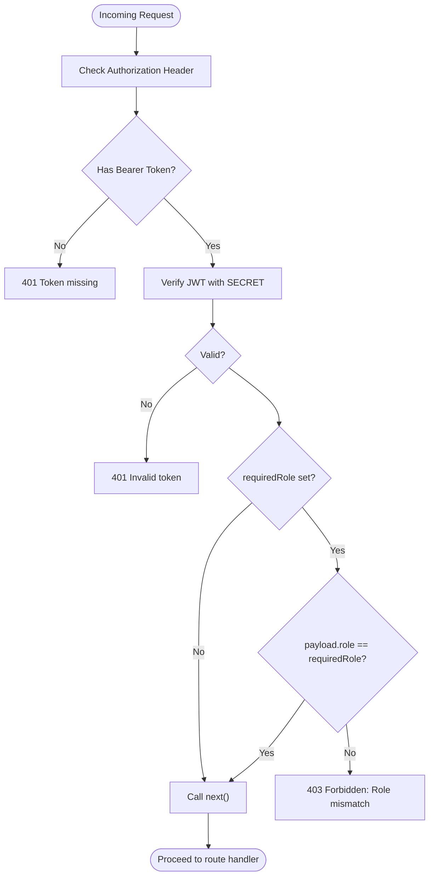
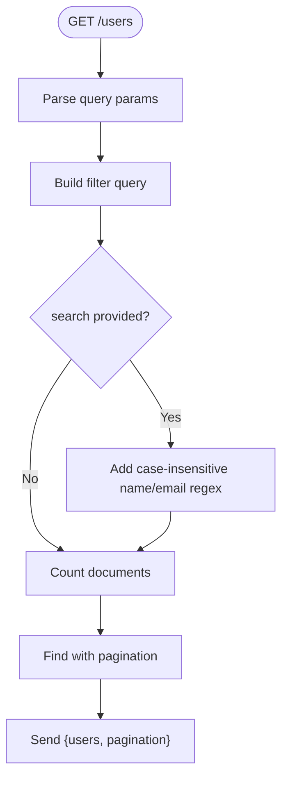
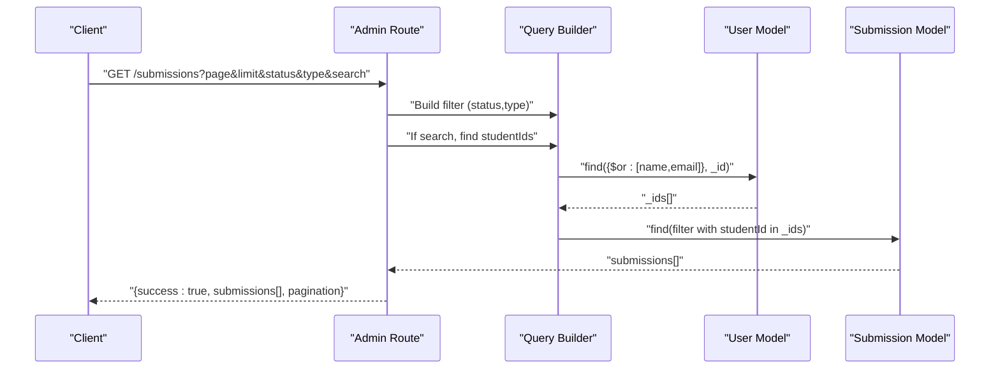
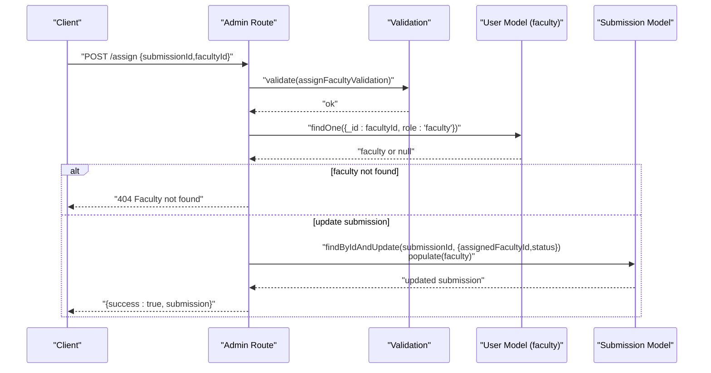
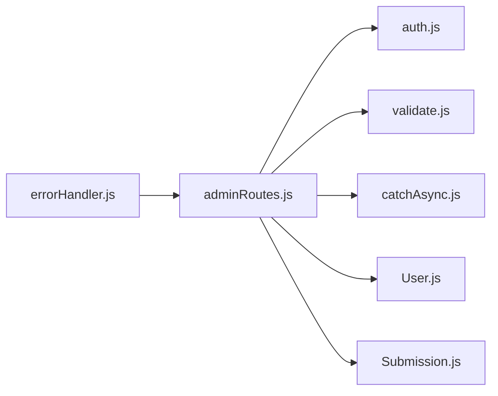

# Admin Dashboard Endpoints

<cite>
**Referenced Files in This Document**
- [server.js](file://server.js)
- [adminRoutes.js](file://routes/adminRoutes.js)
- [auth.js](file://middleware/auth.js)
- [validate.js](file://middleware/validate.js)
- [ApiError.js](file://utils/ApiError.js)
- [errorHandler.js](file://middleware/errorHandler.js)
- [User.js](file://models/User.js)
- [Submission.js](file://models/Submission.js)
- [.env](file://.env)
- [authRoutes.js](file://routes/authRoutes.js)
- [catchAsync.js](file://utils/catchAsync.js)
- [admin.html](file://public/admin.html)
</cite>

## Table of Contents
1. [Introduction](#introduction)
2. [Project Structure](#project-structure)
3. [Core Components](#core-components)
4. [Architecture Overview](#architecture-overview)
5. [Detailed Component Analysis](#detailed-component-analysis)
6. [Dependency Analysis](#dependency-analysis)
7. [Performance Considerations](#performance-considerations)
8. [Troubleshooting Guide](#troubleshooting-guide)
9. [Conclusion](#conclusion)
10. [Appendices](#appendices)

## Introduction
This document provides comprehensive API documentation for admin-only endpoints that power the administrative dashboard. It covers administrative user management, faculty assignment workflows, system monitoring, and reporting capabilities. The documentation details role-based access control (admin role only), JWT authentication flow, request/response schemas, pagination and filtering parameters, examples of authorized access patterns, error handling for unauthorized requests, and security considerations including audit logging recommendations.

## Project Structure
The backend is organized around Express routes grouped by domain, shared middleware for authentication and validation, database models, and global error handling. The admin module is mounted under /api/admin and secured via an authentication middleware that enforces admin role.

**Diagram sources**
- [server.js](file://server.js#L62-L66)
- [adminRoutes.js](file://routes/adminRoutes.js#L1-L184)
- [auth.js](file://middleware/auth.js#L1-L25)
- [validate.js](file://middleware/validate.js#L1-L120)
- [catchAsync.js](file://utils/catchAsync.js#L1-L8)
- [User.js](file://models/User.js#L1-L20)
- [Submission.js](file://models/Submission.js#L1-L30)
- [.env](file://.env#L1-L4)
- [errorHandler.js](file://middleware/errorHandler.js#L1-L53)

**Section sources**
- [server.js](file://server.js#L1-L92)

## Core Components
- Authentication middleware enforces JWT verification and admin role checks.
- Validation middleware standardizes request validation and error propagation.
- Admin routes implement user listing, submission listing, faculty assignment, and dashboard statistics.
- Models define the data structures for users and submissions.
- Global error handler normalizes error responses and logs errors.

Key responsibilities:
- Admin routes: Secure endpoints for admin operations with pagination, filtering, and population of related entities.
- Auth middleware: Extracts Bearer token, verifies JWT, attaches user payload to request, and enforces role.
- Validation middleware: Aggregates validation errors and converts them to structured API errors.
- Error handler: Centralized error response formatting and logging.

**Section sources**
- [auth.js](file://middleware/auth.js#L1-L25)
- [validate.js](file://middleware/validate.js#L1-L120)
- [adminRoutes.js](file://routes/adminRoutes.js#L1-L184)
- [User.js](file://models/User.js#L1-L20)
- [Submission.js](file://models/Submission.js#L1-L30)
- [errorHandler.js](file://middleware/errorHandler.js#L1-L53)

## Architecture Overview
The admin endpoints follow a layered architecture:
- Route handlers enforce admin role and apply validation.
- Async wrapper ensures uncaught exceptions are routed to the error handler.
- Database queries use aggregation-friendly patterns with pagination and optional filters.
- Responses adhere to a consistent success/message structure.

**Diagram sources**
- [adminRoutes.js](file://routes/adminRoutes.js#L150-L182)
- [auth.js](file://middleware/auth.js#L3-L23)
- [User.js](file://models/User.js#L1-L20)
- [Submission.js](file://models/Submission.js#L1-L30)

## Detailed Component Analysis

### Authentication and Authorization
- JWT-based authentication with bearer token scheme.
- Token verification uses a secret from environment variables.
- Role enforcement occurs after successful token verification.
- Unauthorized access returns 401 for missing/invalid tokens and 403 for role mismatch.

**Diagram sources**
- [auth.js](file://middleware/auth.js#L3-L23)
- [.env](file://.env#L3-L3)

**Section sources**
- [auth.js](file://middleware/auth.js#L1-L25)
- [.env](file://.env#L1-L4)

### Admin Routes Overview
- Base path: /api/admin
- All endpoints require admin role via auth("admin").
- Validation middleware is applied where appropriate.
- Consistent response envelope: { success: boolean, ...data }.

**Section sources**
- [adminRoutes.js](file://routes/adminRoutes.js#L1-L184)

### Endpoint: GET /api/admin/faculty
- Purpose: Retrieve all faculty members for selection dropdowns.
- Authentication: admin only.
- Response: Array of faculty objects with selected fields.

Request
- Headers: Authorization: Bearer <token>
- Query parameters: None

Response
- 200 OK: { success: true, faculty: [{ name, email, dept }, ...] }

Security and Access
- Enforced by auth("admin").

**Section sources**
- [adminRoutes.js](file://routes/adminRoutes.js#L9-L18)
- [auth.js](file://middleware/auth.js#L14-L16)

### Endpoint: GET /api/admin/users
- Purpose: List users with pagination, search, and role filtering.
- Authentication: admin only.
- Query parameters:
  - page: integer, default 1, min 1
  - limit: integer, default 10, min 1..100
  - search: string (case-insensitive name or email regex)
  - role: string (student | faculty | admin)

Response
- 200 OK: { success: true, users: [...], pagination: { page, limit, total, pages } }

Processing logic
- Build query with optional $or for name/email and role filter.
- Execute parallel count and paginated find.
- Sort by creation date descending.

**Diagram sources**
- [adminRoutes.js](file://routes/adminRoutes.js#L20-L61)
- [validate.js](file://middleware/validate.js#L101-L109)

**Section sources**
- [adminRoutes.js](file://routes/adminRoutes.js#L20-L61)
- [validate.js](file://middleware/validate.js#L101-L109)

### Endpoint: GET /api/admin/submissions
- Purpose: List submissions with pagination and filters.
- Authentication: admin only.
- Query parameters:
  - page: integer, default 1, min 1
  - limit: integer, default 10, min 1..100
  - status: string (Submitted | Assigned | Approved | Resubmission Required)
  - type: string (internship | project | research)
  - search: string (case-insensitive name or email)

Response
- 200 OK: { success: true, submissions: [...], pagination: { page, limit, total, pages } }

Processing logic
- Apply status/type filters.
- If search provided, resolve student IDs via User collection regex match.
- Populate student and assigned faculty details.
- Execute parallel count and paginated find.

**Diagram sources**
- [adminRoutes.js](file://routes/adminRoutes.js#L63-L117)
- [Submission.js](file://models/Submission.js#L1-L30)
- [User.js](file://models/User.js#L1-L20)

**Section sources**
- [adminRoutes.js](file://routes/adminRoutes.js#L63-L117)
- [Submission.js](file://models/Submission.js#L1-L30)
- [User.js](file://models/User.js#L1-L20)

### Endpoint: POST /api/admin/assign
- Purpose: Assign a faculty member to a submission.
- Authentication: admin only.
- Request body:
  - submissionId: ObjectId
  - facultyId: ObjectId

Response
- 200 OK: { success: true, message: "Faculty assigned successfully", submission: { ... } }
- 404: If submission or faculty not found.

Validation
- Uses assignFacultyValidation to ensure ObjectId format.

**Diagram sources**
- [adminRoutes.js](file://routes/adminRoutes.js#L119-L148)
- [validate.js](file://middleware/validate.js#L74-L82)
- [User.js](file://models/User.js#L1-L20)
- [Submission.js](file://models/Submission.js#L1-L30)

**Section sources**
- [adminRoutes.js](file://routes/adminRoutes.js#L119-L148)
- [validate.js](file://middleware/validate.js#L74-L82)
- [User.js](file://models/User.js#L1-L20)
- [Submission.js](file://models/Submission.js#L1-L30)

### Endpoint: GET /api/admin/stats
- Purpose: Retrieve system-wide statistics for the admin dashboard.
- Authentication: admin only.
- Response
  - 200 OK: { success: true, stats: { users: { total, students, faculty }, submissions: { total, pending, assigned, approved } } }

Processing logic
- Executes parallel counts for total users, student/faculty counts, total submissions, and counts by status.

**Section sources**
- [adminRoutes.js](file://routes/adminRoutes.js#L150-L182)

### Request/Response Schemas

Common response envelope
- All admin endpoints return a consistent envelope:
  - success: boolean
  - Additional fields vary by endpoint

Pagination parameters
- page: integer, default 1, min 1
- limit: integer, default 10, min 1..100

Filtering options
- Users: search (name or email regex), role
- Submissions: status, type, search (student name/email)

Validation rules
- assignFacultyValidation: submissionId and facultyId are required and must be valid ObjectId.
- paginationValidation: page and limit must be integers within specified ranges.

**Section sources**
- [adminRoutes.js](file://routes/adminRoutes.js#L20-L61)
- [adminRoutes.js](file://routes/adminRoutes.js#L63-L117)
- [adminRoutes.js](file://routes/adminRoutes.js#L119-L148)
- [validate.js](file://middleware/validate.js#L74-L82)
- [validate.js](file://middleware/validate.js#L101-L109)

### Authorized Access Patterns and Examples
- Admin login flow:
  - POST /api/auth/login with email and password.
  - Response includes token, role, name, and userId.
- Frontend usage pattern:
  - Store token in localStorage upon login.
  - Include Authorization: Bearer <token> in all admin requests.
  - Example client behavior is demonstrated in the admin HTML page.

Example references
- Token issuance and payload structure: [authRoutes.js](file://routes/authRoutes.js#L42-L46)
- Client-side admin page enforcing admin role and sending Bearer token: [admin.html](file://public/admin.html#L86-L104)

**Section sources**
- [authRoutes.js](file://routes/authRoutes.js#L28-L55)
- [admin.html](file://public/admin.html#L86-L104)

### Error Handling and Unauthorized Access
- Missing token: 401 Token missing
- Invalid/expired token: 401 Invalid token
- Role mismatch: 403 Forbidden: Role mismatch
- Validation errors: 400 with aggregated messages
- Resource not found (ObjectId cast errors): 404 Resource not found
- Duplicate field errors: 400 Duplicate field value entered

Global error handler behavior
- Logs error to console.
- Normalizes response with success:false and message.
- Includes stack trace in development mode.

**Section sources**
- [auth.js](file://middleware/auth.js#L9-L21)
- [errorHandler.js](file://middleware/errorHandler.js#L28-L37)
- [validate.js](file://middleware/validate.js#L13-L14)
- [ApiError.js](file://utils/ApiError.js#L1-L17)

## Dependency Analysis
Admin routes depend on:
- Authentication middleware for JWT verification and role enforcement.
- Validation middleware for input sanitization and error propagation.
- Models for data access and population of related entities.
- Async wrapper to centralize promise error handling.

**Diagram sources**
- [adminRoutes.js](file://routes/adminRoutes.js#L1-L184)
- [auth.js](file://middleware/auth.js#L1-L25)
- [validate.js](file://middleware/validate.js#L1-L120)
- [catchAsync.js](file://utils/catchAsync.js#L1-L8)
- [User.js](file://models/User.js#L1-L20)
- [Submission.js](file://models/Submission.js#L1-L30)
- [errorHandler.js](file://middleware/errorHandler.js#L1-L53)

**Section sources**
- [adminRoutes.js](file://routes/adminRoutes.js#L1-L184)

## Performance Considerations
- Parallel execution: Admin routes use Promise.all for count and data retrieval to minimize latency.
- Indexing recommendations:
  - Ensure indexes on User.email and Submission.studentId, assignedFacultyId for efficient joins and filtering.
  - Consider compound indexes for frequent filters (e.g., status, type, createdAt).
- Pagination limits: Enforced via validation to prevent excessive loads.
- Population: Use selective field projections to reduce payload sizes.

[No sources needed since this section provides general guidance]

## Troubleshooting Guide
Common issues and resolutions
- 401 Token missing: Ensure Authorization header with Bearer token is present.
- 401 Invalid token: Verify token signature and expiration; regenerate token if expired.
- 403 Forbidden: Confirm the user has admin role.
- 400 Validation errors: Correct input according to validation rules (ObjectId format, ranges).
- 404 Not found: Verify resource IDs exist and are accessible.

Audit logging recommendations
- Log all admin actions (user listing, submission assignment, stats access) with timestamp, admin user ID, IP address, and request metadata.
- Mask sensitive fields in logs (tokens, passwords).
- Retain logs for compliance and incident investigation.

**Section sources**
- [auth.js](file://middleware/auth.js#L9-L21)
- [errorHandler.js](file://middleware/errorHandler.js#L28-L37)
- [validate.js](file://middleware/validate.js#L13-L14)

## Conclusion
The admin dashboard endpoints provide a secure, validated, and efficient interface for administrative tasks. JWT-based authentication with admin role enforcement protects sensitive operations, while standardized validation and error handling improve reliability. The endpoints support essential admin workflows including user and submission management, faculty assignment, and system statistics, with clear request/response contracts and pagination/filtering options.

[No sources needed since this section summarizes without analyzing specific files]

## Appendices

### Endpoint Reference Summary
- GET /api/admin/faculty: List faculty for dropdowns.
- GET /api/admin/users: Paginated user listing with search and role filter.
- GET /api/admin/submissions: Paginated submissions with status/type/search filters.
- POST /api/admin/assign: Assign faculty to a submission.
- GET /api/admin/stats: System statistics.

**Section sources**
- [adminRoutes.js](file://routes/adminRoutes.js#L9-L182)