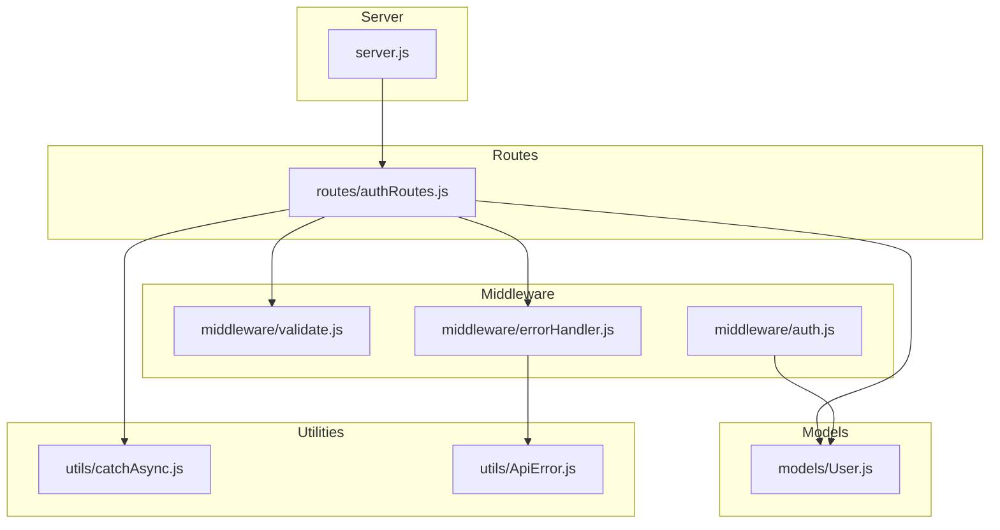
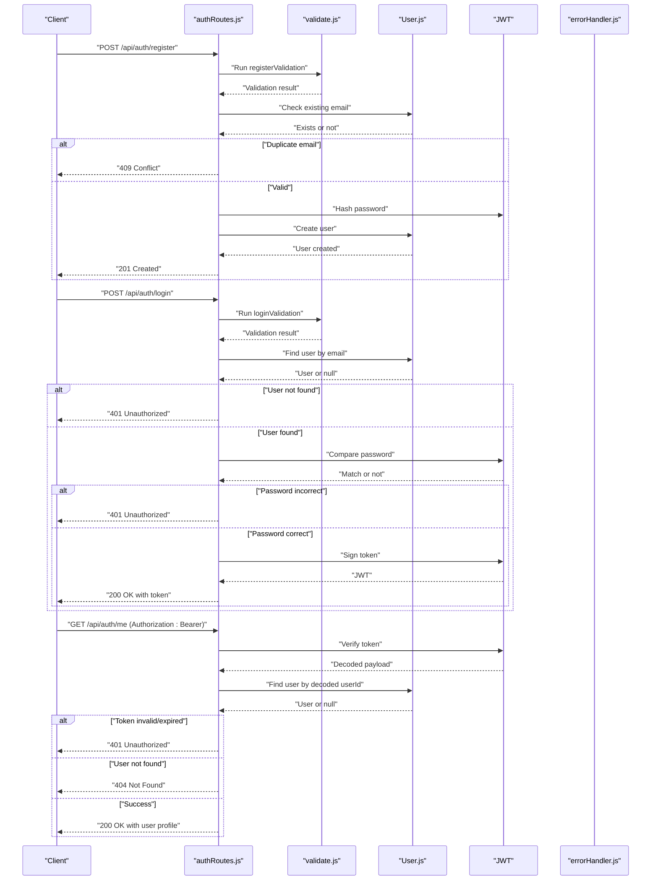
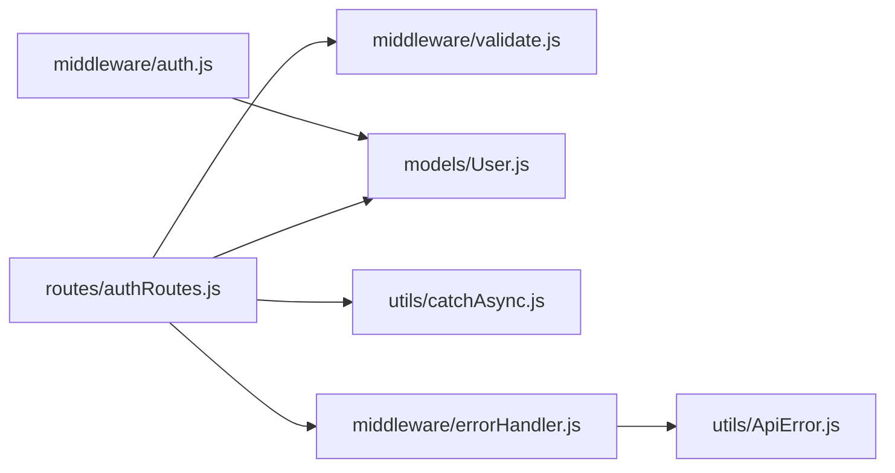

# Authentication Endpoints

<cite>
**Referenced Files in This Document**
- [server.js](file://server.js)
- [authRoutes.js](file://routes/authRoutes.js)
- [User.js](file://models/User.js)
- [validate.js](file://middleware/validate.js)
- [auth.js](file://middleware/auth.js)
- [errorHandler.js](file://middleware/errorHandler.js)
- [ApiError.js](file://utils/ApiError.js)
- [catchAsync.js](file://utils/catchAsync.js)
</cite>

## Table of Contents
1. [Introduction](#introduction)
2. [Project Structure](#project-structure)
3. [Core Components](#core-components)
4. [Architecture Overview](#architecture-overview)
5. [Detailed Component Analysis](#detailed-component-analysis)
6. [Dependency Analysis](#dependency-analysis)
7. [Performance Considerations](#performance-considerations)
8. [Troubleshooting Guide](#troubleshooting-guide)
9. [Conclusion](#conclusion)

## Introduction
This document provides comprehensive API documentation for the authentication endpoints in the backend service. It covers the registration, login, and user profile retrieval flows, including request/response schemas, validation rules, error handling, and security considerations. The endpoints are protected by JWT-based authentication and validated using structured validation middleware.

## Project Structure
The authentication endpoints are organized under the routes module and backed by a user model. Validation and error handling are centralized in dedicated middleware and utility modules. The server initializes security middleware, rate limiting, and route registration.

**Diagram sources**
- [server.js](file://server.js#L1-L92)
- [authRoutes.js](file://routes/authRoutes.js#L1-L85)
- [validate.js](file://middleware/validate.js#L1-L120)
- [auth.js](file://middleware/auth.js#L1-L25)
- [errorHandler.js](file://middleware/errorHandler.js#L1-L53)
- [User.js](file://models/User.js#L1-L20)
- [catchAsync.js](file://utils/catchAsync.js#L1-L8)
- [ApiError.js](file://utils/ApiError.js#L1-L17)

**Section sources**
- [server.js](file://server.js#L1-L92)
- [authRoutes.js](file://routes/authRoutes.js#L1-L85)
- [validate.js](file://middleware/validate.js#L1-L120)
- [User.js](file://models/User.js#L1-L20)

## Core Components
- Authentication routes: Registration, login, and profile retrieval endpoints.
- Validation middleware: Enforces request field requirements and formats.
- JWT authentication middleware: Validates tokens and enforces role-based access.
- Error handling: Centralized error mapping and standardized response format.
- User model: Defines schema for name, email, password hash, role, department, and year.

**Section sources**
- [authRoutes.js](file://routes/authRoutes.js#L1-L85)
- [validate.js](file://middleware/validate.js#L1-L120)
- [auth.js](file://middleware/auth.js#L1-L25)
- [errorHandler.js](file://middleware/errorHandler.js#L1-L53)
- [User.js](file://models/User.js#L1-L20)

## Architecture Overview
The authentication flow integrates route handlers, validation, database operations, JWT signing/verification, and error handling. Rate limiting is applied to authentication endpoints, and security middleware protects the server.

**Diagram sources**
- [authRoutes.js](file://routes/authRoutes.js#L1-L85)
- [validate.js](file://middleware/validate.js#L1-L120)
- [User.js](file://models/User.js#L1-L20)
- [errorHandler.js](file://middleware/errorHandler.js#L1-L53)

## Detailed Component Analysis

### POST /api/auth/register
- Purpose: Registers a new user account.
- Request Schema:
  - name: string, required, trimmed, length 2–50
  - email: string, required, trimmed, valid email, normalized
  - password: string, required, minimum 6 characters, must include uppercase, lowercase, and digit
  - role: string, optional, must be one of student, faculty, admin; defaults to student if omitted
  - dept: string, optional, trimmed, max 50 characters
  - year: string, optional, trimmed, max 20 characters
- Validation Rules:
  - Uses express-validator for trimming, presence checks, length limits, and format validation.
  - Password strength enforced via regex.
  - Role constrained to predefined values when provided.
- Processing Logic:
  - Checks for existing email using the User model.
  - Hashes the password using bcrypt.
  - Creates a new user record with provided fields and defaults.
- Responses:
  - 201 Created: Registration successful, returns success flag and user identifier.
  - 409 Conflict: Email already exists.
  - 400 Bad Request: Validation failures mapped to ApiError.
  - 500 Internal Server Error: Unhandled exceptions routed through global error handler.
- Example Request:
  - POST /api/auth/register
  - Headers: Content-Type: application/json
  - Body: { "name": "John Doe", "email": "john@example.com", "password": "Pass123", "role": "student", "dept": "CS", "year": "2024" }
- Example Response (Success):
  - Status: 201
  - Body: { "success": true, "message": "Registered successfully", "userId": "<mongo-id>" }
- Example Response (Conflict):
  - Status: 409
  - Body: { "success": false, "message": "Email already exists" }

Security Considerations:
- Password hashing with bcrypt.
- Input sanitization via express-validator and mongo-sanitize.
- Rate limiting configured for authentication endpoints.

**Section sources**
- [authRoutes.js](file://routes/authRoutes.js#L9-L26)
- [validate.js](file://middleware/validate.js#L19-L44)
- [User.js](file://models/User.js#L1-L20)
- [server.js](file://server.js#L31-L38)

### POST /api/auth/login
- Purpose: Authenticates a user and issues a JWT token.
- Request Schema:
  - email: string, required, valid email
  - password: string, required
- Validation Rules:
  - Uses loginValidation to ensure presence and format of email and password.
- Processing Logic:
  - Finds user by email and retrieves stored password hash.
  - Compares provided password with stored hash.
  - On success, signs a JWT containing userId, role, and name with a 7-day expiry.
- Responses:
  - 200 OK: Authentication successful, returns token, role, name, and userId.
  - 401 Unauthorized: Invalid credentials (user not found or password mismatch).
  - 400 Bad Request: Validation failures mapped to ApiError.
  - 500 Internal Server Error: Unhandled exceptions routed through global error handler.
- Example Request:
  - POST /api/auth/login
  - Headers: Content-Type: application/json
  - Body: { "email": "john@example.com", "password": "Pass123" }
- Example Response (Success):
  - Status: 200
  - Body: { "success": true, "token": "<jwt>", "role": "student", "name": "John Doe", "userId": "<mongo-id>" }

Security Considerations:
- Password comparison using bcrypt.
- JWT secret used for signing and verification.
- Rate limiting configured for login endpoint.

**Section sources**
- [authRoutes.js](file://routes/authRoutes.js#L29-L55)
- [validate.js](file://middleware/validate.js#L46-L53)
- [User.js](file://models/User.js#L1-L20)

### GET /api/auth/me
- Purpose: Retrieves the authenticated user’s profile.
- Authentication:
  - Requires Authorization header with Bearer token.
  - Token verified using JWT secret.
- Processing Logic:
  - Extracts token from Authorization header.
  - Verifies token and decodes payload.
  - Fetches user by decoded userId, excluding password hash.
- Responses:
  - 200 OK: Returns user profile with id, name, email, role, dept, year.
  - 401 Unauthorized: Missing or invalid token.
  - 404 Not Found: User associated with token does not exist.
  - 500 Internal Server Error: Unhandled exceptions routed through global error handler.
- Example Request:
  - GET /api/auth/me
  - Headers: Authorization: Bearer <jwt>
- Example Response (Success):
  - Status: 200
  - Body: { "success": true, "user": { "id": "<mongo-id>", "name": "John Doe", "email": "john@example.com", "role": "student", "dept": "CS", "year": "2024" } }

Security Considerations:
- Token verification with JWT secret.
- Secure token storage client-side (HTTP-only cookies recommended).
- Rate limiting configured for authentication endpoints.

**Section sources**
- [authRoutes.js](file://routes/authRoutes.js#L57-L83)
- [User.js](file://models/User.js#L1-L20)

## Dependency Analysis
The authentication endpoints depend on validation, user model, JWT utilities, and error handling. Route handlers wrap asynchronous operations with catchAsync to funnel errors to the global error handler.

**Diagram sources**
- [authRoutes.js](file://routes/authRoutes.js#L1-L85)
- [validate.js](file://middleware/validate.js#L1-L120)
- [User.js](file://models/User.js#L1-L20)
- [catchAsync.js](file://utils/catchAsync.js#L1-L8)
- [errorHandler.js](file://middleware/errorHandler.js#L1-L53)
- [ApiError.js](file://utils/ApiError.js#L1-L17)
- [auth.js](file://middleware/auth.js#L1-L25)

**Section sources**
- [authRoutes.js](file://routes/authRoutes.js#L1-L85)
- [validate.js](file://middleware/validate.js#L1-L120)
- [User.js](file://models/User.js#L1-L20)
- [catchAsync.js](file://utils/catchAsync.js#L1-L8)
- [errorHandler.js](file://middleware/errorHandler.js#L1-L53)
- [auth.js](file://middleware/auth.js#L1-L25)

## Performance Considerations
- Rate Limiting:
  - General API rate limiting applied to /api/.
  - Stricter rate limiting for /api/auth/login and /api/auth/register to mitigate brute-force attempts.
- Input Sanitization:
  - mongo-sanitize prevents NoSQL injection.
  - express-validator trims and validates inputs.
- Asynchronous Error Handling:
  - catchAsync wraps route handlers to prevent uncaught promise rejections.
- Token Expiry:
  - JWT configured with 7-day expiry; consider shorter expirations for higher security.

[No sources needed since this section provides general guidance]

## Troubleshooting Guide
Common Issues and Resolutions:
- 400 Bad Request:
  - Validation failures return a combined message; address missing or invalid fields according to validation rules.
- 401 Unauthorized:
  - Registration: Duplicate email detected.
  - Login: Invalid credentials (user not found or incorrect password).
  - Profile: Missing or invalid Bearer token.
- 404 Not Found:
  - Profile endpoint returns this when the user associated with the token no longer exists.
- 409 Conflict:
  - Registration endpoint returns this when the email already exists.
- 429 Too Many Requests:
  - Rate limiting triggered for excessive authentication attempts; wait before retrying.
- 500 Internal Server Error:
  - Unexpected server errors; check logs and ensure environment variables are configured.

**Section sources**
- [authRoutes.js](file://routes/authRoutes.js#L12-L15)
- [authRoutes.js](file://routes/authRoutes.js#L32-L40)
- [authRoutes.js](file://routes/authRoutes.js#L59-L62)
- [authRoutes.js](file://routes/authRoutes.js#L67-L70)
- [errorHandler.js](file://middleware/errorHandler.js#L1-L53)
- [server.js](file://server.js#L31-L38)

## Conclusion
The authentication endpoints provide secure, validated, and rate-limited registration, login, and profile retrieval. They leverage JWT for sessionless authentication, enforce strict input validation, and centralize error handling. For production, ensure environment variables are set, tokens are stored securely, and clients handle token refresh or re-authentication appropriately.