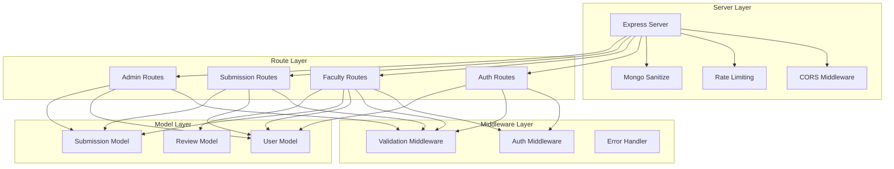
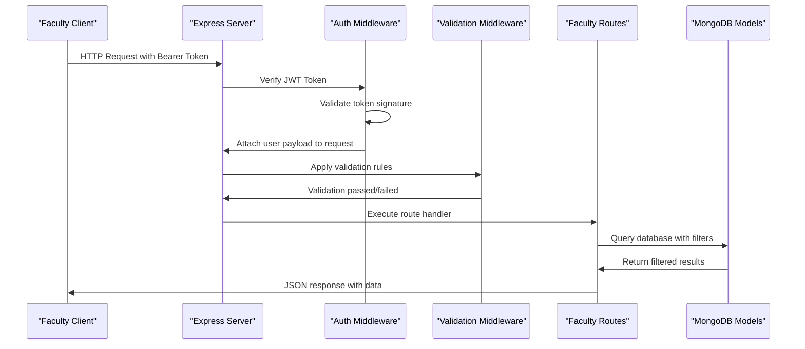
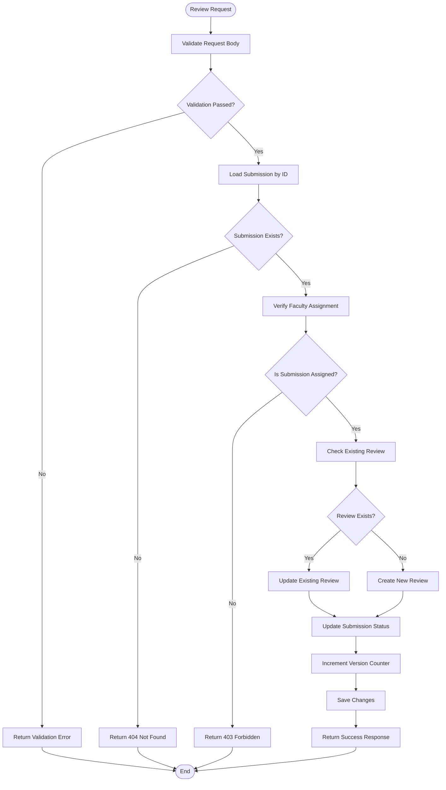
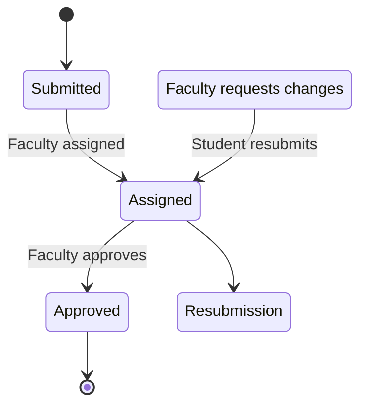
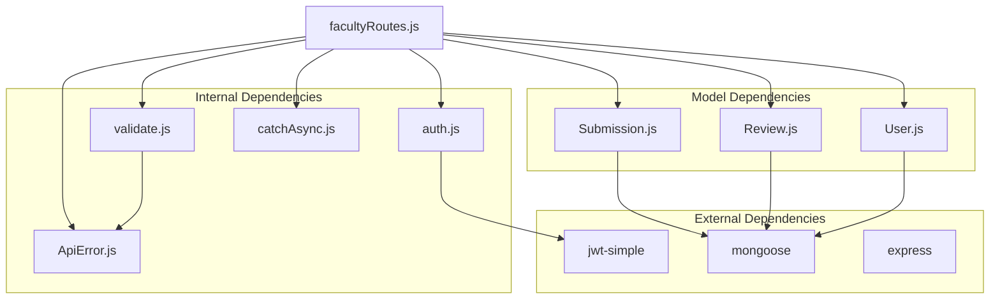

# Faculty Workflow Endpoints

<cite>
**Referenced Files in This Document**
- [server.js](file://server.js)
- [facultyRoutes.js](file://routes/facultyRoutes.js)
- [auth.js](file://middleware/auth.js)
- [validate.js](file://middleware/validate.js)
- [authRoutes.js](file://routes/authRoutes.js)
- [Submission.js](file://models/Submission.js)
- [Review.js](file://models/Review.js)
- [User.js](file://models/User.js)
- [ApiError.js](file://utils/ApiError.js)
- [catchAsync.js](file://utils/catchAsync.js)
</cite>

## Table of Contents
1. [Introduction](#introduction)
2. [Project Structure](#project-structure)
3. [Core Components](#core-components)
4. [Architecture Overview](#architecture-overview)
5. [Detailed Component Analysis](#detailed-component-analysis)
6. [Dependency Analysis](#dependency-analysis)
7. [Performance Considerations](#performance-considerations)
8. [Troubleshooting Guide](#troubleshooting-guide)
9. [Conclusion](#conclusion)

## Introduction
This document provides comprehensive API documentation for faculty-specific workflow endpoints. It covers the GET /api/faculty/assigned endpoint for retrieving assigned submissions with filtering by status and pagination, the GET /api/faculty/reviews endpoint for accessing submission reviews and evaluation forms, and the faculty role-based access control and JWT authentication requirements. The documentation includes request/response schemas, status transition workflows, and practical examples for authentication, assignment retrieval, review submission, and approval/rejection processes.

## Project Structure
The backend follows a modular Express.js architecture with clear separation of concerns:
- Routes define API endpoints and orchestrate business logic
- Middleware handles authentication, validation, and error handling
- Models represent MongoDB collections and data structures
- Utilities provide shared error handling and async wrappers



**Diagram sources**
- [server.js](file://server.js#L16-L66)
- [facultyRoutes.js](file://routes/facultyRoutes.js#L1-L172)

**Section sources**
- [server.js](file://server.js#L16-L66)

## Core Components
The faculty workflow system consists of three primary endpoints that handle assignment retrieval, review history, and submission review processes. All endpoints require faculty role authentication and support pagination for efficient data retrieval.

### Authentication and Authorization
The system implements JWT-based authentication with role-based access control:
- JWT tokens contain user ID, role, and name claims
- Faculty endpoints use the auth middleware with role validation
- Token verification occurs via the auth middleware
- Role enforcement ensures only faculty members can access faculty endpoints

### Data Models
The system operates on three core models with defined relationships:
- Submission: Contains student assignments with status tracking
- Review: Stores faculty evaluations with decisions and marks
- User: Manages authentication credentials and role assignments

**Section sources**
- [auth.js](file://middleware/auth.js#L3-L23)
- [User.js](file://models/User.js#L3-L18)
- [Submission.js](file://models/Submission.js#L3-L28)
- [Review.js](file://models/Review.js#L3-L16)

## Architecture Overview
The faculty workflow endpoints follow a consistent pattern of authentication, validation, business logic execution, and response formatting. The system maintains data integrity through model relationships and enforces business rules at the application level.



**Diagram sources**
- [auth.js](file://middleware/auth.js#L4-L22)
- [validate.js](file://middleware/validate.js#L4-L16)
- [facultyRoutes.js](file://routes/facultyRoutes.js#L10-L42)

## Detailed Component Analysis

### GET /api/faculty/assigned - Assigned Submissions Retrieval
This endpoint retrieves submissions assigned to the authenticated faculty member with comprehensive filtering and pagination capabilities.

#### Endpoint Details
- **Method**: GET
- **Path**: `/api/faculty/assigned`
- **Authentication**: Required (Faculty role)
- **Pagination**: Page-based with configurable limits

#### Request Parameters
| Parameter | Type | Required | Description | Validation |
|-----------|------|----------|-------------|------------|
| page | integer | No | Page number (default: 1) | Must be positive integer |
| limit | integer | No | Results per page (default: 10) | Between 1 and 100 |

#### Response Schema
```javascript
{
  success: boolean,
  submissions: [
    {
      _id: string,
      title: string,
      type: string,
      status: string,
      version: number,
      studentId: {
        _id: string,
        name: string,
        email: string,
        dept: string,
        year: string
      },
      assignedFacultyId: string,
      createdAt: string,
      updatedAt: string
    }
  ],
  pagination: {
    page: number,
    limit: number,
    total: number,
    pages: number
  }
}
```

#### Filtering Logic
The endpoint supports dynamic filtering based on submission status:
- Filter by assigned faculty ID automatically applies
- Optional status parameter allows narrowing results
- Status values: "Submitted", "Assigned", "Approved", "Resubmission Required"

#### Implementation Details
- Uses population to include student details in response
- Sorts by creation date (newest first)
- Implements concurrent queries for data and count
- Supports pagination with skip/limit pattern

**Section sources**
- [facultyRoutes.js](file://routes/facultyRoutes.js#L10-L42)
- [Submission.js](file://models/Submission.js#L17-L21)
- [validate.js](file://middleware/validate.js#L101-L109)

### GET /api/faculty/reviews - Review History Access
This endpoint provides faculty members with access to their review history and associated submission details.

#### Endpoint Details
- **Method**: GET
- **Path**: `/api/faculty/reviews`
- **Authentication**: Required (Faculty role)
- **Pagination**: Page-based with configurable limits

#### Request Parameters
| Parameter | Type | Required | Description | Validation |
|-----------|------|----------|-------------|------------|
| page | integer | No | Page number (default: 1) | Must be positive integer |
| limit | integer | No | Results per page (default: 10) | Between 1 and 100 |

#### Response Schema
```javascript
{
  success: boolean,
  reviews: [
    {
      _id: string,
      submissionId: {
        _id: string,
        title: string,
        type: string,
        status: string,
        studentId: {
          _id: string,
          name: string,
          email: string
        }
      },
      facultyId: string,
      remarks: string,
      marks: number,
      decision: string,
      createdAt: string,
      updatedAt: string
    }
  ],
  pagination: {
    page: number,
    limit: number,
    total: number,
    pages: number
  }
}
```

#### Implementation Details
- Populates submission details with nested student information
- Sorts reviews by creation date (newest first)
- Uses concurrent queries for data and count
- Maintains pagination consistency across results

**Section sources**
- [facultyRoutes.js](file://routes/facultyRoutes.js#L44-L79)
- [Review.js](file://models/Review.js#L5-L13)

### POST /api/faculty/review - Submission Review and Evaluation
This endpoint enables faculty members to submit reviews for assigned submissions, including marks and final decisions.

#### Endpoint Details
- **Method**: POST
- **Path**: `/api/faculty/review`
- **Authentication**: Required (Faculty role)
- **Content-Type**: application/json

#### Request Body Schema
```javascript
{
  submissionId: string,      // Required - MongoDB ObjectId
  decision: string,          // Required - "Approved" or "Resubmission Required"
  marks: number,             // Optional - Integer between 0 and 100
  remarks: string            // Optional - Text up to 1000 characters
}
```

#### Response Schema
```javascript
{
  success: boolean,
  message: string,
  review: {
    _id: string,
    submissionId: string,
    facultyId: string,
    remarks: string,
    marks: number,
    decision: string,
    createdAt: string,
    updatedAt: string
  },
  newStatus: string
}
```

#### Business Logic Flow


**Diagram sources**
- [facultyRoutes.js](file://routes/facultyRoutes.js#L83-L133)

#### Status Transition Workflow
The system enforces strict status transitions for academic workflow integrity:



**Diagram sources**
- [Submission.js](file://models/Submission.js#L17-L21)

#### Implementation Details
- Validates submission existence and faculty assignment
- Supports both review creation and updates
- Automatically updates submission status based on decision
- Increments version counter for audit trail
- Handles concurrent access safely

**Section sources**
- [facultyRoutes.js](file://routes/facultyRoutes.js#L83-L133)
- [Submission.js](file://models/Submission.js#L23-L25)
- [Review.js](file://models/Review.js#L13)

### Additional Faculty Endpoints

#### GET /api/faculty/stats - Dashboard Statistics
Provides faculty dashboard metrics including counts for various workflow states.

**Section sources**
- [facultyRoutes.js](file://routes/facultyRoutes.js#L135-L170)

## Dependency Analysis
The faculty workflow endpoints demonstrate clean architectural separation with well-defined dependencies:



**Diagram sources**
- [facultyRoutes.js](file://routes/facultyRoutes.js#L1-L8)
- [auth.js](file://middleware/auth.js#L1)
- [validate.js](file://middleware/validate.js#L1-L2)

**Section sources**
- [facultyRoutes.js](file://routes/facultyRoutes.js#L1-L8)
- [auth.js](file://middleware/auth.js#L1-L23)

## Performance Considerations
The system implements several performance optimizations:

### Database Query Optimization
- **Concurrent Queries**: Uses Promise.all for simultaneous data and count queries
- **Population Strategy**: Efficiently loads related documents in single queries
- **Indexing Opportunities**: Consider adding indexes on frequently queried fields:
  - `Submission.assignedFacultyId`
  - `Submission.status`
  - `Review.facultyId`
  - `Submission.studentId`

### Pagination Efficiency
- **Skip/Limit Pattern**: Implements efficient pagination for large datasets
- **Count Optimization**: Uses countDocuments for accurate pagination metadata
- **Memory Management**: Processes large result sets without loading entire collections

### Caching Opportunities
- **Response Caching**: Could implement Redis caching for frequently accessed submission lists
- **User Session Caching**: Cache user profile data for session duration
- **Statistical Data**: Cache dashboard statistics to reduce database load

## Troubleshooting Guide

### Authentication Issues
Common authentication problems and solutions:

| Issue | Symptoms | Solution |
|-------|----------|----------|
| Missing Token | 401 Token missing | Ensure Authorization header with "Bearer " prefix |
| Invalid Token | 401 Invalid token | Verify JWT_SECRET environment variable and token validity |
| Role Mismatch | 403 Forbidden: Role mismatch | Confirm user has faculty role in database |
| Expired Token | 401 Unauthorized | Generate new token using login endpoint |

### Validation Errors
Common validation failures:

| Field | Validation Rule | Common Issues |
|-------|----------------|---------------|
| page | Positive integer | Non-numeric values, negative numbers |
| limit | 1-100 range | Values outside range, non-integer |
| submissionId | MongoDB ObjectId | Invalid ObjectId format |
| decision | Enum values | Wrong decision value |
| marks | 0-100 range | Out-of-range values, non-integer |

### Business Logic Errors
Common business logic issues:

| Scenario | Error Response | Resolution |
|----------|----------------|------------|
| Submission not found | 404 Submission not found | Verify submission exists and ID is correct |
| Not assigned to faculty | 403 This submission is not assigned to you | Check assignment in database |
| Duplicate review | Validation error | Use update endpoint instead of create |

**Section sources**
- [auth.js](file://middleware/auth.js#L9-L21)
- [validate.js](file://middleware/validate.js#L101-L109)
- [facultyRoutes.js](file://routes/facultyRoutes.js#L90-L96)

## Conclusion
The faculty workflow endpoints provide a robust foundation for academic submission management with strong security, validation, and data integrity controls. The implementation demonstrates clean architectural patterns with clear separation of concerns, comprehensive error handling, and efficient database operations. The system successfully balances functionality with security through role-based access control and JWT authentication, while maintaining flexibility through configurable pagination and filtering capabilities.

Key strengths of the implementation include:
- Secure authentication with role validation
- Comprehensive input validation
- Efficient database query patterns
- Clear status transition workflows
- Extensible error handling
- Well-structured code organization

The endpoints are production-ready with room for future enhancements such as advanced caching, real-time notifications, and expanded reporting capabilities.