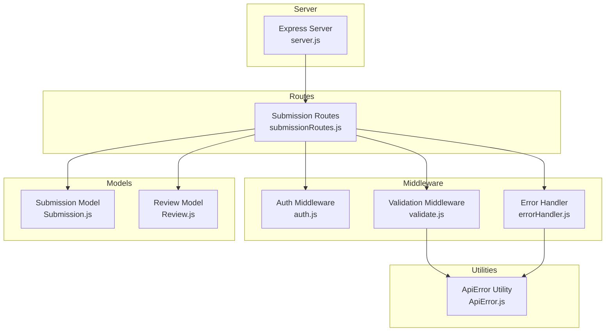
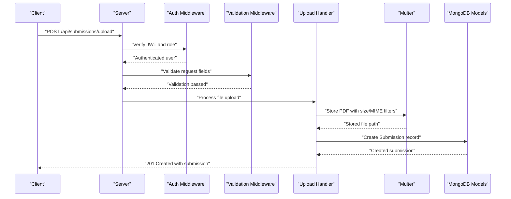
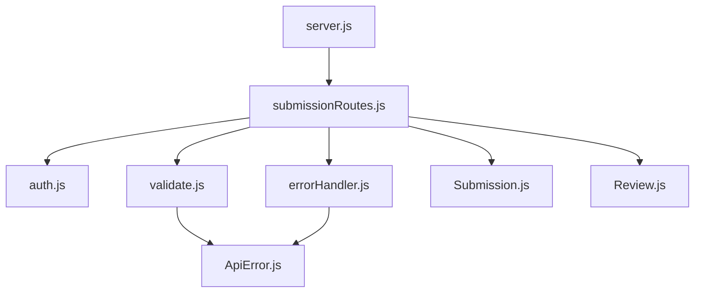

# Submission Management Endpoints

<cite>
**Referenced Files in This Document**
- [server.js](file://server.js)
- [submissionRoutes.js](file://routes/submissionRoutes.js)
- [Submission.js](file://models/Submission.js)
- [Review.js](file://models/Review.js)
- [auth.js](file://middleware/auth.js)
- [validate.js](file://middleware/validate.js)
- [ApiError.js](file://utils/ApiError.js)
- [errorHandler.js](file://middleware/errorHandler.js)
- [.env](file://.env)
</cite>

## Table of Contents
1. [Introduction](#introduction)
2. [Project Structure](#project-structure)
3. [Core Components](#core-components)
4. [Architecture Overview](#architecture-overview)
5. [Detailed Component Analysis](#detailed-component-analysis)
6. [Dependency Analysis](#dependency-analysis)
7. [Performance Considerations](#performance-considerations)
8. [Troubleshooting Guide](#troubleshooting-guide)
9. [Conclusion](#conclusion)

## Introduction
This document provides comprehensive API documentation for submission management endpoints. It focuses on two primary endpoints:
- POST /api/submissions/upload: Student upload of PDF reports with validation and security checks
- GET /api/submissions/mine: Retrieval of a student's own submissions with pagination and associated reviews

The documentation covers request formats, validation rules, security measures, response schemas, workflow states, and practical examples for success, validation errors, and permission scenarios.

## Project Structure
The submission management functionality is implemented within a modular Express.js application:
- Routes define endpoint handlers and apply middleware for authentication, validation, and error handling
- Models define the data schema for submissions and reviews
- Middleware enforces authentication, request validation, and global error handling
- Utilities encapsulate error handling patterns

**Diagram sources**
- [server.js](file://server.js#L1-L92)
- [submissionRoutes.js](file://routes/submissionRoutes.js#L1-L159)
- [auth.js](file://middleware/auth.js#L1-L25)
- [validate.js](file://middleware/validate.js#L1-L120)
- [errorHandler.js](file://middleware/errorHandler.js#L1-L53)
- [Submission.js](file://models/Submission.js#L1-L30)
- [Review.js](file://models/Review.js#L1-L18)
- [ApiError.js](file://utils/ApiError.js#L1-L17)

**Section sources**
- [server.js](file://server.js#L1-L92)
- [submissionRoutes.js](file://routes/submissionRoutes.js#L1-L159)

## Core Components
- Authentication middleware validates JWT tokens and enforces role-based access
- Validation middleware applies express-validator rules for request bodies and query parameters
- Submission routes implement upload and retrieval logic with multer for PDF handling
- Models define submission and review schemas with status enums and relationships
- Error handling centralizes error responses and maps multer and mongoose errors

Key responsibilities:
- POST /api/submissions/upload: Validates request fields, accepts a single PDF file, performs content verification, creates a submission record, and returns the created submission
- GET /api/submissions/mine: Retrieves paginated submissions for the authenticated student, populates assigned faculty and associated reviews, and returns metadata

**Section sources**
- [auth.js](file://middleware/auth.js#L1-L25)
- [validate.js](file://middleware/validate.js#L55-L72)
- [submissionRoutes.js](file://routes/submissionRoutes.js#L48-L121)
- [Submission.js](file://models/Submission.js#L1-L30)
- [Review.js](file://models/Review.js#L1-L18)
- [errorHandler.js](file://middleware/errorHandler.js#L1-L53)

## Architecture Overview
The submission endpoints follow a layered architecture:
- HTTP Layer: Express routes handle incoming requests
- Authentication Layer: JWT-based authentication with role enforcement
- Validation Layer: Request body and query parameter validation
- Storage Layer: Multer disk storage for PDF uploads with size limits and MIME-type filtering
- Persistence Layer: MongoDB models for submissions and reviews
- Error Handling Layer: Centralized error mapping and standardized responses

**Diagram sources**
- [submissionRoutes.js](file://routes/submissionRoutes.js#L48-L83)
- [auth.js](file://middleware/auth.js#L1-L25)
- [validate.js](file://middleware/validate.js#L55-L72)
- [Submission.js](file://models/Submission.js#L1-L30)

## Detailed Component Analysis

### POST /api/submissions/upload
Purpose: Allow students to upload a PDF report along with submission metadata.

Request format:
- Method: POST
- URL: /api/submissions/upload
- Headers:
  - Authorization: Bearer <JWT_TOKEN>
  - Content-Type: multipart/form-data
- Form fields (multipart/form-data):
  - report: PDF file (required)
  - title: string (required, 3–200 characters)
  - type: enum ["internship", "project", "research"] (required)
  - domain: string (optional, max 100 characters)
  - companyOrGuide: string (optional, max 100 characters)

Security and validation:
- Authentication: Requires a valid JWT token; only students can access
- File validation:
  - MIME type: application/pdf
  - Size limit: 10 MB
  - Content verification: Reads the stored file and checks PDF magic number
- Field validation:
  - Uses express-validator rules for length and allowed values

Processing workflow:
1. Authenticate student
2. Validate form fields
3. Accept single file upload named "report"
4. Verify file presence
5. Validate PDF content by checking magic number
6. Extract metadata from form fields
7. Create submission record with status "Submitted"
8. Return success response with created submission

Response schema:
- success: boolean
- message: string
- submission: object containing:
  - studentId: ObjectId
  - title: string
  - type: enum
  - domain: string
  - companyOrGuide: string
  - filePath: string
  - status: enum ["Submitted", "Assigned", "Approved", "Resubmission Required"]
  - assignedFacultyId: ObjectId or null
  - version: number
  - timestamps: createdAt, updatedAt

Error responses:
- 400 Bad Request: Validation errors, invalid PDF, file size exceeded
- 401 Unauthorized: Missing or invalid token
- 403 Forbidden: Role mismatch (non-student)
- 413 Payload Too Large: File exceeds 10 MB limit
- 500 Internal Server Error: Unexpected server error

Examples:
- Successful upload:
  - Request: multipart/form-data with report and metadata
  - Response: 201 with submission object and message
- Validation error:
  - Request: missing title/type or invalid type
  - Response: 400 with aggregated validation messages
- Invalid PDF:
  - Request: non-PDF file or corrupted PDF
  - Response: 400 with "Invalid PDF file"
- Permission denied:
  - Request: non-student token
  - Response: 403 with "Forbidden: Role mismatch"

**Section sources**
- [submissionRoutes.js](file://routes/submissionRoutes.js#L48-L83)
- [auth.js](file://middleware/auth.js#L1-L25)
- [validate.js](file://middleware/validate.js#L55-L72)
- [Submission.js](file://models/Submission.js#L1-L30)
- [errorHandler.js](file://middleware/errorHandler.js#L39-L43)

### GET /api/submissions/mine
Purpose: Retrieve a student's own submissions with pagination and associated reviews.

Request format:
- Method: GET
- URL: /api/submissions/mine
- Headers:
  - Authorization: Bearer <JWT_TOKEN>
- Query parameters:
  - page: integer (optional, default 1, min 1)
  - limit: integer (optional, default 10, min 1, max 100)

Security and validation:
- Authentication: Requires a valid JWT token; only students can access
- Pagination validation: Enforces page and limit constraints

Processing workflow:
1. Authenticate student
2. Validate pagination parameters
3. Fetch submissions for the authenticated student, sorted by creation date (newest first)
4. Populate assigned faculty details
5. Count total submissions for pagination metadata
6. Fetch associated reviews for all submissions and populate faculty details
7. Return submissions, reviews, and pagination metadata

Response schema:
- success: boolean
- submissions: array of submission objects (same schema as POST response)
- reviews: array of review objects:
  - submissionId: ObjectId
  - facultyId: ObjectId
  - remarks: string
  - marks: number
  - decision: enum ["Approved", "Resubmission Required"]
  - timestamps: createdAt, updatedAt
- pagination: object with:
  - page: number
  - limit: number
  - total: number
  - pages: number

Error responses:
- 400 Bad Request: Invalid pagination parameters
- 401 Unauthorized: Missing or invalid token
- 403 Forbidden: Role mismatch (non-student)
- 500 Internal Server Error: Unexpected server error

Examples:
- Successful retrieval:
  - Request: GET /api/submissions/mine?page=1&limit=10
  - Response: 200 with submissions, reviews, and pagination metadata
- Pagination:
  - Request: GET /api/submissions/mine?page=2&limit=5
  - Response: 200 with subset of submissions and updated pagination
- Permission denied:
  - Request: Non-student token
  - Response: 403 with "Forbidden: Role mismatch"

**Section sources**
- [submissionRoutes.js](file://routes/submissionRoutes.js#L85-L121)
- [auth.js](file://middleware/auth.js#L1-L25)
- [validate.js](file://middleware/validate.js#L101-L109)
- [Submission.js](file://models/Submission.js#L1-L30)
- [Review.js](file://models/Review.js#L1-L18)

### Supporting Components

#### Authentication Middleware
- Verifies JWT from Authorization header
- Enforces optional role requirement
- Populates req.user with decoded payload

**Section sources**
- [auth.js](file://middleware/auth.js#L1-L25)

#### Validation Middleware
- Applies express-validator rules for:
  - Upload fields: title, type, domain, companyOrGuide
  - Pagination: page, limit
- Aggregates validation errors and throws ApiError

**Section sources**
- [validate.js](file://middleware/validate.js#L55-L72)
- [validate.js](file://middleware/validate.js#L101-L109)

#### Error Handling
- Centralizes error responses
- Maps multer file size errors to user-friendly messages
- Handles mongoose cast/validation errors
- Wraps errors in ApiError with appropriate status codes

**Section sources**
- [errorHandler.js](file://middleware/errorHandler.js#L1-L53)
- [ApiError.js](file://utils/ApiError.js#L1-L17)

## Dependency Analysis
The submission endpoints depend on several modules and configurations:

**Diagram sources**
- [submissionRoutes.js](file://routes/submissionRoutes.js#L1-L159)
- [auth.js](file://middleware/auth.js#L1-L25)
- [validate.js](file://middleware/validate.js#L1-L120)
- [errorHandler.js](file://middleware/errorHandler.js#L1-L53)
- [Submission.js](file://models/Submission.js#L1-L30)
- [Review.js](file://models/Review.js#L1-L18)
- [ApiError.js](file://utils/ApiError.js#L1-L17)
- [server.js](file://server.js#L1-L92)

Key dependencies:
- Multer for file handling and storage
- Express-validator for request validation
- JWT for authentication
- MongoDB models for persistence
- Environment variables for configuration

**Section sources**
- [submissionRoutes.js](file://routes/submissionRoutes.js#L1-L159)
- [server.js](file://server.js#L1-L92)
- [.env](file://.env#L1-L4)

## Performance Considerations
- File size limit: 10 MB prevents excessive resource consumption
- Pagination: Limits results per page to reduce payload size
- Population: Efficiently populates related documents only when needed
- Rate limiting: Applied at server level to protect endpoints from abuse
- Static file serving: PDFs served via static middleware for efficient delivery

## Troubleshooting Guide
Common issues and resolutions:
- File size exceeded:
  - Symptom: 400 Bad Request with file size message
  - Resolution: Reduce file size below 10 MB
- Invalid PDF:
  - Symptom: 400 Bad Request with "Invalid PDF file"
  - Resolution: Ensure the uploaded file is a genuine PDF
- Missing or invalid token:
  - Symptom: 401 Unauthorized
  - Resolution: Provide a valid Bearer token
- Role mismatch:
  - Symptom: 403 Forbidden
  - Resolution: Use a student account for submission endpoints
- Validation errors:
  - Symptom: 400 Bad Request with aggregated messages
  - Resolution: Correct field values according to validation rules

**Section sources**
- [errorHandler.js](file://middleware/errorHandler.js#L39-L43)
- [validate.js](file://middleware/validate.js#L55-L72)
- [auth.js](file://middleware/auth.js#L1-L25)

## Conclusion
The submission management endpoints provide a secure, validated, and efficient interface for students to upload PDF reports and retrieve their submissions with associated reviews. The implementation emphasizes:
- Strong authentication and role enforcement
- Comprehensive request validation
- Secure file handling with size and content checks
- Clear response schemas and pagination support
- Centralized error handling with user-friendly messages

These endpoints support the complete submission workflow and integrate seamlessly with the broader application architecture.