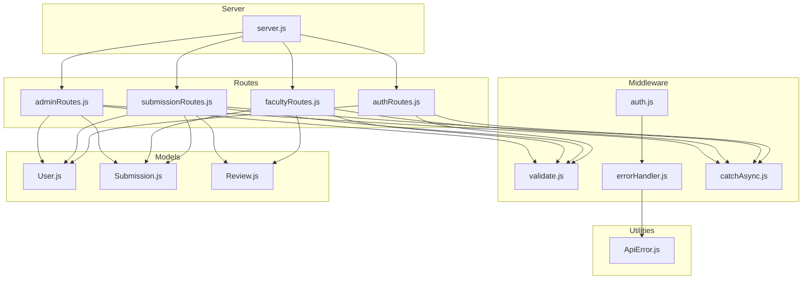
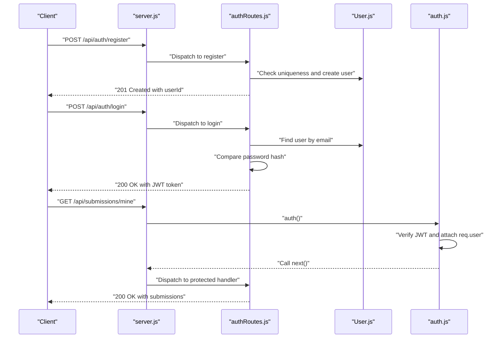
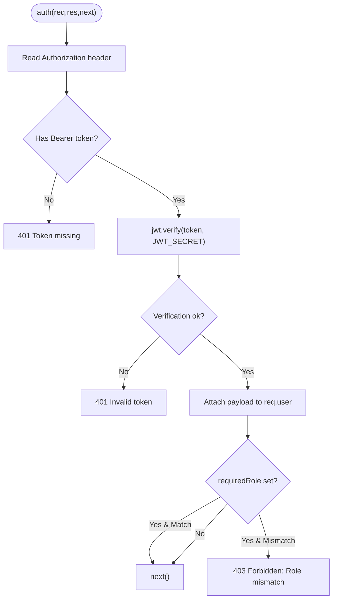
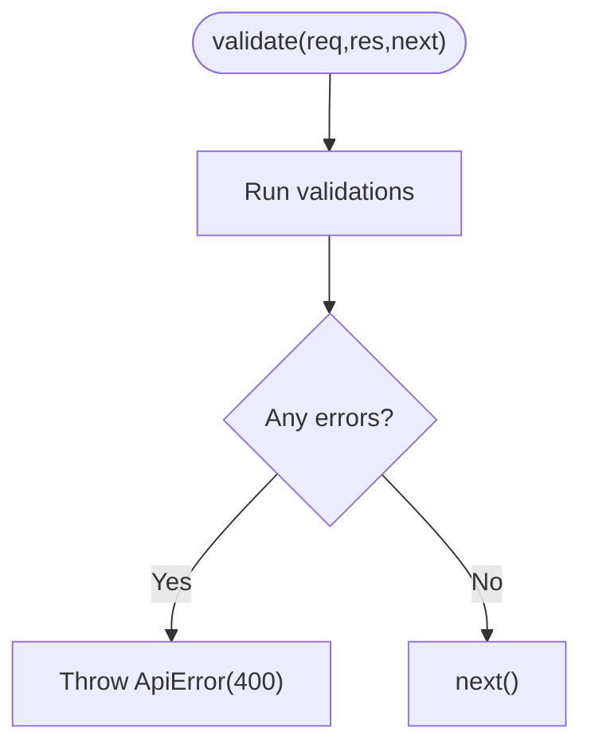
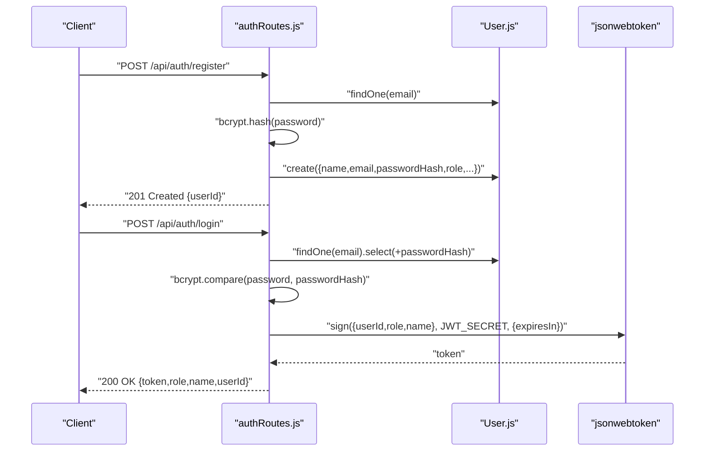
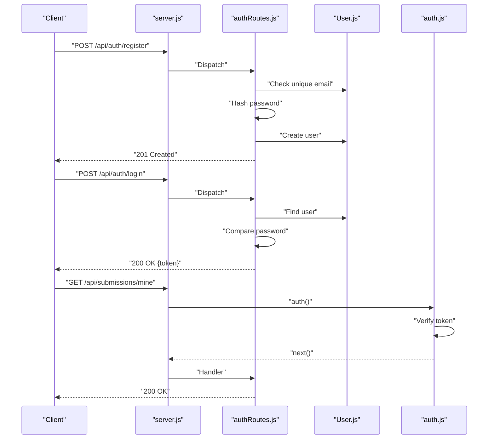
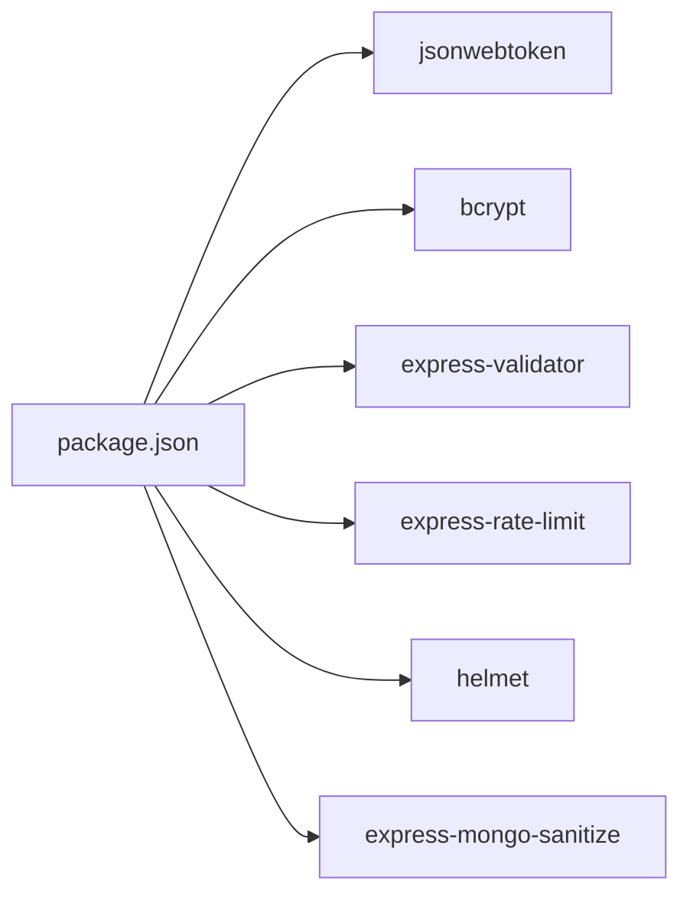

# Authentication & Authorization

<cite>
**Referenced Files in This Document**
- [server.js](file://server.js)
- [auth.js](file://middleware/auth.js)
- [validate.js](file://middleware/validate.js)
- [errorHandler.js](file://middleware/errorHandler.js)
- [authRoutes.js](file://routes/authRoutes.js)
- [adminRoutes.js](file://routes/adminRoutes.js)
- [facultyRoutes.js](file://routes/facultyRoutes.js)
- [submissionRoutes.js](file://routes/submissionRoutes.js)
- [User.js](file://models/User.js)
- [Submission.js](file://models/Submission.js)
- [Review.js](file://models/Review.js)
- [ApiError.js](file://utils/ApiError.js)
- [catchAsync.js](file://utils/catchAsync.js)
- [package.json](file://package.json)
</cite>

## Table of Contents
1. [Introduction](#introduction)
2. [Project Structure](#project-structure)
3. [Core Components](#core-components)
4. [Architecture Overview](#architecture-overview)
5. [Detailed Component Analysis](#detailed-component-analysis)
6. [Dependency Analysis](#dependency-analysis)
7. [Performance Considerations](#performance-considerations)
8. [Troubleshooting Guide](#troubleshooting-guide)
9. [Conclusion](#conclusion)

## Introduction
This document explains the JWT-based authentication and authorization system used in the backend. It covers:
- Role-based access control (Rbac) with roles: student, faculty, admin
- Token lifecycle: generation during login, validation via middleware, and handling of invalid/expired tokens
- Middleware protecting routes and enforcing role checks
- Practical examples of protected routes and role verification
- End-to-end authentication flow from registration to login to token validation
- Security considerations, token expiration handling, and error scenarios

## Project Structure
The authentication and authorization logic spans middleware, routes, models, and utilities. The server configures security middleware and mounts route groups under /api/.

**Diagram sources**
- [server.js](file://server.js#L1-L92)
- [auth.js](file://middleware/auth.js#L1-L25)
- [validate.js](file://middleware/validate.js#L1-L120)
- [errorHandler.js](file://middleware/errorHandler.js#L1-L53)
- [authRoutes.js](file://routes/authRoutes.js#L1-L85)
- [submissionRoutes.js](file://routes/submissionRoutes.js#L1-L159)
- [facultyRoutes.js](file://routes/facultyRoutes.js#L1-L172)
- [adminRoutes.js](file://routes/adminRoutes.js#L1-L184)
- [User.js](file://models/User.js#L1-L20)
- [Submission.js](file://models/Submission.js#L1-L30)
- [Review.js](file://models/Review.js#L1-L18)
- [ApiError.js](file://utils/ApiError.js#L1-L17)
- [catchAsync.js](file://utils/catchAsync.js#L1-L8)

**Section sources**
- [server.js](file://server.js#L1-L92)

## Core Components
- JWT middleware: central auth guard that extracts the Bearer token, verifies it, attaches user info to the request, optionally enforces role.
- Validation middleware: reusable validator that runs express-validator rules and converts failures into structured errors.
- Routes: define registration, login, profile retrieval, and role-specific endpoints.
- Models: User, Submission, Review define the data and relationships used by auth and RBAC.
- Utilities: ApiError and catchAsync standardize error handling and async wrappers.

Key implementation references:
- JWT middleware and role enforcement: [auth.js](file://middleware/auth.js#L1-L25)
- Validation helpers: [validate.js](file://middleware/validate.js#L1-L120)
- Registration and login: [authRoutes.js](file://routes/authRoutes.js#L1-L85)
- Protected routes with role checks: [adminRoutes.js](file://routes/adminRoutes.js#L1-L184), [facultyRoutes.js](file://routes/facultyRoutes.js#L1-L172), [submissionRoutes.js](file://routes/submissionRoutes.js#L1-L159)
- User model with roles: [User.js](file://models/User.js#L1-L20)
- Error handling for JWT and other errors: [errorHandler.js](file://middleware/errorHandler.js#L1-L53)

**Section sources**
- [auth.js](file://middleware/auth.js#L1-L25)
- [validate.js](file://middleware/validate.js#L1-L120)
- [authRoutes.js](file://routes/authRoutes.js#L1-L85)
- [adminRoutes.js](file://routes/adminRoutes.js#L1-L184)
- [facultyRoutes.js](file://routes/facultyRoutes.js#L1-L172)
- [submissionRoutes.js](file://routes/submissionRoutes.js#L1-L159)
- [User.js](file://models/User.js#L1-L20)
- [errorHandler.js](file://middleware/errorHandler.js#L1-L53)

## Architecture Overview
The system uses bearer tokens issued on successful login. All protected routes are wrapped with the auth middleware, which:
- Extracts the Authorization header
- Verifies the JWT using the secret from environment
- Attaches decoded payload (userId, role, name) to req.user
- Enforces optional role requirement
- Delegates to the route handler on success

**Diagram sources**
- [server.js](file://server.js#L62-L66)
- [authRoutes.js](file://routes/authRoutes.js#L1-L85)
- [User.js](file://models/User.js#L1-L20)
- [auth.js](file://middleware/auth.js#L1-L25)

## Detailed Component Analysis

### JWT Middleware (auth)
Responsibilities:
- Extract Bearer token from Authorization header
- Verify JWT using process.env.JWT_SECRET
- Attach decoded payload { userId, role, name } to req.user
- Enforce required role if provided
- Return appropriate HTTP errors on missing/invalid/expired tokens

**Diagram sources**
- [auth.js](file://middleware/auth.js#L1-L25)

**Section sources**
- [auth.js](file://middleware/auth.js#L1-L25)

### Validation Middleware (validate)
Responsibilities:
- Run express-validator rules
- Convert validation failures into ApiError(400)
- Allow downstream handlers to continue on success

**Diagram sources**
- [validate.js](file://middleware/validate.js#L1-L16)

**Section sources**
- [validate.js](file://middleware/validate.js#L1-L120)

### Authentication Routes (/api/auth)
Endpoints:
- POST /api/auth/register: Validates input, checks uniqueness, hashes password, creates user with role (defaults to student)
- POST /api/auth/login: Finds user, compares password, signs JWT with 7-day expiry
- GET /api/auth/me: Extracts token from Authorization header, verifies, resolves user by decoded userId

**Diagram sources**
- [authRoutes.js](file://routes/authRoutes.js#L1-L85)
- [User.js](file://models/User.js#L1-L20)

**Section sources**
- [authRoutes.js](file://routes/authRoutes.js#L1-L85)
- [User.js](file://models/User.js#L1-L20)

### Role-Based Access Control (RBAC)
- Admin-only routes: GET /api/admin/faculty, GET /api/admin/users, GET /api/admin/submissions, POST /api/admin/assign, GET /api/admin/stats
- Faculty-only routes: GET /api/faculty/assigned, GET /api/faculty/reviews, POST /api/faculty/review, GET /api/faculty/stats
- Student-only routes: POST /api/submissions/upload, GET /api/submissions/mine
- Public route with per-request role checks: GET /api/submissions/:id

Implementation pattern:
- Wrap route handlers with auth("role") to enforce role
- For open-access endpoints, call auth() without arguments and perform manual checks inside the handler

Examples:
- Admin-only: [adminRoutes.js](file://routes/adminRoutes.js#L10-L18), [adminRoutes.js](file://routes/adminRoutes.js#L21-L61), [adminRoutes.js](file://routes/adminRoutes.js#L120-L148), [adminRoutes.js](file://routes/adminRoutes.js#L151-L182)
- Faculty-only: [facultyRoutes.js](file://routes/facultyRoutes.js#L10-L42), [facultyRoutes.js](file://routes/facultyRoutes.js#L83-L133), [facultyRoutes.js](file://routes/facultyRoutes.js#L136-L170)
- Student-only: [submissionRoutes.js](file://routes/submissionRoutes.js#L48-L83), [submissionRoutes.js](file://routes/submissionRoutes.js#L86-L121)
- Mixed access: [submissionRoutes.js](file://routes/submissionRoutes.js#L124-L157)

**Section sources**
- [adminRoutes.js](file://routes/adminRoutes.js#L1-L184)
- [facultyRoutes.js](file://routes/facultyRoutes.js#L1-L172)
- [submissionRoutes.js](file://routes/submissionRoutes.js#L1-L159)

### Protected Route Implementation Examples
- Admin dashboard stats:
  - Route: GET /api/admin/stats
  - Guard: auth("admin")
  - Handler: aggregates counts using req.user for filtering where applicable
  - Reference: [adminRoutes.js](file://routes/adminRoutes.js#L151-L182)

- Faculty review submission:
  - Route: POST /api/faculty/review
  - Guard: auth("faculty")
  - Handler: validates decision/marks, ensures assignment ownership, updates submission status
  - Reference: [facultyRoutes.js](file://routes/facultyRoutes.js#L83-L133)

- Student upload:
  - Route: POST /api/submissions/upload
  - Guard: auth("student")
  - Handler: validates PDF, persists file, creates Submission record linked to req.user.userId
  - Reference: [submissionRoutes.js](file://routes/submissionRoutes.js#L48-L83)

- Per-request role check:
  - Route: GET /api/submissions/:id
  - Guard: auth()
  - Handler: checks ownership or assignment based on role
  - Reference: [submissionRoutes.js](file://routes/submissionRoutes.js#L124-L157)

**Section sources**
- [adminRoutes.js](file://routes/adminRoutes.js#L151-L182)
- [facultyRoutes.js](file://routes/facultyRoutes.js#L83-L133)
- [submissionRoutes.js](file://routes/submissionRoutes.js#L48-L83)
- [submissionRoutes.js](file://routes/submissionRoutes.js#L124-L157)

### Token Expiration and Refresh
- Token lifetime: 7 days (configured during sign)
- Expiration handling: errorHandler maps TokenExpiredError to 401 "Token expired"
- Refresh mechanism: Not implemented in the current codebase; clients should re-authenticate after expiry

References:
- Token signing with expiry: [authRoutes.js](file://routes/authRoutes.js#L42-L46)
- Expiration error mapping: [errorHandler.js](file://middleware/errorHandler.js#L34-L37)

**Section sources**
- [authRoutes.js](file://routes/authRoutes.js#L42-L46)
- [errorHandler.js](file://middleware/errorHandler.js#L34-L37)

### Authentication Flow: Registration → Login → Token Validation

**Diagram sources**
- [server.js](file://server.js#L62-L66)
- [authRoutes.js](file://routes/authRoutes.js#L1-L85)
- [User.js](file://models/User.js#L1-L20)
- [auth.js](file://middleware/auth.js#L1-L25)

## Dependency Analysis
External libraries and their roles:
- jsonwebtoken: JWT signing and verification
- bcrypt: Password hashing and comparison
- express-validator: Request validation
- express-rate-limit: Rate limiting for auth endpoints
- helmet: Security headers
- express-mongo-sanitize: Sanitization against NoSQL injection
- dotenv: Environment variables

**Diagram sources**
- [package.json](file://package.json#L10-L22)

**Section sources**
- [package.json](file://package.json#L10-L22)

## Performance Considerations
- Token verification is O(1); keep JWT_SECRET secure and avoid excessive re-signing.
- Validation middleware batches rules; keep rule sets concise.
- Rate limiting reduces brute-force login attempts; consider lowering limits for production if needed.
- Avoid heavy synchronous operations in middleware; async wrappers are already used.

## Troubleshooting Guide
Common errors and resolutions:
- Missing Authorization header: 401 "Token missing"
  - Ensure client sends Authorization: Bearer <token>
  - Reference: [auth.js](file://middleware/auth.js#L9-L9)

- Invalid token: 401 "Invalid token"
  - Verify JWT_SECRET matches server configuration
  - Confirm token was signed by the server
  - Reference: [auth.js](file://middleware/auth.js#L20-L20), [errorHandler.js](file://middleware/errorHandler.js#L28-L32)

- Expired token: 401 "Token expired"
  - Re-authenticate the user
  - Reference: [errorHandler.js](file://middleware/errorHandler.js#L34-L37)

- Role mismatch: 403 "Forbidden: Role mismatch"
  - Ensure the token’s role matches the required role
  - Reference: [auth.js](file://middleware/auth.js#L14-L16)

- Validation errors: 400 with aggregated messages
  - Fix input according to validation rules
  - Reference: [validate.js](file://middleware/validate.js#L13-L14)

- Resource not found (CastError): 404 "Resource not found"
  - Check ObjectId format and existence
  - Reference: [errorHandler.js](file://middleware/errorHandler.js#L11-L14)

- Duplicate field error: 400 "Duplicate field value entered"
  - Resolve duplicate keys (e.g., email)
  - Reference: [errorHandler.js](file://middleware/errorHandler.js#L16-L20)

- File size exceeded: 400 "File size too large. Maximum size is 10MB"
  - Reduce file size or adjust limits
  - Reference: [errorHandler.js](file://middleware/errorHandler.js#L40-L43)

**Section sources**
- [auth.js](file://middleware/auth.js#L9-L21)
- [errorHandler.js](file://middleware/errorHandler.js#L11-L43)
- [validate.js](file://middleware/validate.js#L13-L14)

## Conclusion
The backend implements a robust JWT-based authentication and RBAC system:
- Tokens are generated on login with a 7-day expiry
- Central auth middleware enforces token validation and optional role checks
- Routes are organized by role, ensuring least-privilege access
- Validation and error handling are standardized
- Security middleware and rate limiting protect the API

To maintain security, ensure JWT_SECRET is strong and rotated periodically, and consider implementing token refresh or logout mechanisms as needed.