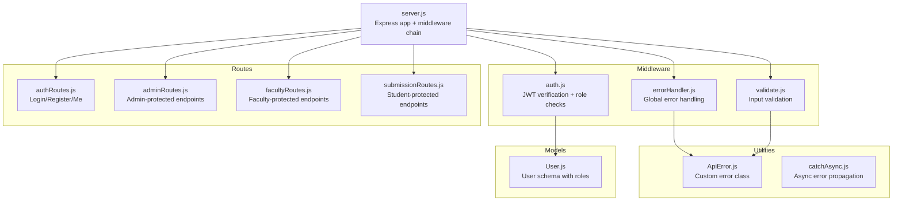
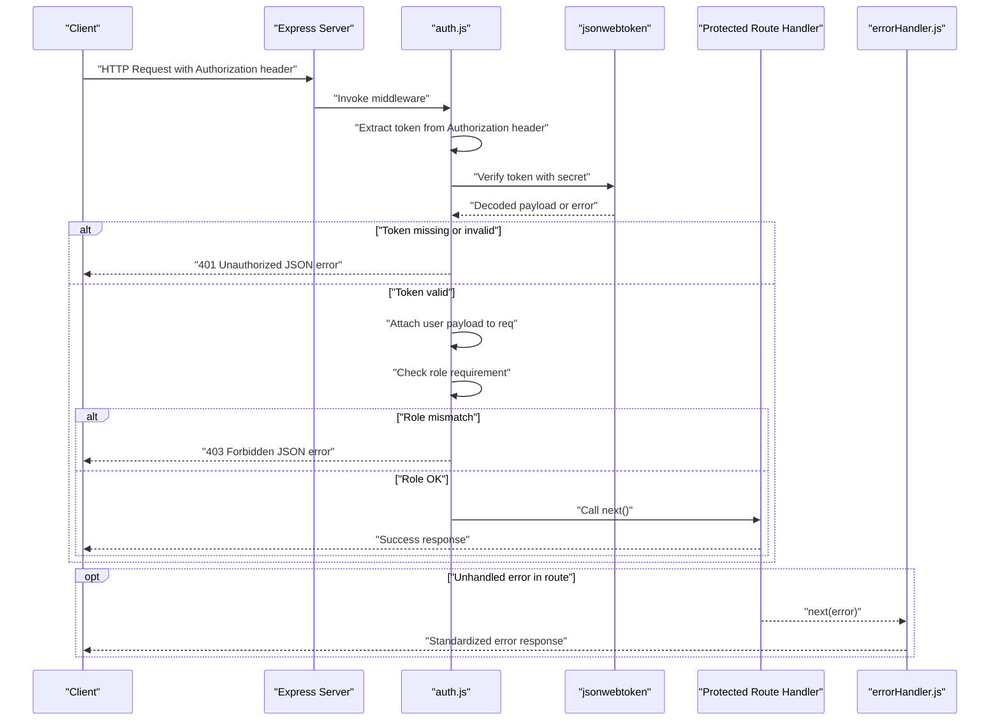
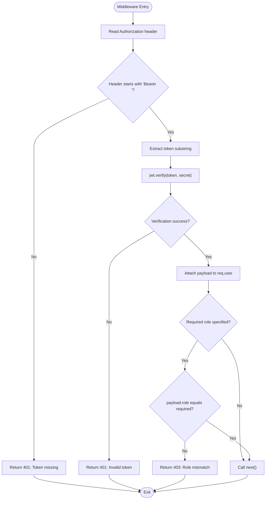
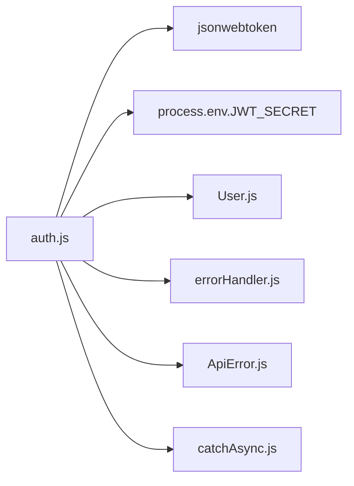

# Authentication Middleware

<cite>
**Referenced Files in This Document**
- [auth.js](file://middleware/auth.js)
- [authRoutes.js](file://routes/authRoutes.js)
- [adminRoutes.js](file://routes/adminRoutes.js)
- [facultyRoutes.js](file://routes/facultyRoutes.js)
- [submissionRoutes.js](file://routes/submissionRoutes.js)
- [errorHandler.js](file://middleware/errorHandler.js)
- [ApiError.js](file://utils/ApiError.js)
- [catchAsync.js](file://utils/catchAsync.js)
- [validate.js](file://middleware/validate.js)
- [server.js](file://server.js)
- [User.js](file://models/User.js)
</cite>

## Table of Contents
1. [Introduction](#introduction)
2. [Project Structure](#project-structure)
3. [Core Components](#core-components)
4. [Architecture Overview](#architecture-overview)
5. [Detailed Component Analysis](#detailed-component-analysis)
6. [Dependency Analysis](#dependency-analysis)
7. [Performance Considerations](#performance-considerations)
8. [Troubleshooting Guide](#troubleshooting-guide)
9. [Conclusion](#conclusion)

## Introduction
This document provides comprehensive documentation for the authentication middleware implementation. It explains how the middleware integrates into the Express.js application, extracts tokens from Authorization headers, validates Bearer token format, handles various error scenarios, and enforces role-based access control. Practical examples demonstrate middleware usage across protected routes, error response formatting, and integration patterns with Express.js routing. The document also covers middleware ordering, performance considerations, and debugging techniques for authentication failures.

## Project Structure
The authentication system spans several modules:
- Middleware: authentication logic and error handling
- Routes: endpoint definitions with middleware integration
- Utilities: error abstraction and async wrapper
- Models: user schema with roles
- Server: Express application setup and middleware chain

**Diagram sources**
- [auth.js](file://middleware/auth.js#L1-L25)
- [errorHandler.js](file://middleware/errorHandler.js#L1-L53)
- [validate.js](file://middleware/validate.js#L1-L120)
- [authRoutes.js](file://routes/authRoutes.js#L1-L85)
- [adminRoutes.js](file://routes/adminRoutes.js#L1-L184)
- [facultyRoutes.js](file://routes/facultyRoutes.js#L1-L172)
- [submissionRoutes.js](file://routes/submissionRoutes.js#L1-L159)
- [ApiError.js](file://utils/ApiError.js#L1-L17)
- [catchAsync.js](file://utils/catchAsync.js#L1-L8)
- [User.js](file://models/User.js#L1-L20)
- [server.js](file://server.js#L1-L92)

**Section sources**
- [server.js](file://server.js#L1-L92)

## Core Components
- Authentication middleware: verifies Authorization header, extracts Bearer token, decodes JWT, attaches user payload to request, and enforces role-based access.
- Route protection: applies the middleware to protected endpoints with optional role enforcement.
- Error handling: centralizes error responses and maps JWT errors to appropriate HTTP status codes.
- Validation: pre-validates request inputs before business logic executes.
- Async error propagation: wraps route handlers to catch asynchronous errors.

Key implementation patterns:
- Token extraction from Authorization header with Bearer scheme validation.
- Role enforcement via optional parameter passed to the middleware factory.
- Consistent JSON error responses with standardized fields.

**Section sources**
- [auth.js](file://middleware/auth.js#L3-L23)
- [authRoutes.js](file://routes/authRoutes.js#L29-L55)
- [adminRoutes.js](file://routes/adminRoutes.js#L10-L18)
- [facultyRoutes.js](file://routes/facultyRoutes.js#L11-L42)
- [submissionRoutes.js](file://routes/submissionRoutes.js#L49-L121)
- [errorHandler.js](file://middleware/errorHandler.js#L28-L37)
- [validate.js](file://middleware/validate.js#L4-L16)
- [catchAsync.js](file://utils/catchAsync.js#L1-L8)

## Architecture Overview
The authentication middleware sits in the Express middleware chain and is applied selectively to protected routes. It interacts with the JWT library to decode tokens and with the User model to enforce role-based access. Errors are handled centrally to ensure consistent responses.

**Diagram sources**
- [auth.js](file://middleware/auth.js#L4-L22)
- [errorHandler.js](file://middleware/errorHandler.js#L3-L50)
- [authRoutes.js](file://routes/authRoutes.js#L58-L83)

## Detailed Component Analysis

### Authentication Middleware
The middleware is a factory function that returns an Express middleware. It:
- Reads the Authorization header and validates Bearer scheme.
- Extracts the token and verifies it using the configured secret.
- Attaches the decoded payload to the request object.
- Enforces role-based access when a required role is specified.
- Handles errors by returning appropriate HTTP status codes.

**Diagram sources**
- [auth.js](file://middleware/auth.js#L4-L22)

**Section sources**
- [auth.js](file://middleware/auth.js#L3-L23)

### Token Extraction and Bearer Format Validation
- The middleware reads the Authorization header and checks for the Bearer prefix.
- If the prefix is missing, it returns a 401 error indicating a missing token.
- The token is extracted by slicing off the first seven characters ("Bearer ").
- The middleware relies on the JWT library to validate signature and expiration.

Practical example paths:
- Token extraction and verification: [auth.js](file://middleware/auth.js#L6-L11)
- Role enforcement: [auth.js](file://middleware/auth.js#L14-L16)

**Section sources**
- [auth.js](file://middleware/auth.js#L6-L11)
- [auth.js](file://middleware/auth.js#L14-L16)

### Role-Based Access Control
- The middleware accepts an optional role parameter to restrict access.
- If required, the payload’s role must match the required role; otherwise, a 403 error is returned.
- The User model defines roles as an enum with values: student, faculty, admin.

Example paths:
- Admin-protected route using role enforcement: [adminRoutes.js](file://routes/adminRoutes.js#L10-L18)
- Faculty-protected route using role enforcement: [facultyRoutes.js](file://routes/facultyRoutes.js#L11-L42)
- Student-protected route using role enforcement: [submissionRoutes.js](file://routes/submissionRoutes.js#L49-L83)

**Section sources**
- [auth.js](file://middleware/auth.js#L14-L16)
- [User.js](file://models/User.js#L11)

### Error Handling for Authentication Failures
The middleware returns distinct errors:
- Missing token: 401 Unauthorized with a message indicating the token is missing.
- Invalid token: 401 Unauthorized with a message indicating the token is invalid.
- Role mismatch: 403 Forbidden with a message indicating role mismatch.

Centralized error handling:
- The global error handler maps JWT errors to 401 responses and standardizes error payloads.
- It logs errors and includes stack traces in development mode.

Example paths:
- Middleware error responses: [auth.js](file://middleware/auth.js#L9-L21)
- Centralized JWT error mapping: [errorHandler.js](file://middleware/errorHandler.js#L28-L37)
- Standardized error response shape: [errorHandler.js](file://middleware/errorHandler.js#L45-L49)

**Section sources**
- [auth.js](file://middleware/auth.js#L9-L21)
- [errorHandler.js](file://middleware/errorHandler.js#L28-L37)
- [errorHandler.js](file://middleware/errorHandler.js#L45-L49)

### Integration with Express.js Routing
The middleware is integrated into routes using the Express Router. It can be applied globally or per-route. When applied per-route, it protects specific endpoints based on role requirements.

Example paths:
- Admin-protected routes: [adminRoutes.js](file://routes/adminRoutes.js#L10-L18)
- Faculty-protected routes: [facultyRoutes.js](file://routes/facultyRoutes.js#L11-L42)
- Student-protected routes: [submissionRoutes.js](file://routes/submissionRoutes.js#L49-L83)
- Mixed middleware chain: [submissionRoutes.js](file://routes/submissionRoutes.js#L124-L157)

**Section sources**
- [adminRoutes.js](file://routes/adminRoutes.js#L10-L18)
- [facultyRoutes.js](file://routes/facultyRoutes.js#L11-L42)
- [submissionRoutes.js](file://routes/submissionRoutes.js#L49-L83)
- [submissionRoutes.js](file://routes/submissionRoutes.js#L124-L157)

### Practical Examples of Middleware Usage
- Protecting admin endpoints:
  - Apply the middleware with the admin role to routes requiring administrative privileges.
  - Example path: [adminRoutes.js](file://routes/adminRoutes.js#L10-L18)

- Protecting faculty endpoints:
  - Apply the middleware with the faculty role to routes requiring faculty privileges.
  - Example path: [facultyRoutes.js](file://routes/facultyRoutes.js#L11-L42)

- Protecting student endpoints:
  - Apply the middleware with the student role to routes requiring student privileges.
  - Example path: [submissionRoutes.js](file://routes/submissionRoutes.js#L49-L83)

- Role-less access for read-only endpoints:
  - Apply the middleware without a role to allow authenticated users access.
  - Example path: [submissionRoutes.js](file://routes/submissionRoutes.js#L124-L157)

- Combining with input validation:
  - Chain validation middleware before business logic to ensure inputs are valid.
  - Example path: [submissionRoutes.js](file://routes/submissionRoutes.js#L48-L83)

**Section sources**
- [adminRoutes.js](file://routes/adminRoutes.js#L10-L18)
- [facultyRoutes.js](file://routes/facultyRoutes.js#L11-L42)
- [submissionRoutes.js](file://routes/submissionRoutes.js#L49-L83)
- [submissionRoutes.js](file://routes/submissionRoutes.js#L124-L157)
- [validate.js](file://middleware/validate.js#L4-L16)

### Error Response Formatting
Consistent error responses are returned across the application:
- Fields: success (boolean), message (string), and stack (included in development).
- Status codes: 401 for unauthorized, 403 for forbidden, 404 for not found, 400 for bad requests.

Example paths:
- Standardized error payload: [errorHandler.js](file://middleware/errorHandler.js#L45-L49)
- JWT error mapping: [errorHandler.js](file://middleware/errorHandler.js#L28-L37)

**Section sources**
- [errorHandler.js](file://middleware/errorHandler.js#L45-L49)
- [errorHandler.js](file://middleware/errorHandler.js#L28-L37)

### Middleware Order Importance
Order matters in Express middleware chains:
- Security middleware (CORS, rate limiting, sanitization) should precede route registration.
- Authentication middleware should be placed before route handlers that require authenticated access.
- Global error handler should be registered last to catch unhandled errors.

Example paths:
- Middleware chain order: [server.js](file://server.js#L18-L52)
- Route registration after middleware: [server.js](file://server.js#L62-L82)

**Section sources**
- [server.js](file://server.js#L18-L52)
- [server.js](file://server.js#L62-L82)

### Debugging Techniques for Authentication Failures
Common failure scenarios and debugging tips:
- Missing Authorization header: Ensure clients send the Authorization header with the Bearer scheme.
- Invalid token: Verify the token was signed with the correct secret and is not expired.
- Role mismatch: Confirm the user’s role matches the required role enforced by the middleware.
- JWT errors: Use the centralized error handler to log and inspect JWT-related errors.

Example paths:
- Header validation and error responses: [auth.js](file://middleware/auth.js#L6-L11)
- JWT error mapping: [errorHandler.js](file://middleware/errorHandler.js#L28-L37)
- Logging errors: [errorHandler.js](file://middleware/errorHandler.js#L7-L8)

**Section sources**
- [auth.js](file://middleware/auth.js#L6-L11)
- [errorHandler.js](file://middleware/errorHandler.js#L28-L37)
- [errorHandler.js](file://middleware/errorHandler.js#L7-L8)

## Dependency Analysis
The authentication middleware depends on:
- jsonwebtoken for token verification.
- Environment variables for the JWT secret.
- The User model for role enforcement.
- The global error handler for consistent error responses.

**Diagram sources**
- [auth.js](file://middleware/auth.js#L1-L25)
- [User.js](file://models/User.js#L1-L20)
- [errorHandler.js](file://middleware/errorHandler.js#L1-L53)
- [ApiError.js](file://utils/ApiError.js#L1-L17)
- [catchAsync.js](file://utils/catchAsync.js#L1-L8)

**Section sources**
- [auth.js](file://middleware/auth.js#L1-L25)
- [User.js](file://models/User.js#L1-L20)
- [errorHandler.js](file://middleware/errorHandler.js#L1-L53)
- [ApiError.js](file://utils/ApiError.js#L1-L17)
- [catchAsync.js](file://utils/catchAsync.js#L1-L8)

## Performance Considerations
- Token verification is CPU-bound; keep JWT secret secure and avoid unnecessary re-verification.
- Role checks are O(1) string comparisons; minimal overhead.
- Combine with input validation to reduce downstream processing for invalid requests.
- Use rate limiting for authentication endpoints to prevent abuse.
- Centralized error handling avoids repeated error formatting logic.

[No sources needed since this section provides general guidance]

## Troubleshooting Guide
- Missing token:
  - Symptom: 401 Unauthorized with a message indicating the token is missing.
  - Cause: Client did not send the Authorization header or forgot the Bearer prefix.
  - Fix: Ensure Authorization header is present and formatted as "Bearer <token>".

- Invalid token:
  - Symptom: 401 Unauthorized with a message indicating the token is invalid.
  - Causes: Wrong secret, tampered token, or expired token.
  - Fix: Verify JWT secret configuration and token validity.

- Role mismatch:
  - Symptom: 403 Forbidden with a message indicating role mismatch.
  - Cause: User’s role does not match the required role.
  - Fix: Ensure the user has the correct role or adjust the required role.

- JWT errors:
  - Symptom: Centralized error handler maps JWT errors to 401 responses.
  - Fix: Inspect logs and stack traces in development mode for detailed context.

**Section sources**
- [auth.js](file://middleware/auth.js#L9-L21)
- [errorHandler.js](file://middleware/errorHandler.js#L28-L37)

## Conclusion
The authentication middleware provides a robust, role-aware mechanism for protecting routes in the Express application. By extracting and validating Bearer tokens, enforcing role-based access, and integrating with centralized error handling, it ensures consistent and secure access control. Proper middleware ordering, combined with input validation and rate limiting, creates a reliable foundation for authentication and authorization across the application.