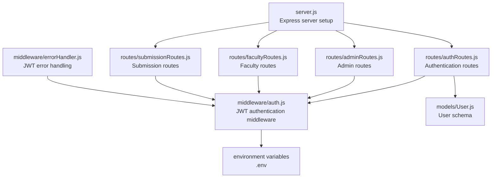
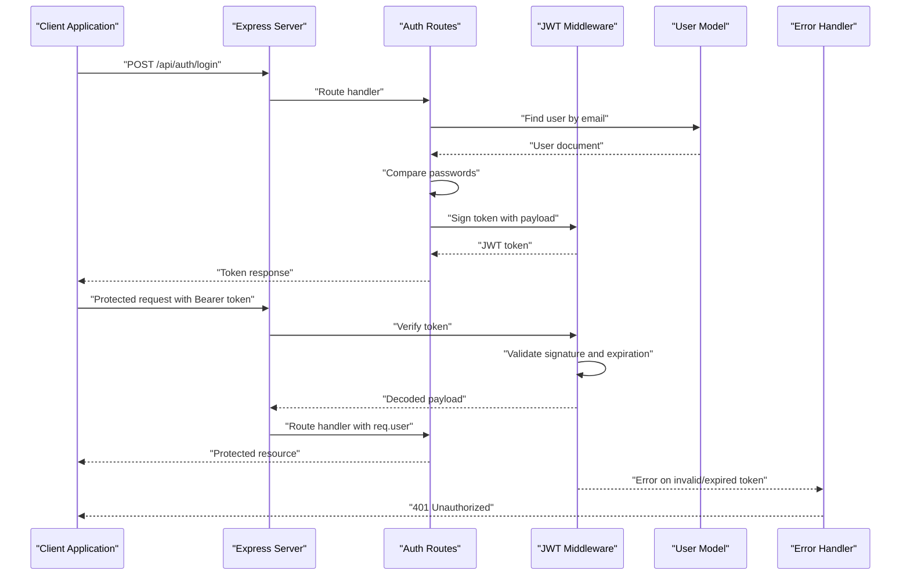
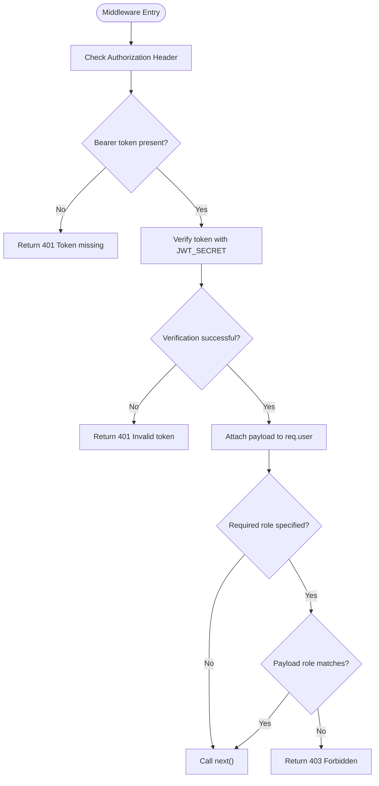
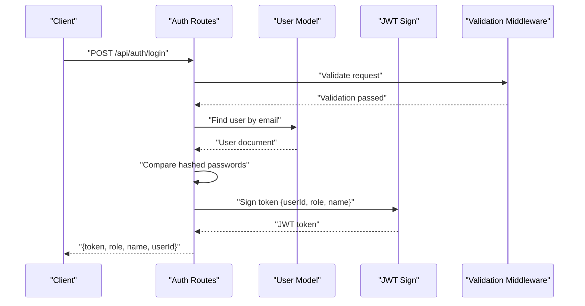
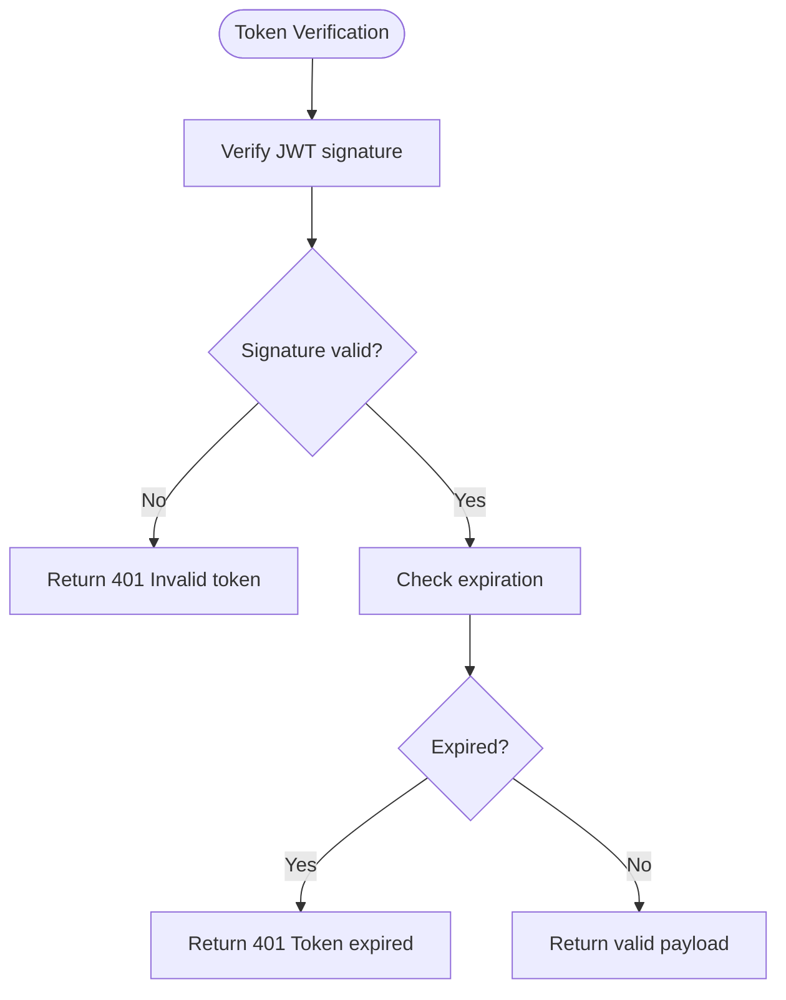
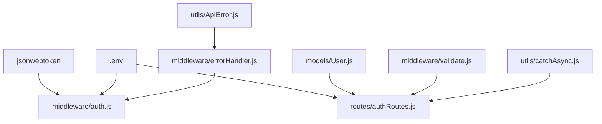

# JWT Token System

<cite>
**Referenced Files in This Document**
- [server.js](file://server.js)
- [auth.js](file://middleware/auth.js)
- [authRoutes.js](file://routes/authRoutes.js)
- [User.js](file://models/User.js)
- [.env](file://.env)
- [errorHandler.js](file://middleware/errorHandler.js)
- [validate.js](file://middleware/validate.js)
- [catchAsync.js](file://utils/catchAsync.js)
- [ApiError.js](file://utils/ApiError.js)
- [adminRoutes.js](file://routes/adminRoutes.js)
- [facultyRoutes.js](file://routes/facultyRoutes.js)
- [submissionRoutes.js](file://routes/submissionRoutes.js)
</cite>

## Table of Contents
1. [Introduction](#introduction)
2. [Project Structure](#project-structure)
3. [Core Components](#core-components)
4. [Architecture Overview](#architecture-overview)
5. [Detailed Component Analysis](#detailed-component-analysis)
6. [Dependency Analysis](#dependency-analysis)
7. [Performance Considerations](#performance-considerations)
8. [Troubleshooting Guide](#troubleshooting-guide)
9. [Conclusion](#conclusion)

## Introduction
This document provides comprehensive documentation for the JWT token implementation in the academic submission portal's authentication system. It explains how tokens are generated during user registration and login, the payload structure containing user ID and role information, token validation using the JWT_SECRET environment variable, expiration handling, and error scenarios for invalid tokens. Practical examples demonstrate token usage in authentication middleware and protected routes, along with token refresh strategies, security considerations for token storage, and best practices for JWT implementation.

## Project Structure
The authentication system is organized around several key modules:
- Server initialization and routing configuration
- Authentication routes for registration, login, and user retrieval
- JWT authentication middleware for protecting routes
- User model defining roles and attributes
- Environment configuration for JWT_SECRET
- Error handling middleware for JWT-related errors
- Validation middleware for request data
- Utility modules for asynchronous error handling and custom error types

**Diagram sources**
- [server.js](file://server.js#L1-L92)
- [authRoutes.js](file://routes/authRoutes.js#L1-L85)
- [auth.js](file://middleware/auth.js#L1-L25)
- [User.js](file://models/User.js#L1-L20)
- [.env](file://.env#L1-L4)
- [errorHandler.js](file://middleware/errorHandler.js#L1-L53)

**Section sources**
- [server.js](file://server.js#L1-L92)
- [authRoutes.js](file://routes/authRoutes.js#L1-L85)
- [auth.js](file://middleware/auth.js#L1-L25)
- [User.js](file://models/User.js#L1-L20)
- [.env](file://.env#L1-L4)
- [errorHandler.js](file://middleware/errorHandler.js#L1-L53)

## Core Components
This section outlines the primary components involved in JWT token handling:
- JWT authentication middleware: Extracts and validates tokens from Authorization headers, verifies them against the JWT_SECRET, and attaches user information to the request object.
- Authentication routes: Handles user registration and login, generates JWT tokens with payload containing user ID, role, and name, and sets token expiration.
- User model: Defines the schema with role enumeration and other attributes used in token payload.
- Environment configuration: Provides the JWT_SECRET used for signing and verifying tokens.
- Error handling: Centralized error handling for JWT-related errors such as invalid tokens and expired tokens.
- Validation middleware: Ensures request data meets validation criteria before processing authentication requests.
- Asynchronous error handling: Wraps route handlers to catch and forward errors to the centralized error handler.
- Custom error type: Provides structured error responses with status codes and operational flags.

**Section sources**
- [auth.js](file://middleware/auth.js#L1-L25)
- [authRoutes.js](file://routes/authRoutes.js#L1-L85)
- [User.js](file://models/User.js#L1-L20)
- [.env](file://.env#L1-L4)
- [errorHandler.js](file://middleware/errorHandler.js#L1-L53)
- [validate.js](file://middleware/validate.js#L1-L120)
- [catchAsync.js](file://utils/catchAsync.js#L1-L8)
- [ApiError.js](file://utils/ApiError.js#L1-L17)

## Architecture Overview
The JWT token system follows a layered architecture:
- Presentation Layer: Express routes handle incoming requests and delegate to middleware and controllers.
- Business Logic Layer: Authentication routes implement registration, login, and user retrieval logic.
- Security Layer: JWT authentication middleware enforces token validation and role-based access control.
- Data Access Layer: User model defines schema and role constraints used in token payload.
- Infrastructure Layer: Environment configuration provides JWT_SECRET and other runtime settings.

**Diagram sources**
- [authRoutes.js](file://routes/authRoutes.js#L28-L55)
- [auth.js](file://middleware/auth.js#L3-L23)
- [User.js](file://models/User.js#L1-L20)
- [errorHandler.js](file://middleware/errorHandler.js#L28-L37)

## Detailed Component Analysis

### JWT Authentication Middleware
The authentication middleware performs the following steps:
- Extracts the Authorization header and checks for the Bearer scheme.
- Verifies the token using the JWT_SECRET environment variable.
- Attaches the decoded payload (userId, role, name) to the request object.
- Enforces role-based access control when a required role is specified.
- Handles errors by returning appropriate HTTP status codes.

**Diagram sources**
- [auth.js](file://middleware/auth.js#L3-L23)

**Section sources**
- [auth.js](file://middleware/auth.js#L1-L25)

### Token Generation During Login
During login, the system:
- Validates request data using validation middleware.
- Authenticates the user by comparing hashed passwords.
- Generates a JWT token with a payload containing userId, role, and name.
- Sets token expiration to 7 days.
- Returns the token along with user information.

**Diagram sources**
- [authRoutes.js](file://routes/authRoutes.js#L28-L55)
- [validate.js](file://middleware/validate.js#L46-L53)

**Section sources**
- [authRoutes.js](file://routes/authRoutes.js#L28-L55)
- [validate.js](file://middleware/validate.js#L46-L53)

### Token Payload Structure
The JWT payload contains:
- userId: Unique identifier of the user
- role: Role of the user (student, faculty, admin)
- name: Full name of the user

These fields enable role-based access control and user identification throughout the application.

**Section sources**
- [authRoutes.js](file://routes/authRoutes.js#L42-L46)

### Token Validation and Expiration Handling
Token validation occurs in two places:
- Authentication middleware: Verifies token signature and extracts payload
- User retrieval endpoint: Manually verifies token for GET /api/auth/me

Expiration is handled by the JWT library, which throws a specific error when tokens expire. The error handler converts this error into a 401 response with a "Token expired" message.

**Diagram sources**
- [auth.js](file://middleware/auth.js#L11-L11)
- [errorHandler.js](file://middleware/errorHandler.js#L34-L37)

**Section sources**
- [auth.js](file://middleware/auth.js#L1-L25)
- [errorHandler.js](file://middleware/errorHandler.js#L28-L37)

### Protected Routes Implementation
Protected routes demonstrate JWT usage across different roles:
- Admin routes: Require admin role using auth("admin")
- Faculty routes: Require faculty role using auth("faculty")
- Submission routes: Student-only operations use auth("student")

Each route receives the authenticated user object via req.user, enabling permission checks and data filtering.

**Section sources**
- [adminRoutes.js](file://routes/adminRoutes.js#L10-L184)
- [facultyRoutes.js](file://routes/facultyRoutes.js#L10-L172)
- [submissionRoutes.js](file://routes/submissionRoutes.js#L48-L159)

### Error Scenarios and Handling
The system handles several error scenarios:
- Missing token: Returns 401 with "Token missing"
- Invalid token: Returns 401 with "Invalid token"
- Role mismatch: Returns 403 with "Forbidden: Role mismatch"
- Expired token: Returns 401 with "Token expired"
- User not found: Returns 404 with "User not found"

Centralized error handling ensures consistent error responses across the application.

**Section sources**
- [auth.js](file://middleware/auth.js#L9-L21)
- [errorHandler.js](file://middleware/errorHandler.js#L28-L37)
- [authRoutes.js](file://routes/authRoutes.js#L64-L70)

## Dependency Analysis
The JWT system has the following dependencies:
- JWT library for token signing and verification
- Environment variables for JWT_SECRET configuration
- User model for role and identity information
- Validation middleware for request data
- Error handling middleware for JWT errors
- Route handlers for protected endpoints

**Diagram sources**
- [auth.js](file://middleware/auth.js#L1-L25)
- [.env](file://.env#L1-L4)
- [authRoutes.js](file://routes/authRoutes.js#L1-L85)
- [User.js](file://models/User.js#L1-L20)
- [validate.js](file://middleware/validate.js#L1-L120)
- [errorHandler.js](file://middleware/errorHandler.js#L1-L53)
- [catchAsync.js](file://utils/catchAsync.js#L1-L8)
- [ApiError.js](file://utils/ApiError.js#L1-L17)

**Section sources**
- [auth.js](file://middleware/auth.js#L1-L25)
- [authRoutes.js](file://routes/authRoutes.js#L1-L85)
- [User.js](file://models/User.js#L1-L20)
- [validate.js](file://middleware/validate.js#L1-L120)
- [errorHandler.js](file://middleware/errorHandler.js#L1-L53)
- [catchAsync.js](file://utils/catchAsync.js#L1-L8)
- [ApiError.js](file://utils/ApiError.js#L1-L17)

## Performance Considerations
- Token expiration: 7-day expiration balances security and user experience
- Minimal payload: Only essential user information is stored in tokens
- Single verification point: Centralized middleware reduces redundant validation
- Asynchronous error handling: Prevents blocking operations in route handlers
- Rate limiting: Built-in protection against brute force attacks on authentication endpoints

## Troubleshooting Guide
Common issues and solutions:
- Invalid JWT_SECRET: Ensure JWT_SECRET is set in environment variables and matches across deployments
- Token expiration: Implement token refresh strategy for long-lived sessions
- Missing Authorization header: Verify client sends Bearer token in correct format
- Role mismatch errors: Confirm user role matches required role for protected routes
- Token not found errors: Check that token is attached to request headers and not expired

Security best practices:
- Store JWT tokens securely in memory or secure HTTP-only cookies
- Implement token refresh mechanisms for persistent sessions
- Regularly rotate JWT_SECRET in production environments
- Monitor and log authentication failures for security auditing
- Use HTTPS in production to protect token transmission

## Conclusion
The JWT token system provides robust authentication and authorization for the academic submission portal. It offers secure token generation, centralized validation, role-based access control, and comprehensive error handling. The implementation follows security best practices while maintaining simplicity and scalability for the portal's requirements.