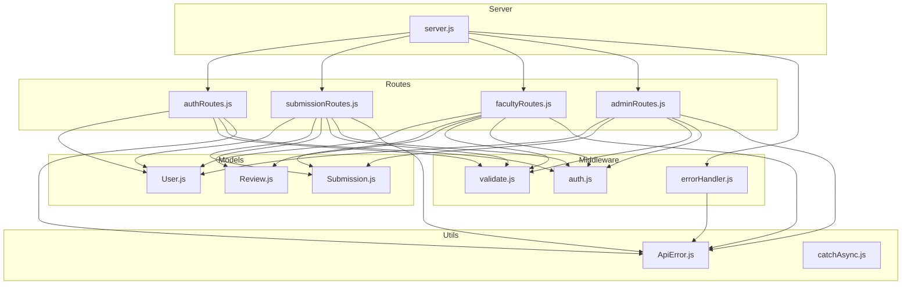
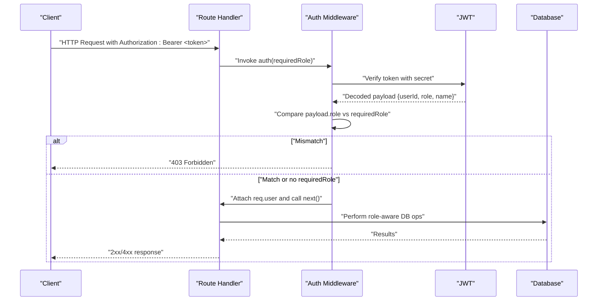
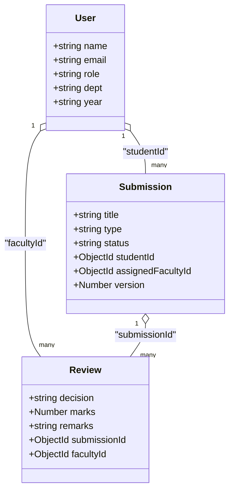
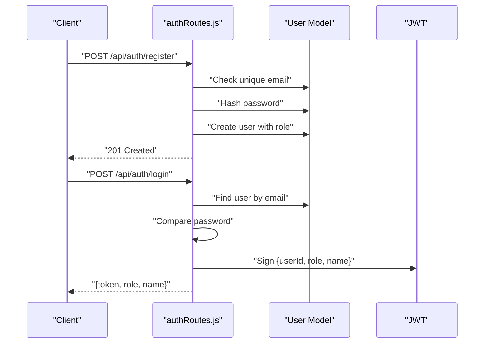
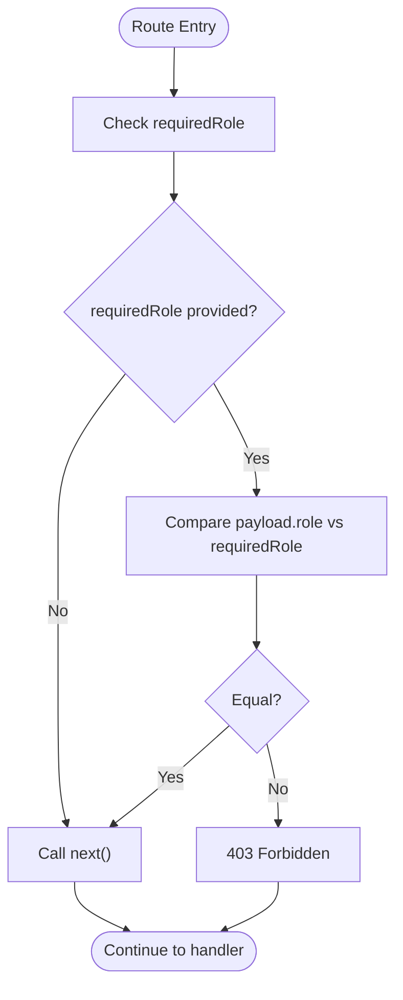
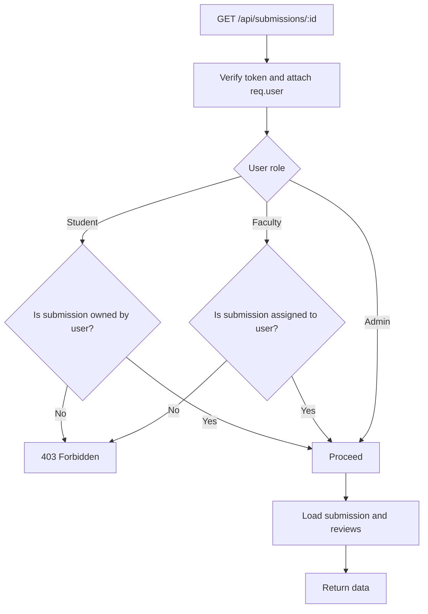
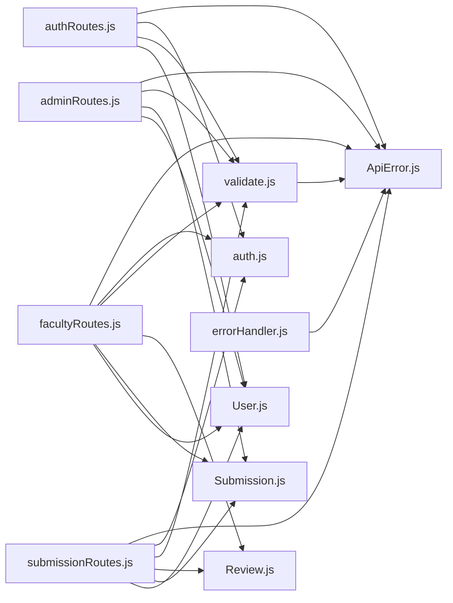

# Role-Based Access Control

<cite>
**Referenced Files in This Document**
- [server.js](file://server.js)
- [auth.js](file://middleware/auth.js)
- [validate.js](file://middleware/validate.js)
- [errorHandler.js](file://middleware/errorHandler.js)
- [User.js](file://models/User.js)
- [Submission.js](file://models/Submission.js)
- [Review.js](file://models/Review.js)
- [authRoutes.js](file://routes/authRoutes.js)
- [adminRoutes.js](file://routes/adminRoutes.js)
- [facultyRoutes.js](file://routes/facultyRoutes.js)
- [submissionRoutes.js](file://routes/submissionRoutes.js)
- [ApiError.js](file://utils/ApiError.js)
- [catchAsync.js](file://utils/catchAsync.js)
</cite>

## Table of Contents
1. [Introduction](#introduction)
2. [Project Structure](#project-structure)
3. [Core Components](#core-components)
4. [Architecture Overview](#architecture-overview)
5. [Detailed Component Analysis](#detailed-component-analysis)
6. [Dependency Analysis](#dependency-analysis)
7. [Performance Considerations](#performance-considerations)
8. [Troubleshooting Guide](#troubleshooting-guide)
9. [Conclusion](#conclusion)

## Introduction
This document explains the role-based access control (RBAC) system implemented in the backend. It covers the three user roles (student, faculty, admin), their permissions and hierarchies, how authentication and authorization are enforced via middleware, and practical examples for protecting routes and controlling access. It also documents role validation during authentication, role-based route guards, conditional access checks, role assignment during registration, and the security implications of the RBAC design.

## Project Structure
The RBAC system spans several layers:
- Middleware: Authentication and validation
- Routes: Role-scoped endpoints
- Models: User, Submission, Review data structures
- Utilities: Error handling and async wrappers
- Server bootstrap: Route mounting and global middleware

**Diagram sources**
- [server.js](file://server.js#L1-L92)
- [auth.js](file://middleware/auth.js#L1-L25)
- [validate.js](file://middleware/validate.js#L1-L120)
- [errorHandler.js](file://middleware/errorHandler.js#L1-L53)
- [User.js](file://models/User.js#L1-L20)
- [Submission.js](file://models/Submission.js#L1-L30)
- [Review.js](file://models/Review.js#L1-L18)
- [authRoutes.js](file://routes/authRoutes.js#L1-L85)
- [submissionRoutes.js](file://routes/submissionRoutes.js#L1-L159)
- [facultyRoutes.js](file://routes/facultyRoutes.js#L1-L172)
- [adminRoutes.js](file://routes/adminRoutes.js#L1-L184)
- [ApiError.js](file://utils/ApiError.js#L1-L17)
- [catchAsync.js](file://utils/catchAsync.js#L1-L8)

**Section sources**
- [server.js](file://server.js#L1-L92)

## Core Components
- User model defines roles and fields used across the system.
- Authentication middleware enforces role-based restrictions via a requiredRole parameter.
- Validation middleware ensures inputs meet business rules and role constraints.
- Route handlers apply auth guards and enforce additional conditional access checks.
- Error handling centralizes error responses and status codes.

Key implementation references:
- Role definition and defaults: [User.js](file://models/User.js#L11-L11)
- Auth guard with requiredRole: [auth.js](file://middleware/auth.js#L3-L23)
- Conditional access in submission route: [submissionRoutes.js](file://routes/submissionRoutes.js#L135-L145)
- Role validation on registration: [validate.js](file://middleware/validate.js#L33-L35)
- Token payload includes role: [authRoutes.js](file://routes/authRoutes.js#L42-L46)

**Section sources**
- [User.js](file://models/User.js#L1-L20)
- [auth.js](file://middleware/auth.js#L1-L25)
- [validate.js](file://middleware/validate.js#L33-L35)
- [authRoutes.js](file://routes/authRoutes.js#L42-L54)
- [submissionRoutes.js](file://routes/submissionRoutes.js#L135-L145)

## Architecture Overview
The RBAC architecture relies on:
- JWT tokens containing user identity and role claims
- A reusable auth middleware that validates tokens and enforces requiredRole
- Route-level guards that either restrict by role or perform dynamic checks
- Validation middleware that enforces role constraints and input correctness
- Centralized error handling for consistent responses

**Diagram sources**
- [auth.js](file://middleware/auth.js#L3-L23)
- [authRoutes.js](file://routes/authRoutes.js#L42-L54)
- [submissionRoutes.js](file://routes/submissionRoutes.js#L124-L157)

## Detailed Component Analysis

### Roles and Hierarchies
- Roles: student, faculty, admin
- Role hierarchy: admin > faculty > student
- Permissions are enforced by:
  - Required-role guards on routes
  - Conditional checks inside routes (e.g., ownership or assignment)
  - Validation constraints on role inputs

**Diagram sources**
- [User.js](file://models/User.js#L1-L20)
- [Submission.js](file://models/Submission.js#L1-L30)
- [Review.js](file://models/Review.js#L1-L18)

**Section sources**
- [User.js](file://models/User.js#L11-L11)
- [Submission.js](file://models/Submission.js#L17-L21)
- [Review.js](file://models/Review.js#L13-L13)

### Authentication and Role Validation
- Registration:
  - Accepts role with default student
  - Validates role enum
  - Stores hashed password and creates user
  - Reference: [authRoutes.js](file://routes/authRoutes.js#L9-L26), [validate.js](file://middleware/validate.js#L33-L35)
- Login:
  - Verifies credentials
  - Issues JWT with role claim
  - Reference: [authRoutes.js](file://routes/authRoutes.js#L29-L54)
- Token verification and role enforcement:
  - Extracts Bearer token
  - Verifies signature
  - Enforces requiredRole if provided
  - Reference: [auth.js](file://middleware/auth.js#L3-L23)

**Diagram sources**
- [authRoutes.js](file://routes/authRoutes.js#L9-L54)
- [User.js](file://models/User.js#L1-L20)
- [auth.js](file://middleware/auth.js#L11-L11)

**Section sources**
- [authRoutes.js](file://routes/authRoutes.js#L9-L54)
- [validate.js](file://middleware/validate.js#L33-L35)
- [auth.js](file://middleware/auth.js#L3-L23)

### Role-Based Route Guards
- Admin-only routes:
  - List faculty, users, submissions, assign faculty, dashboard stats
  - Guarded by auth("admin")
  - References: [adminRoutes.js](file://routes/adminRoutes.js#L10-L18), [adminRoutes.js](file://routes/adminRoutes.js#L21-L61), [adminRoutes.js](file://routes/adminRoutes.js#L64-L117), [adminRoutes.js](file://routes/adminRoutes.js#L120-L148), [adminRoutes.js](file://routes/adminRoutes.js#L151-L182)
- Faculty-only routes:
  - View assigned submissions, reviews, submit review, dashboard stats
  - Guarded by auth("faculty")
  - References: [facultyRoutes.js](file://routes/facultyRoutes.js#L10-L42), [facultyRoutes.js](file://routes/facultyRoutes.js#L45-L79), [facultyRoutes.js](file://routes/facultyRoutes.js#L83-L133), [facultyRoutes.js](file://routes/facultyRoutes.js#L136-L170)
- Student-only routes:
  - Upload report, view own submissions and reviews
  - Guarded by auth("student")
  - References: [submissionRoutes.js](file://routes/submissionRoutes.js#L48-L83), [submissionRoutes.js](file://routes/submissionRoutes.js#L86-L121)

**Diagram sources**
- [auth.js](file://middleware/auth.js#L14-L16)

**Section sources**
- [adminRoutes.js](file://routes/adminRoutes.js#L10-L18)
- [adminRoutes.js](file://routes/adminRoutes.js#L21-L61)
- [adminRoutes.js](file://routes/adminRoutes.js#L64-L117)
- [adminRoutes.js](file://routes/adminRoutes.js#L120-L148)
- [adminRoutes.js](file://routes/adminRoutes.js#L151-L182)
- [facultyRoutes.js](file://routes/facultyRoutes.js#L10-L42)
- [facultyRoutes.js](file://routes/facultyRoutes.js#L45-L79)
- [facultyRoutes.js](file://routes/facultyRoutes.js#L83-L133)
- [facultyRoutes.js](file://routes/facultyRoutes.js#L136-L170)
- [submissionRoutes.js](file://routes/submissionRoutes.js#L48-L83)
- [submissionRoutes.js](file://routes/submissionRoutes.js#L86-L121)

### Conditional Access Control
Some routes implement additional checks beyond requiredRole:
- Submission visibility:
  - Students can only view their own submissions
  - Faculty can only view submissions assigned to them
  - Reference: [submissionRoutes.js](file://routes/submissionRoutes.js#L135-L145)
- Faculty review assignment:
  - Can only review submissions assigned to them
  - Reference: [facultyRoutes.js](file://routes/facultyRoutes.js#L94-L96)

**Diagram sources**
- [submissionRoutes.js](file://routes/submissionRoutes.js#L124-L157)

**Section sources**
- [submissionRoutes.js](file://routes/submissionRoutes.js#L135-L145)
- [facultyRoutes.js](file://routes/facultyRoutes.js#L94-L96)

### Practical Examples

- Protect a route for admins only:
  - Apply auth("admin") before the handler
  - Reference: [adminRoutes.js](file://routes/adminRoutes.js#L10-L18)

- Protect a route for faculty only:
  - Apply auth("faculty") before the handler
  - Reference: [facultyRoutes.js](file://routes/facultyRoutes.js#L10-L42)

- Protect a route for students only:
  - Apply auth("student") before the handler
  - Reference: [submissionRoutes.js](file://routes/submissionRoutes.js#L48-L83)

- Allow any authenticated user to view a resource with conditional access:
  - Apply auth() without requiredRole
  - Add role-specific checks inside the handler
  - Reference: [submissionRoutes.js](file://routes/submissionRoutes.js#L124-L157)

- Role validation during registration:
  - Validate role enum and set default if omitted
  - Reference: [validate.js](file://middleware/validate.js#L33-L35), [authRoutes.js](file://routes/authRoutes.js#L9-L26)

- Permission escalation scenarios:
  - The system does not implement runtime role elevation
  - Access is strictly enforced by requiredRole and conditional checks
  - Reference: [auth.js](file://middleware/auth.js#L14-L16), [submissionRoutes.js](file://routes/submissionRoutes.js#L135-L145)

**Section sources**
- [adminRoutes.js](file://routes/adminRoutes.js#L10-L18)
- [facultyRoutes.js](file://routes/facultyRoutes.js#L10-L42)
- [submissionRoutes.js](file://routes/submissionRoutes.js#L48-L83)
- [submissionRoutes.js](file://routes/submissionRoutes.js#L124-L157)
- [validate.js](file://middleware/validate.js#L33-L35)
- [authRoutes.js](file://routes/authRoutes.js#L9-L26)
- [auth.js](file://middleware/auth.js#L14-L16)

### Role Assignment and Modification
- Assignment during registration:
  - role is validated and defaults to student if not provided
  - Reference: [authRoutes.js](file://routes/authRoutes.js#L9-L26), [validate.js](file://middleware/validate.js#L33-L35)
- Modification procedures:
  - Not exposed in the provided routes
  - If needed, add an admin-only endpoint to update user.role with validation
  - Reference: [User.js](file://models/User.js#L11-L11)

**Section sources**
- [authRoutes.js](file://routes/authRoutes.js#L9-L26)
- [validate.js](file://middleware/validate.js#L33-L35)
- [User.js](file://models/User.js#L11-L11)

## Dependency Analysis
- Auth middleware depends on JWT and environment secrets
- Routes depend on auth middleware and models
- Validation middleware depends on express-validator and ApiError
- Error handler depends on ApiError and logs errors
- Utilities wrap async handlers for consistent error propagation

**Diagram sources**
- [authRoutes.js](file://routes/authRoutes.js#L1-L85)
- [submissionRoutes.js](file://routes/submissionRoutes.js#L1-L159)
- [facultyRoutes.js](file://routes/facultyRoutes.js#L1-L172)
- [adminRoutes.js](file://routes/adminRoutes.js#L1-L184)
- [auth.js](file://middleware/auth.js#L1-L25)
- [validate.js](file://middleware/validate.js#L1-L120)
- [errorHandler.js](file://middleware/errorHandler.js#L1-L53)
- [ApiError.js](file://utils/ApiError.js#L1-L17)
- [User.js](file://models/User.js#L1-L20)
- [Submission.js](file://models/Submission.js#L1-L30)
- [Review.js](file://models/Review.js#L1-L18)

**Section sources**
- [auth.js](file://middleware/auth.js#L1-L25)
- [validate.js](file://middleware/validate.js#L1-L120)
- [errorHandler.js](file://middleware/errorHandler.js#L1-L53)
- [User.js](file://models/User.js#L1-L20)
- [Submission.js](file://models/Submission.js#L1-L30)
- [Review.js](file://models/Review.js#L1-L18)
- [authRoutes.js](file://routes/authRoutes.js#L1-L85)
- [submissionRoutes.js](file://routes/submissionRoutes.js#L1-L159)
- [facultyRoutes.js](file://routes/facultyRoutes.js#L1-L172)
- [adminRoutes.js](file://routes/adminRoutes.js#L1-L184)
- [ApiError.js](file://utils/ApiError.js#L1-L17)

## Performance Considerations
- JWT verification is lightweight; keep token size minimal
- Use pagination for admin and faculty lists to reduce payload sizes
- Leverage database indexes on frequently queried fields (e.g., email, role)
- Avoid unnecessary population in routes; only populate when needed
- Consider caching role and basic profile data for frequent authenticated requests

## Troubleshooting Guide
Common issues and resolutions:
- Missing or invalid Authorization header:
  - Symptom: 401 Token missing or Invalid token
  - Resolution: Ensure Bearer token is present and valid
  - Reference: [auth.js](file://middleware/auth.js#L9-L21)
- Role mismatch:
  - Symptom: 403 Forbidden: Role mismatch
  - Resolution: Use correct auth guard for the route or adjust user role
  - Reference: [auth.js](file://middleware/auth.js#L14-L16)
- Unauthorized access to resources:
  - Symptom: 403 Forbidden for submissions
  - Resolution: Verify ownership or assignment; ensure correct role
  - Reference: [submissionRoutes.js](file://routes/submissionRoutes.js#L135-L145)
- Validation errors:
  - Symptom: 400 Bad Request with validation messages
  - Resolution: Fix input according to validation rules
  - Reference: [validate.js](file://middleware/validate.js#L18-L119)
- JWT errors:
  - Symptom: 401 Invalid token or Token expired
  - Resolution: Re-authenticate or refresh token
  - Reference: [errorHandler.js](file://middleware/errorHandler.js#L28-L37)

**Section sources**
- [auth.js](file://middleware/auth.js#L9-L21)
- [auth.js](file://middleware/auth.js#L14-L16)
- [submissionRoutes.js](file://routes/submissionRoutes.js#L135-L145)
- [validate.js](file://middleware/validate.js#L18-L119)
- [errorHandler.js](file://middleware/errorHandler.js#L28-L37)

## Conclusion
The RBAC system enforces strict role-based access using a reusable auth middleware and route-level guards. Roles are validated during registration, and additional conditional checks ensure proper ownership and assignment. The design is modular, secure, and extensible—ready to support future enhancements such as role modification endpoints or advanced permission matrices.