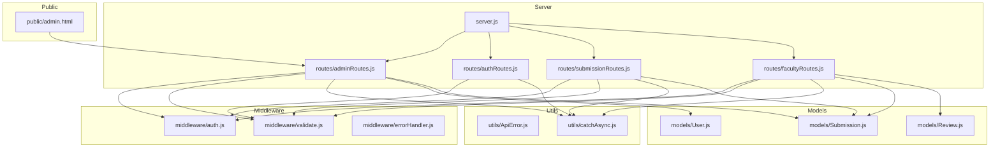
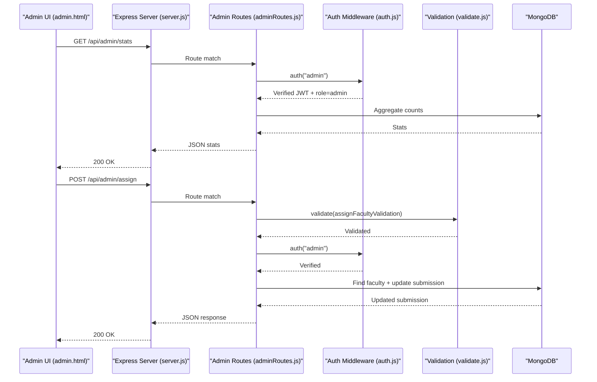
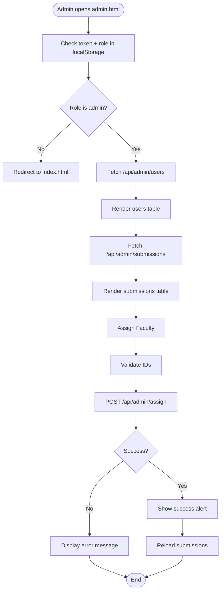
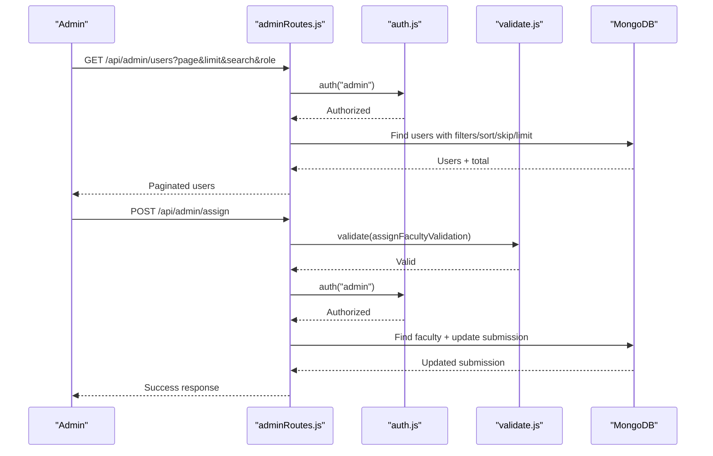
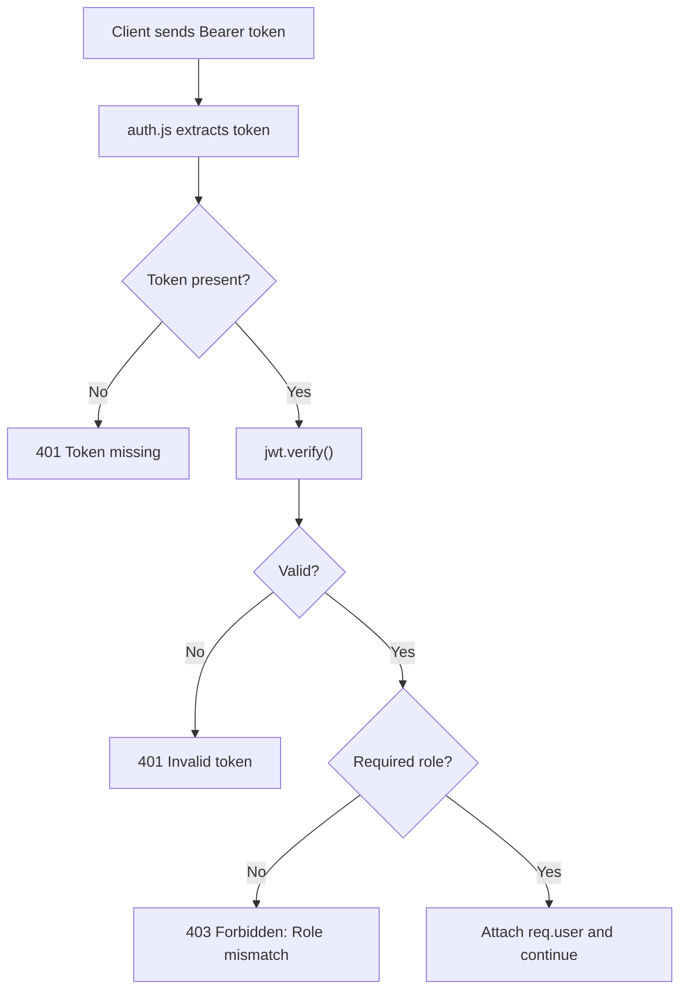
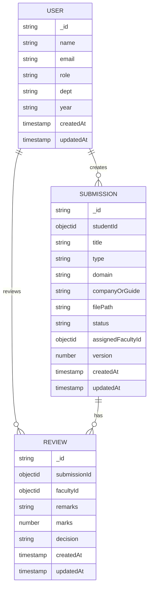
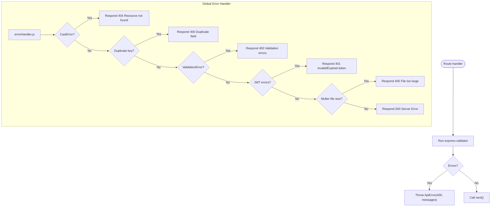
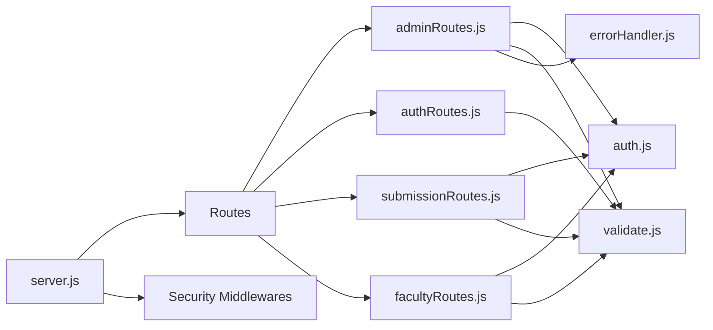

# Administrative Oversight & Dashboard

<cite>
**Referenced Files in This Document**
- [server.js](file://server.js)
- [auth.js](file://middleware/auth.js)
- [validate.js](file://middleware/validate.js)
- [errorHandler.js](file://middleware/errorHandler.js)
- [ApiError.js](file://utils/ApiError.js)
- [catchAsync.js](file://utils/catchAsync.js)
- [User.js](file://models/User.js)
- [Submission.js](file://models/Submission.js)
- [Review.js](file://models/Review.js)
- [adminRoutes.js](file://routes/adminRoutes.js)
- [authRoutes.js](file://routes/authRoutes.js)
- [submissionRoutes.js](file://routes/submissionRoutes.js)
- [facultyRoutes.js](file://routes/facultyRoutes.js)
- [admin.html](file://public/admin.html)
- [package.json](file://package.json)
</cite>

## Table of Contents
1. [Introduction](#introduction)
2. [Project Structure](#project-structure)
3. [Core Components](#core-components)
4. [Architecture Overview](#architecture-overview)
5. [Detailed Component Analysis](#detailed-component-analysis)
6. [Dependency Analysis](#dependency-analysis)
7. [Performance Considerations](#performance-considerations)
8. [Troubleshooting Guide](#troubleshooting-guide)
9. [Conclusion](#conclusion)
10. [Appendices](#appendices)

## Introduction
This document describes the administrative dashboard and oversight system for managing users, monitoring submissions, and supervising workflows. It explains administrative controls for user role management, system configuration, and workflow optimization, and documents dashboard metrics, reporting capabilities, and system health monitoring. Practical examples illustrate administrative user management, bulk operations, and system maintenance tasks. The admin permissions model, audit trail generation, and compliance reporting features are addressed alongside administrative workflows for system updates, user onboarding, and performance optimization.

## Project Structure
The backend is organized around Express routes, Mongoose models, middleware, and utilities. The admin panel is served as a static HTML page that communicates with the API via bearer tokens.

**Diagram sources**
- [server.js](file://server.js#L62-L66)
- [adminRoutes.js](file://routes/adminRoutes.js#L1-L184)
- [authRoutes.js](file://routes/authRoutes.js#L1-L85)
- [submissionRoutes.js](file://routes/submissionRoutes.js#L1-L159)
- [facultyRoutes.js](file://routes/facultyRoutes.js#L1-L172)
- [auth.js](file://middleware/auth.js#L1-L25)
- [validate.js](file://middleware/validate.js#L1-L120)
- [errorHandler.js](file://middleware/errorHandler.js#L1-L53)
- [ApiError.js](file://utils/ApiError.js#L1-L17)
- [catchAsync.js](file://utils/catchAsync.js#L1-L8)
- [User.js](file://models/User.js#L1-L20)
- [Submission.js](file://models/Submission.js#L1-L30)
- [Review.js](file://models/Review.js#L1-L18)
- [admin.html](file://public/admin.html#L1-L189)

**Section sources**
- [server.js](file://server.js#L1-L92)
- [package.json](file://package.json#L1-L28)

## Core Components
- Authentication and Authorization Middleware
  - Validates JWT bearer tokens and enforces role-based access control for admin-only endpoints.
- Validation Layer
  - Provides reusable validators for pagination, assignment, and submission workflows.
- Error Handling
  - Centralized error handling for API errors, validation failures, and runtime exceptions.
- Models
  - User, Submission, and Review define core entities and relationships.
- Routes
  - Admin routes expose user listing, submission supervision, faculty assignment, and dashboard statistics.
  - Auth routes handle registration, login, and profile retrieval.
  - Submission routes manage uploads, viewing, and permissions.
  - Faculty routes support assigned submissions, reviews, and dashboard stats.

**Section sources**
- [auth.js](file://middleware/auth.js#L1-L25)
- [validate.js](file://middleware/validate.js#L1-L120)
- [errorHandler.js](file://middleware/errorHandler.js#L1-L53)
- [User.js](file://models/User.js#L1-L20)
- [Submission.js](file://models/Submission.js#L1-L30)
- [Review.js](file://models/Review.js#L1-L18)
- [adminRoutes.js](file://routes/adminRoutes.js#L1-L184)
- [authRoutes.js](file://routes/authRoutes.js#L1-L85)
- [submissionRoutes.js](file://routes/submissionRoutes.js#L1-L159)
- [facultyRoutes.js](file://routes/facultyRoutes.js#L1-L172)

## Architecture Overview
The system uses JWT-based authentication with role checks. Admin endpoints are protected by the auth middleware requiring the "admin" role. Validation middleware ensures request correctness before handlers execute. Error handling normalizes responses across the board. The admin panel is a lightweight SPA-like client that fetches data from admin endpoints and performs actions such as assigning faculty to submissions.

**Diagram sources**
- [admin.html](file://public/admin.html#L101-L182)
- [server.js](file://server.js#L62-L66)
- [adminRoutes.js](file://routes/adminRoutes.js#L10-L182)
- [auth.js](file://middleware/auth.js#L1-L25)
- [validate.js](file://middleware/validate.js#L74-L82)

## Detailed Component Analysis

### Admin Dashboard Frontend
- Purpose
  - Displays users and submissions, supports faculty assignment, and handles logout.
- Key Behaviors
  - Loads users and submissions via admin endpoints.
  - Assigns faculty to a submission using submissionId and facultyId.
  - Enforces admin role via local storage and redirects unauthorized users.
- Practical Examples
  - Bulk operations: The UI lists users and submissions; administrators can copy IDs from the console and trigger batch-like operations by calling the assignment endpoint multiple times.
  - Maintenance: Refreshing pages reloads data from the backend.

**Diagram sources**
- [admin.html](file://public/admin.html#L90-L182)

**Section sources**
- [admin.html](file://public/admin.html#L1-L189)

### Admin Routes and Workflows
- Users Listing with Search and Pagination
  - Filters by role and partial name/email; paginates results.
- Submissions Listing with Filters and Search
  - Filters by status/type; supports searching by student name via joined IDs.
- Faculty Assignment
  - Validates IDs, verifies faculty existence, updates submission status to "Assigned".
- Dashboard Statistics
  - Aggregates totals for users, faculty, students, and submission statuses.

**Diagram sources**
- [adminRoutes.js](file://routes/adminRoutes.js#L20-L182)
- [auth.js](file://middleware/auth.js#L1-L25)
- [validate.js](file://middleware/validate.js#L74-L82)

**Section sources**
- [adminRoutes.js](file://routes/adminRoutes.js#L1-L184)

### Authentication and Permissions Model
- JWT Payload
  - Contains userId, role, and name; signed with a secret.
- Role Enforcement
  - Admin-only endpoints enforce required role "admin".
- Current User Profile
  - Returns user info excluding sensitive fields.

**Diagram sources**
- [auth.js](file://middleware/auth.js#L1-L25)
- [authRoutes.js](file://routes/authRoutes.js#L28-L55)

**Section sources**
- [auth.js](file://middleware/auth.js#L1-L25)
- [authRoutes.js](file://routes/authRoutes.js#L1-L85)

### Data Models and Relationships

**Diagram sources**
- [User.js](file://models/User.js#L1-L20)
- [Submission.js](file://models/Submission.js#L1-L30)
- [Review.js](file://models/Review.js#L1-L18)

**Section sources**
- [User.js](file://models/User.js#L1-L20)
- [Submission.js](file://models/Submission.js#L1-L30)
- [Review.js](file://models/Review.js#L1-L18)

### Validation and Error Handling
- Validation
  - Reusable validators for pagination, assignment, and submission creation.
- Error Handling
  - Converts various errors (validation, cast, JWT, multer) into structured API responses.

**Diagram sources**
- [validate.js](file://middleware/validate.js#L1-L120)
- [errorHandler.js](file://middleware/errorHandler.js#L1-L53)
- [ApiError.js](file://utils/ApiError.js#L1-L17)

**Section sources**
- [validate.js](file://middleware/validate.js#L1-L120)
- [errorHandler.js](file://middleware/errorHandler.js#L1-L53)
- [ApiError.js](file://utils/ApiError.js#L1-L17)

### Faculty and Student Workflows (for context)
- Faculty Assigned Submissions and Reviews
  - Lists assigned submissions, review history, and submits decisions with marks and remarks.
- Student Uploads and Views
  - Uploads PDF reports with validation, views own submissions and associated reviews.

**Section sources**
- [facultyRoutes.js](file://routes/facultyRoutes.js#L1-L172)
- [submissionRoutes.js](file://routes/submissionRoutes.js#L1-L159)

## Dependency Analysis
- Routing and Security
  - server.js mounts routes and applies security middleware (CORS, helmet, rate limiting, sanitization).
- Admin Dependencies
  - adminRoutes depends on auth middleware, validation, catchAsync, and models.
- Validation Cohesion
  - Validation rules are centralized and reused across routes.
- Error Normalization
  - errorHandler provides consistent responses regardless of error source.

**Diagram sources**
- [server.js](file://server.js#L18-L82)
- [adminRoutes.js](file://routes/adminRoutes.js#L1-L8)
- [authRoutes.js](file://routes/authRoutes.js#L1-L7)
- [submissionRoutes.js](file://routes/submissionRoutes.js#L1-L12)
- [facultyRoutes.js](file://routes/facultyRoutes.js#L1-L7)

**Section sources**
- [server.js](file://server.js#L1-L92)
- [adminRoutes.js](file://routes/adminRoutes.js#L1-L8)
- [authRoutes.js](file://routes/authRoutes.js#L1-L7)
- [submissionRoutes.js](file://routes/submissionRoutes.js#L1-L12)
- [facultyRoutes.js](file://routes/facultyRoutes.js#L1-L7)

## Performance Considerations
- Database Queries
  - Admin endpoints use aggregation and count queries; consider adding indexes on frequently queried fields (e.g., role, status, timestamps).
- Pagination
  - Implemented consistently; keep limit within safe bounds to avoid heavy loads.
- Concurrency
  - Parallelize independent queries (e.g., fetching users and total count) to reduce latency.
- File Uploads
  - PDF validation occurs after upload; consider pre-checking magic bytes during upload to fail fast.

[No sources needed since this section provides general guidance]

## Troubleshooting Guide
- Authentication Failures
  - Missing or invalid token leads to 401 responses; verify JWT_SECRET and token presence.
- Authorization Failures
  - Non-admin users receive 403 on admin endpoints; ensure role is set to admin.
- Validation Errors
  - 400 responses with aggregated messages indicate malformed requests; confirm query/body fields meet validation criteria.
- Resource Not Found
  - Cast errors are normalized to 404; verify IDs and resource existence.
- File Upload Issues
  - Non-PDF or oversized files are rejected; ensure PDF magic number and size limits.

**Section sources**
- [auth.js](file://middleware/auth.js#L1-L25)
- [errorHandler.js](file://middleware/errorHandler.js#L1-L53)
- [validate.js](file://middleware/validate.js#L1-L120)
- [submissionRoutes.js](file://routes/submissionRoutes.js#L17-L45)

## Conclusion
The administrative dashboard provides a focused interface for overseeing users, submissions, and workflow assignments. Admin routes enforce strict role-based access, validate inputs, and deliver paginated, filtered datasets. The system’s modular middleware and centralized error handling ensure predictable behavior. Extending the dashboard with additional metrics, audit logs, and compliance reporting would further strengthen oversight capabilities.

[No sources needed since this section summarizes without analyzing specific files]

## Appendices

### Administrative Controls and Workflows
- User Management
  - View users with role and department filters; copy IDs from console for bulk operations.
- System Monitoring
  - Use dashboard stats to track submission pipeline and user distribution.
- Workflow Supervision
  - Assign faculty to submissions; monitor status transitions.
- System Maintenance
  - Refresh dashboards to reflect latest data; ensure uploads directory permissions and disk space.

[No sources needed since this section provides general guidance]