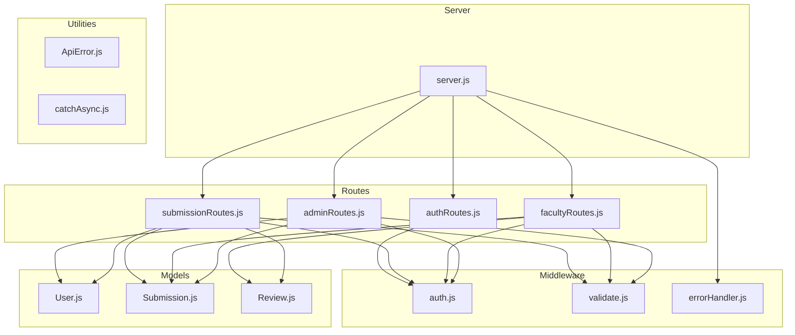
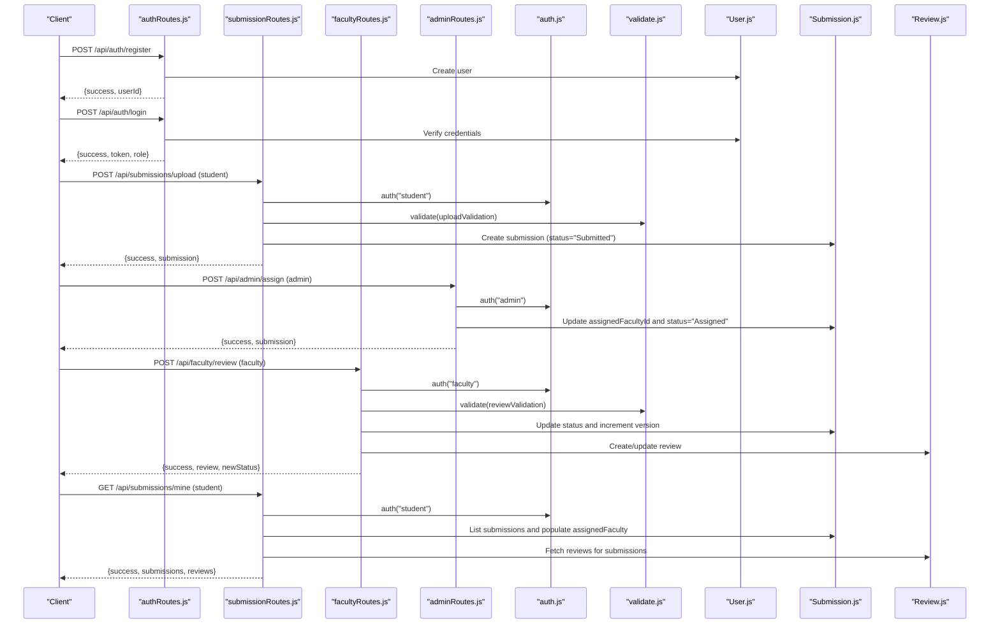
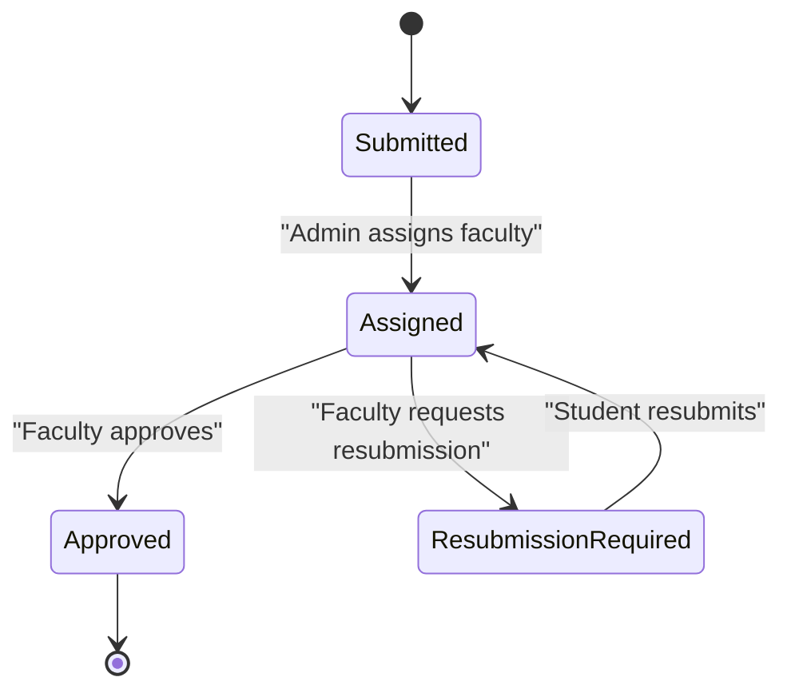
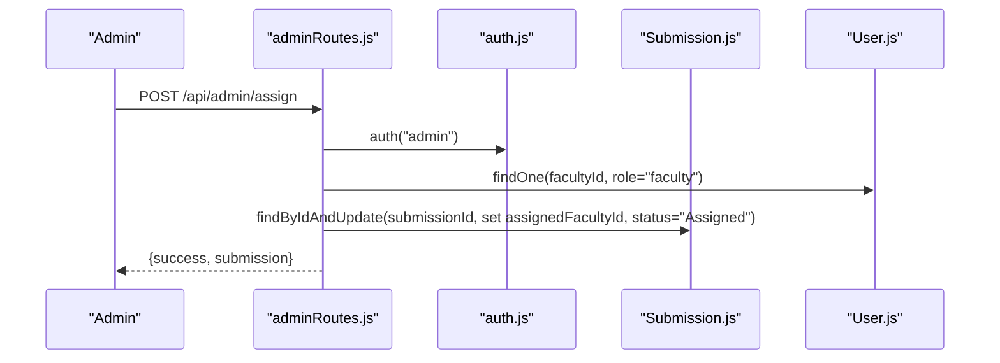
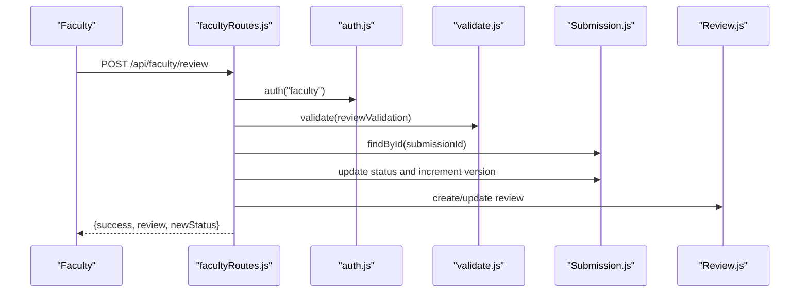
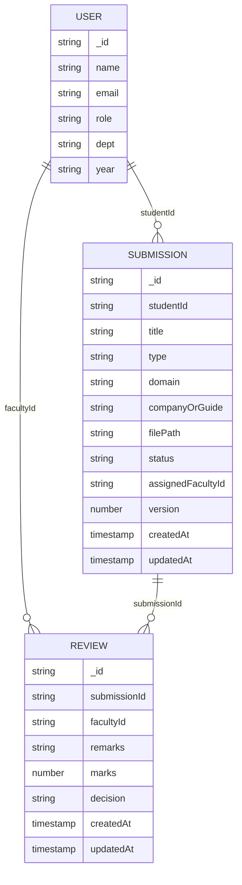
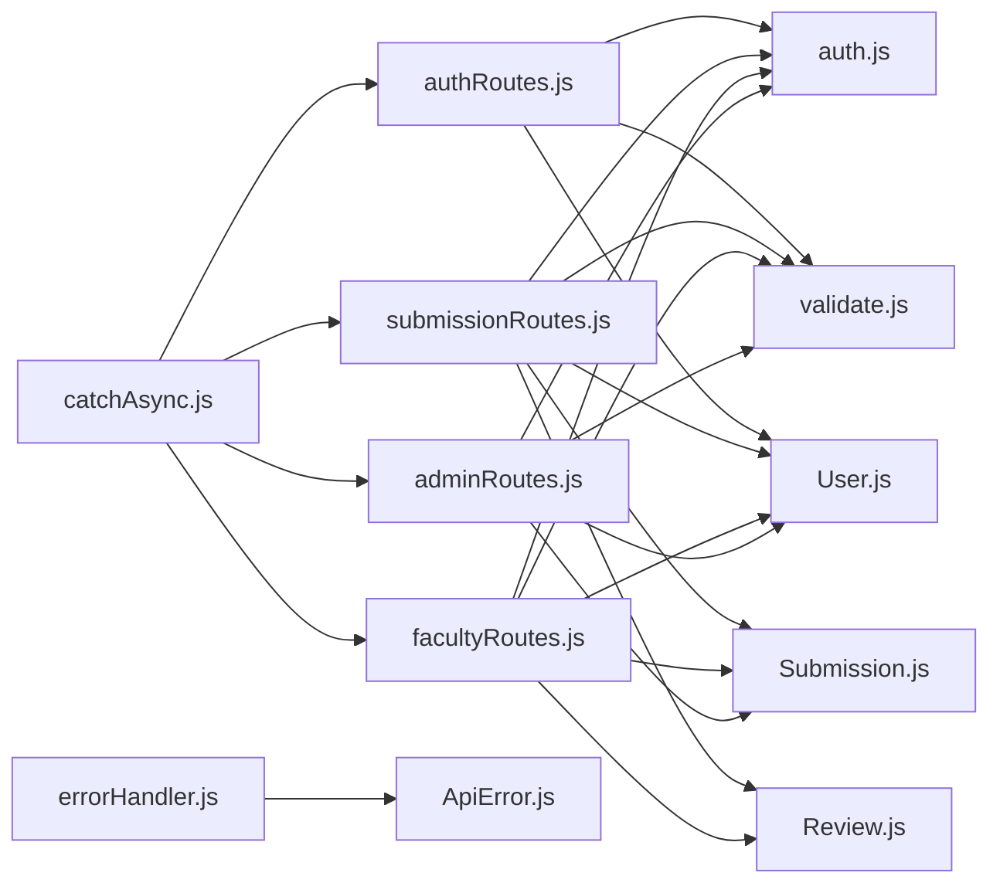

# Business Logic & Workflow

<cite>
**Referenced Files in This Document**
- [server.js](file://server.js)
- [auth.js](file://middleware/auth.js)
- [validate.js](file://middleware/validate.js)
- [errorHandler.js](file://middleware/errorHandler.js)
- [ApiError.js](file://utils/ApiError.js)
- [catchAsync.js](file://utils/catchAsync.js)
- [User.js](file://models/User.js)
- [Submission.js](file://models/Submission.js)
- [Review.js](file://models/Review.js)
- [authRoutes.js](file://routes/authRoutes.js)
- [submissionRoutes.js](file://routes/submissionRoutes.js)
- [facultyRoutes.js](file://routes/facultyRoutes.js)
- [adminRoutes.js](file://routes/adminRoutes.js)
</cite>

## Table of Contents
1. [Introduction](#introduction)
2. [Project Structure](#project-structure)
3. [Core Components](#core-components)
4. [Architecture Overview](#architecture-overview)
5. [Detailed Component Analysis](#detailed-component-analysis)
6. [Dependency Analysis](#dependency-analysis)
7. [Performance Considerations](#performance-considerations)
8. [Troubleshooting Guide](#troubleshooting-guide)
9. [Conclusion](#conclusion)
10. [Appendices](#appendices)

## Introduction
This document explains the academic submission workflow management system’s business logic and multi-stage workflow: Submitted → Assigned → Approved. It covers state transitions, faculty assignment, review and evaluation, approvals, role-based permissions, and administrative oversight. It also documents practical execution examples, status tracking, audit trails, exceptions, reassignment procedures, and monitoring capabilities.

## Project Structure
The backend is organized around a layered architecture:
- Routes define REST endpoints for authentication, submissions, faculty, and administration.
- Middleware enforces authentication, authorization, and input validation.
- Models define the data schema for Users, Submissions, and Reviews.
- Utilities encapsulate error handling and asynchronous wrappers.
- The server initializes middleware, routes, static assets, and database connections.

**Diagram sources**
- [server.js](file://server.js#L1-L92)
- [auth.js](file://middleware/auth.js#L1-L25)
- [validate.js](file://middleware/validate.js#L1-L120)
- [errorHandler.js](file://middleware/errorHandler.js#L1-L53)
- [authRoutes.js](file://routes/authRoutes.js#L1-L85)
- [submissionRoutes.js](file://routes/submissionRoutes.js#L1-L159)
- [facultyRoutes.js](file://routes/facultyRoutes.js#L1-L172)
- [adminRoutes.js](file://routes/adminRoutes.js#L1-L184)
- [User.js](file://models/User.js#L1-L20)
- [Submission.js](file://models/Submission.js#L1-L30)
- [Review.js](file://models/Review.js#L1-L18)

**Section sources**
- [server.js](file://server.js#L1-L92)

## Core Components
- Authentication and Authorization: JWT-based authentication with role gating enforced by middleware.
- Validation: Centralized validation rules for registration, login, submission upload, review decisions, and pagination.
- Models:
  - User: Stores identity, role, department, and year.
  - Submission: Tracks student submissions, type, domain/company/guide, file path, status, assigned faculty, and version.
  - Review: Captures faculty remarks, marks, and decision per submission.
- Routes:
  - Auth: Registration, login, and profile retrieval.
  - Submission: Upload, list mine, and view single submission with reviews.
  - Faculty: View assigned submissions, review history, submit reviews, and dashboard stats.
  - Admin: Manage users, list submissions, assign faculty, and dashboard stats.

**Section sources**
- [auth.js](file://middleware/auth.js#L1-L25)
- [validate.js](file://middleware/validate.js#L1-L120)
- [User.js](file://models/User.js#L1-L20)
- [Submission.js](file://models/Submission.js#L1-L30)
- [Review.js](file://models/Review.js#L1-L18)
- [authRoutes.js](file://routes/authRoutes.js#L1-L85)
- [submissionRoutes.js](file://routes/submissionRoutes.js#L1-L159)
- [facultyRoutes.js](file://routes/facultyRoutes.js#L1-L172)
- [adminRoutes.js](file://routes/adminRoutes.js#L1-L184)

## Architecture Overview
The system follows a RESTful API architecture with role-based access control and MongoDB-backed persistence. Requests flow through middleware for security and validation, then reach route handlers that interact with models and return structured JSON responses.

**Diagram sources**
- [authRoutes.js](file://routes/authRoutes.js#L1-L85)
- [submissionRoutes.js](file://routes/submissionRoutes.js#L1-L159)
- [facultyRoutes.js](file://routes/facultyRoutes.js#L1-L172)
- [adminRoutes.js](file://routes/adminRoutes.js#L1-L184)
- [auth.js](file://middleware/auth.js#L1-L25)
- [validate.js](file://middleware/validate.js#L1-L120)
- [User.js](file://models/User.js#L1-L20)
- [Submission.js](file://models/Submission.js#L1-L30)
- [Review.js](file://models/Review.js#L1-L18)

## Detailed Component Analysis

### Workflow States and Transitions
The submission lifecycle progresses through three primary states:
- Submitted: Initial state after student upload.
- Assigned: Admin assigns a faculty member; submission becomes actionable.
- Approved: Faculty evaluates and approves; submission completes.

**Diagram sources**
- [Submission.js](file://models/Submission.js#L17-L21)
- [adminRoutes.js](file://routes/adminRoutes.js#L119-L148)
- [facultyRoutes.js](file://routes/facultyRoutes.js#L82-L133)

**Section sources**
- [Submission.js](file://models/Submission.js#L17-L21)
- [adminRoutes.js](file://routes/adminRoutes.js#L119-L148)
- [facultyRoutes.js](file://routes/facultyRoutes.js#L82-L133)

### Role-Based Permissions
- Student:
  - Can upload submissions and view their own submissions and associated reviews.
  - Cannot access others’ submissions or administrative endpoints.
- Faculty:
  - Can view assigned submissions, submit reviews, and track personal stats.
  - Cannot modify unrelated submissions or assign faculty.
- Admin:
  - Can manage users, list submissions, assign faculty, and view system-wide stats.

Access control is enforced by middleware and route guards.

**Section sources**
- [auth.js](file://middleware/auth.js#L3-L23)
- [submissionRoutes.js](file://routes/submissionRoutes.js#L124-L157)
- [facultyRoutes.js](file://routes/facultyRoutes.js#L10-L42)
- [adminRoutes.js](file://routes/adminRoutes.js#L21-L61)

### Faculty Assignment System
- Admin endpoint accepts a submission ID and a faculty ID.
- Validates faculty existence and role.
- Updates submission’s assigned faculty and sets status to Assigned.
- Returns populated submission with assigned faculty details.

**Diagram sources**
- [adminRoutes.js](file://routes/adminRoutes.js#L119-L148)
- [auth.js](file://middleware/auth.js#L3-L23)
- [Submission.js](file://models/Submission.js#L23-L25)
- [User.js](file://models/User.js#L11)

**Section sources**
- [adminRoutes.js](file://routes/adminRoutes.js#L119-L148)

### Review and Evaluation Process
- Faculty submits a review with decision (Approved or Resubmission Required), optional marks, and remarks.
- Route validates inputs and checks assignment ownership.
- Updates submission status and increments version.
- Creates or updates a Review record linked to the submission and faculty.

**Diagram sources**
- [facultyRoutes.js](file://routes/facultyRoutes.js#L82-L133)
- [auth.js](file://middleware/auth.js#L3-L23)
- [validate.js](file://middleware/validate.js#L84-L99)
- [Submission.js](file://models/Submission.js#L17-L25)
- [Review.js](file://models/Review.js#L13)

**Section sources**
- [facultyRoutes.js](file://routes/facultyRoutes.js#L82-L133)
- [validate.js](file://middleware/validate.js#L84-L99)
- [Review.js](file://models/Review.js#L1-L18)

### Approval Mechanisms
- Approval occurs when a faculty member selects “Approved” during review.
- Submission status transitions to Approved and version increments.
- Students can view the final status and associated reviews.

**Section sources**
- [facultyRoutes.js](file://routes/facultyRoutes.js#L122-L124)
- [submissionRoutes.js](file://routes/submissionRoutes.js#L147-L149)

### Practical Execution Examples
- Student uploads a report:
  - Endpoint: POST /api/submissions/upload
  - Payload includes title, type, optional domain/company/guide, and a PDF file.
  - On success, submission is created with status “Submitted”.
- Admin assigns a faculty:
  - Endpoint: POST /api/admin/assign
  - Payload includes submissionId and facultyId.
  - On success, submission status becomes “Assigned”.
- Faculty reviews and approves:
  - Endpoint: POST /api/faculty/review
  - Payload includes submissionId, decision, optional marks, and remarks.
  - On success, submission status becomes “Approved” and version increments.
- Student views own submissions and reviews:
  - Endpoint: GET /api/submissions/mine
  - Returns paginated submissions and associated reviews.

**Section sources**
- [submissionRoutes.js](file://routes/submissionRoutes.js#L48-L83)
- [adminRoutes.js](file://routes/adminRoutes.js#L119-L148)
- [facultyRoutes.js](file://routes/facultyRoutes.js#L82-L133)
- [submissionRoutes.js](file://routes/submissionRoutes.js#L85-L121)

### Status Tracking and Audit Trails
- Submission model tracks createdAt/updatedAt timestamps and maintains a version counter.
- Review model captures creation timestamps and links to submission and faculty.
- Admin and faculty dashboards expose counts and summaries for monitoring.

**Diagram sources**
- [User.js](file://models/User.js#L1-L20)
- [Submission.js](file://models/Submission.js#L1-L30)
- [Review.js](file://models/Review.js#L1-L18)

**Section sources**
- [Submission.js](file://models/Submission.js#L25-L27)
- [Review.js](file://models/Review.js#L13-L15)
- [adminRoutes.js](file://routes/adminRoutes.js#L150-L182)
- [facultyRoutes.js](file://routes/facultyRoutes.js#L135-L170)

### Business Logic for Submission Processing
- File ingestion:
  - Only PDFs are accepted; fileFilter restricts to application/pdf.
  - Magic-number validation ensures actual PDF content.
  - Unique filenames generated with UUID and sanitized original names.
- Submission creation:
  - Populates studentId, title, type, optional fields, file path, and initial status “Submitted”.
- Access control:
  - Single-submission view enforces ownership for students and assignment ownership for faculty.
- Pagination:
  - All list endpoints support page and limit parameters with safe defaults.

**Section sources**
- [submissionRoutes.js](file://routes/submissionRoutes.js#L17-L45)
- [submissionRoutes.js](file://routes/submissionRoutes.js#L48-L83)
- [submissionRoutes.js](file://routes/submissionRoutes.js#L124-L157)
- [validate.js](file://middleware/validate.js#L101-L109)

### Faculty Workload Management
- Faculty dashboard exposes:
  - Total assigned submissions.
  - Pending reviews (Submitted or Assigned).
  - Approved and Resubmission Required counts.
  - Total reviews created.
- Admin dashboard exposes:
  - Totals for users, submissions, and statuses.

**Section sources**
- [facultyRoutes.js](file://routes/facultyRoutes.js#L135-L170)
- [adminRoutes.js](file://routes/adminRoutes.js#L150-L182)

### Administrative Oversight
- Admin endpoints:
  - List users with search and role filtering.
  - List submissions with status/type/search filters.
  - Assign faculty to submissions.
  - Retrieve system-wide statistics.

**Section sources**
- [adminRoutes.js](file://routes/adminRoutes.js#L9-L18)
- [adminRoutes.js](file://routes/adminRoutes.js#L20-L61)
- [adminRoutes.js](file://routes/adminRoutes.js#L63-L117)
- [adminRoutes.js](file://routes/adminRoutes.js#L119-L148)
- [adminRoutes.js](file://routes/adminRoutes.js#L150-L182)

### Workflow Exceptions and Reassignment Procedures
- Exceptions handled centrally:
  - Missing or invalid tokens.
  - Cast errors (invalid ObjectId).
  - Duplicate keys.
  - Validation errors.
  - File size limits.
- Reassignment:
  - Admin can reassign a submission to another faculty member at any time.
  - Reassignment updates assignedFacultyId and resets status to “Assigned”.

**Section sources**
- [errorHandler.js](file://middleware/errorHandler.js#L1-L53)
- [adminRoutes.js](file://routes/adminRoutes.js#L119-L148)

### System Monitoring Capabilities
- Health endpoint: GET /health returns server status.
- Static asset serving for uploads and frontend.
- Rate limiting for general and authentication endpoints.
- CORS enabled for configured frontend URL.

**Section sources**
- [server.js](file://server.js#L68-L82)
- [server.js](file://server.js#L24-L38)
- [server.js](file://server.js#L41-L44)

## Dependency Analysis
The system exhibits low coupling and high cohesion:
- Routes depend on middleware for auth and validation.
- Models encapsulate schema and relationships.
- Utilities provide shared error handling and async wrappers.
- No circular dependencies observed among core modules.

**Diagram sources**
- [authRoutes.js](file://routes/authRoutes.js#L1-L85)
- [submissionRoutes.js](file://routes/submissionRoutes.js#L1-L159)
- [facultyRoutes.js](file://routes/facultyRoutes.js#L1-L172)
- [adminRoutes.js](file://routes/adminRoutes.js#L1-L184)
- [auth.js](file://middleware/auth.js#L1-L25)
- [validate.js](file://middleware/validate.js#L1-L120)
- [errorHandler.js](file://middleware/errorHandler.js#L1-L53)
- [ApiError.js](file://utils/ApiError.js#L1-L17)
- [catchAsync.js](file://utils/catchAsync.js#L1-L8)
- [User.js](file://models/User.js#L1-L20)
- [Submission.js](file://models/Submission.js#L1-L30)
- [Review.js](file://models/Review.js#L1-L18)

**Section sources**
- [authRoutes.js](file://routes/authRoutes.js#L1-L85)
- [submissionRoutes.js](file://routes/submissionRoutes.js#L1-L159)
- [facultyRoutes.js](file://routes/facultyRoutes.js#L1-L172)
- [adminRoutes.js](file://routes/adminRoutes.js#L1-L184)
- [auth.js](file://middleware/auth.js#L1-L25)
- [validate.js](file://middleware/validate.js#L1-L120)
- [errorHandler.js](file://middleware/errorHandler.js#L1-L53)
- [ApiError.js](file://utils/ApiError.js#L1-L17)
- [catchAsync.js](file://utils/catchAsync.js#L1-L8)
- [User.js](file://models/User.js#L1-L20)
- [Submission.js](file://models/Submission.js#L1-L30)
- [Review.js](file://models/Review.js#L1-L18)

## Performance Considerations
- Pagination: All list endpoints support page and limit to prevent large payloads.
- Parallel queries: Admin and faculty dashboards use Promise.all for concurrent counts.
- File handling: PDF validation prevents unnecessary processing of invalid files.
- Rate limiting: Protects endpoints from abuse while allowing normal usage.

[No sources needed since this section provides general guidance]

## Troubleshooting Guide
Common issues and resolutions:
- Authentication failures:
  - Missing or invalid Bearer token.
  - Expired token.
  - Unauthorized role access.
- Validation errors:
  - Missing or invalid fields in submissions, reviews, or assignments.
  - File size exceeding 10MB or non-PDF content.
- Resource not found:
  - Invalid ObjectId or missing submission/user.
- Duplicate entries:
  - Email already registered.

Resolution steps:
- Verify token presence and validity.
- Confirm role-based access and route correctness.
- Check input validation messages and adjust payloads accordingly.
- Ensure PDF file meets size and content constraints.

**Section sources**
- [errorHandler.js](file://middleware/errorHandler.js#L10-L44)
- [validate.js](file://middleware/validate.js#L55-L109)
- [submissionRoutes.js](file://routes/submissionRoutes.js#L17-L45)
- [auth.js](file://middleware/auth.js#L3-L23)

## Conclusion
The system implements a clear, role-based workflow for academic submissions with robust validation, secure authentication, and comprehensive auditing through models and dashboards. The multi-stage process (Submitted → Assigned → Approved) is enforced by administrative assignment and faculty review decisions, with clear exceptions and reassignment pathways. The modular design supports scalability and maintainability.

[No sources needed since this section summarizes without analyzing specific files]

## Appendices
- Example endpoints and roles:
  - POST /api/auth/register (any role)
  - POST /api/auth/login (any role)
  - POST /api/submissions/upload (student)
  - GET /api/submissions/mine (student)
  - GET /api/submissions/:id (student/faculty)
  - POST /api/admin/assign (admin)
  - GET /api/admin/submissions (admin)
  - GET /api/admin/stats (admin)
  - GET /api/faculty/assigned (faculty)
  - POST /api/faculty/review (faculty)
  - GET /api/faculty/stats (faculty)

[No sources needed since this section provides general guidance]