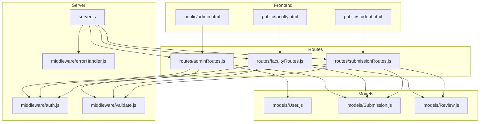
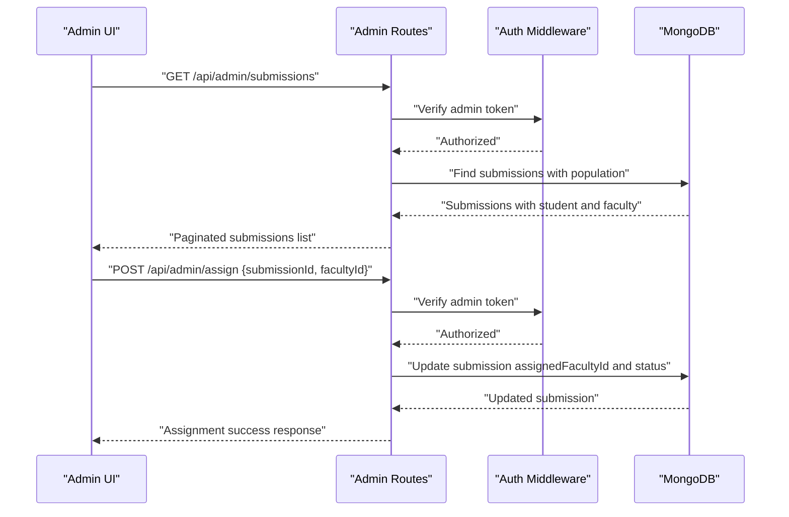
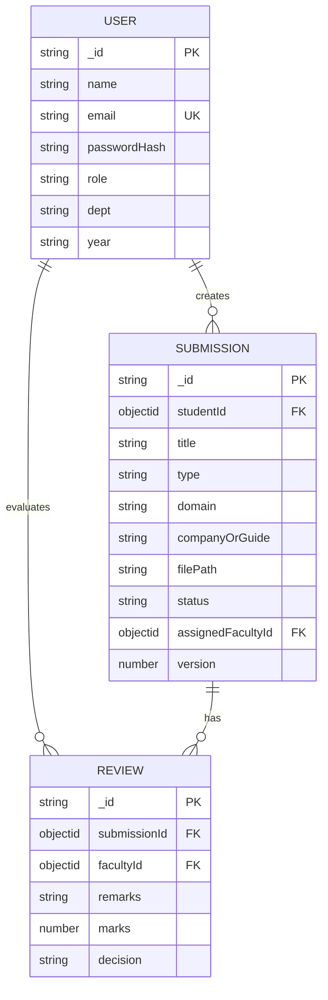
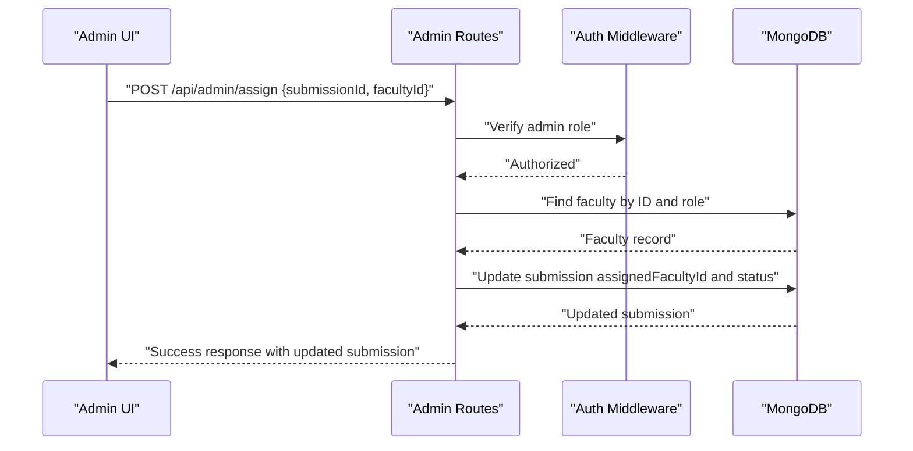
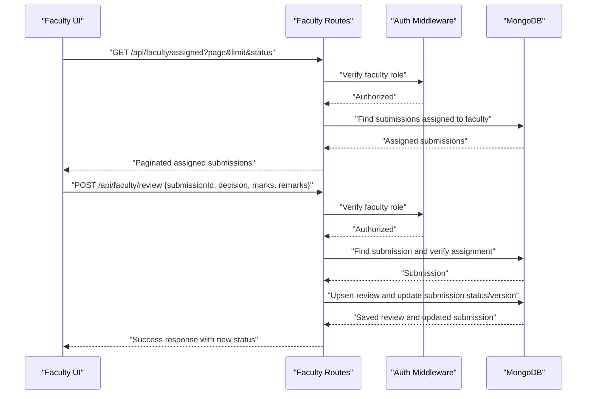
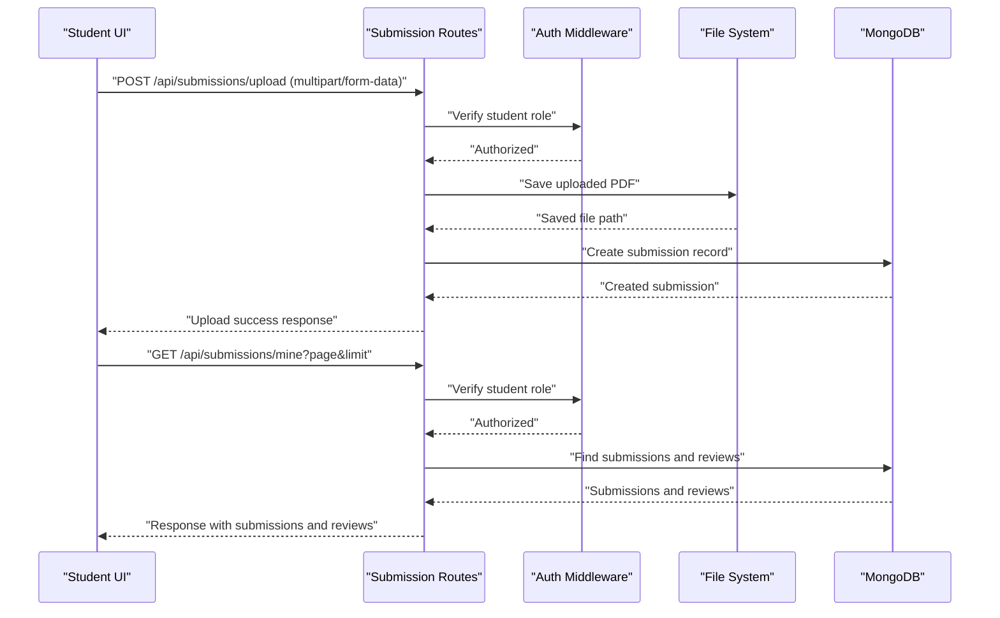
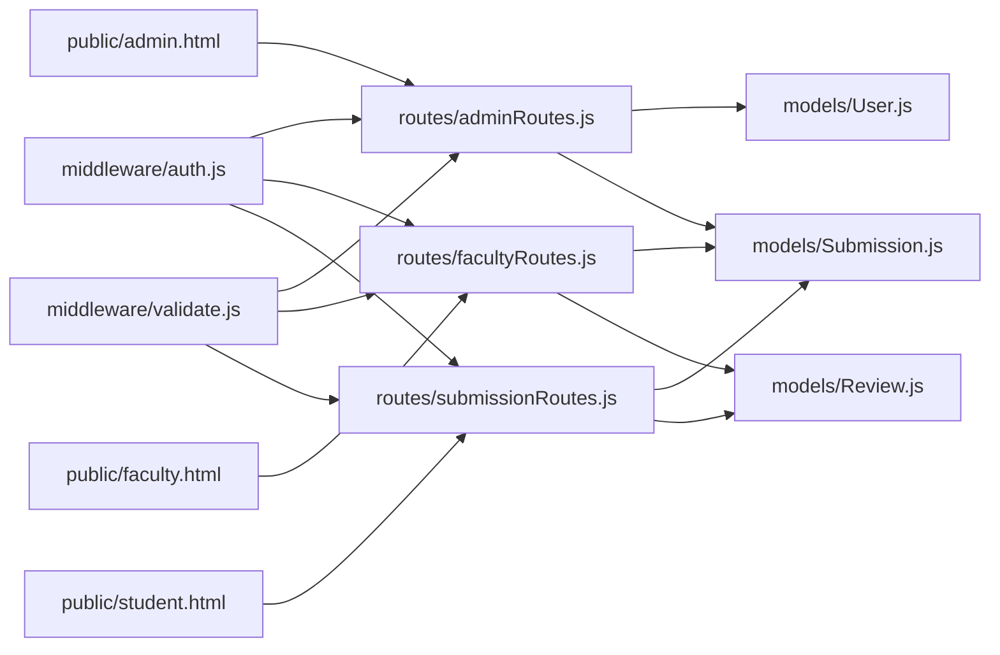

# Faculty Assignment System

<cite>
**Referenced Files in This Document**
- [server.js](file://server.js)
- [models/User.js](file://models/User.js)
- [models/Submission.js](file://models/Submission.js)
- [models/Review.js](file://models/Review.js)
- [routes/adminRoutes.js](file://routes/adminRoutes.js)
- [routes/facultyRoutes.js](file://routes/facultyRoutes.js)
- [routes/submissionRoutes.js](file://routes/submissionRoutes.js)
- [middleware/auth.js](file://middleware/auth.js)
- [middleware/validate.js](file://middleware/validate.js)
- [middleware/errorHandler.js](file://middleware/errorHandler.js)
- [utils/ApiError.js](file://utils/ApiError.js)
- [public/admin.html](file://public/admin.html)
- [public/faculty.html](file://public/faculty.html)
- [public/student.html](file://public/student.html)
</cite>

## Table of Contents
1. [Introduction](#introduction)
2. [Project Structure](#project-structure)
3. [Core Components](#core-components)
4. [Architecture Overview](#architecture-overview)
5. [Detailed Component Analysis](#detailed-component-analysis)
6. [Dependency Analysis](#dependency-analysis)
7. [Performance Considerations](#performance-considerations)
8. [Troubleshooting Guide](#troubleshooting-guide)
9. [Conclusion](#conclusion)
10. [Appendices](#appendices)

## Introduction
This document provides comprehensive documentation for the faculty assignment system. It explains how administrative users assign faculty members to student submissions, assignment criteria, and workload balancing considerations. It documents the faculty dashboard functionality for assigned submissions, filtering options, and review capabilities. It details assignment algorithms, faculty availability tracking, and conflict resolution mechanisms. Practical examples cover manual assignment processes, automated assignment triggers, and assignment modification procedures. It also documents the faculty-user relationship, assignment permissions, and audit logging for all assignment actions, along with assignment exceptions, reassignment workflows, and faculty capacity management.

## Project Structure
The system follows a layered architecture:
- Server entry point initializes Express, middleware, routes, and database connection.
- Models define the data schema for Users, Submissions, and Reviews.
- Routes expose REST endpoints for admin, faculty, and submission management.
- Middleware enforces authentication, validation, and error handling.
- Frontend HTML pages provide admin, faculty, and student dashboards.

**Diagram sources**
- [server.js](file://server.js#L1-L92)
- [routes/adminRoutes.js](file://routes/adminRoutes.js#L1-L184)
- [routes/facultyRoutes.js](file://routes/facultyRoutes.js#L1-L172)
- [routes/submissionRoutes.js](file://routes/submissionRoutes.js#L1-L159)
- [middleware/auth.js](file://middleware/auth.js#L1-L25)
- [middleware/validate.js](file://middleware/validate.js#L1-L120)
- [middleware/errorHandler.js](file://middleware/errorHandler.js#L1-L53)
- [models/User.js](file://models/User.js#L1-L20)
- [models/Submission.js](file://models/Submission.js#L1-L30)
- [models/Review.js](file://models/Review.js#L1-L18)
- [public/admin.html](file://public/admin.html#L1-L189)
- [public/faculty.html](file://public/faculty.html#L1-L170)
- [public/student.html](file://public/student.html#L1-L180)

**Section sources**
- [server.js](file://server.js#L1-L92)

## Core Components
- Authentication middleware validates JWT tokens and enforces role-based access control.
- Validation middleware ensures request payloads meet strict criteria for each endpoint.
- Admin routes handle user and submission listings, faculty assignment, and statistics.
- Faculty routes manage assigned submissions, review history, and submission evaluation.
- Submission routes support student upload, retrieval of personal submissions, and review access.
- Models define the data structures for Users, Submissions, and Reviews with appropriate relationships.

**Section sources**
- [middleware/auth.js](file://middleware/auth.js#L1-L25)
- [middleware/validate.js](file://middleware/validate.js#L1-L120)
- [routes/adminRoutes.js](file://routes/adminRoutes.js#L1-L184)
- [routes/facultyRoutes.js](file://routes/facultyRoutes.js#L1-L172)
- [routes/submissionRoutes.js](file://routes/submissionRoutes.js#L1-L159)
- [models/User.js](file://models/User.js#L1-L20)
- [models/Submission.js](file://models/Submission.js#L1-L30)
- [models/Review.js](file://models/Review.js#L1-L18)

## Architecture Overview
The system uses a RESTful API with role-based access control:
- Admins can list users, list submissions, assign faculty to submissions, and view statistics.
- Faculty can view their assigned submissions, review submissions, and view their review history.
- Students can upload reports, view their submissions, and see associated reviews.

**Diagram sources**
- [routes/adminRoutes.js](file://routes/adminRoutes.js#L63-L117)
- [routes/adminRoutes.js](file://routes/adminRoutes.js#L119-L148)
- [middleware/auth.js](file://middleware/auth.js#L1-L25)

## Detailed Component Analysis

### Data Models
The system relies on three primary models with relationships:
- User model defines roles (student, faculty, admin) and profile attributes.
- Submission model tracks student submissions, types, domains, file paths, statuses, and assigned faculty.
- Review model captures faculty decisions, marks, and remarks for each submission.

**Diagram sources**
- [models/User.js](file://models/User.js#L1-L20)
- [models/Submission.js](file://models/Submission.js#L1-L30)
- [models/Review.js](file://models/Review.js#L1-L18)

**Section sources**
- [models/User.js](file://models/User.js#L1-L20)
- [models/Submission.js](file://models/Submission.js#L1-L30)
- [models/Review.js](file://models/Review.js#L1-L18)

### Admin Assignment Workflow
Administrative users can assign faculty to submissions via the admin panel:
- Fetch submissions with pagination and filters.
- Select a submission and a faculty member.
- Submit assignment request to update the submission’s assigned faculty and status.

**Diagram sources**
- [routes/adminRoutes.js](file://routes/adminRoutes.js#L119-L148)
- [middleware/auth.js](file://middleware/auth.js#L1-L25)

**Section sources**
- [routes/adminRoutes.js](file://routes/adminRoutes.js#L119-L148)

### Faculty Dashboard and Review Process
Faculty members can:
- View assigned submissions with pagination and optional status filtering.
- Open submission PDFs and evaluate them.
- Submit reviews with decision, marks, and remarks.
- The system updates submission status and increments version.

**Diagram sources**
- [routes/facultyRoutes.js](file://routes/facultyRoutes.js#L9-L42)
- [routes/facultyRoutes.js](file://routes/facultyRoutes.js#L82-L133)
- [middleware/auth.js](file://middleware/auth.js#L1-L25)

**Section sources**
- [routes/facultyRoutes.js](file://routes/facultyRoutes.js#L9-L42)
- [routes/facultyRoutes.js](file://routes/facultyRoutes.js#L82-L133)

### Student Submission Upload and Access
Students can:
- Upload PDF reports with metadata.
- View their own submissions and associated reviews.
- Access submission details with permission checks.

**Diagram sources**
- [routes/submissionRoutes.js](file://routes/submissionRoutes.js#L47-L83)
- [routes/submissionRoutes.js](file://routes/submissionRoutes.js#L85-L121)
- [middleware/auth.js](file://middleware/auth.js#L1-L25)

**Section sources**
- [routes/submissionRoutes.js](file://routes/submissionRoutes.js#L47-L83)
- [routes/submissionRoutes.js](file://routes/submissionRoutes.js#L85-L121)

### Assignment Criteria and Workload Balancing
- Assignment criteria:
  - Admin selects a submission and a faculty member with role verification.
  - Submission status transitions to Assigned upon successful assignment.
- Workload balancing:
  - The current implementation does not enforce automatic balancing.
  - Admin can filter submissions by status and type for manual distribution.
  - Faculty can filter their assigned submissions by status for prioritization.

**Section sources**
- [routes/adminRoutes.js](file://routes/adminRoutes.js#L119-L148)
- [routes/adminRoutes.js](file://routes/adminRoutes.js#L63-L117)
- [routes/facultyRoutes.js](file://routes/facultyRoutes.js#L9-L42)

### Faculty Availability Tracking and Conflict Resolution
- Availability tracking:
  - No explicit faculty capacity or scheduling constraints are enforced.
  - Admin can list faculty for selection; no capacity counters are maintained.
- Conflict resolution:
  - If a submission is reassigned, the previous assignment is overwritten.
  - Faculty can only review submissions assigned to them; unauthorized access is blocked.

**Section sources**
- [routes/adminRoutes.js](file://routes/adminRoutes.js#L119-L148)
- [routes/facultyRoutes.js](file://routes/facultyRoutes.js#L82-L133)

### Practical Examples

#### Manual Assignment Process
- Admin logs into the admin panel.
- Navigates to the submissions list and filters as needed.
- Copies a submission ID and a faculty ID from the users list.
- Clicks Assign to update the submission’s assigned faculty and status.

**Section sources**
- [public/admin.html](file://public/admin.html#L155-L182)
- [routes/adminRoutes.js](file://routes/adminRoutes.js#L119-L148)

#### Automated Assignment Triggers
- The current codebase does not implement automated assignment triggers.
- Administrators must manually assign faculty to submissions.

**Section sources**
- [routes/adminRoutes.js](file://routes/adminRoutes.js#L119-L148)

#### Assignment Modification Procedures
- Reassignment:
  - Admin can reassign a submission to another faculty member.
  - The previous assignment is replaced; submission status becomes Assigned.
- Status updates:
  - Faculty reviews update submission status to Approved or Resubmission Required.
  - Version increments with each review.

**Section sources**
- [routes/adminRoutes.js](file://routes/adminRoutes.js#L119-L148)
- [routes/facultyRoutes.js](file://routes/facultyRoutes.js#L82-L133)

### Faculty-User Relationship and Permissions
- Role-based access control:
  - Admin: full access to users, submissions, and assignment.
  - Faculty: can view assigned submissions, submit reviews, and view review history.
  - Student: can upload reports and view their own submissions and reviews.
- Permission enforcement:
  - Admin endpoints require admin role.
  - Faculty endpoints require faculty role.
  - Submission details require ownership or assignment verification.

**Section sources**
- [middleware/auth.js](file://middleware/auth.js#L1-L25)
- [routes/adminRoutes.js](file://routes/adminRoutes.js#L1-L18)
- [routes/facultyRoutes.js](file://routes/facultyRoutes.js#L1-L42)
- [routes/submissionRoutes.js](file://routes/submissionRoutes.js#L123-L157)

### Audit Logging for Assignment Actions
- The current implementation does not include dedicated audit logs for assignment actions.
- Error handling centralizes error responses with status codes and messages.

**Section sources**
- [middleware/errorHandler.js](file://middleware/errorHandler.js#L1-L53)
- [utils/ApiError.js](file://utils/ApiError.js#L1-L17)

### Assignment Exceptions and Reassignment Workflows
- Exceptions:
  - Non-existent submission or faculty IDs result in 404 errors.
  - Role mismatches result in 403 errors.
  - Validation failures return 400 errors.
- Reassignment workflow:
  - Admin reassigns by posting to the assignment endpoint with a new faculty ID.
  - Submission status transitions to Assigned; previous assignment is overwritten.

**Section sources**
- [routes/adminRoutes.js](file://routes/adminRoutes.js#L119-L148)
- [routes/facultyRoutes.js](file://routes/facultyRoutes.js#L82-L133)
- [middleware/errorHandler.js](file://middleware/errorHandler.js#L1-L53)

### Faculty Capacity Management
- Current limitations:
  - No built-in capacity tracking or scheduling constraints.
  - Admin can list faculty and assign submissions manually.
- Recommendations:
  - Introduce capacity metrics (max assignments per faculty).
  - Add scheduling constraints to prevent overlapping assignments.
  - Implement auto-balancing algorithms based on capacity and workload.

**Section sources**
- [routes/adminRoutes.js](file://routes/adminRoutes.js#L9-L18)
- [routes/facultyRoutes.js](file://routes/facultyRoutes.js#L135-L170)

## Dependency Analysis
The system exhibits clear separation of concerns:
- Routes depend on middleware for authentication and validation.
- Routes interact with models for data persistence.
- Frontend pages consume REST endpoints exposed by routes.

**Diagram sources**
- [middleware/auth.js](file://middleware/auth.js#L1-L25)
- [middleware/validate.js](file://middleware/validate.js#L1-L120)
- [routes/adminRoutes.js](file://routes/adminRoutes.js#L1-L184)
- [routes/facultyRoutes.js](file://routes/facultyRoutes.js#L1-L172)
- [routes/submissionRoutes.js](file://routes/submissionRoutes.js#L1-L159)
- [models/User.js](file://models/User.js#L1-L20)
- [models/Submission.js](file://models/Submission.js#L1-L30)
- [models/Review.js](file://models/Review.js#L1-L18)
- [public/admin.html](file://public/admin.html#L1-L189)
- [public/faculty.html](file://public/faculty.html#L1-L170)
- [public/student.html](file://public/student.html#L1-L180)

**Section sources**
- [routes/adminRoutes.js](file://routes/adminRoutes.js#L1-L184)
- [routes/facultyRoutes.js](file://routes/facultyRoutes.js#L1-L172)
- [routes/submissionRoutes.js](file://routes/submissionRoutes.js#L1-L159)

## Performance Considerations
- Pagination:
  - All list endpoints support pagination to reduce payload sizes.
- Parallel queries:
  - Admin submissions endpoint uses parallel count and find operations.
- File handling:
  - PDF upload validation checks file magic bytes to ensure content integrity.
- Security:
  - Helmet, rate limiting, and MongoDB sanitization protect the server.

**Section sources**
- [routes/adminRoutes.js](file://routes/adminRoutes.js#L63-L117)
- [routes/submissionRoutes.js](file://routes/submissionRoutes.js#L17-L23)
- [server.js](file://server.js#L18-L54)

## Troubleshooting Guide
- Authentication failures:
  - Missing or invalid tokens result in 401 errors.
- Authorization failures:
  - Role mismatches yield 403 errors.
- Validation errors:
  - Invalid submission IDs, decision values, or pagination parameters trigger 400 errors.
- Resource not found:
  - Cast errors for invalid ObjectIds result in 404 responses.
- File upload issues:
  - Non-PDF files or oversized files cause upload failures.

**Section sources**
- [middleware/auth.js](file://middleware/auth.js#L1-L25)
- [middleware/errorHandler.js](file://middleware/errorHandler.js#L1-L53)
- [middleware/validate.js](file://middleware/validate.js#L74-L119)
- [routes/submissionRoutes.js](file://routes/submissionRoutes.js#L33-L45)

## Conclusion
The faculty assignment system provides a clear, role-based REST API with robust validation and error handling. Administrative users can assign faculty to submissions, while faculty can review assigned submissions and update statuses. Students can upload reports and track their progress. While the current implementation lacks automated balancing and capacity tracking, it offers a solid foundation for future enhancements such as workload balancing algorithms, scheduling constraints, and comprehensive audit logging.

## Appendices

### API Definitions

- Admin Routes
  - GET /api/admin/faculty
    - Description: List all faculty members for dropdown selection.
    - Authentication: admin required.
    - Response: Array of faculty with name, email, and department.
  - GET /api/admin/users
    - Description: Paginated and searchable user listing by role.
    - Authentication: admin required.
    - Query params: page, limit, search, role.
    - Response: Users with pagination metadata.
  - GET /api/admin/submissions
    - Description: Paginated and filterable submissions listing.
    - Authentication: admin required.
    - Query params: page, limit, status, type, search.
    - Response: Submissions with student and assigned faculty populated.
  - POST /api/admin/assign
    - Description: Assign a faculty member to a submission.
    - Authentication: admin required.
    - Request body: { submissionId, facultyId }.
    - Response: Updated submission with assigned faculty.
  - GET /api/admin/stats
    - Description: System-wide statistics.
    - Authentication: admin required.
    - Response: Counts for users, students, faculty, and submission statuses.

- Faculty Routes
  - GET /api/faculty/assigned
    - Description: Paginated assigned submissions with optional status filter.
    - Authentication: faculty required.
    - Query params: page, limit, status.
    - Response: Submissions assigned to the logged-in faculty.
  - GET /api/faculty/reviews
    - Description: Paginated review history for the faculty.
    - Authentication: faculty required.
    - Query params: page, limit.
    - Response: Reviews with submission and student details.
  - POST /api/faculty/review
    - Description: Submit or update a review for an assigned submission.
    - Authentication: faculty required.
    - Request body: { submissionId, decision, marks, remarks }.
    - Response: Saved review and new submission status.
  - GET /api/faculty/stats
    - Description: Faculty dashboard statistics.
    - Authentication: faculty required.
    - Response: Counts for assigned, pending, approved, resubmissions, and total reviews.

- Submission Routes
  - POST /api/submissions/upload
    - Description: Student upload of PDF report with metadata.
    - Authentication: student required.
    - Request body: multipart/form-data with report file and metadata.
    - Response: Created submission.
  - GET /api/submissions/mine
    - Description: Student’s own submissions and associated reviews.
    - Authentication: student required.
    - Query params: page, limit.
    - Response: Submissions and reviews.
  - GET /api/submissions/:id
    - Description: Retrieve a submission with reviews.
    - Authentication: required (admin, faculty, or student depending on ownership/assignment).
    - Response: Submission and reviews with populated user details.

**Section sources**
- [routes/adminRoutes.js](file://routes/adminRoutes.js#L9-L18)
- [routes/adminRoutes.js](file://routes/adminRoutes.js#L20-L61)
- [routes/adminRoutes.js](file://routes/adminRoutes.js#L63-L117)
- [routes/adminRoutes.js](file://routes/adminRoutes.js#L119-L148)
- [routes/adminRoutes.js](file://routes/adminRoutes.js#L150-L182)
- [routes/facultyRoutes.js](file://routes/facultyRoutes.js#L9-L42)
- [routes/facultyRoutes.js](file://routes/facultyRoutes.js#L44-L80)
- [routes/facultyRoutes.js](file://routes/facultyRoutes.js#L82-L133)
- [routes/facultyRoutes.js](file://routes/facultyRoutes.js#L135-L170)
- [routes/submissionRoutes.js](file://routes/submissionRoutes.js#L47-L83)
- [routes/submissionRoutes.js](file://routes/submissionRoutes.js#L85-L121)
- [routes/submissionRoutes.js](file://routes/submissionRoutes.js#L123-L157)