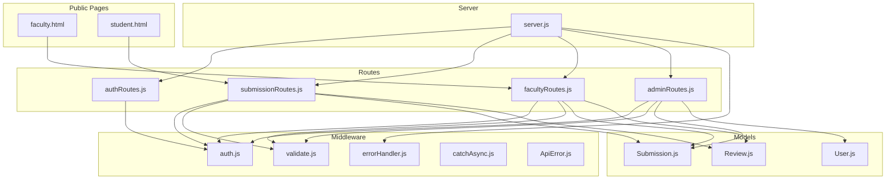
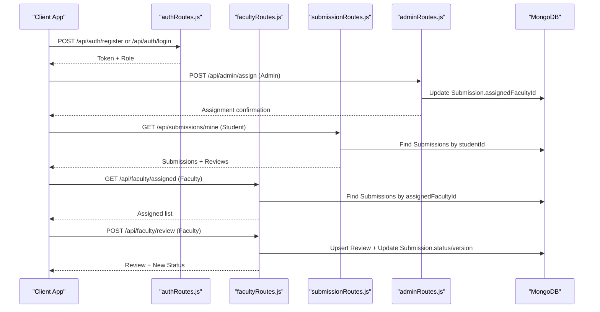
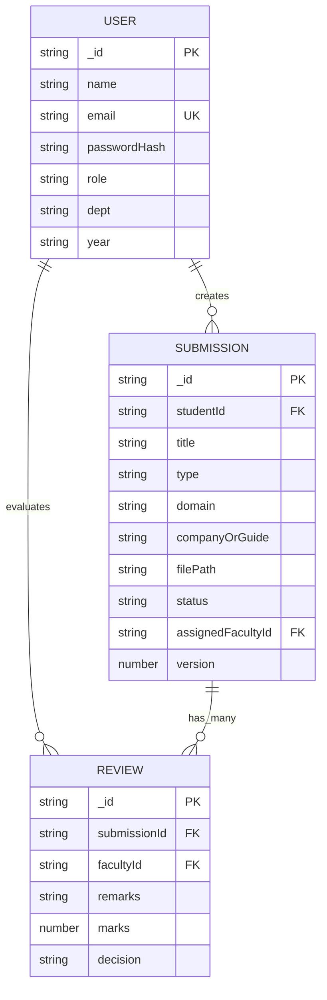
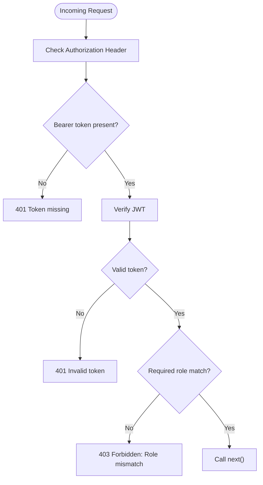
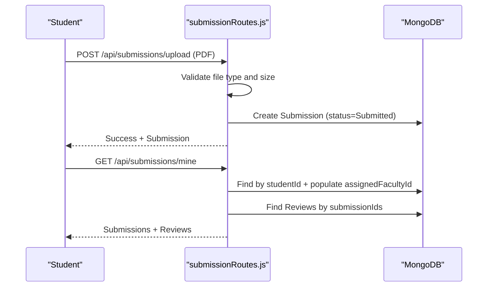
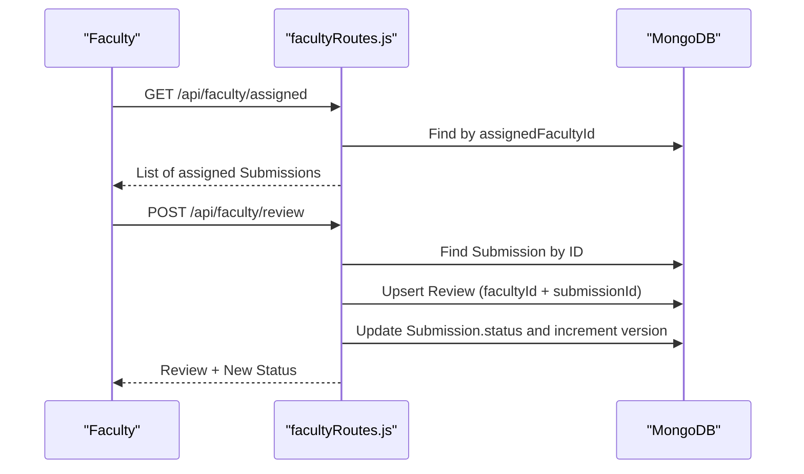
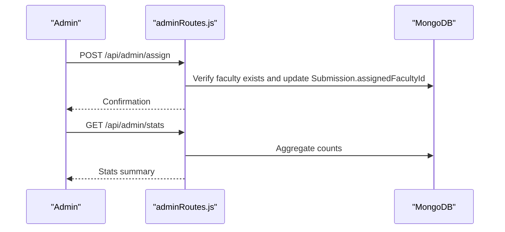
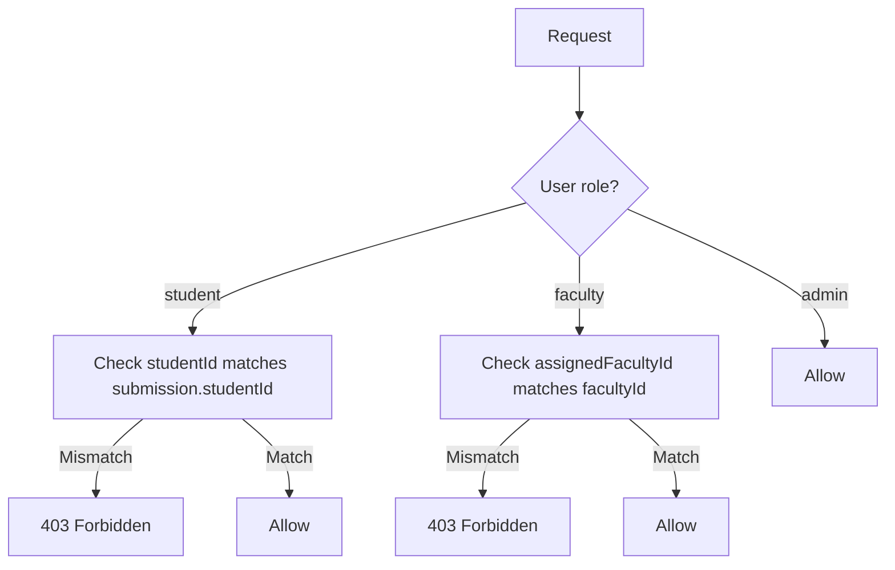
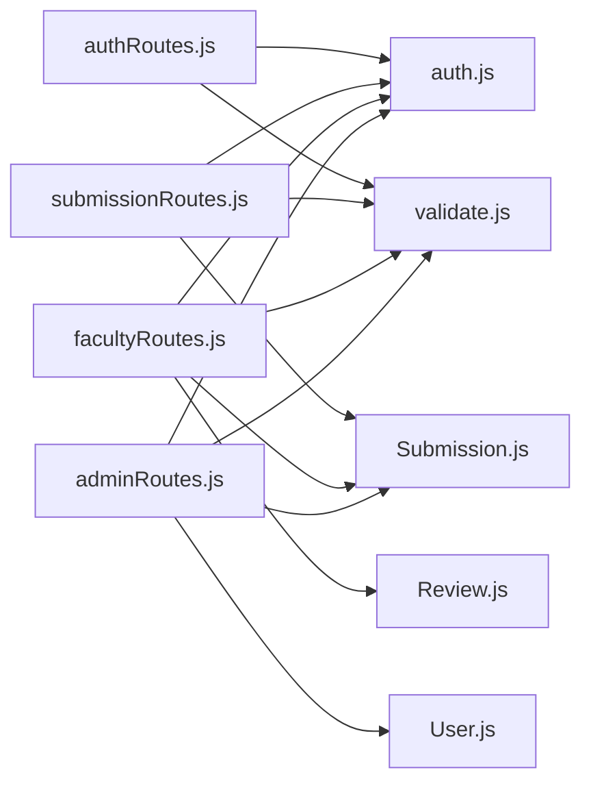

# Review & Evaluation Process

<cite>
**Referenced Files in This Document**
- [server.js](file://server.js)
- [auth.js](file://middleware/auth.js)
- [validate.js](file://middleware/validate.js)
- [errorHandler.js](file://middleware/errorHandler.js)
- [ApiError.js](file://utils/ApiError.js)
- [catchAsync.js](file://utils/catchAsync.js)
- [User.js](file://models/User.js)
- [Submission.js](file://models/Submission.js)
- [Review.js](file://models/Review.js)
- [authRoutes.js](file://routes/authRoutes.js)
- [submissionRoutes.js](file://routes/submissionRoutes.js)
- [facultyRoutes.js](file://routes/facultyRoutes.js)
- [adminRoutes.js](file://routes/adminRoutes.js)
- [faculty.html](file://public/faculty.html)
- [student.html](file://public/student.html)
</cite>

## Table of Contents
1. [Introduction](#introduction)
2. [Project Structure](#project-structure)
3. [Core Components](#core-components)
4. [Architecture Overview](#architecture-overview)
5. [Detailed Component Analysis](#detailed-component-analysis)
6. [Dependency Analysis](#dependency-analysis)
7. [Performance Considerations](#performance-considerations)
8. [Troubleshooting Guide](#troubleshooting-guide)
9. [Conclusion](#conclusion)
10. [Appendices](#appendices)

## Introduction
This document describes the faculty review and evaluation system, focusing on the multi-criteria evaluation process, review submission mechanics, and grade assignment workflows. It explains how reviews are created, how decisions and grades are recorded, and how visibility and permissions govern access. It also documents the data model, evaluation criteria mapping, and aggregation of results, along with practical examples, appeal and modification procedures, and quality assurance mechanisms.

## Project Structure
The backend is organized around Express routes, Mongoose models, middleware for authentication and validation, and minimal static HTML pages for demonstration. The server integrates security middleware, rate limiting, and centralized error handling.

**Diagram sources**
- [server.js](file://server.js#L1-L92)
- [auth.js](file://middleware/auth.js#L1-L25)
- [validate.js](file://middleware/validate.js#L1-L120)
- [errorHandler.js](file://middleware/errorHandler.js#L1-L53)
- [catchAsync.js](file://utils/catchAsync.js#L1-L8)
- [ApiError.js](file://utils/ApiError.js#L1-L17)
- [User.js](file://models/User.js#L1-L20)
- [Submission.js](file://models/Submission.js#L1-L30)
- [Review.js](file://models/Review.js#L1-L18)
- [authRoutes.js](file://routes/authRoutes.js#L1-L85)
- [submissionRoutes.js](file://routes/submissionRoutes.js#L1-L159)
- [facultyRoutes.js](file://routes/facultyRoutes.js#L1-L172)
- [adminRoutes.js](file://routes/adminRoutes.js#L1-L184)
- [faculty.html](file://public/faculty.html#L1-L170)
- [student.html](file://public/student.html#L1-L180)

**Section sources**
- [server.js](file://server.js#L1-L92)

## Core Components
- Authentication and Authorization: JWT-based middleware enforces role gating for protected endpoints.
- Validation: Centralized validation rules ensure consistent input checks across endpoints.
- Data Models: Submission and Review define the core evaluation data structures; User defines roles and attributes.
- Routes:
  - Submission routes handle upload, retrieval, and visibility rules.
  - Faculty routes manage assigned submissions, review creation/update, and statistics.
  - Admin routes coordinate faculty assignments and global reporting.
  - Auth routes handle registration, login, and profile retrieval.

Key responsibilities:
- Multi-criteria evaluation: Decision and marks are captured per review; submission status reflects the decision.
- Visibility: Access controlled by role and assignment.
- Grade assignment: Marks stored per review; submission version increments after each review.
- Appeals and modifications: Reviews can be updated; submission status transitions accordingly.

**Section sources**
- [auth.js](file://middleware/auth.js#L1-L25)
- [validate.js](file://middleware/validate.js#L1-L120)
- [User.js](file://models/User.js#L1-L20)
- [Submission.js](file://models/Submission.js#L1-L30)
- [Review.js](file://models/Review.js#L1-L18)
- [submissionRoutes.js](file://routes/submissionRoutes.js#L1-L159)
- [facultyRoutes.js](file://routes/facultyRoutes.js#L1-L172)
- [adminRoutes.js](file://routes/adminRoutes.js#L1-L184)

## Architecture Overview
The system follows a layered architecture:
- Presentation: Minimal static pages demonstrate client-side integration with the API.
- API Layer: Routes expose CRUD and workflow operations.
- Business Logic: Validation and authorization middleware enforce policies.
- Persistence: Mongoose models encapsulate data and relationships.

**Diagram sources**
- [authRoutes.js](file://routes/authRoutes.js#L1-L85)
- [adminRoutes.js](file://routes/adminRoutes.js#L1-L184)
- [submissionRoutes.js](file://routes/submissionRoutes.js#L1-L159)
- [facultyRoutes.js](file://routes/facultyRoutes.js#L1-L172)

## Detailed Component Analysis

### Data Model: Users, Submissions, and Reviews
The data model supports the review lifecycle and permission-driven visibility.

- Roles: student, faculty, admin govern access to routes and data.
- Submission lifecycle: Submitted → Assigned → Approved or Resubmission Required; version increments per review.
- Review captures decision and optional marks and remarks.

**Diagram sources**
- [User.js](file://models/User.js#L1-L20)
- [Submission.js](file://models/Submission.js#L1-L30)
- [Review.js](file://models/Review.js#L1-L18)

**Section sources**
- [User.js](file://models/User.js#L1-L20)
- [Submission.js](file://models/Submission.js#L1-L30)
- [Review.js](file://models/Review.js#L1-L18)

### Authentication and Authorization
- JWT verification extracts userId, role, and name.
- Role gating ensures only authorized users access protected routes.
- Token presence enforced via middleware.

**Diagram sources**
- [auth.js](file://middleware/auth.js#L1-L25)

**Section sources**
- [auth.js](file://middleware/auth.js#L1-L25)

### Submission Upload and Retrieval (Student)
- Students upload PDF reports with metadata (title, type, domain, companyOrGuide).
- PDF content validated via magic number check.
- Students can view their own submissions and associated reviews.

**Diagram sources**
- [submissionRoutes.js](file://routes/submissionRoutes.js#L48-L83)
- [submissionRoutes.js](file://routes/submissionRoutes.js#L85-L121)

**Section sources**
- [submissionRoutes.js](file://routes/submissionRoutes.js#L48-L83)
- [submissionRoutes.js](file://routes/submissionRoutes.js#L85-L121)

### Faculty Review Workflow
- Faculty can view assigned submissions and submit reviews.
- Review includes decision (Approved or Resubmission Required), optional marks, and remarks.
- On submission, the system updates submission status and increments version.

**Diagram sources**
- [facultyRoutes.js](file://routes/facultyRoutes.js#L82-L133)

**Section sources**
- [facultyRoutes.js](file://routes/facultyRoutes.js#L82-L133)

### Admin Coordination and Oversight
- Admin can assign faculty to submissions and retrieve aggregated stats.
- Admin can list users, submissions, and search/filter by various criteria.

**Diagram sources**
- [adminRoutes.js](file://routes/adminRoutes.js#L119-L148)

**Section sources**
- [adminRoutes.js](file://routes/adminRoutes.js#L119-L148)

### Visibility Rules and Permissions
- Students can only view their own submissions and reviews.
- Faculty can only view submissions assigned to themselves.
- Admin has broad read access for oversight.

**Diagram sources**
- [submissionRoutes.js](file://routes/submissionRoutes.js#L135-L145)

**Section sources**
- [submissionRoutes.js](file://routes/submissionRoutes.js#L135-L145)

### Practical Examples

- Review Creation
  - Faculty opens the assigned submission, fills marks, decision, and remarks, then submits.
  - The system persists the review and updates submission status and version.

- Peer Review Coordination
  - Multiple faculty can evaluate the same submission; each creates or updates a review record linked to the submission.
  - Submission status reflects the decision from the latest review.

- Final Evaluation Aggregation
  - Submission status aggregates the decision outcome.
  - Version increments with each review, enabling auditability.

[No sources needed since this section provides practical guidance derived from analyzed components]

### Appeal and Modification Procedures
- Modification: Faculty can resubmit a review for the same submission; the system upserts the review, updating marks and decision.
- Appeal: The current model does not define a dedicated appeal workflow; however, “Resubmission Required” allows iterative improvement. Students can re-upload and re-assign submissions as needed.

**Section sources**
- [facultyRoutes.js](file://routes/facultyRoutes.js#L98-L133)

### Quality Assurance Mechanisms
- Validation ensures consistent input across endpoints (e.g., decision enum, marks range, pagination bounds).
- Error handling centralizes error responses and logs errors for diagnostics.
- Rate limiting protects endpoints from abuse.
- PDF validation prevents invalid content from being stored.

**Section sources**
- [validate.js](file://middleware/validate.js#L84-L99)
- [errorHandler.js](file://middleware/errorHandler.js#L1-L53)
- [server.js](file://server.js#L23-L38)
- [submissionRoutes.js](file://routes/submissionRoutes.js#L17-L23)

## Dependency Analysis
The system exhibits clear separation of concerns:
- Routes depend on models and middleware.
- Middleware depends on shared utilities and environment configuration.
- Models are decoupled from transport and rely on Mongoose.

**Diagram sources**
- [authRoutes.js](file://routes/authRoutes.js#L1-L85)
- [submissionRoutes.js](file://routes/submissionRoutes.js#L1-L159)
- [facultyRoutes.js](file://routes/facultyRoutes.js#L1-L172)
- [adminRoutes.js](file://routes/adminRoutes.js#L1-L184)
- [auth.js](file://middleware/auth.js#L1-L25)
- [validate.js](file://middleware/validate.js#L1-L120)
- [Submission.js](file://models/Submission.js#L1-L30)
- [Review.js](file://models/Review.js#L1-L18)
- [User.js](file://models/User.js#L1-L20)

**Section sources**
- [authRoutes.js](file://routes/authRoutes.js#L1-L85)
- [submissionRoutes.js](file://routes/submissionRoutes.js#L1-L159)
- [facultyRoutes.js](file://routes/facultyRoutes.js#L1-L172)
- [adminRoutes.js](file://routes/adminRoutes.js#L1-L184)

## Performance Considerations
- Pagination: All paginated endpoints enforce reasonable page sizes to avoid heavy queries.
- Parallel queries: Routes use Promise.all for concurrent reads (e.g., counts and lists).
- Index-friendly queries: Populate and enum-based filters minimize expensive scans.
- File handling: PDF size limits and magic-number checks reduce storage overhead.

[No sources needed since this section provides general guidance]

## Troubleshooting Guide
Common issues and resolutions:
- Authentication failures: Missing or invalid tokens lead to 401 responses.
- Authorization failures: Role mismatches yield 403 responses.
- Validation errors: Misformatted inputs trigger 400 responses with consolidated messages.
- Resource not found: Cast errors and 404 responses indicate missing resources.
- File upload errors: Size or type violations produce 400 responses.

**Section sources**
- [errorHandler.js](file://middleware/errorHandler.js#L10-L43)
- [validate.js](file://middleware/validate.js#L4-L16)
- [auth.js](file://middleware/auth.js#L9-L21)

## Conclusion
The system provides a robust foundation for a faculty review and evaluation workflow. It enforces role-based access, validates inputs, and maintains a clear audit trail through submission versioning and review records. While explicit multi-criteria grading and formal appeals are not modeled, the current design supports iterative improvements and transparent decision-making.

## Appendices

### API Definitions and Behaviors
- Submission Upload (Student)
  - Endpoint: POST /api/submissions/upload
  - Auth: student
  - Validation: title, type, optional domain/companyOrGuide; PDF only; size limit
  - Behavior: Creates Submission with status “Submitted”

- View Own Submissions (Student)
  - Endpoint: GET /api/submissions/mine
  - Auth: student
  - Behavior: Returns submissions and associated reviews with pagination

- View Single Submission (Student/Faculty/Admin)
  - Endpoint: GET /api/submissions/:id
  - Auth: student/faculty/admin
  - Behavior: Enforces ownership/assignment; returns submission and reviews

- Assign Faculty (Admin)
  - Endpoint: POST /api/admin/assign
  - Auth: admin
  - Validation: submissionId, facultyId
  - Behavior: Updates assignedFacultyId and sets status to “Assigned”

- Faculty Assigned List (Faculty)
  - Endpoint: GET /api/faculty/assigned
  - Auth: faculty
  - Behavior: Returns assigned submissions with optional status filter

- Submit Review (Faculty)
  - Endpoint: POST /api/faculty/review
  - Auth: faculty
  - Validation: submissionId, decision (Approved or Resubmission Required), optional marks (0–100), optional remarks
  - Behavior: Upserts review; updates submission status and increments version

- Faculty Review History (Faculty)
  - Endpoint: GET /api/faculty/reviews
  - Auth: faculty
  - Behavior: Returns faculty’s review history with pagination

- Admin Dashboard Stats (Admin)
  - Endpoint: GET /api/admin/stats
  - Auth: admin
  - Behavior: Returns counts for users, submissions, and statuses

**Section sources**
- [submissionRoutes.js](file://routes/submissionRoutes.js#L48-L157)
- [facultyRoutes.js](file://routes/facultyRoutes.js#L9-L170)
- [adminRoutes.js](file://routes/adminRoutes.js#L119-L182)