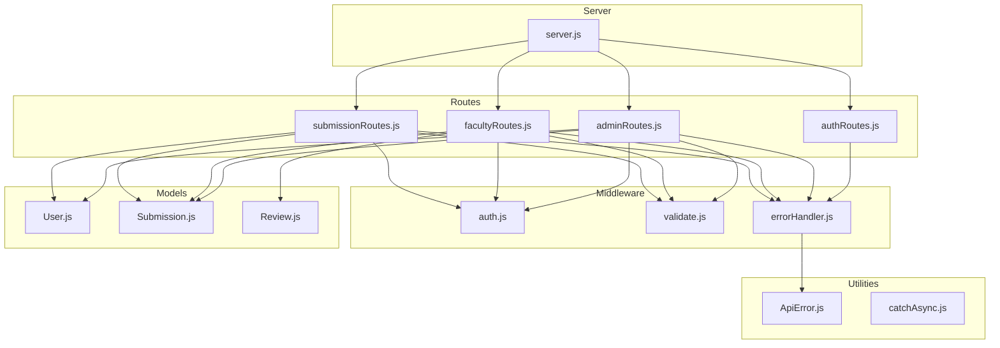
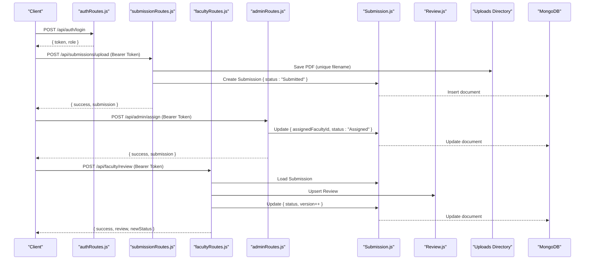
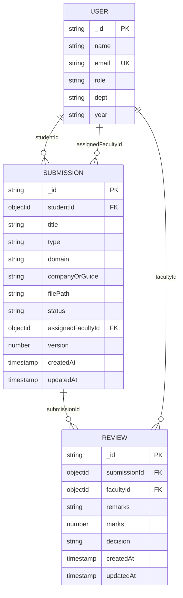
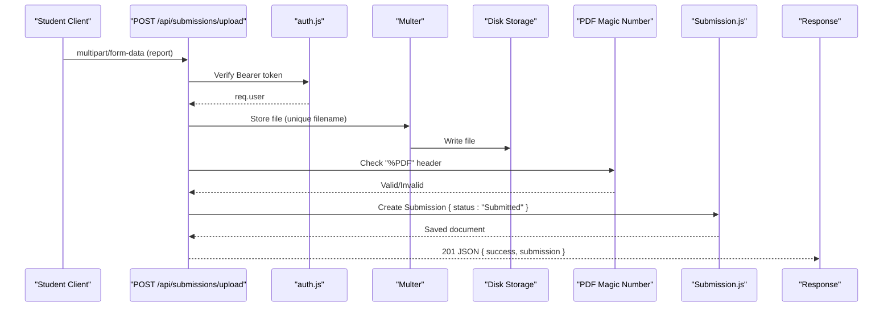
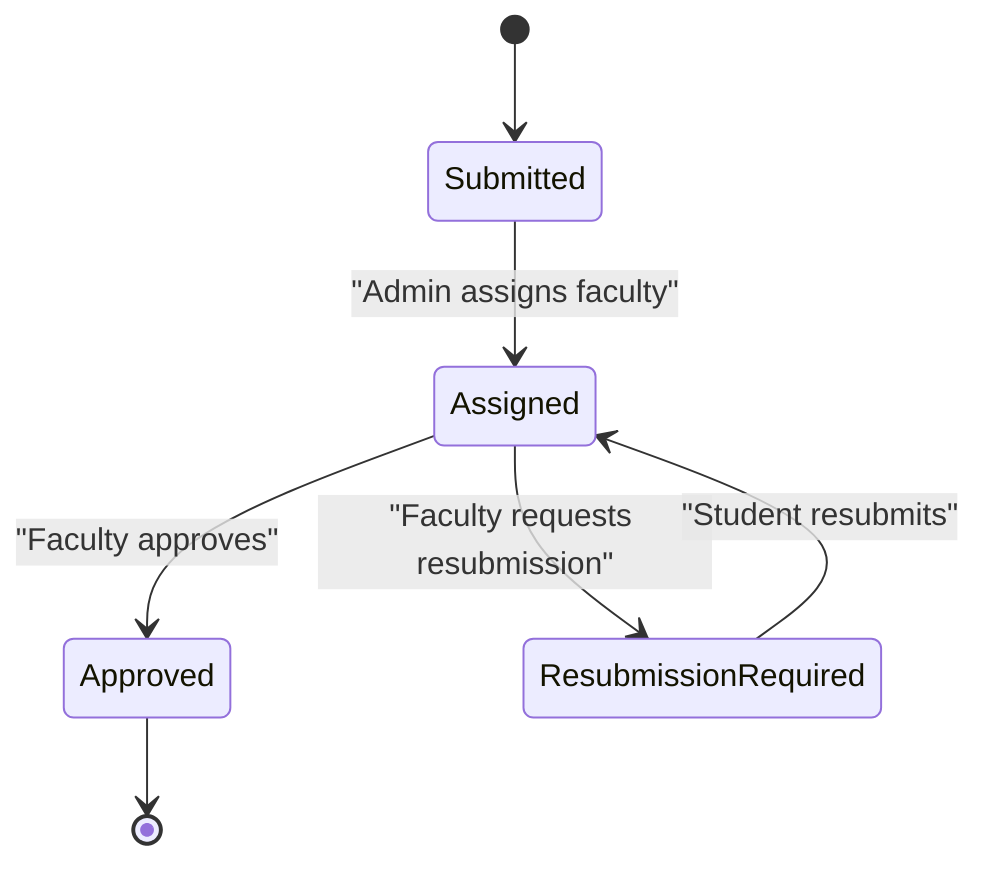
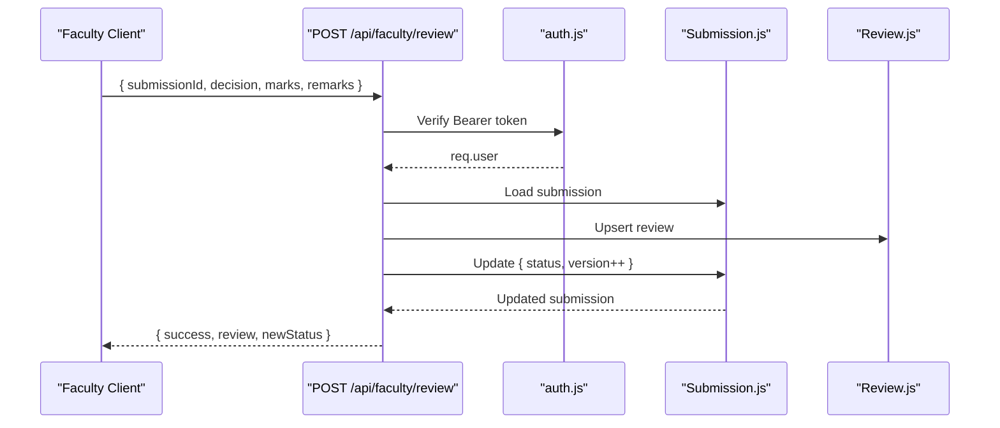
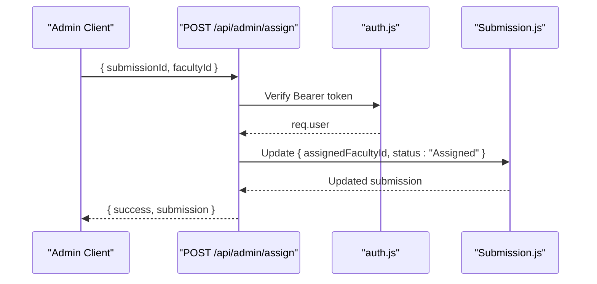
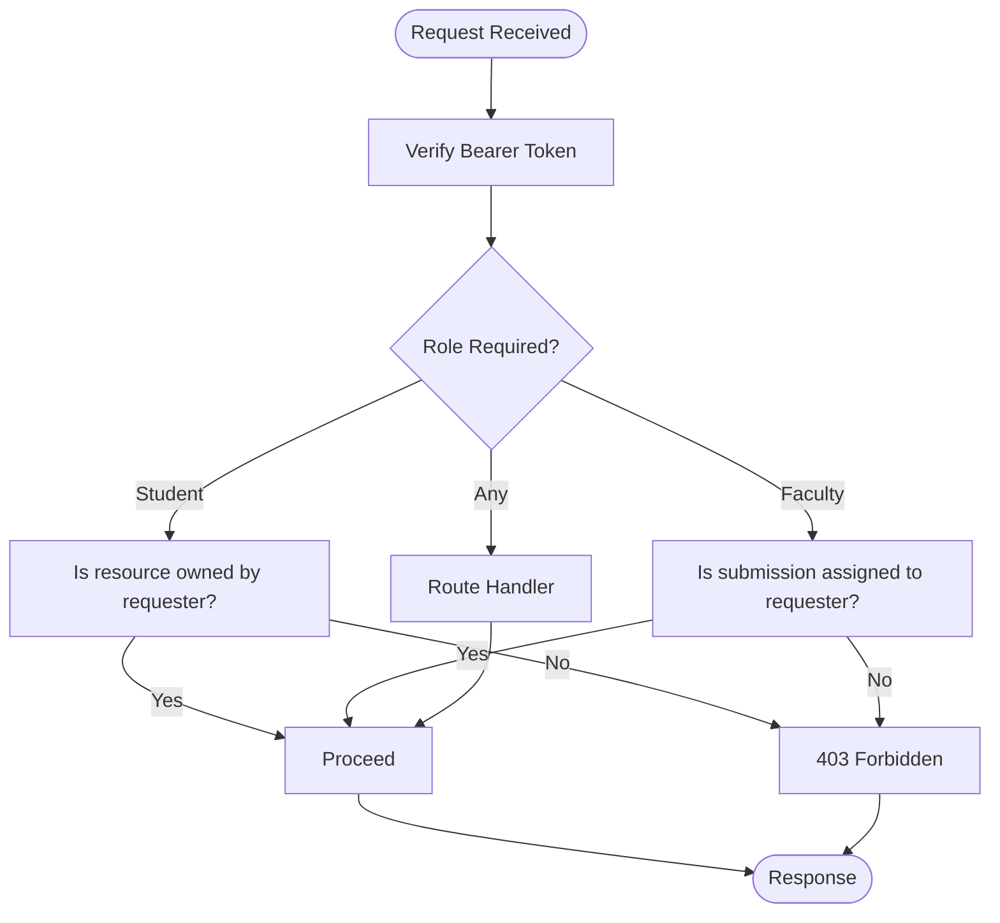
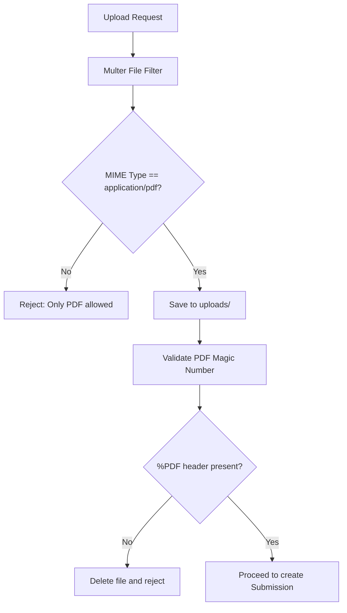
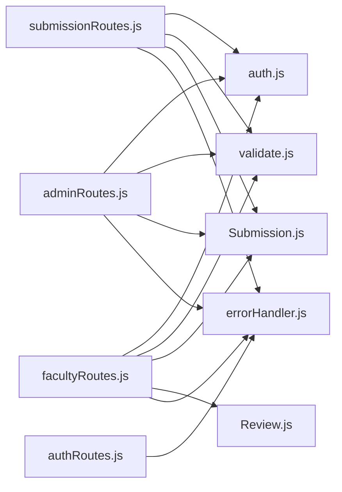

# Submission Workflow Management

<cite>
**Referenced Files in This Document**
- [server.js](file://server.js)
- [authRoutes.js](file://routes/authRoutes.js)
- [submissionRoutes.js](file://routes/submissionRoutes.js)
- [facultyRoutes.js](file://routes/facultyRoutes.js)
- [adminRoutes.js](file://routes/adminRoutes.js)
- [auth.js](file://middleware/auth.js)
- [validate.js](file://middleware/validate.js)
- [errorHandler.js](file://middleware/errorHandler.js)
- [ApiError.js](file://utils/ApiError.js)
- [catchAsync.js](file://utils/catchAsync.js)
- [Submission.js](file://models/Submission.js)
- [Review.js](file://models/Review.js)
- [User.js](file://models/User.js)
</cite>

## Table of Contents
1. [Introduction](#introduction)
2. [Project Structure](#project-structure)
3. [Core Components](#core-components)
4. [Architecture Overview](#architecture-overview)
5. [Detailed Component Analysis](#detailed-component-analysis)
6. [Dependency Analysis](#dependency-analysis)
7. [Performance Considerations](#performance-considerations)
8. [Troubleshooting Guide](#troubleshooting-guide)
9. [Conclusion](#conclusion)
10. [Appendices](#appendices)

## Introduction
This document describes the submission workflow management system that governs the lifecycle of academic submissions from creation to completion. It covers the complete submission lifecycle from “Submitted” to “Assigned” to “Approved,” with explicit multi-step processes for student submission creation, file validation, and automatic status assignment. It documents the submission creation API endpoint, PDF validation mechanisms, file storage processes, permission-based access controls, and the submission data model with field validations and business rules. Practical examples illustrate submission creation, status tracking, and permission checks. Common workflow scenarios, error handling, and audit trail capabilities are addressed.

## Project Structure
The system is organized around Express routes, Mongoose models, middleware for authentication and validation, and utilities for error handling and asynchronous execution. Static file serving for uploaded PDFs is configured, and global error handling centralizes response formatting.

**Diagram sources**
- [server.js](file://server.js#L1-L92)
- [authRoutes.js](file://routes/authRoutes.js#L1-L85)
- [submissionRoutes.js](file://routes/submissionRoutes.js#L1-L159)
- [facultyRoutes.js](file://routes/facultyRoutes.js#L1-L172)
- [adminRoutes.js](file://routes/adminRoutes.js#L1-L184)
- [auth.js](file://middleware/auth.js#L1-L25)
- [validate.js](file://middleware/validate.js#L1-L120)
- [errorHandler.js](file://middleware/errorHandler.js#L1-L53)
- [ApiError.js](file://utils/ApiError.js#L1-L17)
- [catchAsync.js](file://utils/catchAsync.js#L1-L8)
- [Submission.js](file://models/Submission.js#L1-L30)
- [Review.js](file://models/Review.js#L1-L18)
- [User.js](file://models/User.js#L1-L20)

**Section sources**
- [server.js](file://server.js#L1-L92)

## Core Components
- Submission model defines the submission record with fields for student identity, metadata, file path, status, assigned faculty, and versioning.
- Submission routes implement the upload endpoint, student’s own submissions listing, and single submission retrieval with permission checks.
- Faculty routes implement assigned submissions listing, review history, and submission review with status updates.
- Admin routes implement faculty assignment, submission listing with filters, and dashboard statistics.
- Authentication middleware enforces bearer token verification and role-based access.
- Validation middleware enforces request body and query constraints for submissions and reviews.
- Error handling middleware standardizes error responses and logs errors.

**Section sources**
- [Submission.js](file://models/Submission.js#L1-L30)
- [submissionRoutes.js](file://routes/submissionRoutes.js#L1-L159)
- [facultyRoutes.js](file://routes/facultyRoutes.js#L1-L172)
- [adminRoutes.js](file://routes/adminRoutes.js#L1-L184)
- [auth.js](file://middleware/auth.js#L1-L25)
- [validate.js](file://middleware/validate.js#L55-L119)
- [errorHandler.js](file://middleware/errorHandler.js#L1-L53)

## Architecture Overview
The system follows a layered architecture:
- Presentation layer: Express routes define endpoints for submissions, reviews, and administrative tasks.
- Application layer: Middleware handles authentication, validation, and error handling.
- Domain layer: Mongoose models represent the data and relationships.
- Infrastructure layer: Static file serving for uploaded PDFs and MongoDB connection.

**Diagram sources**
- [authRoutes.js](file://routes/authRoutes.js#L28-L55)
- [submissionRoutes.js](file://routes/submissionRoutes.js#L48-L83)
- [adminRoutes.js](file://routes/adminRoutes.js#L119-L148)
- [facultyRoutes.js](file://routes/facultyRoutes.js#L82-L133)
- [Submission.js](file://models/Submission.js#L1-L30)
- [Review.js](file://models/Review.js#L1-L18)

## Detailed Component Analysis

### Submission Data Model
The Submission model captures the essential attributes of a submission and enforces constraints:
- Identity: studentId references User; assignedFacultyId references User.
- Metadata: title, type, domain, companyOrGuide.
- File: filePath stores the URL path to the uploaded PDF.
- Lifecycle: status with allowed values; version increments on review.
- Timestamps: createdAt and updatedAt managed by Mongoose.

**Diagram sources**
- [Submission.js](file://models/Submission.js#L1-L30)
- [Review.js](file://models/Review.js#L1-L18)
- [User.js](file://models/User.js#L1-L20)

**Section sources**
- [Submission.js](file://models/Submission.js#L1-L30)

### Submission Creation API: Upload
The upload endpoint orchestrates the multi-step process:
- Authentication: Only authenticated students can upload.
- File handling: Multer saves PDFs to the uploads directory with a unique filename.
- Content validation: The uploaded file is verified to start with the PDF magic number.
- Persistence: A Submission document is created with status set to “Submitted.”
- Response: JSON includes success flag and the created submission.

Key behaviors and validations:
- File type: Only PDFs are accepted.
- Size limit: Max 10 MB enforced by Multer.
- Content validation: PDF magic number check ensures integrity.
- Request body: Title and type are validated; optional fields sanitized.

**Diagram sources**
- [submissionRoutes.js](file://routes/submissionRoutes.js#L48-L83)
- [auth.js](file://middleware/auth.js#L1-L25)
- [validate.js](file://middleware/validate.js#L55-L72)

**Section sources**
- [submissionRoutes.js](file://routes/submissionRoutes.js#L17-L83)
- [validate.js](file://middleware/validate.js#L55-L72)

### Status Transitions: Submitted → Assigned → Approved
The workflow progresses through distinct states governed by administrative and faculty actions:
- Submitted: Created automatically upon successful upload.
- Assigned: Admin assigns a faculty member; status becomes “Assigned.”
- Approved: Faculty reviews and sets status to “Approved” or “Resubmission Required.”

**Diagram sources**
- [Submission.js](file://models/Submission.js#L17-L21)
- [adminRoutes.js](file://routes/adminRoutes.js#L119-L148)
- [facultyRoutes.js](file://routes/facultyRoutes.js#L82-L133)

**Section sources**
- [Submission.js](file://models/Submission.js#L17-L21)
- [adminRoutes.js](file://routes/adminRoutes.js#L119-L148)
- [facultyRoutes.js](file://routes/facultyRoutes.js#L82-L133)

### Faculty Review and Status Update
Faculty members can review submissions and update status:
- Endpoint: POST /api/faculty/review validates decision and marks.
- Permission: Must match the assigned faculty for the submission.
- Behavior: Upserts a Review; updates Submission status and increments version.

**Diagram sources**
- [facultyRoutes.js](file://routes/facultyRoutes.js#L82-L133)
- [Submission.js](file://models/Submission.js#L1-L30)
- [Review.js](file://models/Review.js#L1-L18)

**Section sources**
- [facultyRoutes.js](file://routes/facultyRoutes.js#L82-L133)
- [validate.js](file://middleware/validate.js#L84-L99)

### Admin Assignment and Dashboard
Administrators manage assignments and monitor progress:
- Assign faculty: Updates assignedFacultyId and sets status to “Assigned.”
- List submissions: Supports pagination and filtering by status/type/search.
- Stats: Aggregates counts for users, submissions, and statuses.

**Diagram sources**
- [adminRoutes.js](file://routes/adminRoutes.js#L119-L148)
- [Submission.js](file://models/Submission.js#L1-L30)

**Section sources**
- [adminRoutes.js](file://routes/adminRoutes.js#L119-L148)

### Permission-Based Access Controls
Access is enforced at multiple layers:
- Authentication: All protected routes use a Bearer token.
- Role enforcement: Routes restrict access to specific roles (student, faculty, admin).
- Ownership checks: Students can only view their own submissions; faculty can only view their assigned submissions.
- Faculty-only review: Reviews must be performed by the assigned faculty.

**Diagram sources**
- [auth.js](file://middleware/auth.js#L1-L25)
- [submissionRoutes.js](file://routes/submissionRoutes.js#L124-L157)
- [facultyRoutes.js](file://routes/facultyRoutes.js#L82-L133)
- [adminRoutes.js](file://routes/adminRoutes.js#L119-L148)

**Section sources**
- [auth.js](file://middleware/auth.js#L1-L25)
- [submissionRoutes.js](file://routes/submissionRoutes.js#L124-L157)
- [facultyRoutes.js](file://routes/facultyRoutes.js#L82-L133)
- [adminRoutes.js](file://routes/adminRoutes.js#L119-L148)

### File Validation and Storage
- File type: Only PDFs are accepted via MIME type filter.
- Size limit: Enforced by Multer configuration.
- Content validation: Reads the first bytes to confirm PDF magic number.
- Storage: Files saved under the uploads directory with unique filenames.
- Serving: Static route serves uploaded PDFs.

**Diagram sources**
- [submissionRoutes.js](file://routes/submissionRoutes.js#L17-L45)
- [submissionRoutes.js](file://routes/submissionRoutes.js#L48-L83)

**Section sources**
- [submissionRoutes.js](file://routes/submissionRoutes.js#L17-L45)
- [submissionRoutes.js](file://routes/submissionRoutes.js#L48-L83)

### Practical Examples

- Submission creation:
  - Endpoint: POST /api/submissions/upload
  - Headers: Authorization: Bearer <token>, Content-Type: multipart/form-data
  - Body: report (PDF), title, type, domain (optional), companyOrGuide (optional)
  - Response: 201 with success and submission object

- Status tracking:
  - Student view: GET /api/submissions/mine (paginated)
  - Single submission: GET /api/submissions/:id (permission-checked)
  - Faculty assigned: GET /api/faculty/assigned (paginated, optional status filter)
  - Admin dashboard: GET /api/admin/stats

- Permission-based access:
  - Students can only view their own submissions.
  - Faculty can only review submissions assigned to them.
  - Admin can assign faculty and list submissions with filters.

**Section sources**
- [submissionRoutes.js](file://routes/submissionRoutes.js#L48-L121)
- [facultyRoutes.js](file://routes/facultyRoutes.js#L9-L42)
- [adminRoutes.js](file://routes/adminRoutes.js#L63-L117)

### Business Rules and Field Validations
- Submission fields:
  - title: required, 3–200 characters
  - type: required, one of “internship”, “project”, “research”
  - domain, companyOrGuide: optional, up to 100 characters
  - filePath: required, URL path to uploaded PDF
  - status: defaults to “Submitted”; allowed values include “Assigned”, “Approved”, “Resubmission Required”
  - assignedFacultyId: optional, defaults to null
  - version: numeric, defaults to 1
- Review fields:
  - decision: required, one of “Approved”, “Resubmission Required”
  - marks: optional integer 0–100
  - remarks: optional, up to 1000 characters
- Validation pipeline:
  - express-validator enforces constraints
  - ApiError standardizes error responses
  - errorHandler maps various error types to HTTP status codes

**Section sources**
- [validate.js](file://middleware/validate.js#L55-L119)
- [Submission.js](file://models/Submission.js#L1-L30)
- [Review.js](file://models/Review.js#L1-L18)
- [ApiError.js](file://utils/ApiError.js#L1-L17)
- [errorHandler.js](file://middleware/errorHandler.js#L1-L53)

## Dependency Analysis
The routes depend on middleware for authentication and validation, and on models for persistence. Error handling is centralized, and static serving is configured for uploaded PDFs.

**Diagram sources**
- [submissionRoutes.js](file://routes/submissionRoutes.js#L1-L159)
- [facultyRoutes.js](file://routes/facultyRoutes.js#L1-L172)
- [adminRoutes.js](file://routes/adminRoutes.js#L1-L184)
- [authRoutes.js](file://routes/authRoutes.js#L1-L85)
- [auth.js](file://middleware/auth.js#L1-L25)
- [validate.js](file://middleware/validate.js#L1-L120)
- [errorHandler.js](file://middleware/errorHandler.js#L1-L53)
- [Submission.js](file://models/Submission.js#L1-L30)
- [Review.js](file://models/Review.js#L1-L18)

**Section sources**
- [submissionRoutes.js](file://routes/submissionRoutes.js#L1-L159)
- [facultyRoutes.js](file://routes/facultyRoutes.js#L1-L172)
- [adminRoutes.js](file://routes/adminRoutes.js#L1-L184)
- [authRoutes.js](file://routes/authRoutes.js#L1-L85)

## Performance Considerations
- Asynchronous execution: catchAsync wraps route handlers to prevent unhandled promise rejections.
- Parallel queries: Routes use Promise.all for concurrent reads (e.g., submissions and counts).
- Pagination: Limits and skip parameters reduce payload sizes.
- Static serving: Uploaded PDFs served via express.static minimize application overhead.
- Rate limiting: Global and targeted rate limits protect endpoints from abuse.

[No sources needed since this section provides general guidance]

## Troubleshooting Guide
Common issues and resolutions:
- Invalid token or missing token: Authentication middleware returns 401; ensure Bearer token is included.
- Role mismatch: Protected routes enforce role-based access; verify user role.
- File size exceeded: Multer error mapped to 400 with a clear message.
- Non-PDF uploads: Rejected by MIME filter; ensure PDF format.
- Invalid PDF content: Magic number check fails; re-upload a valid PDF.
- Submission not found: CastError mapped to 404; verify IDs.
- Forbidden access: Permission checks reject unauthorized users; ensure ownership or assignment.
- Duplicate fields: Unique constraint violations return 400; change unique values.

**Section sources**
- [auth.js](file://middleware/auth.js#L1-L25)
- [errorHandler.js](file://middleware/errorHandler.js#L1-L53)
- [submissionRoutes.js](file://routes/submissionRoutes.js#L17-L45)
- [submissionRoutes.js](file://routes/submissionRoutes.js#L53-L62)

## Conclusion
The submission workflow management system provides a robust, permission-aware lifecycle for academic submissions. It enforces strict validation, secure file handling, and clear state transitions from “Submitted” to “Assigned” to “Approved.” The modular design with middleware and centralized error handling ensures maintainability and reliability. Administrators can efficiently assign faculty and monitor progress, while students and faculty can track and manage submissions securely.

## Appendices

### API Endpoints Summary
- Authentication
  - POST /api/auth/register: Validates registration inputs and creates a user.
  - POST /api/auth/login: Authenticates and returns a JWT.
  - GET /api/auth/me: Retrieves current user profile.
- Submissions
  - POST /api/submissions/upload: Student uploads a PDF and creates a submission.
  - GET /api/submissions/mine: Student lists their submissions with pagination.
  - GET /api/submissions/:id: Retrieve a submission with reviews and permission checks.
- Faculty
  - GET /api/faculty/assigned: Lists assigned submissions with pagination and optional status filter.
  - GET /api/faculty/reviews: Lists faculty review history with pagination.
  - POST /api/faculty/review: Reviews a submission and updates status.
  - GET /api/faculty/stats: Returns dashboard statistics.
- Admin
  - GET /api/admin/faculty: Lists faculty for assignment.
  - GET /api/admin/users: Lists users with pagination and search.
  - GET /api/admin/submissions: Lists submissions with pagination and filters.
  - POST /api/admin/assign: Assigns a faculty to a submission.
  - GET /api/admin/stats: Returns dashboard statistics.

**Section sources**
- [authRoutes.js](file://routes/authRoutes.js#L1-L85)
- [submissionRoutes.js](file://routes/submissionRoutes.js#L1-L159)
- [facultyRoutes.js](file://routes/facultyRoutes.js#L1-L172)
- [adminRoutes.js](file://routes/adminRoutes.js#L1-L184)