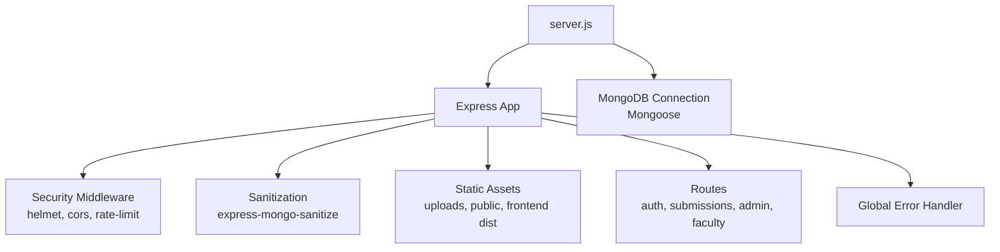
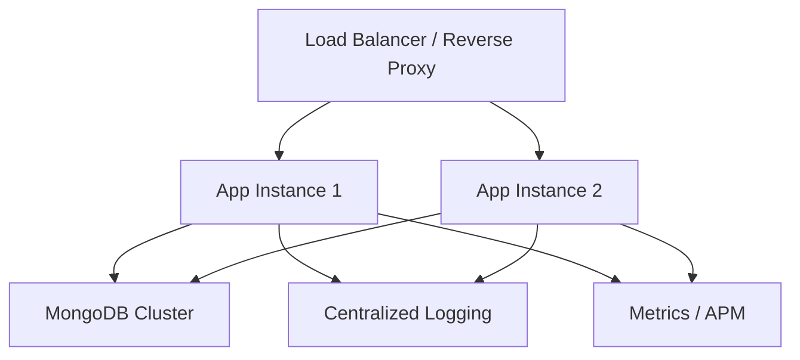
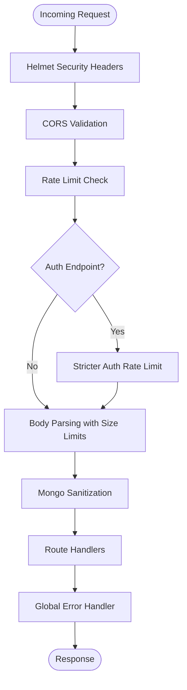
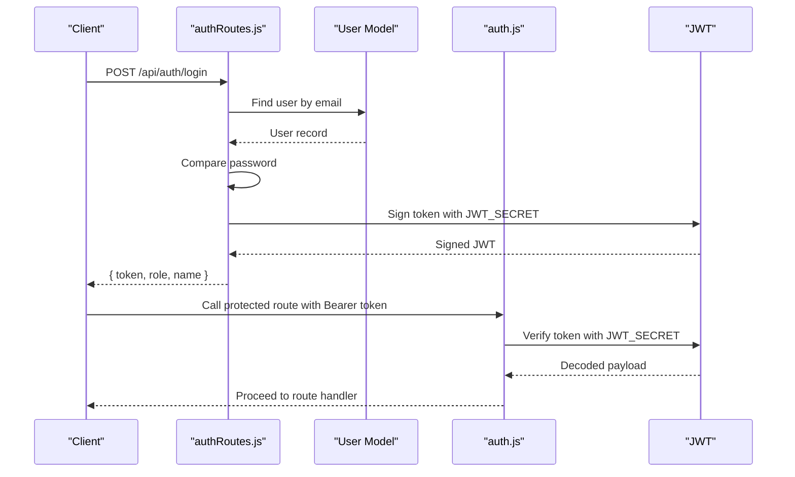
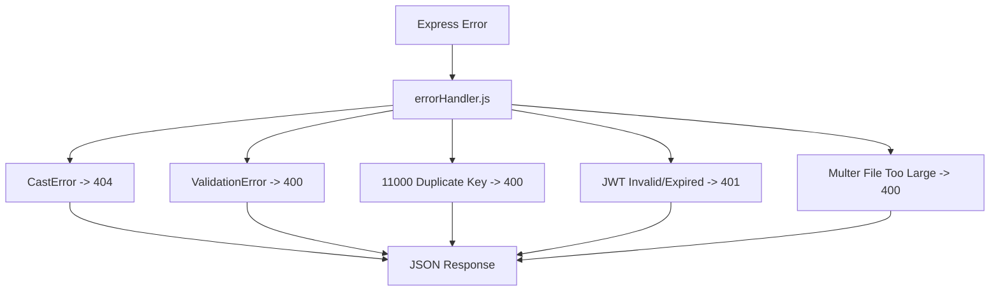
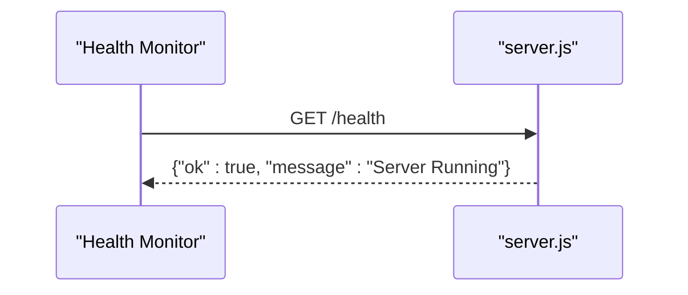
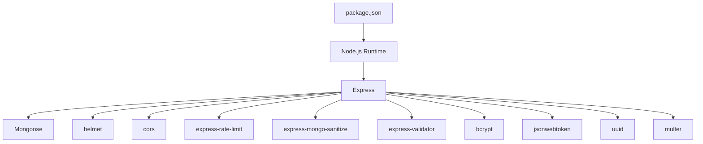

# Configuration & Deployment

<cite>
**Referenced Files in This Document**
- [.env](file://.env)
- [package.json](file://package.json)
- [server.js](file://server.js)
- [middleware/auth.js](file://middleware/auth.js)
- [middleware/errorHandler.js](file://middleware/errorHandler.js)
- [routes/authRoutes.js](file://routes/authRoutes.js)
- [utils/ApiError.js](file://utils/ApiError.js)
- [models/User.js](file://models/User.js)
</cite>

## Table of Contents
1. [Introduction](#introduction)
2. [Project Structure](#project-structure)
3. [Core Components](#core-components)
4. [Architecture Overview](#architecture-overview)
5. [Detailed Component Analysis](#detailed-component-analysis)
6. [Dependency Analysis](#dependency-analysis)
7. [Performance Considerations](#performance-considerations)
8. [Troubleshooting Guide](#troubleshooting-guide)
9. [Conclusion](#conclusion)
10. [Appendices](#appendices)

## Introduction
This document provides production-grade configuration and deployment guidance for the backend service. It covers environment variables, database connectivity, JWT secrets, port settings, security parameters, dependency management, server configuration, deployment strategies, environment-specific setups, monitoring, health checks, performance optimization, security hardening, logging, error monitoring, scaling, load balancing, and high availability.

## Project Structure
The backend is an Express application with modular middleware, routes, models, and utilities. It uses environment variables for configuration and integrates MongoDB via Mongoose. The server exposes health checks, serves static assets, and implements robust security middleware.

**Diagram sources**
- [server.js](file://server.js#L1-L92)

**Section sources**
- [server.js](file://server.js#L1-L92)

## Core Components
- Environment configuration via dotenv and process environment variables
- Security middleware stack (CORS, Helmet, rate limiting)
- Authentication middleware using JWT
- Centralized error handling with structured error responses
- MongoDB connection and model definitions
- Health endpoint for runtime checks

Key configuration touchpoints:
- Port binding and MongoDB URI
- Frontend URL for CORS
- JWT secret for signing tokens
- Rate limits for general and auth endpoints

**Section sources**
- [.env](file://.env#L1-L4)
- [server.js](file://server.js#L18-L54)
- [middleware/auth.js](file://middleware/auth.js#L1-L25)
- [routes/authRoutes.js](file://routes/authRoutes.js#L42-L46)
- [middleware/errorHandler.js](file://middleware/errorHandler.js#L1-L53)
- [models/User.js](file://models/User.js#L1-L20)

## Architecture Overview
Production-ready runtime architecture includes:
- Reverse proxy or load balancer in front of multiple Node.js instances
- Managed MongoDB deployment (replica set or cloud provider)
- Centralized logging and metrics collection
- Automated health checks and readiness probes
- CDN or static hosting for frontend assets

[No sources needed since this diagram shows conceptual workflow, not actual code structure]

## Detailed Component Analysis

### Environment Variables and Secrets
- PORT: Application listening port
- MONGO_URI: MongoDB connection string
- JWT_SECRET: Secret key for JWT signing
- FRONTEND_URL: Origin for CORS configuration

Production recommendations:
- Store secrets externally (secret manager or orchestrator) and mount as environment variables
- Rotate JWT_SECRET periodically and coordinate rolling restarts
- Use distinct MONGO_URI for production (cloud Atlas or private cluster)
- Restrict FRONTEND_URL to production domain(s)

**Section sources**
- [.env](file://.env#L1-L4)
- [server.js](file://server.js#L41-L44)
- [routes/authRoutes.js](file://routes/authRoutes.js#L42-L46)
- [middleware/auth.js](file://middleware/auth.js#L11)

### Security Middleware and Hardening
- Helmet: Standard security headers
- CORS: Origin-based access control with credentials support
- Rate limiting: General and stricter limits for auth endpoints
- Data sanitization: Protection against NoSQL injection
- Body size limits: Prevent large payload abuse

**Diagram sources**
- [server.js](file://server.js#L18-L54)
- [middleware/errorHandler.js](file://middleware/errorHandler.js#L1-L53)

**Section sources**
- [server.js](file://server.js#L18-L54)

### Authentication and Authorization
- Token generation uses JWT with a configurable secret
- Middleware validates bearer tokens and enforces optional role checks
- Protected routes rely on the auth middleware

**Diagram sources**
- [routes/authRoutes.js](file://routes/authRoutes.js#L28-L55)
- [middleware/auth.js](file://middleware/auth.js#L3-L23)

**Section sources**
- [routes/authRoutes.js](file://routes/authRoutes.js#L28-L55)
- [middleware/auth.js](file://middleware/auth.js#L1-L25)
- [models/User.js](file://models/User.js#L1-L20)

### Error Handling and Observability
- Centralized error handler maps database and validation errors to appropriate HTTP statuses
- Logs errors to stdout/stderr for container log collection
- In development mode, includes stack traces; in production, suppresses stack traces

**Diagram sources**
- [middleware/errorHandler.js](file://middleware/errorHandler.js#L3-L50)
- [utils/ApiError.js](file://utils/ApiError.js#L1-L17)

**Section sources**
- [middleware/errorHandler.js](file://middleware/errorHandler.js#L1-L53)
- [utils/ApiError.js](file://utils/ApiError.js#L1-L17)

### Health Checks and Readiness
- Health endpoint returns a simple JSON response indicating service status
- Use this endpoint for Kubernetes readiness/liveness probes or load balancer health checks

**Diagram sources**
- [server.js](file://server.js#L68-L70)

**Section sources**
- [server.js](file://server.js#L68-L70)

## Dependency Analysis
Runtime and operational dependencies:
- Node.js application managed via npm scripts
- Express web framework
- MongoDB driver via Mongoose
- Security and validation libraries
- dotenv for environment configuration

**Diagram sources**
- [package.json](file://package.json#L10-L26)

**Section sources**
- [package.json](file://package.json#L1-L28)

## Performance Considerations
- Tune rate limits per deployment needs; adjust windows and max values
- Optimize MongoDB connection pool settings via MONGO_URI options
- Enable compression and caching at the reverse proxy level
- Use connection keep-alive and tune socket timeouts
- Monitor slow queries and add appropriate indexes in production
- Scale horizontally behind a load balancer

[No sources needed since this section provides general guidance]

## Troubleshooting Guide
Common production issues and resolutions:
- MongoDB connection failures: verify MONGO_URI and network ACLs; ensure replica set connectivity
- CORS errors: confirm FRONTEND_URL matches the deployed origin
- JWT signature mismatches: ensure JWT_SECRET is identical across instances during rolling updates
- 429 Too Many Requests: review rate limit thresholds and client-side retry policies
- 500 Internal Server Errors: inspect centralized logs for stack traces and error categories handled by the error handler

**Section sources**
- [server.js](file://server.js#L84-L92)
- [middleware/errorHandler.js](file://middleware/errorHandler.js#L1-L53)

## Conclusion
This guide outlines a secure, observable, and scalable production setup for the backend. By externalizing secrets, enforcing strict security middleware, implementing robust error handling, and leveraging health checks, the system can operate reliably under production loads. Combine these configurations with infrastructure automation, monitoring, and CI/CD practices for a complete deployment lifecycle.

[No sources needed since this section summarizes without analyzing specific files]

## Appendices

### Environment Variable Reference
- PORT: Listening port for the Express server
- MONGO_URI: MongoDB connection string
- JWT_SECRET: Secret key for JWT signing
- FRONTEND_URL: Allowed origin for CORS

**Section sources**
- [.env](file://.env#L1-L4)

### Production Setup Checklist
- Configure environment variables in the platform secrets store
- Set up MongoDB with appropriate backup, monitoring, and access controls
- Deploy behind a load balancer with sticky sessions disabled for stateless scaling
- Add health checks and configure auto-healing
- Enable centralized logging and metrics collection
- Plan secrets rotation and update rollout strategy

[No sources needed since this section provides general guidance]