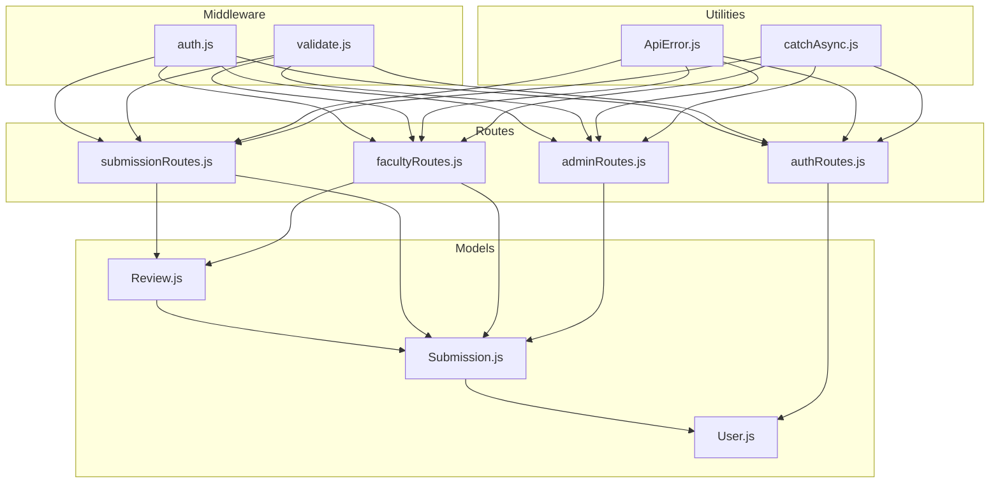
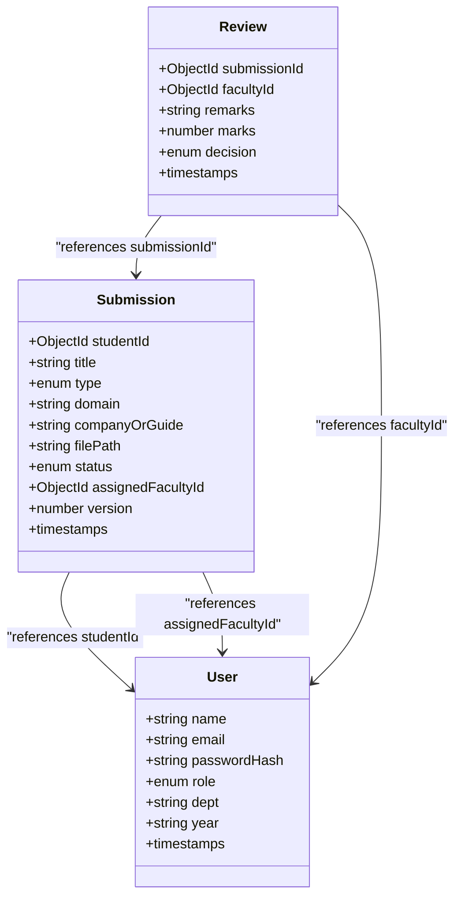
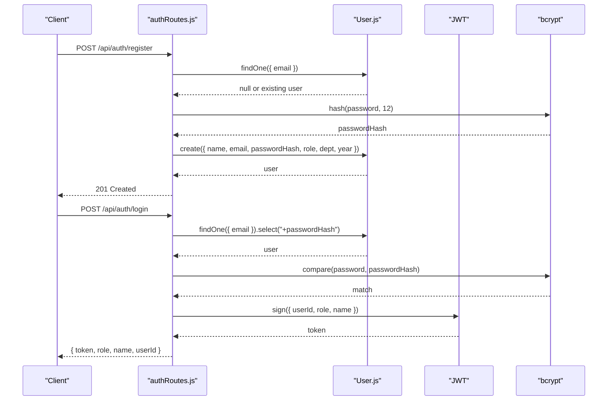
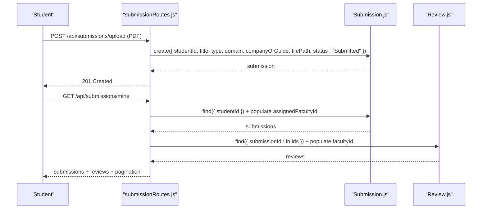
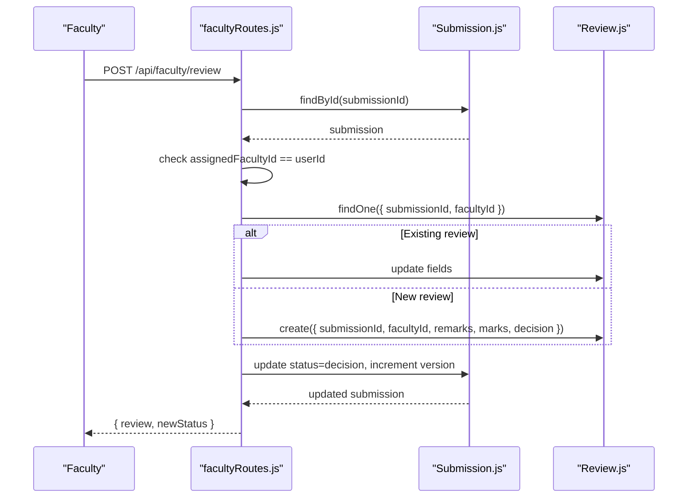
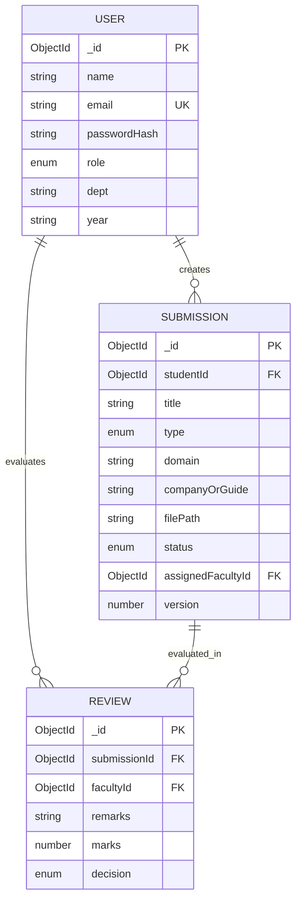
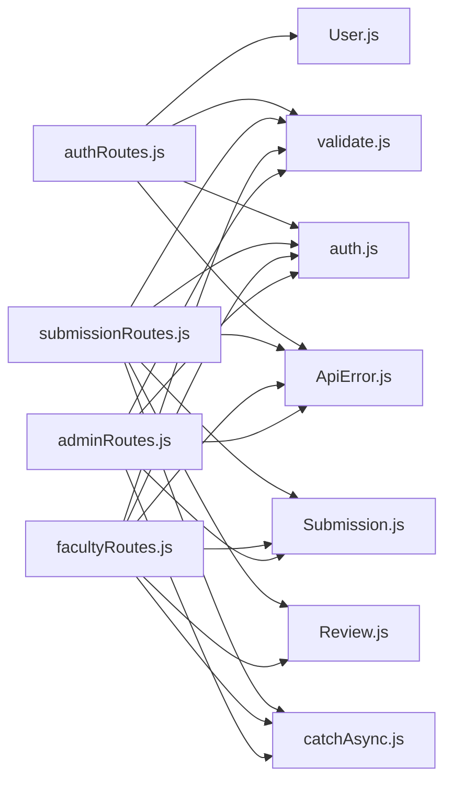

# Data Models & Database

<cite>
**Referenced Files in This Document**
- [User.js](file://models/User.js)
- [Submission.js](file://models/Submission.js)
- [Review.js](file://models/Review.js)
- [auth.js](file://middleware/auth.js)
- [validate.js](file://middleware/validate.js)
- [authRoutes.js](file://routes/authRoutes.js)
- [submissionRoutes.js](file://routes/submissionRoutes.js)
- [facultyRoutes.js](file://routes/facultyRoutes.js)
- [adminRoutes.js](file://routes/adminRoutes.js)
- [ApiError.js](file://utils/ApiError.js)
- [catchAsync.js](file://utils/catchAsync.js)
- [server.js](file://server.js)
</cite>

## Table of Contents
1. [Introduction](#introduction)
2. [Project Structure](#project-structure)
3. [Core Components](#core-components)
4. [Architecture Overview](#architecture-overview)
5. [Detailed Component Analysis](#detailed-component-analysis)
6. [Dependency Analysis](#dependency-analysis)
7. [Performance Considerations](#performance-considerations)
8. [Troubleshooting Guide](#troubleshooting-guide)
9. [Conclusion](#conclusion)
10. [Appendices](#appendices)

## Introduction
This document provides comprehensive data model documentation for the MongoDB/Mongoose schema definitions powering the academic workflow system. It details the User model with role-based access control, the Submission model for academic work tracking, and the Review model for faculty evaluations. It explains entity relationships, field definitions, data types, validation rules, and the business logic embedded in the models. It also documents data access patterns, indexing strategies, performance considerations, data lifecycle, and validation constraints.

## Project Structure
The data models are defined under the models directory and consumed by route handlers and middleware. Authentication and validation middleware enforce role checks and input constraints. The server initializes middleware, routes, and connects to MongoDB.

**Diagram sources**
- [User.js](file://models/User.js#L1-L20)
- [Submission.js](file://models/Submission.js#L1-L30)
- [Review.js](file://models/Review.js#L1-L18)
- [auth.js](file://middleware/auth.js#L1-L25)
- [validate.js](file://middleware/validate.js#L1-L120)
- [authRoutes.js](file://routes/authRoutes.js#L1-L85)
- [submissionRoutes.js](file://routes/submissionRoutes.js#L1-L159)
- [facultyRoutes.js](file://routes/facultyRoutes.js#L1-L172)
- [adminRoutes.js](file://routes/adminRoutes.js#L1-L184)
- [ApiError.js](file://utils/ApiError.js#L1-L17)
- [catchAsync.js](file://utils/catchAsync.js#L1-L8)

**Section sources**
- [server.js](file://server.js#L1-L92)

## Core Components
This section documents the three core Mongoose models and their embedded business rules.

- User Model
  - Purpose: Stores user profiles and enforces role-based access control.
  - Fields:
    - name: String, required
    - email: String, required, unique, normalized to lowercase
    - passwordHash: String, required
    - role: Enum ["student", "faculty", "admin"], required
    - dept: String, default empty
    - year: String, default empty
  - Timestamps: createdAt, updatedAt
  - Validation: Enforced via registration endpoint and middleware.
  - Business rules:
    - Unique email constraint enforced at schema level.
    - Role determines access to protected routes via middleware.

- Submission Model
  - Purpose: Tracks academic work submissions and workflow state.
  - Fields:
    - studentId: ObjectId referencing User, required
    - title: String, required
    - type: Enum ["internship", "project", "research"], required
    - domain: String, default empty
    - companyOrGuide: String, default empty
    - filePath: String, required
    - status: Enum ["Submitted", "Assigned", "Approved", "Resubmission Required"], default "Submitted"
    - assignedFacultyId: ObjectId referencing User, optional
    - version: Number, default 1
  - Timestamps: createdAt, updatedAt
  - Business rules:
    - Status transitions are driven by faculty reviews.
    - Version increments on each review update.
    - Faculty assignment updates status to "Assigned".

- Review Model
  - Purpose: Captures faculty evaluations for a submission.
  - Fields:
    - submissionId: ObjectId referencing Submission, required
    - facultyId: ObjectId referencing User, required
    - remarks: String, default empty
    - marks: Number, default 0
    - decision: Enum ["Approved", "Resubmission Required"], required
  - Timestamps: createdAt, updatedAt
  - Business rules:
    - Each faculty member can update their review for a submission.
    - Decision drives submission status and version bump.

**Section sources**
- [User.js](file://models/User.js#L1-L20)
- [Submission.js](file://models/Submission.js#L1-L30)
- [Review.js](file://models/Review.js#L1-L18)

## Architecture Overview
The system follows a layered architecture:
- Routes define endpoints and orchestrate data access.
- Middleware enforces authentication and input validation.
- Models encapsulate schema definitions and business constraints.
- Utilities standardize error handling and asynchronous flow.

**Diagram sources**
- [User.js](file://models/User.js#L1-L20)
- [Submission.js](file://models/Submission.js#L1-L30)
- [Review.js](file://models/Review.js#L1-L18)

## Detailed Component Analysis

### User Model
- Schema definition and constraints:
  - Unique email enforced at schema level.
  - Role enum restricts valid roles.
  - Password stored as hash; original password is never persisted.
- Access control:
  - Authentication middleware verifies JWT and optionally enforces role.
- Registration and login:
  - Registration validates input, checks uniqueness, hashes password, and persists user.
  - Login validates credentials, compares hashed passwords, and issues JWT.

**Diagram sources**
- [authRoutes.js](file://routes/authRoutes.js#L1-L85)
- [User.js](file://models/User.js#L1-L20)
- [auth.js](file://middleware/auth.js#L1-L25)

**Section sources**
- [User.js](file://models/User.js#L1-L20)
- [authRoutes.js](file://routes/authRoutes.js#L1-L85)
- [auth.js](file://middleware/auth.js#L1-L25)
- [validate.js](file://middleware/validate.js#L18-L44)

### Submission Model
- Workflow tracking:
  - Status transitions: Submitted → Assigned → Approved or Resubmission Required.
  - Version increments on each review update.
- Access control:
  - Students can view only their own submissions.
  - Faculty can view only submissions assigned to them.
- Upload pipeline:
  - PDF validation via Multer and magic number check.
  - File path stored for retrieval.

**Diagram sources**
- [submissionRoutes.js](file://routes/submissionRoutes.js#L48-L121)
- [Submission.js](file://models/Submission.js#L1-L30)
- [Review.js](file://models/Review.js#L1-L18)

**Section sources**
- [Submission.js](file://models/Submission.js#L1-L30)
- [submissionRoutes.js](file://routes/submissionRoutes.js#L48-L121)
- [validate.js](file://middleware/validate.js#L55-L72)

### Review Model
- Faculty evaluation:
  - Supports updating remarks, marks, and decision.
  - Prevents unauthorized access by verifying assignment.
- Status propagation:
  - Review decision updates submission status.
  - Version increments after each review update.

**Diagram sources**
- [facultyRoutes.js](file://routes/facultyRoutes.js#L82-L133)
- [Submission.js](file://models/Submission.js#L1-L30)
- [Review.js](file://models/Review.js#L1-L18)

**Section sources**
- [Review.js](file://models/Review.js#L1-L18)
- [facultyRoutes.js](file://routes/facultyRoutes.js#L82-L133)
- [validate.js](file://middleware/validate.js#L84-L99)

### Entity Relationships and Referential Integrity
- Submission.studentId references User.
- Submission.assignedFacultyId references User.
- Review.submissionId references Submission.
- Review.facultyId references User.

**Diagram sources**
- [User.js](file://models/User.js#L1-L20)
- [Submission.js](file://models/Submission.js#L1-L30)
- [Review.js](file://models/Review.js#L1-L18)

## Dependency Analysis
- Route handlers depend on models and middleware.
- Middleware depends on validation rules and error utilities.
- Models are standalone but referenced by routes and middleware.

**Diagram sources**
- [authRoutes.js](file://routes/authRoutes.js#L1-L85)
- [submissionRoutes.js](file://routes/submissionRoutes.js#L1-L159)
- [facultyRoutes.js](file://routes/facultyRoutes.js#L1-L172)
- [adminRoutes.js](file://routes/adminRoutes.js#L1-L184)
- [User.js](file://models/User.js#L1-L20)
- [Submission.js](file://models/Submission.js#L1-L30)
- [Review.js](file://models/Review.js#L1-L18)
- [validate.js](file://middleware/validate.js#L1-L120)
- [auth.js](file://middleware/auth.js#L1-L25)
- [ApiError.js](file://utils/ApiError.js#L1-L17)
- [catchAsync.js](file://utils/catchAsync.js#L1-L8)

**Section sources**
- [validate.js](file://middleware/validate.js#L1-L120)
- [auth.js](file://middleware/auth.js#L1-L25)
- [ApiError.js](file://utils/ApiError.js#L1-L17)
- [catchAsync.js](file://utils/catchAsync.js#L1-L8)

## Performance Considerations
- Indexing strategies:
  - Consider adding compound indexes for frequent queries:
    - Submission(studentId, createdAt) for student submission lists.
    - Submission(assignedFacultyId, status, createdAt) for faculty assigned lists with filtering.
    - Review(facultyId, createdAt) for faculty review history.
    - Submission(status, type) for admin dashboards and filtering.
    - User(email) for login and uniqueness checks.
- Query patterns:
  - Populate only necessary fields to reduce payload size.
  - Use pagination (page, limit) consistently across endpoints.
  - Batch counts and finds using Promise.all for improved latency.
- File handling:
  - Store only file paths in the database; keep large files on disk.
  - Validate file type and size early to avoid unnecessary writes.
- Caching:
  - Consider caching frequently accessed metadata (e.g., user roles, submission counts) where appropriate.
- Network and security:
  - Rate limiting applied to auth endpoints and general API.
  - MongoSanitize mitigates NoSQL injection risks.

[No sources needed since this section provides general guidance]

## Troubleshooting Guide
- Authentication failures:
  - Missing or invalid Authorization header.
  - Token verification failure or role mismatch.
- Validation errors:
  - Input validation middleware aggregates messages and throws a 400 error.
- Resource access errors:
  - Students cannot view others’ submissions.
  - Faculty can review only assigned submissions.
- Resource not found:
  - Submission or user lookup failures return 404.
- PDF upload issues:
  - Non-PDF files or invalid PDF content rejected with 400.

**Section sources**
- [auth.js](file://middleware/auth.js#L1-L25)
- [validate.js](file://middleware/validate.js#L1-L120)
- [ApiError.js](file://utils/ApiError.js#L1-L17)
- [submissionRoutes.js](file://routes/submissionRoutes.js#L124-L157)
- [facultyRoutes.js](file://routes/facultyRoutes.js#L82-L133)
- [adminRoutes.js](file://routes/adminRoutes.js#L120-L148)

## Conclusion
The data models implement a clean separation of concerns with explicit role-based access control and robust validation. The Submission and Review models encode workflow state transitions and evaluation logic, while the User model centralizes identity and authorization. Together with middleware and route handlers, they form a cohesive system for managing academic submissions and evaluations.

[No sources needed since this section summarizes without analyzing specific files]

## Appendices

### Field Definitions and Types
- User
  - name: String
  - email: String
  - passwordHash: String
  - role: Enum ["student", "faculty", "admin"]
  - dept: String
  - year: String
- Submission
  - studentId: ObjectId
  - title: String
  - type: Enum ["internship", "project", "research"]
  - domain: String
  - companyOrGuide: String
  - filePath: String
  - status: Enum ["Submitted", "Assigned", "Approved", "Resubmission Required"]
  - assignedFacultyId: ObjectId
  - version: Number
- Review
  - submissionId: ObjectId
  - facultyId: ObjectId
  - remarks: String
  - marks: Number
  - decision: Enum ["Approved", "Resubmission Required"]

**Section sources**
- [User.js](file://models/User.js#L1-L20)
- [Submission.js](file://models/Submission.js#L1-L30)
- [Review.js](file://models/Review.js#L1-L18)

### Sample Data Structures
- User
  - Example: { name: "...", email: "...", role: "student|faculty|admin", dept: "...", year: "..." }
- Submission
  - Example: { studentId: ObjectId, title: "...", type: "internship|project|research", filePath: "/uploads/...", status: "Submitted|Assigned|Approved|Resubmission Required", version: 1 }
- Review
  - Example: { submissionId: ObjectId, facultyId: ObjectId, decision: "Approved|Resubmission Required", marks: 0..100, remarks: "..." }

**Section sources**
- [User.js](file://models/User.js#L1-L20)
- [Submission.js](file://models/Submission.js#L1-L30)
- [Review.js](file://models/Review.js#L1-L18)

### Validation Constraints
- Registration:
  - Name length, Email format and uniqueness, Password strength, Optional role normalization, Department/year length limits.
- Login:
  - Email presence and format, Password presence.
- Submission upload:
  - Title length, Type enum, Optional Domain/Company/Guide length limits.
- Faculty review:
  - Decision enum, Marks range, Remarks length, Submission/faculty IDs.
- Pagination:
  - Page and limit bounds.

**Section sources**
- [validate.js](file://middleware/validate.js#L18-L44)
- [validate.js](file://middleware/validate.js#L46-L53)
- [validate.js](file://middleware/validate.js#L55-L72)
- [validate.js](file://middleware/validate.js#L84-L99)
- [validate.js](file://middleware/validate.js#L101-L109)

### Data Lifecycle and Business Logic Embedded in Models
- User lifecycle:
  - Registration creates a hashed password record; login authenticates via password comparison.
- Submission lifecycle:
  - Creation sets initial status; admin assigns faculty; faculty reviews update status and version.
- Review lifecycle:
  - One review per faculty per submission; updates overwrite previous review; decision propagates to submission.

**Section sources**
- [authRoutes.js](file://routes/authRoutes.js#L1-L85)
- [adminRoutes.js](file://routes/adminRoutes.js#L120-L148)
- [facultyRoutes.js](file://routes/facultyRoutes.js#L82-L133)
- [Submission.js](file://models/Submission.js#L1-L30)
- [Review.js](file://models/Review.js#L1-L18)