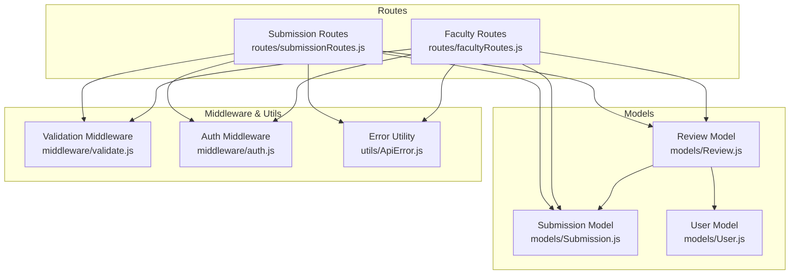
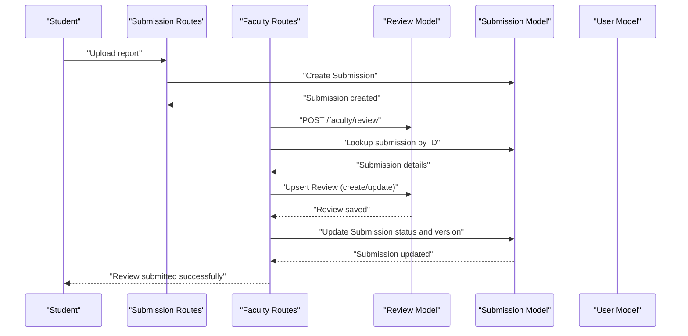
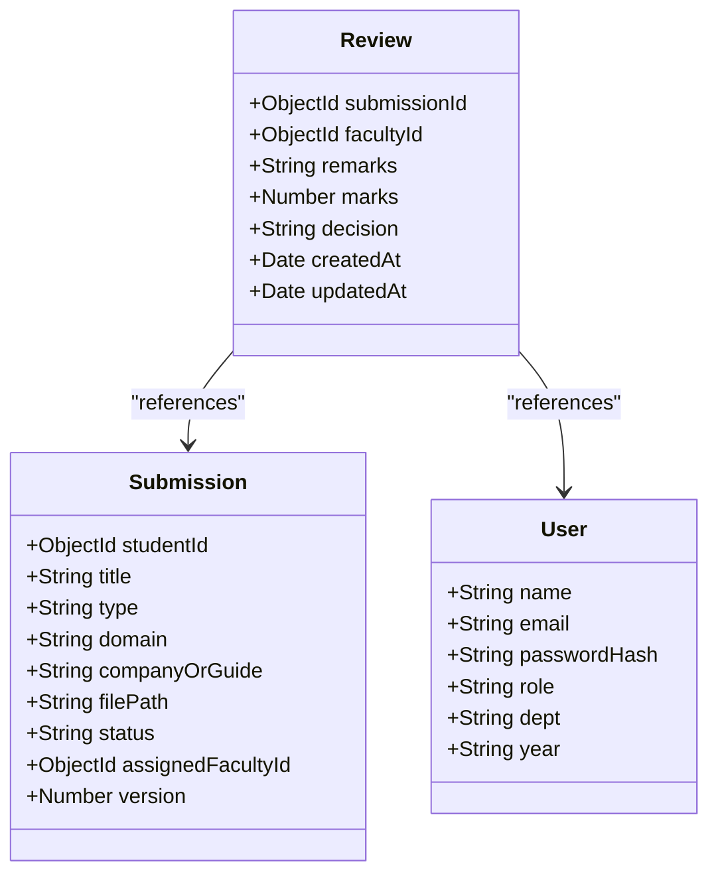
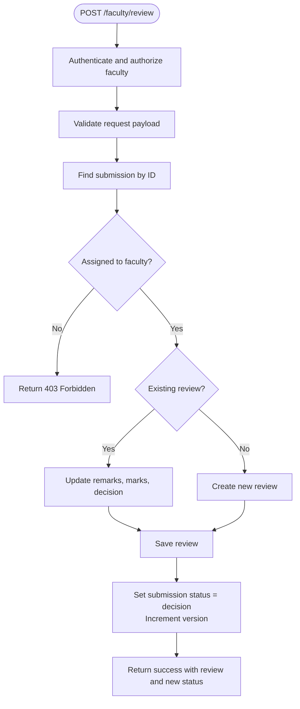
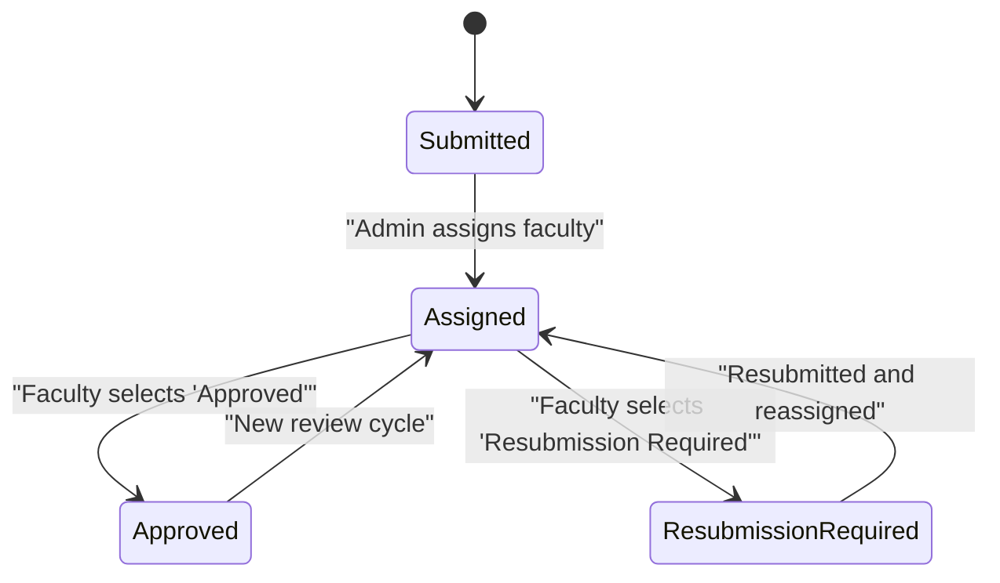
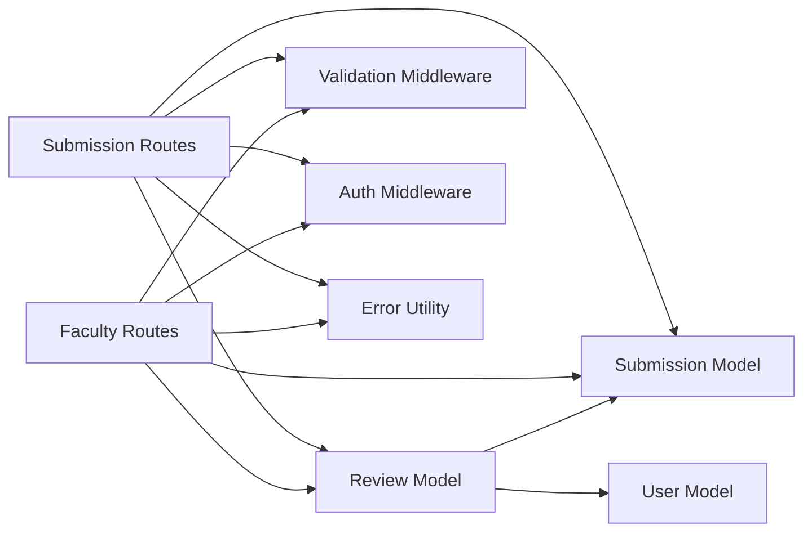

# Review Model

<cite>
**Referenced Files in This Document**
- [Review.js](file://models/Review.js)
- [Submission.js](file://models/Submission.js)
- [User.js](file://models/User.js)
- [facultyRoutes.js](file://routes/facultyRoutes.js)
- [submissionRoutes.js](file://routes/submissionRoutes.js)
- [validate.js](file://middleware/validate.js)
- [auth.js](file://middleware/auth.js)
- [ApiError.js](file://utils/ApiError.js)
</cite>

## Table of Contents
1. [Introduction](#introduction)
2. [Project Structure](#project-structure)
3. [Core Components](#core-components)
4. [Architecture Overview](#architecture-overview)
5. [Detailed Component Analysis](#detailed-component-analysis)
6. [Dependency Analysis](#dependency-analysis)
7. [Performance Considerations](#performance-considerations)
8. [Troubleshooting Guide](#troubleshooting-guide)
9. [Conclusion](#conclusion)

## Introduction
This document provides comprehensive data model documentation for the Review model within a faculty evaluation and feedback system. It details the schema definition, relationships with User and Submission models, review criteria, scoring mechanisms, feedback collection processes, validation rules, and approval workflow business logic. The Review model captures faculty evaluations of student submissions, including numerical ratings, textual feedback, and decision outcomes.

## Project Structure
The Review model is part of a MongoDB/Mongoose-based backend with Express.js routing. The relevant components are organized as follows:
- Data models: Review, Submission, User
- Routes: facultyRoutes.js handles faculty-specific operations including review creation and updates; submissionRoutes.js handles student submission operations and cross-references reviews
- Middleware: validate.js defines validation rules for requests; auth.js enforces role-based access control
- Utilities: ApiError.js standardizes error responses

**Diagram sources**
- [Review.js](file://models/Review.js#L1-L18)
- [Submission.js](file://models/Submission.js#L1-L30)
- [User.js](file://models/User.js#L1-L20)
- [facultyRoutes.js](file://routes/facultyRoutes.js#L1-L172)
- [submissionRoutes.js](file://routes/submissionRoutes.js#L1-L159)
- [validate.js](file://middleware/validate.js#L1-L120)
- [auth.js](file://middleware/auth.js#L1-L25)
- [ApiError.js](file://utils/ApiError.js#L1-L17)

**Section sources**
- [Review.js](file://models/Review.js#L1-L18)
- [Submission.js](file://models/Submission.js#L1-L30)
- [User.js](file://models/User.js#L1-L20)
- [facultyRoutes.js](file://routes/facultyRoutes.js#L1-L172)
- [submissionRoutes.js](file://routes/submissionRoutes.js#L1-L159)
- [validate.js](file://middleware/validate.js#L1-L120)
- [auth.js](file://middleware/auth.js#L1-L25)
- [ApiError.js](file://utils/ApiError.js#L1-L17)

## Core Components
This section documents the Review model schema, including field definitions, data types, constraints, and relationships.

- Model name: Review
- Collection: reviews
- Schema fields:
  - submissionId: ObjectId referencing Submission; required
  - facultyId: ObjectId referencing User; required
  - remarks: String; default empty string
  - marks: Number; default 0
  - decision: Enum with values "Approved" and "Resubmission Required"; required
  - createdAt: Timestamp (automatically managed by Mongoose)
  - updatedAt: Timestamp (automatically managed by Mongoose)

Relationships:
- One-to-many: Review belongs to one Submission and one User (faculty)
- Reverse relationships:
  - Submission has many Reviews (via foreign key submissionId)
  - User has many Reviews (via foreign key facultyId)

Validation and constraints:
- submissionId and facultyId are required and reference valid documents
- decision must be one of the allowed enum values
- marks is optional but constrained to 0–100 when provided
- remarks is optional with a maximum length constraint

Timestamps:
- Created and updated timestamps are automatically maintained by Mongoose.

**Section sources**
- [Review.js](file://models/Review.js#L3-L16)
- [Submission.js](file://models/Submission.js#L5)
- [User.js](file://models/User.js#L7)

## Architecture Overview
The Review model participates in a broader workflow involving students submitting reports, administrators assigning faculty reviewers, and faculty providing evaluations. The following sequence illustrates the end-to-end flow for review submission:

**Diagram sources**
- [facultyRoutes.js](file://routes/facultyRoutes.js#L82-L133)
- [submissionRoutes.js](file://routes/submissionRoutes.js#L48-L83)
- [Review.js](file://models/Review.js#L3-L16)
- [Submission.js](file://models/Submission.js#L3-L27)
- [User.js](file://models/User.js#L1-L20)

## Detailed Component Analysis

### Review Model Schema
The Review model encapsulates evaluation data for a specific submission. It includes:
- Foreign keys to Submission and User
- Evaluation score (marks)
- Textual feedback (remarks)
- Decision outcome (Approved or Resubmission Required)
- Automatic timestamps

**Diagram sources**
- [Review.js](file://models/Review.js#L3-L16)
- [Submission.js](file://models/Submission.js#L3-L27)
- [User.js](file://models/User.js#L3-L17)

**Section sources**
- [Review.js](file://models/Review.js#L3-L16)
- [Submission.js](file://models/Submission.js#L3-L27)
- [User.js](file://models/User.js#L3-L17)

### Faculty Review Workflow
Faculty members can evaluate assigned submissions. The workflow includes:
- Authentication and authorization checks
- Input validation for review fields
- Submission lookup and assignment verification
- Upsert of Review records
- Submission status update and version increment

Key steps:
1. Authenticate as faculty and enforce role-based access
2. Validate request payload using reviewValidation rules
3. Retrieve submission by ID and confirm assignment to the faculty member
4. Check for existing review; if present, update; otherwise, create
5. Update submission status to match decision and increment version
6. Return success response with updated status

**Diagram sources**
- [facultyRoutes.js](file://routes/facultyRoutes.js#L82-L133)
- [validate.js](file://middleware/validate.js#L84-L99)
- [auth.js](file://middleware/auth.js#L3-L23)

**Section sources**
- [facultyRoutes.js](file://routes/facultyRoutes.js#L82-L133)
- [validate.js](file://middleware/validate.js#L84-L99)
- [auth.js](file://middleware/auth.js#L3-L23)

### Validation Rules for Review Completeness
The validation middleware enforces the following constraints for review submissions:
- submissionId: required, must be a valid ObjectId
- decision: required, must be one of "Approved" or "Resubmission Required"
- marks: optional, must be an integer between 0 and 100 if provided
- remarks: optional, must be ≤ 1000 characters if provided

These rules ensure that reviews are complete and consistent with the evaluation workflow.

**Section sources**
- [validate.js](file://middleware/validate.js#L84-L99)

### Feedback Collection and Metadata
Feedback collection involves:
- Remarks field for qualitative comments
- Marks field for quantitative scoring
- Automatic timestamps for auditability
- Decision field to drive submission status transitions

The routes expose endpoints to:
- List assigned submissions for a faculty member
- View review history for a faculty member
- Submit or update a review
- Fetch submission details with associated reviews

**Section sources**
- [facultyRoutes.js](file://routes/facultyRoutes.js#L9-L41)
- [facultyRoutes.js](file://routes/facultyRoutes.js#L44-L79)
- [facultyRoutes.js](file://routes/facultyRoutes.js#L82-L133)
- [submissionRoutes.js](file://routes/submissionRoutes.js#L85-L121)
- [submissionRoutes.js](file://routes/submissionRoutes.js#L123-L157)

### Business Logic for Approval Workflows
Approval workflows are governed by:
- Submission status transitions based on decision
- Version increments to track review iterations
- Access control ensuring only assigned faculty can evaluate
- Idempotent upsert behavior to support resubmission cycles

**Diagram sources**
- [Submission.js](file://models/Submission.js#L17-L21)
- [facultyRoutes.js](file://routes/facultyRoutes.js#L122-L124)

**Section sources**
- [Submission.js](file://models/Submission.js#L17-L21)
- [facultyRoutes.js](file://routes/facultyRoutes.js#L122-L124)

## Dependency Analysis
The Review model depends on:
- Submission model for evaluation context
- User model for faculty identity
- Validation middleware for input sanitization
- Auth middleware for role enforcement
- Error utility for standardized responses

**Diagram sources**
- [Review.js](file://models/Review.js#L3-L16)
- [Submission.js](file://models/Submission.js#L3-L27)
- [User.js](file://models/User.js#L1-L20)
- [facultyRoutes.js](file://routes/facultyRoutes.js#L1-L172)
- [submissionRoutes.js](file://routes/submissionRoutes.js#L1-L159)
- [validate.js](file://middleware/validate.js#L1-L120)
- [auth.js](file://middleware/auth.js#L1-L25)
- [ApiError.js](file://utils/ApiError.js#L1-L17)

**Section sources**
- [Review.js](file://models/Review.js#L3-L16)
- [Submission.js](file://models/Submission.js#L3-L27)
- [User.js](file://models/User.js#L1-L20)
- [facultyRoutes.js](file://routes/facultyRoutes.js#L1-L172)
- [submissionRoutes.js](file://routes/submissionRoutes.js#L1-L159)
- [validate.js](file://middleware/validate.js#L1-L120)
- [auth.js](file://middleware/auth.js#L1-L25)
- [ApiError.js](file://utils/ApiError.js#L1-L17)

## Performance Considerations
- Indexing recommendations:
  - Add indexes on Review.submissionId and Review.facultyId for frequent lookups and joins
  - Consider compound indexes for common query patterns (e.g., facultyId + createdAt)
- Population strategies:
  - Use selective population of fields to reduce payload sizes (as seen in routes)
  - Paginate results to avoid large datasets
- Caching:
  - Cache frequently accessed submission and review summaries for read-heavy scenarios
- Asynchronous operations:
  - Leverage Promise.all for concurrent reads/writes where safe (as demonstrated in routes)

## Troubleshooting Guide
Common issues and resolutions:
- Missing or invalid token:
  - Symptom: 401 Unauthorized
  - Cause: Missing or invalid Bearer token
  - Resolution: Ensure proper authentication and token validity
- Role mismatch:
  - Symptom: 403 Forbidden
  - Cause: Non-faculty user attempting faculty-only operations
  - Resolution: Verify user role and re-authenticate
- Submission not found:
  - Symptom: 404 Not Found
  - Cause: Invalid submissionId or deleted submission
  - Resolution: Confirm submissionId and existence
- Submission not assigned:
  - Symptom: 403 Forbidden
  - Cause: Attempting to review a submission not assigned to the faculty member
  - Resolution: Ensure assignment before evaluation
- Validation errors:
  - Symptom: 400 Bad Request with validation messages
  - Causes: Invalid decision, out-of-range marks, or oversized remarks
  - Resolution: Align payload with validation rules

**Section sources**
- [auth.js](file://middleware/auth.js#L3-L23)
- [facultyRoutes.js](file://routes/facultyRoutes.js#L89-L96)
- [facultyRoutes.js](file://routes/facultyRoutes.js#L94-L96)
- [validate.js](file://middleware/validate.js#L84-L99)
- [ApiError.js](file://utils/ApiError.js#L1-L17)

## Conclusion
The Review model provides a focused yet robust foundation for capturing faculty evaluations within the system. Its schema aligns with the evaluation workflow, while validation and middleware ensure data integrity and access control. The relationships with Submission and User models enable contextual evaluation and auditability. By adhering to the documented validation rules and workflow logic, stakeholders can reliably collect feedback, manage approval cycles, and maintain a transparent evaluation process.