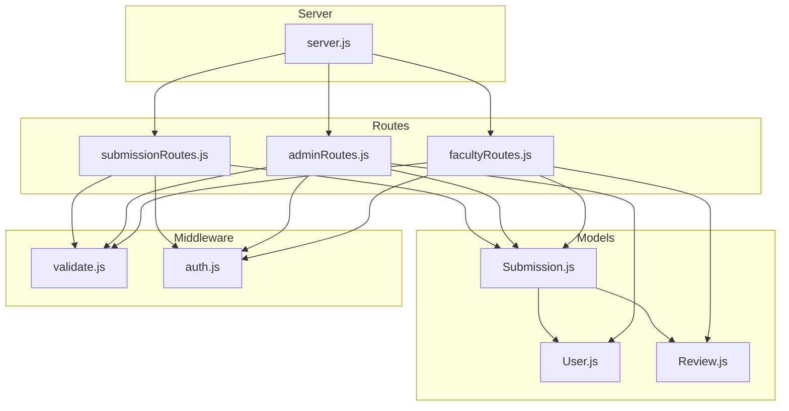
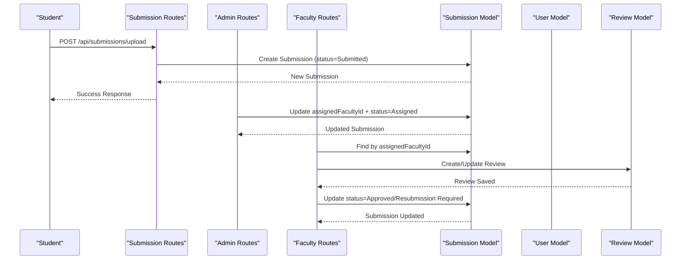
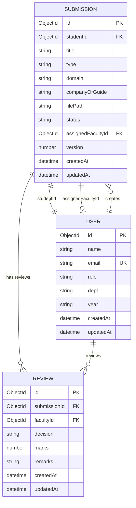
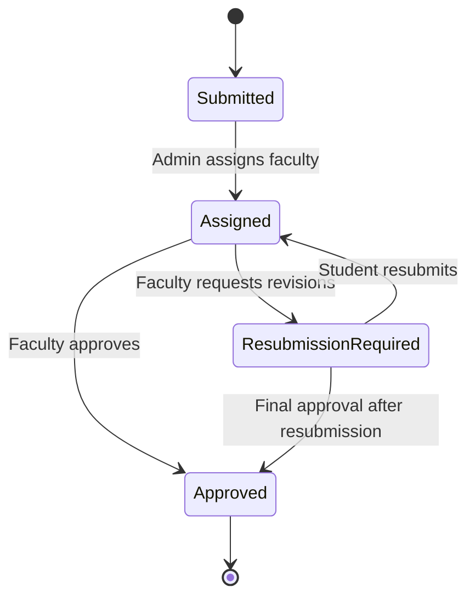
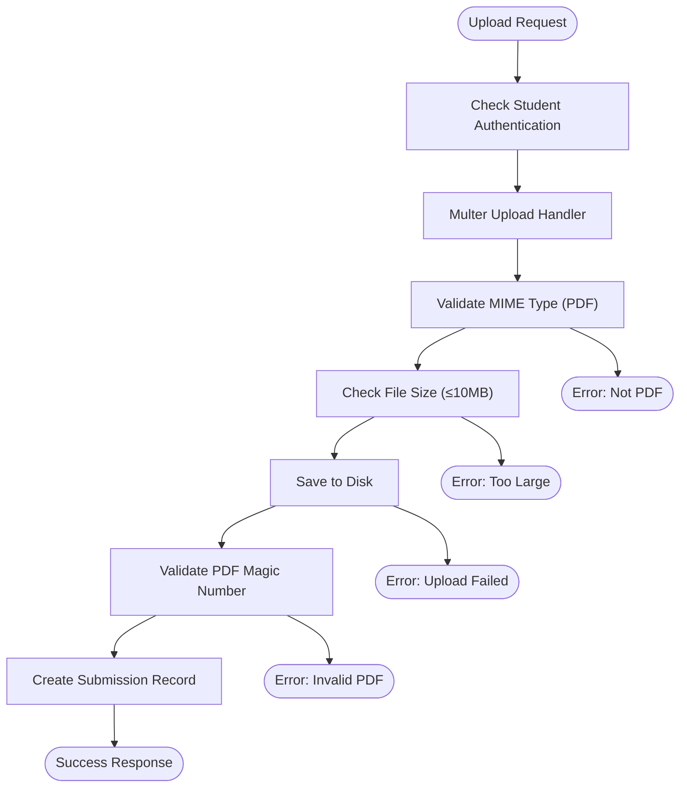
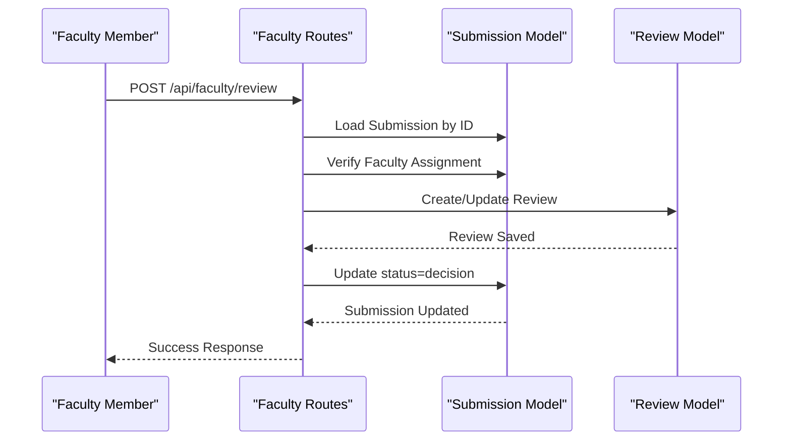
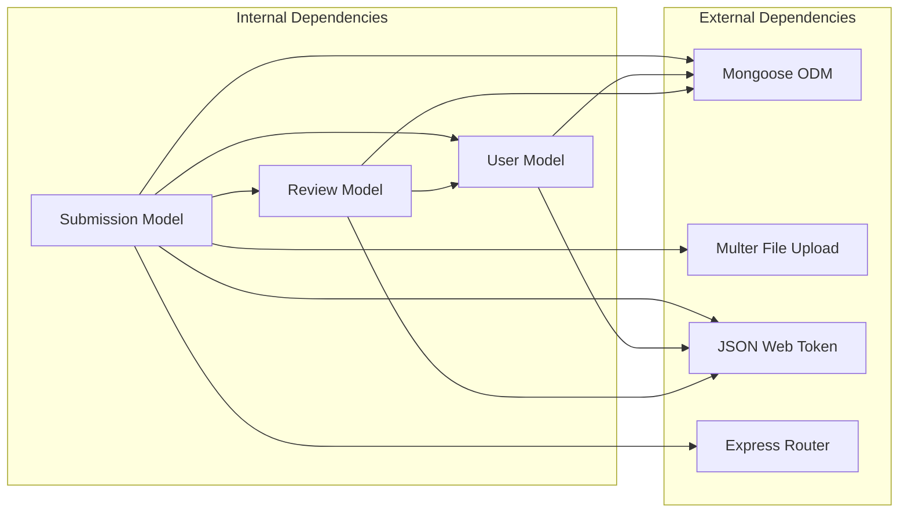

# Submission Model

<cite>
**Referenced Files in This Document**
- [Submission.js](file://models/Submission.js)
- [User.js](file://models/User.js)
- [Review.js](file://models/Review.js)
- [submissionRoutes.js](file://routes/submissionRoutes.js)
- [adminRoutes.js](file://routes/adminRoutes.js)
- [facultyRoutes.js](file://routes/facultyRoutes.js)
- [validate.js](file://middleware/validate.js)
- [auth.js](file://middleware/auth.js)
- [server.js](file://server.js)
</cite>

## Table of Contents
1. [Introduction](#introduction)
2. [Project Structure](#project-structure)
3. [Core Components](#core-components)
4. [Architecture Overview](#architecture-overview)
5. [Detailed Component Analysis](#detailed-component-analysis)
6. [Dependency Analysis](#dependency-analysis)
7. [Performance Considerations](#performance-considerations)
8. [Troubleshooting Guide](#troubleshooting-guide)
9. [Conclusion](#conclusion)

## Introduction
This document provides comprehensive data model documentation for the Submission model used to track academic work submissions. It covers schema definition, status management, workflow states, relationships with the User model, file handling, validation rules, and business logic constraints embedded in the model. The Submission model supports three academic work types (internship, project, research), tracks submission lifecycle from Submitted → Assigned → Approved, and integrates with faculty assignment and review workflows.

## Project Structure
The Submission model is part of a modular backend architecture with clear separation of concerns:
- Models define data schemas and relationships
- Routes handle HTTP endpoints and business logic
- Middleware provides validation and authentication
- Utilities encapsulate error handling and async patterns

**Diagram sources**
- [Submission.js](file://models/Submission.js#L1-L30)
- [User.js](file://models/User.js#L1-L20)
- [Review.js](file://models/Review.js#L1-L18)
- [submissionRoutes.js](file://routes/submissionRoutes.js#L1-L159)
- [adminRoutes.js](file://routes/adminRoutes.js#L1-L184)
- [facultyRoutes.js](file://routes/facultyRoutes.js#L1-L172)
- [validate.js](file://middleware/validate.js#L1-L120)
- [auth.js](file://middleware/auth.js#L1-L25)
- [server.js](file://server.js#L1-L92)

**Section sources**
- [server.js](file://server.js#L1-L92)

## Core Components
The Submission model defines the core data structure for academic work tracking:

### Schema Definition
The Submission schema includes the following fields:
- studentId: ObjectId referencing User (required)
- title: String (required, 3-200 characters)
- type: Enum ["internship", "project", "research"] (required)
- domain: String (default: empty string)
- companyOrGuide: String (default: empty string)
- filePath: String (required, stores upload path)
- status: Enum ["Submitted", "Assigned", "Approved", "Resubmission Required"] (default: "Submitted")
- assignedFacultyId: ObjectId referencing User (default: null)
- version: Number (default: 1)
- timestamps: Automatic createdAt and updatedAt fields

### Status Management
The model enforces a strict workflow with four states:
- Submitted: Initial state when students upload reports
- Assigned: Admin assigns faculty reviewer
- Approved: Faculty approves submission
- Resubmission Required: Faculty requests revisions

### File Handling
- PDF-only uploads with 10MB size limit
- Unique filename generation using UUID
- Magic number validation to ensure PDF integrity
- Static serving of uploaded files

**Section sources**
- [Submission.js](file://models/Submission.js#L3-L28)
- [submissionRoutes.js](file://routes/submissionRoutes.js#L17-L45)

## Architecture Overview
The Submission model participates in a three-tier workflow involving students, administrators, and faculty:

**Diagram sources**
- [submissionRoutes.js](file://routes/submissionRoutes.js#L48-L83)
- [adminRoutes.js](file://routes/adminRoutes.js#L119-L148)
- [facultyRoutes.js](file://routes/facultyRoutes.js#L82-L133)
- [Submission.js](file://models/Submission.js#L17-L25)
- [User.js](file://models/User.js#L11)

## Detailed Component Analysis

### Submission Model Schema
The Submission model implements a comprehensive academic work tracking system:

**Diagram sources**
- [Submission.js](file://models/Submission.js#L3-L28)
- [User.js](file://models/User.js#L3-L18)
- [Review.js](file://models/Review.js#L3-L16)

### Submission Lifecycle Management
The lifecycle follows a strict state machine with validation at each transition:

**Diagram sources**
- [Submission.js](file://models/Submission.js#L17-L21)
- [facultyRoutes.js](file://routes/facultyRoutes.js#L122-L124)

### File Upload Validation Workflow
The system implements multi-layered validation for file uploads:

**Diagram sources**
- [submissionRoutes.js](file://routes/submissionRoutes.js#L17-L45)
- [submissionRoutes.js](file://routes/submissionRoutes.js#L48-L83)

### Status Transition Business Logic
Faculty members can update submission status through reviews:

**Diagram sources**
- [facultyRoutes.js](file://routes/facultyRoutes.js#L82-L133)
- [Submission.js](file://models/Submission.js#L17-L21)

### Relationship Management
The model establishes clear relationships with User and Review models:

#### Student Association
- Each submission belongs to exactly one student
- Students can view their own submissions with populated user details
- Access control ensures students can only view their own records

#### Faculty Assignment
- Admin can assign faculty members to submissions
- Assigned faculty can view submissions in their dashboard
- Permission checks prevent unauthorized access

#### Review Integration
- Reviews capture faculty decisions and feedback
- Each submission can have multiple reviews over time
- Version tracking increments with each review cycle

**Section sources**
- [Submission.js](file://models/Submission.js#L5-L25)
- [User.js](file://models/User.js#L11)
- [Review.js](file://models/Review.js#L5-L13)
- [submissionRoutes.js](file://routes/submissionRoutes.js#L86-L121)
- [adminRoutes.js](file://routes/adminRoutes.js#L119-L148)
- [facultyRoutes.js](file://routes/facultyRoutes.js#L82-L133)

## Dependency Analysis
The Submission model has well-defined dependencies and relationships:

**Diagram sources**
- [Submission.js](file://models/Submission.js#L1)
- [User.js](file://models/User.js#L1)
- [Review.js](file://models/Review.js#L1)
- [submissionRoutes.js](file://routes/submissionRoutes.js#L1-L12)
- [auth.js](file://middleware/auth.js#L1)

### Coupling and Cohesion
- **Cohesion**: High within the Submission model - all submission-related logic is centralized
- **Coupling**: Moderate - depends on User and Review models but maintains clear boundaries
- **External Dependencies**: Well-managed through middleware and utility modules

### Potential Issues
- **Circular Dependencies**: None detected in the current structure
- **Data Integrity**: Strong validation prevents invalid states
- **Performance**: Indexes could be added for frequent queries (studentId, status, assignedFacultyId)

**Section sources**
- [Submission.js](file://models/Submission.js#L1-L30)
- [User.js](file://models/User.js#L1-L20)
- [Review.js](file://models/Review.js#L1-L18)

## Performance Considerations
Several optimization opportunities exist for production deployment:

### Database Indexing Strategy
Recommended indexes for improved query performance:
- studentId: frequently queried for student submissions
- assignedFacultyId: used in faculty dashboards
- status: filtered in admin and faculty views
- createdAt: sorting for recent submissions

### File Storage Optimization
- Implement cloud storage (AWS S3, Google Cloud Storage) for scalability
- Add CDN support for faster PDF delivery
- Consider compression for large documents

### Caching Strategy
- Cache frequently accessed submission lists
- Implement Redis for session management
- Cache user-populated submission data for dashboard views

### Query Optimization
- Use projection to limit returned fields
- Implement pagination for large result sets
- Add aggregation pipelines for complex reporting

## Troubleshooting Guide

### Common Validation Errors
- **Title Length**: Must be 3-200 characters
- **Type Validation**: Must be one of ["internship", "project", "research"]
- **PDF Validation**: Only PDF files accepted, must pass magic number check
- **File Size**: Maximum 10MB per submission

### Status Transition Issues
- **Unauthorized Access**: Faculty can only review assigned submissions
- **Duplicate Reviews**: System handles updates to existing reviews
- **Version Conflicts**: Version increments automatically with each review

### File Upload Problems
- **Permission Denied**: Check upload directory permissions
- **Memory Issues**: Large files may exceed Node.js memory limits
- **Corruption**: PDF magic number validation fails for corrupted files

### Debugging Steps
1. Verify JWT token validity in request headers
2. Check MongoDB connection status
3. Validate file upload directory existence and permissions
4. Monitor database query performance
5. Review server logs for detailed error messages

**Section sources**
- [validate.js](file://middleware/validate.js#L55-L72)
- [submissionRoutes.js](file://routes/submissionRoutes.js#L17-L45)
- [facultyRoutes.js](file://routes/facultyRoutes.js#L89-L96)
- [auth.js](file://middleware/auth.js#L3-L23)

## Conclusion
The Submission model provides a robust foundation for academic work tracking with clear business logic, comprehensive validation, and well-defined relationships. Its lifecycle management supports the complete academic workflow from submission to final approval, while the multi-layered validation ensures data integrity. The modular architecture enables easy maintenance and future enhancements, such as additional file formats, extended status workflows, or integration with external systems.

Key strengths include:
- Clear state management with explicit validation
- Comprehensive file handling with security measures
- Well-defined relationships with User and Review models
- Strong permission controls and access management
- Scalable architecture supporting growth

Areas for potential improvement include database indexing, cloud storage integration, and enhanced caching strategies for production environments.