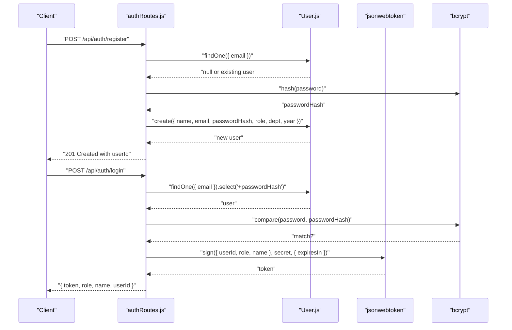
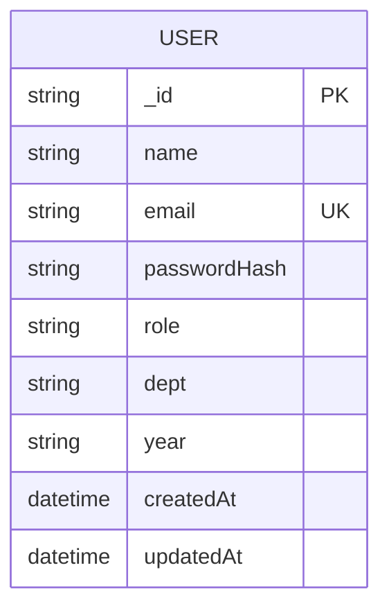
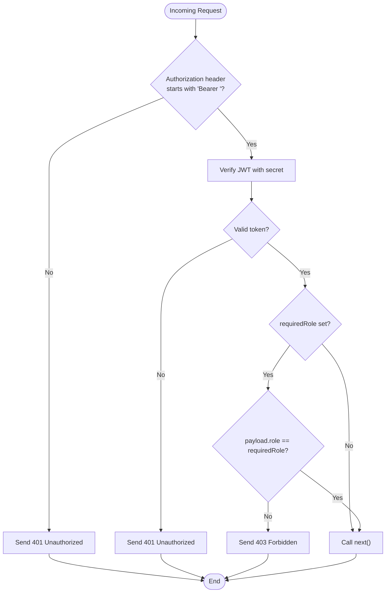
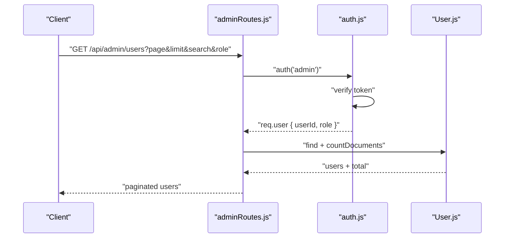
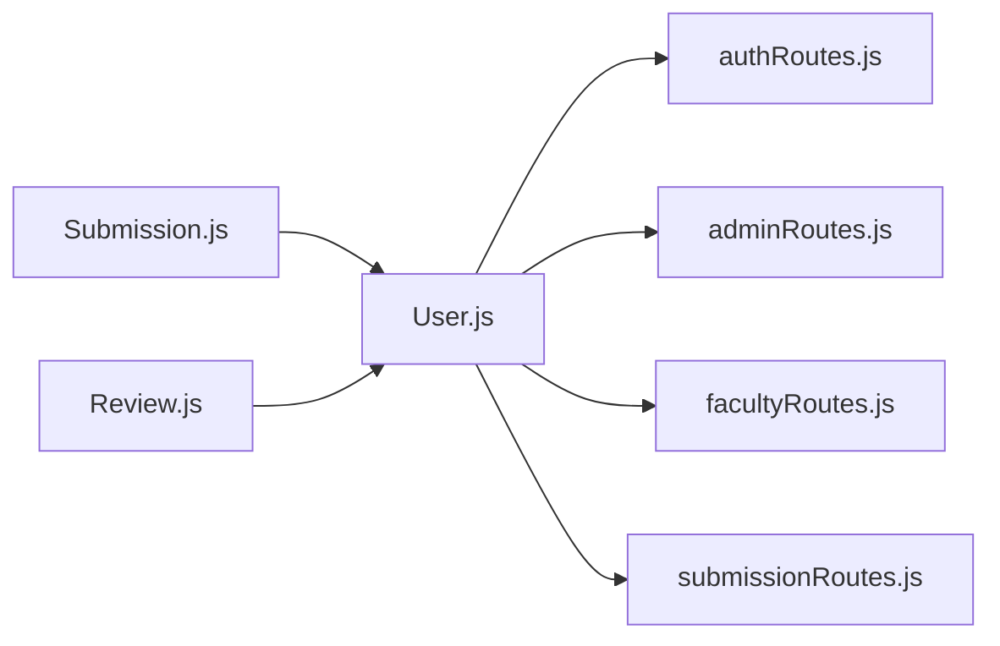

# User Model

<cite>
**Referenced Files in This Document**
- [User.js](file://models/User.js)
- [authRoutes.js](file://routes/authRoutes.js)
- [auth.js](file://middleware/auth.js)
- [validate.js](file://middleware/validate.js)
- [adminRoutes.js](file://routes/adminRoutes.js)
- [facultyRoutes.js](file://routes/facultyRoutes.js)
- [submissionRoutes.js](file://routes/submissionRoutes.js)
- [Submission.js](file://models/Submission.js)
- [Review.js](file://models/Review.js)
- [server.js](file://server.js)
- [ApiError.js](file://utils/ApiError.js)
</cite>

## Table of Contents
1. [Introduction](#introduction)
2. [Project Structure](#project-structure)
3. [Core Components](#core-components)
4. [Architecture Overview](#architecture-overview)
5. [Detailed Component Analysis](#detailed-component-analysis)
6. [Dependency Analysis](#dependency-analysis)
7. [Performance Considerations](#performance-considerations)
8. [Troubleshooting Guide](#troubleshooting-guide)
9. [Conclusion](#conclusion)

## Introduction
This document provides comprehensive data model documentation for the User model, focusing on schema definition, validation, role-based access control, and integration with authentication and authorization systems. It also covers indexing strategies for email lookups, performance considerations, and practical usage patterns derived from the repository’s implementation.

## Project Structure
The User model resides in the models directory and is integrated with route handlers under routes, middleware for authentication and validation, and supporting models for Submissions and Reviews. The server initializes middleware, routes, and database connectivity.

```mermaid
graph TB
subgraph "Models"
U["User.js"]
S["Submission.js"]
R["Review.js"]
end
subgraph "Routes"
AR["authRoutes.js"]
AdminR["adminRoutes.js"]
FacR["facultyRoutes.js"]
SubR["submissionRoutes.js"]
end
subgraph "Middleware"
AuthMW["auth.js"]
ValMW["validate.js"]
end
subgraph "Server"
Server["server.js"]
end
U --> AR
U --> AdminR
U --> FacR
U --> SubR
S --> AR
S --> AdminR
S --> FacR
S --> SubR
R --> AR
R --> AdminR
R --> FacR
AR --> AuthMW
AdminR --> AuthMW
FacR --> AuthMW
SubR --> AuthMW
AR --> ValMW
AdminR --> ValMW
FacR --> ValMW
SubR --> ValMW
Server --> AR
Server --> AdminR
Server --> FacR
Server --> SubR
```

**Diagram sources**
- [User.js](file://models/User.js#L1-L20)
- [Submission.js](file://models/Submission.js#L1-L30)
- [Review.js](file://models/Review.js#L1-L18)
- [authRoutes.js](file://routes/authRoutes.js#L1-L85)
- [adminRoutes.js](file://routes/adminRoutes.js#L1-L184)
- [facultyRoutes.js](file://routes/facultyRoutes.js#L1-L172)
- [submissionRoutes.js](file://routes/submissionRoutes.js#L1-L159)
- [auth.js](file://middleware/auth.js#L1-L25)
- [validate.js](file://middleware/validate.js#L1-L120)
- [server.js](file://server.js#L1-L92)

**Section sources**
- [server.js](file://server.js#L1-L92)
- [User.js](file://models/User.js#L1-L20)
- [authRoutes.js](file://routes/authRoutes.js#L1-L85)
- [adminRoutes.js](file://routes/adminRoutes.js#L1-L184)
- [facultyRoutes.js](file://routes/facultyRoutes.js#L1-L172)
- [submissionRoutes.js](file://routes/submissionRoutes.js#L1-L159)
- [auth.js](file://middleware/auth.js#L1-L25)
- [validate.js](file://middleware/validate.js#L1-L120)

## Core Components
- User Schema: Defines fields for name, email, passwordHash, role, dept, and year with required and optional constraints.
- Authentication and Authorization: JWT-based authentication with role gating via middleware.
- Validation: Express-validator rules for registration and login, including enum validation for role.
- Integrations: Routes for registration, login, and profile retrieval; admin and faculty routes leverage user data; submissions and reviews reference users.

Key schema highlights:
- Name: String, required.
- Email: String, required, unique, normalized to lowercase.
- Password hash: String, required.
- Role: Enum of ["student", "faculty", "admin"], required.
- Department: String, optional, defaults to empty string.
- Year: String, optional, defaults to empty string.
- Timestamps: Automatic createdAt and updatedAt fields.

**Section sources**
- [User.js](file://models/User.js#L3-L18)
- [authRoutes.js](file://routes/authRoutes.js#L9-L26)
- [validate.js](file://middleware/validate.js#L19-L44)
- [auth.js](file://middleware/auth.js#L3-L23)

## Architecture Overview
The User model participates in three primary flows:
- Registration: Validates input, checks uniqueness, hashes password, persists user, and responds with success metadata.
- Login: Finds user by email, compares hashed password, and issues JWT containing user identity and role.
- Authorization: Middleware verifies JWT and enforces role-based access control for protected routes.



**Diagram sources**
- [authRoutes.js](file://routes/authRoutes.js#L9-L55)
- [User.js](file://models/User.js#L1-L20)
- [auth.js](file://middleware/auth.js#L1-L25)

**Section sources**
- [authRoutes.js](file://routes/authRoutes.js#L9-L55)
- [User.js](file://models/User.js#L3-L18)
- [auth.js](file://middleware/auth.js#L3-L23)

## Detailed Component Analysis

### User Schema Definition
- Fields and types:
  - name: String
  - email: String (unique, required, normalized to lowercase)
  - passwordHash: String (required)
  - role: Enum ["student", "faculty", "admin"] (required)
  - dept: String (optional, default "")
  - year: String (optional, default "")
- Constraints:
  - Unique email enforced at schema level.
  - Enum validation for role.
  - Required fields for name, email, and passwordHash.
  - Optional fields with sensible defaults.



**Diagram sources**
- [User.js](file://models/User.js#L3-L18)

**Section sources**
- [User.js](file://models/User.js#L3-L18)

### Role-Based Access Control (RBAC)
- Middleware pattern:
  - Extracts Bearer token from Authorization header.
  - Verifies token using JWT secret.
  - Optionally enforces requiredRole equality.
  - Attaches user payload to request for downstream use.
- Route-level enforcement:
  - Admin-only routes call auth("admin").
  - Faculty-only routes call auth("faculty").
  - Student-only routes call auth("student").
- Token payload includes userId, role, and name for downstream decisions.



**Diagram sources**
- [auth.js](file://middleware/auth.js#L3-L23)

**Section sources**
- [auth.js](file://middleware/auth.js#L3-L23)
- [adminRoutes.js](file://routes/adminRoutes.js#L10-L18)
- [facultyRoutes.js](file://routes/facultyRoutes.js#L10-L42)
- [submissionRoutes.js](file://routes/submissionRoutes.js#L48-L83)

### Validation Rules and Constraints
- Registration validation ensures:
  - Name: trimmed, required, length bounds.
  - Email: trimmed, required, valid format, normalized.
  - Password: required, minimum length, mixed-case and digit requirements.
  - Role: optional but must be one of ["student", "faculty", "admin"] if provided.
  - Dept and Year: optional, trimmed, length bounds.
- Login validation ensures:
  - Email: trimmed, required, valid format.
  - Password: required.

These rules are enforced by the validate middleware, which aggregates errors and throws a 400 ApiError.

**Section sources**
- [validate.js](file://middleware/validate.js#L19-L53)
- [authRoutes.js](file://routes/authRoutes.js#L9-L26)

### Authentication and Authorization Integration
- Registration:
  - Checks email uniqueness.
  - Hashes password with bcrypt.
  - Creates user record.
- Login:
  - Retrieves user by email with password hash selected.
  - Compares password with bcrypt.
  - Issues JWT with userId, role, and name.
- Protected routes:
  - Admin routes: fetch faculty lists, manage users, view stats.
  - Faculty routes: manage assigned submissions, submit reviews, view stats.
  - Submission routes: student-only upload and view own submissions.



**Diagram sources**
- [adminRoutes.js](file://routes/adminRoutes.js#L21-L61)
- [auth.js](file://middleware/auth.js#L3-L23)
- [User.js](file://models/User.js#L1-L20)

**Section sources**
- [authRoutes.js](file://routes/authRoutes.js#L9-L55)
- [adminRoutes.js](file://routes/adminRoutes.js#L21-L61)
- [facultyRoutes.js](file://routes/facultyRoutes.js#L10-L42)
- [submissionRoutes.js](file://routes/submissionRoutes.js#L48-L121)

### Sample Data Structures
Representative user documents produced by the system:
- Minimal user after registration:
  - name, email, passwordHash, role, dept="", year="", timestamps
- Admin-issued user listing response:
  - Array of { name, email, role, dept, year, createdAt }
- Current user profile:
  - { id, name, email, role, dept, year }

These structures reflect the fields defined in the schema and the route responses.

**Section sources**
- [authRoutes.js](file://routes/authRoutes.js#L19-L25)
- [adminRoutes.js](file://routes/adminRoutes.js#L42-L59)
- [authRoutes.js](file://routes/authRoutes.js#L72-L82)

### Indexing Strategies for Email Queries
- Unique index: The schema defines email as unique, which implies a unique index on email. This optimizes equality lookups during login and registration checks.
- Compound indexes: For frequent searches combining role and email, consider a compound index on { role: 1, email: 1 } to speed up admin queries filtering by role and searching by email.
- Text/search indexes: If implementing free-text search across name and email, a text index on { name: "text", email: "text" } could improve admin search performance.

Note: The current implementation primarily uses equality and regex filters on email and name. Ensure indexes align with observed query patterns.

**Section sources**
- [User.js](file://models/User.js#L7-L7)
- [adminRoutes.js](file://routes/adminRoutes.js#L31-L38)

## Dependency Analysis
The User model is referenced by:
- Authentication routes for registration and login.
- Admin routes for user listings and stats.
- Faculty routes for assigned submissions and stats.
- Submission routes for student-only operations and permission checks.
- Submission and Review models via ObjectId references.



**Diagram sources**
- [User.js](file://models/User.js#L1-L20)
- [Submission.js](file://models/Submission.js#L1-L30)
- [Review.js](file://models/Review.js#L1-L18)
- [authRoutes.js](file://routes/authRoutes.js#L1-L85)
- [adminRoutes.js](file://routes/adminRoutes.js#L1-L184)
- [facultyRoutes.js](file://routes/facultyRoutes.js#L1-L172)
- [submissionRoutes.js](file://routes/submissionRoutes.js#L1-L159)

**Section sources**
- [User.js](file://models/User.js#L1-L20)
- [Submission.js](file://models/Submission.js#L5-L23)
- [Review.js](file://models/Review.js#L5-L13)
- [authRoutes.js](file://routes/authRoutes.js#L1-L85)
- [adminRoutes.js](file://routes/adminRoutes.js#L1-L184)
- [facultyRoutes.js](file://routes/facultyRoutes.js#L1-L172)
- [submissionRoutes.js](file://routes/submissionRoutes.js#L1-L159)

## Performance Considerations
- Email uniqueness: Enforced at schema level; ensure the unique index is present to avoid duplicate inserts and to accelerate login/email lookup.
- Password hashing: bcrypt cost is configured during registration; higher costs increase CPU usage but improve security.
- Token verification: JWT verification is O(1); keep secret secure and rotate periodically.
- Pagination: Admin and faculty routes implement pagination to reduce payload sizes and database load.
- Parallel counts: Admin routes use Promise.all for concurrent count and fetch operations to minimize latency.
- Regex searches: Admin search uses regex on name and email; consider adding a text index if search volume grows.

[No sources needed since this section provides general guidance]

## Troubleshooting Guide
- Registration fails with “Email already exists”:
  - Cause: Duplicate email detected by unique constraint.
  - Resolution: Use a different email address.
- Login fails with “Invalid credentials”:
  - Cause: User not found by email or password mismatch.
  - Resolution: Confirm email and password; ensure passwordHash is stored.
- “Token missing” or “Invalid token”:
  - Cause: Missing or invalid Bearer token.
  - Resolution: Include Authorization header with “Bearer <token>”; verify JWT secret.
- “Forbidden: Role mismatch”:
  - Cause: Token role does not match required role.
  - Resolution: Authenticate with appropriate credentials; ensure role is set during registration.
- “No token provided” on “/api/auth/me”:
  - Cause: Missing Bearer token.
  - Resolution: Attach Authorization header before calling the endpoint.
- “User not found” on “/api/auth/me”:
  - Cause: User ID in token not found in database.
  - Resolution: Recreate user or re-authenticate.

**Section sources**
- [authRoutes.js](file://routes/authRoutes.js#L12-L15)
- [authRoutes.js](file://routes/authRoutes.js#L32-L40)
- [authRoutes.js](file://routes/authRoutes.js#L58-L70)
- [auth.js](file://middleware/auth.js#L9-L21)
- [adminRoutes.js](file://routes/adminRoutes.js#L127-L130)

## Conclusion
The User model defines a concise yet robust schema with strong constraints and enum-based role control. Combined with JWT-based authentication and middleware-driven RBAC, it enables secure and efficient access control across admin, faculty, and student functionalities. Proper indexing on email and strategic use of pagination and parallel queries support scalable user lookups and administrative operations.