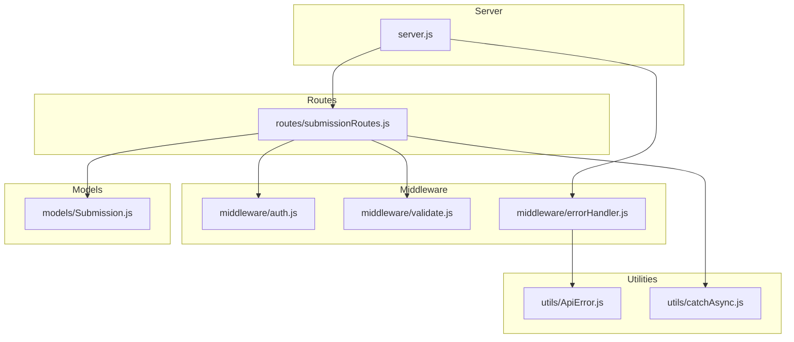
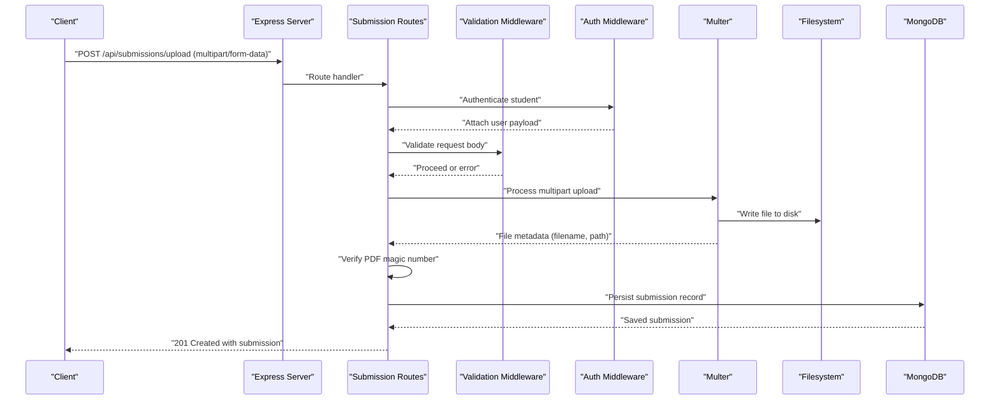
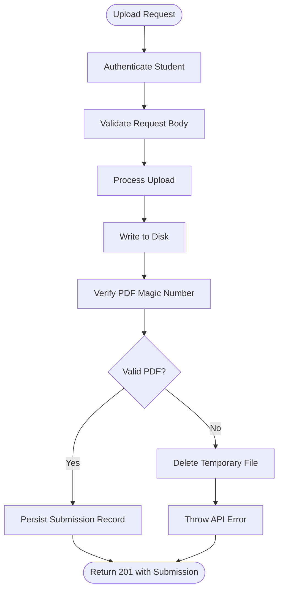
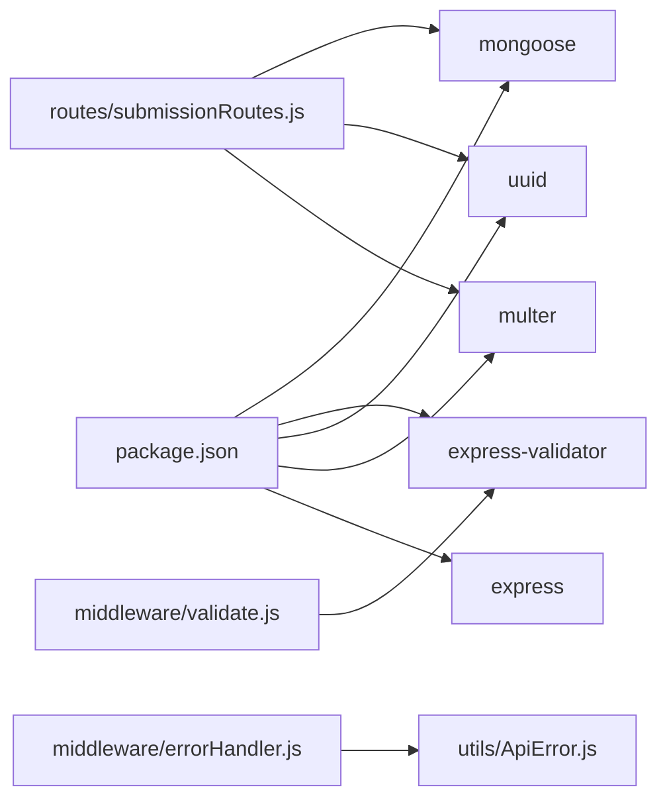
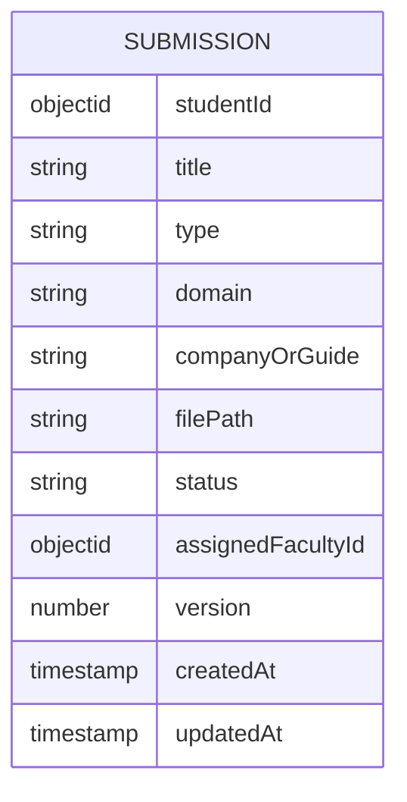

# File Upload & Management

<cite>
**Referenced Files in This Document**
- [server.js](file://server.js)
- [submissionRoutes.js](file://routes/submissionRoutes.js)
- [Submission.js](file://models/Submission.js)
- [validate.js](file://middleware/validate.js)
- [auth.js](file://middleware/auth.js)
- [errorHandler.js](file://middleware/errorHandler.js)
- [ApiError.js](file://utils/ApiError.js)
- [catchAsync.js](file://utils/catchAsync.js)
- [package.json](file://package.json)
</cite>

## Table of Contents
1. [Introduction](#introduction)
2. [Project Structure](#project-structure)
3. [Core Components](#core-components)
4. [Architecture Overview](#architecture-overview)
5. [Detailed Component Analysis](#detailed-component-analysis)
6. [Dependency Analysis](#dependency-analysis)
7. [Performance Considerations](#performance-considerations)
8. [Troubleshooting Guide](#troubleshooting-guide)
9. [Conclusion](#conclusion)
10. [Appendices](#appendices)

## Introduction
This document explains the PDF upload and file management system implemented in the backend. It covers Multer configuration for handling PDF uploads, storage settings, validation rules, the end-to-end upload workflow, security measures, integration with the submission workflow, and cleanup procedures. Practical examples and error handling strategies are included to help developers implement and troubleshoot the system effectively.

## Project Structure
The file upload system spans several modules:
- Express server initialization and middleware registration
- Route handlers for submission-related operations
- Validation middleware for request bodies and file metadata
- Authentication middleware for role-based access control
- Error handling middleware for consistent error responses
- Utility classes for structured error responses
- Mongoose model for storing submission records

**Diagram sources**
- [server.js](file://server.js#L1-L92)
- [submissionRoutes.js](file://routes/submissionRoutes.js#L1-L159)
- [auth.js](file://middleware/auth.js#L1-L25)
- [validate.js](file://middleware/validate.js#L1-L120)
- [errorHandler.js](file://middleware/errorHandler.js#L1-L53)
- [Submission.js](file://models/Submission.js#L1-L30)
- [ApiError.js](file://utils/ApiError.js#L1-L17)
- [catchAsync.js](file://utils/catchAsync.js#L1-L8)

**Section sources**
- [server.js](file://server.js#L1-L92)
- [submissionRoutes.js](file://routes/submissionRoutes.js#L1-L159)
- [validate.js](file://middleware/validate.js#L1-L120)
- [auth.js](file://middleware/auth.js#L1-L25)
- [errorHandler.js](file://middleware/errorHandler.js#L1-L53)
- [Submission.js](file://models/Submission.js#L1-L30)
- [ApiError.js](file://utils/ApiError.js#L1-L17)
- [catchAsync.js](file://utils/catchAsync.js#L1-L8)

## Core Components
- Multer configuration for PDF uploads:
  - Disk storage destination set to the uploads directory
  - Unique filename generation using UUID and original filename normalization
  - File filter restricts uploads to PDF MIME type
  - Size limit enforced at 10 MB
- PDF content validation:
  - Magic number check to verify actual file content starts with "%PDF"
- Submission persistence:
  - MongoDB model captures submission metadata and file path
- Request validation:
  - Express-validator rules for title, type, domain, and companyOrGuide
- Authentication and authorization:
  - JWT-based middleware with role-aware access control
- Error handling:
  - Centralized error handler with specific handling for Multer file size errors and structured API errors

**Section sources**
- [submissionRoutes.js](file://routes/submissionRoutes.js#L17-L45)
- [Submission.js](file://models/Submission.js#L1-L30)
- [validate.js](file://middleware/validate.js#L55-L72)
- [auth.js](file://middleware/auth.js#L1-L25)
- [errorHandler.js](file://middleware/errorHandler.js#L39-L43)
- [ApiError.js](file://utils/ApiError.js#L1-L17)

## Architecture Overview
The upload workflow integrates route handlers, middleware, storage, and persistence. The sequence below maps to actual code paths.

**Diagram sources**
- [server.js](file://server.js#L63-L66)
- [submissionRoutes.js](file://routes/submissionRoutes.js#L48-L83)
- [auth.js](file://middleware/auth.js#L1-L25)
- [validate.js](file://middleware/validate.js#L4-L16)
- [errorHandler.js](file://middleware/errorHandler.js#L39-L43)

## Detailed Component Analysis

### Multer Configuration and Storage Strategy
- Destination: Files are stored under the uploads directory, which is created automatically if it does not exist.
- Filename: Generated using a UUID combined with the original filename (spaces replaced with underscores) to ensure uniqueness and readability.
- File filter: Only PDF MIME type is accepted; otherwise, a structured API error is thrown.
- Size limit: Enforced at 10 MB; exceeded sizes trigger a specific Multer error handled centrally.
- Static serving: The uploads directory is served statically at "/uploads".

Security and integrity:
- Content validation: After writing to disk, the system reads the first bytes to confirm the file starts with the PDF magic number ("%PDF").
- Cleanup: On invalid PDF detection, the temporary file is removed immediately.

Practical example paths:
- Multer configuration and storage: [submissionRoutes.js](file://routes/submissionRoutes.js#L25-L45)
- Static serving of uploads: [server.js](file://server.js#L53-L54)

**Section sources**
- [submissionRoutes.js](file://routes/submissionRoutes.js#L14-L45)
- [server.js](file://server.js#L53-L54)

### File Upload Workflow
End-to-end flow:
1. Client sends a multipart form with a field named "report" containing the PDF.
2. Authentication middleware ensures the caller is a student.
3. Validation middleware checks required fields and formats.
4. Multer processes the upload, writes the file to disk, and populates req.file.
5. The system verifies the PDF magic number; if invalid, the file is deleted and an error is thrown.
6. A submission record is created in MongoDB with the file path and metadata.
7. The response returns the created submission.

Key implementation references:
- Route handler and validation chain: [submissionRoutes.js](file://routes/submissionRoutes.js#L48-L83)
- PDF magic number check: [submissionRoutes.js](file://routes/submissionRoutes.js#L17-L23)
- Submission creation: [submissionRoutes.js](file://routes/submissionRoutes.js#L67-L75)

**Diagram sources**
- [submissionRoutes.js](file://routes/submissionRoutes.js#L48-L83)
- [auth.js](file://middleware/auth.js#L1-L25)
- [validate.js](file://middleware/validate.js#L4-L16)

**Section sources**
- [submissionRoutes.js](file://routes/submissionRoutes.js#L48-L83)
- [auth.js](file://middleware/auth.js#L1-L25)
- [validate.js](file://middleware/validate.js#L4-L16)

### Validation Process
- Request body validation:
  - Title: required, trimmed, length bounds
  - Type: required, restricted to predefined values
  - Domain and Company/Guide: optional, trimmed, length bounds
- File validation:
  - MIME type must be application/pdf
  - File size must not exceed 10 MB
- PDF content validation:
  - Magic number check confirms actual PDF content

References:
- Upload validation rules: [validate.js](file://middleware/validate.js#L55-L72)
- Multer file filter and limits: [submissionRoutes.js](file://routes/submissionRoutes.js#L33-L45)
- PDF magic number check: [submissionRoutes.js](file://routes/submissionRoutes.js#L17-L23)

**Section sources**
- [validate.js](file://middleware/validate.js#L55-L72)
- [submissionRoutes.js](file://routes/submissionRoutes.js#L33-L45)
- [submissionRoutes.js](file://routes/submissionRoutes.js#L17-L23)

### Security Considerations
- Helmet protection: Basic security headers configured at server startup.
- Rate limiting: General and stricter limits for authentication endpoints.
- CORS configuration: Controlled origin and credentials support.
- Mongo sanitize: Protection against NoSQL injection.
- JWT-based authentication: Token verification and role enforcement.
- File type and size restrictions: Prevents malicious or oversized uploads.
- PDF content verification: Confirms file integrity beyond MIME type.

References:
- Security middleware and rate limiting: [server.js](file://server.js#L18-L51)
- Auth middleware: [auth.js](file://middleware/auth.js#L1-L25)
- PDF magic number check: [submissionRoutes.js](file://routes/submissionRoutes.js#L17-L23)

**Section sources**
- [server.js](file://server.js#L18-L51)
- [auth.js](file://middleware/auth.js#L1-L25)
- [submissionRoutes.js](file://routes/submissionRoutes.js#L17-L23)

### Integration with Submission Workflow
- Submission model stores:
  - Student identifier, title, type, optional domain/company/guide
  - File path for static serving
  - Status lifecycle and optional faculty assignment
- Upload endpoint creates a submission with status "Submitted".
- Additional routes support listing, viewing, and permission checks for submissions.

References:
- Submission model: [Submission.js](file://models/Submission.js#L1-L30)
- Upload endpoint and submission creation: [submissionRoutes.js](file://routes/submissionRoutes.js#L48-L83)

**Section sources**
- [Submission.js](file://models/Submission.js#L1-L30)
- [submissionRoutes.js](file://routes/submissionRoutes.js#L48-L83)

### Error Handling and Cleanup Procedures
- Centralized error handler:
  - Converts various errors to structured API responses
  - Handles Multer file size limit errors specifically
  - Logs errors for diagnostics
- API error class:
  - Standardized error shape with status codes and operational flags
- Async wrapper:
  - Ensures async route handlers propagate errors to the centralized handler

References:
- Error handler: [errorHandler.js](file://middleware/errorHandler.js#L1-L53)
- API error class: [ApiError.js](file://utils/ApiError.js#L1-L17)
- Async wrapper: [catchAsync.js](file://utils/catchAsync.js#L1-L8)

Cleanup procedures:
- On invalid PDF content, the temporary file is deleted before throwing an error.

References:
- Cleanup on invalid PDF: [submissionRoutes.js](file://routes/submissionRoutes.js#L58-L62)

**Section sources**
- [errorHandler.js](file://middleware/errorHandler.js#L1-L53)
- [ApiError.js](file://utils/ApiError.js#L1-L17)
- [catchAsync.js](file://utils/catchAsync.js#L1-L8)
- [submissionRoutes.js](file://routes/submissionRoutes.js#L58-L62)

## Dependency Analysis
External dependencies relevant to file uploads:
- Express: Web framework and static serving
- Multer: File upload handling
- UUID: Unique filename generation
- Express-validator: Request validation
- Mongoose: Persistence of submission records

References:
- Dependencies: [package.json](file://package.json#L10-L22)

**Diagram sources**
- [package.json](file://package.json#L10-L22)
- [submissionRoutes.js](file://routes/submissionRoutes.js#L1-L159)
- [validate.js](file://middleware/validate.js#L1-L120)
- [errorHandler.js](file://middleware/errorHandler.js#L1-L53)
- [ApiError.js](file://utils/ApiError.js#L1-L17)

**Section sources**
- [package.json](file://package.json#L10-L22)

## Performance Considerations
- File size limit: 10 MB prevents excessive memory usage during upload processing.
- Single-file uploads: Using upload.single optimizes for one PDF per request.
- Asynchronous validation and persistence: Reduces blocking operations.
- Static serving: Efficient delivery of uploaded PDFs via Express static middleware.

[No sources needed since this section provides general guidance]

## Troubleshooting Guide
Common issues and resolutions:
- File too large:
  - Symptom: Multer LIMIT_FILE_SIZE error
  - Resolution: Reduce file size below 10 MB
  - Reference: [errorHandler.js](file://middleware/errorHandler.js#L39-L43)
- Invalid PDF content:
  - Symptom: Error indicating invalid PDF
  - Resolution: Ensure the file is a genuine PDF; magic number check fails otherwise
  - Reference: [submissionRoutes.js](file://routes/submissionRoutes.js#L17-L23)
- Missing or incorrect MIME type:
  - Symptom: API error for unsupported file type
  - Resolution: Send a PDF with application/pdf MIME type
  - Reference: [submissionRoutes.js](file://routes/submissionRoutes.js#L33-L39)
- Missing required fields:
  - Symptom: Validation errors for title/type
  - Resolution: Provide title and type within allowed constraints
  - Reference: [validate.js](file://middleware/validate.js#L55-L72)
- Authentication failures:
  - Symptom: 401 errors for missing or invalid tokens
  - Resolution: Include a valid Bearer token
  - Reference: [auth.js](file://middleware/auth.js#L1-L25)

**Section sources**
- [errorHandler.js](file://middleware/errorHandler.js#L39-L43)
- [submissionRoutes.js](file://routes/submissionRoutes.js#L17-L39)
- [validate.js](file://middleware/validate.js#L55-L72)
- [auth.js](file://middleware/auth.js#L1-L25)

## Conclusion
The file upload system combines robust validation, secure storage, and clear error handling. Multer manages uploads with strict type and size constraints, while additional checks ensure file integrity. Submissions are persisted with clear metadata and integrated into the broader submission workflow. The centralized error handling and security middleware provide a reliable foundation for production use.

[No sources needed since this section summarizes without analyzing specific files]

## Appendices

### Practical Implementation Examples
- Uploading a PDF:
  - Endpoint: POST /api/submissions/upload
  - Field name: report
  - Headers: Authorization: Bearer <token>, Content-Type: multipart/form-data
  - References:
    - [submissionRoutes.js](file://routes/submissionRoutes.js#L48-L83)
    - [auth.js](file://middleware/auth.js#L1-L25)
    - [validate.js](file://middleware/validate.js#L55-L72)

- Accessing uploaded PDFs:
  - URL pattern: /uploads/<filename>
  - Static serving configured at server startup
  - References:
    - [server.js](file://server.js#L53-L54)
    - [submissionRoutes.js](file://routes/submissionRoutes.js#L64-L75)

### Data Model Overview

**Diagram sources**
- [Submission.js](file://models/Submission.js#L1-L30)