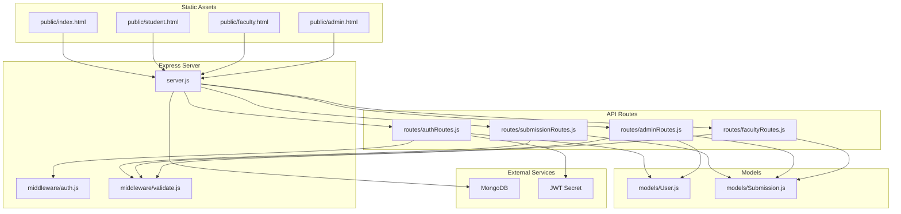
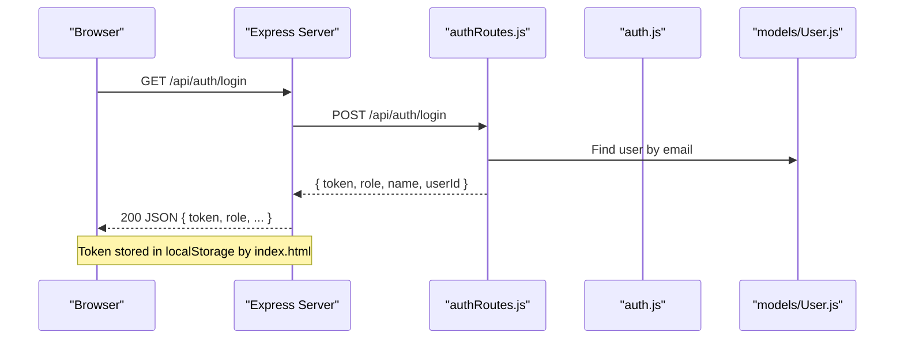
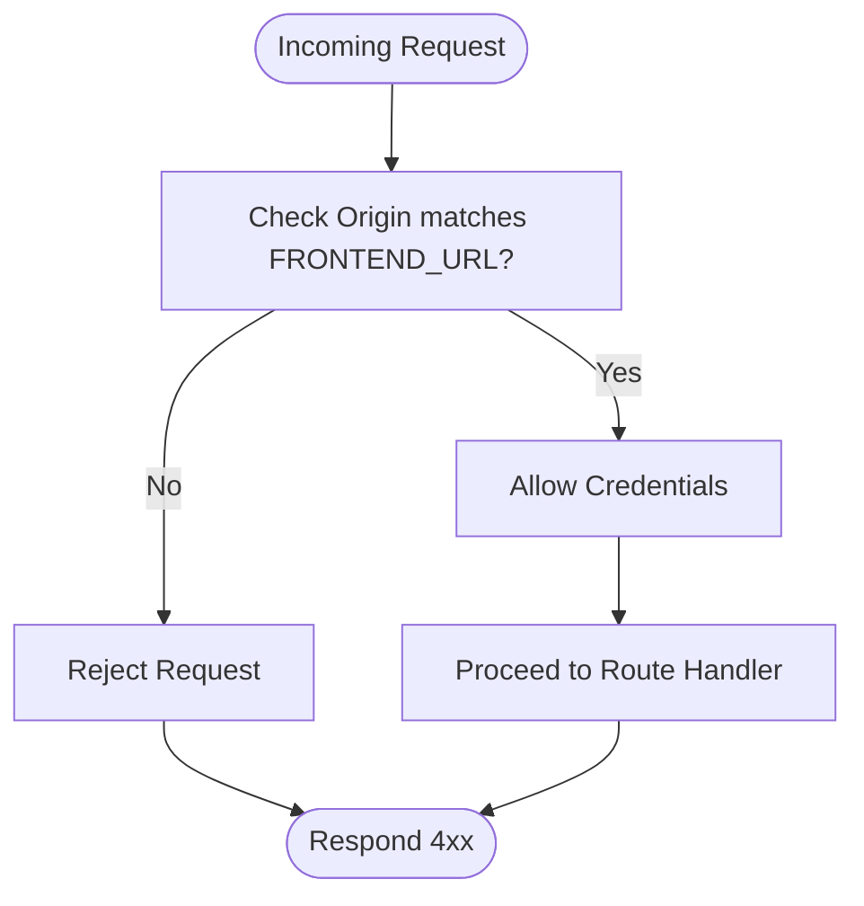
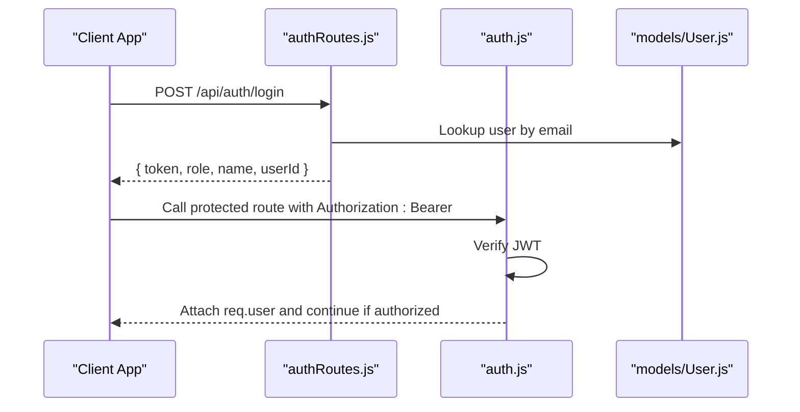
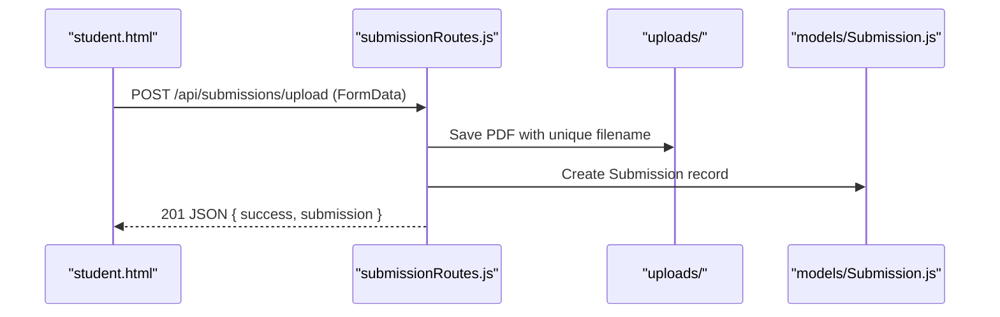
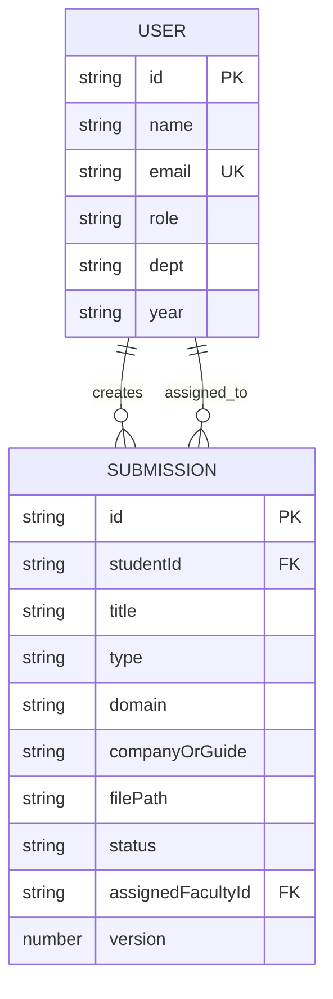
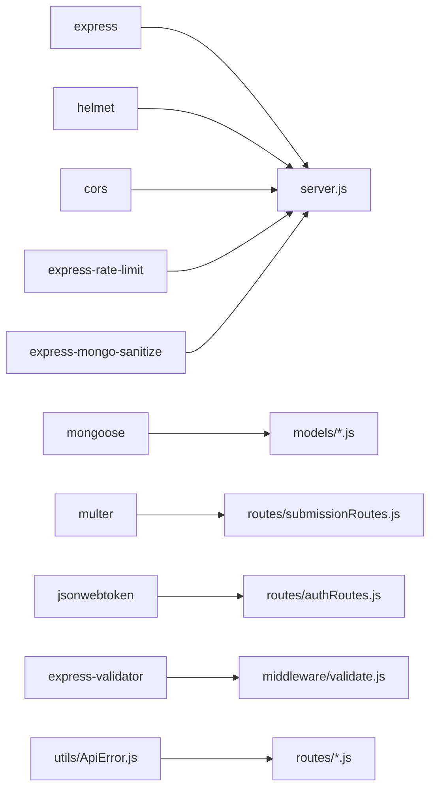

# Frontend Integration

<cite>
**Referenced Files in This Document**
- [server.js](file://server.js)
- [auth.js](file://middleware/auth.js)
- [validate.js](file://middleware/validate.js)
- [authRoutes.js](file://routes/authRoutes.js)
- [submissionRoutes.js](file://routes/submissionRoutes.js)
- [adminRoutes.js](file://routes/adminRoutes.js)
- [facultyRoutes.js](file://routes/facultyRoutes.js)
- [index.html](file://public/index.html)
- [student.html](file://public/student.html)
- [faculty.html](file://public/faculty.html)
- [admin.html](file://public/admin.html)
- [User.js](file://models/User.js)
- [Submission.js](file://models/Submission.js)
- [ApiError.js](file://utils/ApiError.js)
- [package.json](file://package.json)
</cite>

## Table of Contents
1. [Introduction](#introduction)
2. [Project Structure](#project-structure)
3. [Core Components](#core-components)
4. [Architecture Overview](#architecture-overview)
5. [Detailed Component Analysis](#detailed-component-analysis)
6. [Dependency Analysis](#dependency-analysis)
7. [Performance Considerations](#performance-considerations)
8. [Troubleshooting Guide](#troubleshooting-guide)
9. [Conclusion](#conclusion)
10. [Appendices](#appendices)

## Introduction
This document explains how the backend serves legacy HTML pages for admin, faculty, and student roles and integrates with frontend templates via REST APIs. It covers static file serving, CORS configuration, authentication token handling, API integration patterns, and practical examples of frontend–backend communication. It also outlines the current state of frontend integration and potential migration paths to modern frontend frameworks.

## Project Structure
The backend exposes:
- Static HTML pages under the public directory for legacy UIs
- A React frontend build served from a sibling dist folder
- REST endpoints under /api/* for authentication, submissions, admin, and faculty dashboards

**Diagram sources**
- [server.js](file://server.js#L1-L92)
- [auth.js](file://middleware/auth.js#L1-L25)
- [validate.js](file://middleware/validate.js#L1-L120)
- [authRoutes.js](file://routes/authRoutes.js#L1-L85)
- [submissionRoutes.js](file://routes/submissionRoutes.js#L1-L159)
- [adminRoutes.js](file://routes/adminRoutes.js#L1-L184)
- [facultyRoutes.js](file://routes/facultyRoutes.js#L1-L172)
- [User.js](file://models/User.js#L1-L20)
- [Submission.js](file://models/Submission.js#L1-L30)

**Section sources**
- [server.js](file://server.js#L1-L92)
- [package.json](file://package.json#L1-L28)

## Core Components
- Static file serving
  - Legacy HTML pages: served from the public directory
  - React build: served from a sibling dist folder
  - PDF uploads: served from the uploads directory
- CORS configuration: allows credentials and restricts origins via environment variable
- Authentication middleware: validates JWT Bearer tokens and enforces role-based access
- Validation middleware: applies express-validator rules and converts failures into structured errors
- API routes: expose endpoints for auth, submissions, admin, and faculty dashboards

**Section sources**
- [server.js](file://server.js#L40-L61)
- [auth.js](file://middleware/auth.js#L1-L25)
- [validate.js](file://middleware/validate.js#L1-L120)
- [authRoutes.js](file://routes/authRoutes.js#L1-L85)
- [submissionRoutes.js](file://routes/submissionRoutes.js#L1-L159)
- [adminRoutes.js](file://routes/adminRoutes.js#L1-L184)
- [facultyRoutes.js](file://routes/facultyRoutes.js#L1-L172)

## Architecture Overview
The backend acts as both a static file server for legacy pages and a REST API server for frontend integration. Requests to non-API routes are served by the React SPA; API routes handle authentication, file uploads, and role-specific dashboards.

**Diagram sources**
- [server.js](file://server.js#L62-L66)
- [authRoutes.js](file://routes/authRoutes.js#L28-L55)
- [auth.js](file://middleware/auth.js#L1-L25)
- [User.js](file://models/User.js#L1-L20)
- [index.html](file://public/index.html#L35-L67)

## Detailed Component Analysis

### Static File Serving and Legacy HTML Pages
- Legacy HTML pages are served directly from the public directory:
  - Admin page: [admin.html](file://public/admin.html#L1-L189)
  - Faculty page: [faculty.html](file://public/faculty.html#L1-L170)
  - Student page: [student.html](file://public/student.html#L1-L180)
  - Login/register landing: [index.html](file://public/index.html#L1-L68)
- The server serves these pages via static middleware configured to the public directory.
- The server also serves the React build from a sibling dist folder and exposes a fallback to serve index.html for non-API routes.

Practical example: The admin page authenticates by checking a stored token and role, then calls admin endpoints to list users and submissions and assigns faculty to submissions.

**Section sources**
- [server.js](file://server.js#L56-L79)
- [admin.html](file://public/admin.html#L86-L186)
- [faculty.html](file://public/faculty.html#L84-L167)
- [student.html](file://public/student.html#L87-L177)
- [index.html](file://public/index.html#L35-L67)

### CORS Configuration and Cross-Origin Resource Sharing
- The server enables CORS with credentials support and sets the origin from an environment variable.
- This allows the frontend (running on a dev server) to send authenticated requests with cookies/tokens.

**Diagram sources**
- [server.js](file://server.js#L40-L44)

**Section sources**
- [server.js](file://server.js#L40-L44)

### Authentication Token Handling
- Login endpoint returns a signed JWT and user metadata; the client stores token, role, and name in localStorage.
- Protected routes use middleware to verify the Bearer token and enforce role checks.
- The auth middleware decodes the token and attaches user info to the request object.

**Diagram sources**
- [authRoutes.js](file://routes/authRoutes.js#L28-L55)
- [auth.js](file://middleware/auth.js#L1-L25)
- [User.js](file://models/User.js#L1-L20)

**Section sources**
- [authRoutes.js](file://routes/authRoutes.js#L28-L55)
- [auth.js](file://middleware/auth.js#L1-L25)
- [index.html](file://public/index.html#L35-L67)

### API Integration Patterns
- Fetch-based communication:
  - Login: [index.html](file://public/index.html#L38-L64)
  - Student upload: [student.html](file://public/student.html#L103-L135)
  - Faculty review: [faculty.html](file://public/faculty.html#L135-L164)
  - Admin actions: [admin.html](file://public/admin.html#L155-L182)
- Headers:
  - Authorization: Bearer <token> for protected endpoints
  - Content-Type: application/json for JSON bodies
  - FormData for multipart uploads (PDF)
- Error handling:
  - Non-OK responses display user-friendly messages
  - Backend validation errors are returned as structured messages

**Section sources**
- [index.html](file://public/index.html#L35-L67)
- [student.html](file://public/student.html#L103-L135)
- [faculty.html](file://public/faculty.html#L135-L164)
- [admin.html](file://public/admin.html#L155-L182)

### Form Submission Patterns
- Student upload uses FormData to send a PDF and metadata to the submissions upload endpoint.
- Faculty review posts evaluation fields to the faculty review endpoint.
- Admin assignment posts submission and faculty IDs to the admin assign endpoint.

**Diagram sources**
- [student.html](file://public/student.html#L103-L135)
- [submissionRoutes.js](file://routes/submissionRoutes.js#L47-L83)
- [Submission.js](file://models/Submission.js#L1-L30)

**Section sources**
- [student.html](file://public/student.html#L103-L135)
- [submissionRoutes.js](file://routes/submissionRoutes.js#L47-L83)

### Role-Based Access Control
- Middleware enforces role-based protection:
  - Admin-only routes: [adminRoutes.js](file://routes/adminRoutes.js#L10-L18)
  - Faculty-only routes: [facultyRoutes.js](file://routes/facultyRoutes.js#L9-L42)
  - Student-only routes: [submissionRoutes.js](file://routes/submissionRoutes.js#L47-L83)
- The auth middleware verifies token and optional role requirement.

**Section sources**
- [auth.js](file://middleware/auth.js#L3-L23)
- [adminRoutes.js](file://routes/adminRoutes.js#L10-L18)
- [facultyRoutes.js](file://routes/facultyRoutes.js#L9-L42)
- [submissionRoutes.js](file://routes/submissionRoutes.js#L47-L83)

### Data Models and Relationships

**Diagram sources**
- [User.js](file://models/User.js#L1-L20)
- [Submission.js](file://models/Submission.js#L1-L30)

**Section sources**
- [User.js](file://models/User.js#L1-L20)
- [Submission.js](file://models/Submission.js#L1-L30)

### API Endpoints Overview
- Authentication
  - POST /api/auth/register
  - POST /api/auth/login
  - GET /api/auth/me
- Submissions
  - POST /api/submissions/upload
  - GET /api/submissions/mine
  - GET /api/submissions/:id
- Admin
  - GET /api/admin/users
  - GET /api/admin/submissions
  - POST /api/admin/assign
  - GET /api/admin/stats
- Faculty
  - GET /api/faculty/assigned
  - GET /api/faculty/reviews
  - POST /api/faculty/review
  - GET /api/faculty/stats

**Section sources**
- [authRoutes.js](file://routes/authRoutes.js#L8-L85)
- [submissionRoutes.js](file://routes/submissionRoutes.js#L47-L159)
- [adminRoutes.js](file://routes/adminRoutes.js#L9-L184)
- [facultyRoutes.js](file://routes/facultyRoutes.js#L9-L172)

## Dependency Analysis
- External libraries:
  - Express for routing and middleware
  - Helmet for security headers
  - CORS for cross-origin access
  - Rate limiting for API endpoints
  - MongoDB/Mongoose for persistence
  - Multer for PDF uploads
  - JWT for authentication
  - express-validator for validation
- Internal dependencies:
  - Routes depend on auth middleware and validation helpers
  - Routes depend on models for database operations
  - Error handling uses a custom ApiError class

**Diagram sources**
- [server.js](file://server.js#L1-L92)
- [package.json](file://package.json#L10-L26)
- [authRoutes.js](file://routes/authRoutes.js#L1-L85)
- [submissionRoutes.js](file://routes/submissionRoutes.js#L1-L159)
- [validate.js](file://middleware/validate.js#L1-L120)
- [ApiError.js](file://utils/ApiError.js#L1-L17)

**Section sources**
- [package.json](file://package.json#L10-L26)
- [server.js](file://server.js#L1-L92)

## Performance Considerations
- Rate limiting:
  - General API requests limited per IP
  - Specific auth endpoints have stricter limits
- Body parsing limits:
  - JSON and URL-encoded payloads constrained to prevent abuse
- Data sanitization:
  - NoSQL injection protection enabled
- Pagination:
  - Admin and faculty endpoints support pagination to reduce payload sizes
- File uploads:
  - PDF validation and size limits applied

Recommendations:
- Consider moving to a CDN for static assets and PDFs
- Add caching headers for static HTML and images
- Monitor API response sizes and consider compression

**Section sources**
- [server.js](file://server.js#L23-L51)
- [submissionRoutes.js](file://routes/submissionRoutes.js#L41-L45)
- [adminRoutes.js](file://routes/adminRoutes.js#L21-L61)
- [facultyRoutes.js](file://routes/facultyRoutes.js#L9-L42)

## Troubleshooting Guide
Common issues and resolutions:
- CORS errors:
  - Ensure FRONTEND_URL matches the origin of the client
  - Confirm credentials are enabled and cookies are allowed
- 401 Unauthorized:
  - Verify token presence and validity
  - Confirm the Authorization header format: Bearer <token>
- 403 Forbidden:
  - Check role requirements for protected routes
- Upload failures:
  - Confirm file type is PDF and below size limits
  - Ensure FormData is used for multipart uploads
- 404 Not Found:
  - For non-API routes, confirm React SPA fallback is configured

**Section sources**
- [server.js](file://server.js#L40-L44)
- [auth.js](file://middleware/auth.js#L3-L23)
- [submissionRoutes.js](file://routes/submissionRoutes.js#L33-L45)
- [validate.js](file://middleware/validate.js#L1-L16)

## Conclusion
The backend currently supports a hybrid model: legacy static HTML pages for admin, faculty, and student dashboards, plus a modern React SPA served from a sibling dist folder. Authentication relies on JWT tokens stored in localStorage, and CORS is configured to support credential-based access. The API follows REST patterns with role-based access control and validation. For future modernization, migrating the legacy pages to the React SPA and consolidating authentication and routing into a single frontend monorepo would streamline development and deployment.

## Appendices

### Practical Examples Index
- Login and redirect: [index.html](file://public/index.html#L35-L67)
- Student upload (FormData): [student.html](file://public/student.html#L103-L135)
- Faculty review submission: [faculty.html](file://public/faculty.html#L135-L164)
- Admin assignment: [admin.html](file://public/admin.html#L155-L182)

### Migration Paths to Modern Frontend Frameworks
- Move legacy HTML pages into the React app’s src directory
- Replace inline fetch calls with a shared API client
- Centralize authentication state and token management
- Use routing libraries to manage navigation and nested dashboards
- Extract reusable components for forms, modals, and tables
- Integrate testing frameworks for UI components and API flows

[No sources needed since this section provides general guidance]