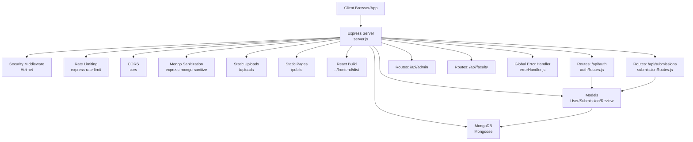

# Getting Started

<cite>
**Referenced Files in This Document**
- [package.json](file://package.json)
- [.env](file://.env)
- [server.js](file://server.js)
- [middleware/auth.js](file://middleware/auth.js)
- [middleware/errorHandler.js](file://middleware/errorHandler.js)
- [middleware/validate.js](file://middleware/validate.js)
- [routes/authRoutes.js](file://routes/authRoutes.js)
- [routes/submissionRoutes.js](file://routes/submissionRoutes.js)
- [utils/catchAsync.js](file://utils/catchAsync.js)
- [utils/ApiError.js](file://utils/ApiError.js)
- [models/User.js](file://models/User.js)
- [models/Submission.js](file://models/Submission.js)
- [models/Review.js](file://models/Review.js)
</cite>

## Table of Contents
1. [Introduction](#introduction)
2. [Prerequisites](#prerequisites)
3. [Installation](#installation)
4. [Environment Configuration](#environment-configuration)
5. [Local Database Setup](#local-database-setup)
6. [Starting the Server](#starting-the-server)
7. [Development Workflow with Nodemon](#development-workflow-with-nodemon)
8. [Verification](#verification)
9. [Common Setup Issues and Solutions](#common-setup-issues-and-solutions)
10. [Architecture Overview](#architecture-overview)
11. [Troubleshooting Guide](#troubleshooting-guide)
12. [Conclusion](#conclusion)

## Introduction
This guide helps you set up and run the Academic Submission Portal backend locally. It covers prerequisites, installation, environment configuration, database setup, server startup, development workflow with hot reloading, verification steps, and troubleshooting. The backend is built with Node.js, Express, and MongoDB/Mongoose, and includes security middleware, validation, error handling, and role-based access control.

## Prerequisites
- Node.js (version compatible with the project dependencies)
- npm (comes with Node.js)
- MongoDB installed and running locally or a remote MongoDB URI
- A modern browser for testing API endpoints and verifying the server health route

**Section sources**
- [package.json](file://package.json#L10-L26)

## Installation
Follow these steps to install the project dependencies:

1. Open a terminal in the project root directory.
2. Install dependencies using npm:
   ```
   npm install
   ```

This command reads the dependencies and devDependencies from the package manifest and installs them locally.

**Section sources**
- [package.json](file://package.json#L10-L26)

## Environment Configuration
Create a `.env` file in the project root with the following keys and values:

- PORT: The port your server listens on (default: 5000)
- MONGO_URI: MongoDB connection string (default: mongodb://127.0.0.1:27017/submission_portal)
- JWT_SECRET: Secret key for signing JSON Web Tokens (change this in production)
- FRONTEND_URL: Origin of your frontend application (default: http://localhost:5173)

Example values are provided in the repository’s .env file. Adjust them according to your local MongoDB setup and frontend URL.

**Section sources**
- [.env](file://.env#L1-L4)

## Local Database Setup
The server connects to MongoDB using the URI configured in the environment. Ensure MongoDB is running and accessible at the configured address. The server attempts to connect during startup and logs success or error messages.

Key points:
- The connection string is loaded from the environment variable.
- On successful connection, the server starts listening on the configured port.
- On failure, the server logs the MongoDB error message.

**Section sources**
- [server.js](file://server.js#L84-L92)

## Starting the Server
There are two primary scripts defined in the package manifest:

- Production start:
  ```
  npm start
  ```
  This runs the server using Node.js directly.

- Development start with hot reloading:
  ```
  npm run dev
  ```
  This runs the server using nodemon, which automatically restarts the server when file changes are detected.

Both scripts rely on the environment configuration described above.

**Section sources**
- [package.json](file://package.json#L6-L8)
- [server.js](file://server.js#L84-L92)

## Development Workflow with Nodemon
Nodemon is included as a dev dependency. To enable hot reloading:

1. Ensure dependencies are installed.
2. Run the development script:
   ```
   npm run dev
   ```
3. Nodemon watches for file changes in the project directory and restarts the server automatically.

Benefits:
- Faster iteration during development.
- Immediate feedback when changing server logic, middleware, routes, or models.

**Section sources**
- [package.json](file://package.json#L24-L26)
- [server.js](file://server.js#L84-L92)

## Verification
After starting the server, verify it is running correctly:

1. Health endpoint:
   - Send a GET request to http://localhost:PORT/health
   - Expect a JSON response indicating the server is running.

2. CORS and static assets:
   - The server serves static HTML pages from the public directory and uploaded PDFs from the uploads directory.
   - Ensure the uploads directory exists and is writable.

3. MongoDB connectivity:
   - Check the console logs for “MongoDB Connected” on successful connection.
   - On connection failure, the console will log a MongoDB error message.

4. Frontend integration:
   - The server serves the React frontend build from a sibling directory named frontend/dist.
   - Ensure the frontend build exists at ../frontend/dist if you plan to test the full stack.

**Section sources**
- [server.js](file://server.js#L68-L70)
- [server.js](file://server.js#L53-L60)
- [server.js](file://server.js#L84-L92)

## Common Setup Issues and Solutions
Below are typical problems and their resolutions:

- Port already in use:
  - Change the PORT value in the .env file to an available port.
  - Restart the server after updating the environment variable.

- MongoDB connection failures:
  - Verify the MONGO_URI in .env points to a reachable MongoDB instance.
  - Ensure MongoDB is running locally or the remote service is accessible.
  - Confirm network/firewall settings allow connections to the MongoDB host/port.

- JWT secret not configured:
  - Ensure JWT_SECRET is present in .env.
  - Use a strong, random secret in production and keep it secure.

- CORS errors:
  - Confirm FRONTEND_URL matches the origin of your frontend application.
  - The server allows credentials and restricts origins accordingly.

- Static asset serving issues:
  - Ensure the uploads directory exists and is writable.
  - Verify the public directory contains the necessary HTML files for backward compatibility.

- Rate limiting:
  - Authentication endpoints have stricter rate limits than general API routes.
  - Excessive requests may trigger rate limit responses.

- Validation errors:
  - The validation middleware enforces strict rules for registration, login, submission uploads, and pagination.
  - Fix input fields according to validation messages returned by the API.

- Error handling:
  - The global error handler converts various database and runtime errors into structured API responses.
  - In development mode, stack traces may be included in error responses for debugging.

**Section sources**
- [.env](file://.env#L1-L4)
- [server.js](file://server.js#L40-L44)
- [server.js](file://server.js#L23-L38)
- [middleware/validate.js](file://middleware/validate.js#L4-L16)
- [middleware/errorHandler.js](file://middleware/errorHandler.js#L3-L50)

## Architecture Overview
The backend follows a layered architecture with clear separation of concerns:

- Entry point: server.js initializes Express, applies security and middleware, mounts routes, and connects to MongoDB.
- Middleware: security (Helmet), rate limiting, CORS, data sanitization, authentication guard, and error handling.
- Routes: modular route handlers for authentication, submissions, admin, and faculty operations.
- Models: Mongoose models for User, Submission, and Review with defined schemas and relationships.
- Utilities: error wrapper (catchAsync) and custom error class (ApiError) for consistent error handling.



**Diagram sources**
- [server.js](file://server.js#L1-L92)
- [routes/authRoutes.js](file://routes/authRoutes.js#L1-L85)
- [routes/submissionRoutes.js](file://routes/submissionRoutes.js#L1-L159)
- [middleware/errorHandler.js](file://middleware/errorHandler.js#L1-L53)
- [models/User.js](file://models/User.js#L1-L20)
- [models/Submission.js](file://models/Submission.js#L1-L30)
- [models/Review.js](file://models/Review.js#L1-L18)

## Troubleshooting Guide
- Health check:
  - Use the /health endpoint to confirm the server is responsive.
- Logs:
  - Monitor console output for MongoDB connection status and server startup messages.
- Authentication:
  - Ensure JWT_SECRET is set and consistent across environments.
  - Verify tokens are sent with Authorization headers prefixed with "Bearer ".
- Validation:
  - Review validation messages returned by the API for incorrect field values or missing required fields.
- Rate limiting:
  - If receiving rate limit errors, reduce request frequency or adjust limits in development.
- Static assets:
  - Confirm uploads directory exists and is writable; otherwise, file uploads may fail.
- CORS:
  - Align FRONTEND_URL with your frontend origin to avoid cross-origin issues.

**Section sources**
- [server.js](file://server.js#L68-L70)
- [middleware/auth.js](file://middleware/auth.js#L1-L25)
- [middleware/validate.js](file://middleware/validate.js#L4-L16)
- [middleware/errorHandler.js](file://middleware/errorHandler.js#L3-L50)

## Conclusion
You now have the fundamentals to set up, run, and iterate on the Academic Submission Portal backend. Use the provided scripts for development, configure environment variables appropriately, ensure MongoDB is accessible, and leverage the built-in middleware and error handling for a robust development experience. For production, update secrets, configure HTTPS, and harden security settings as needed.