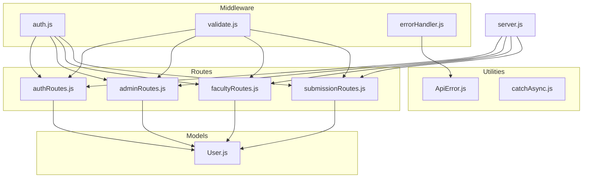
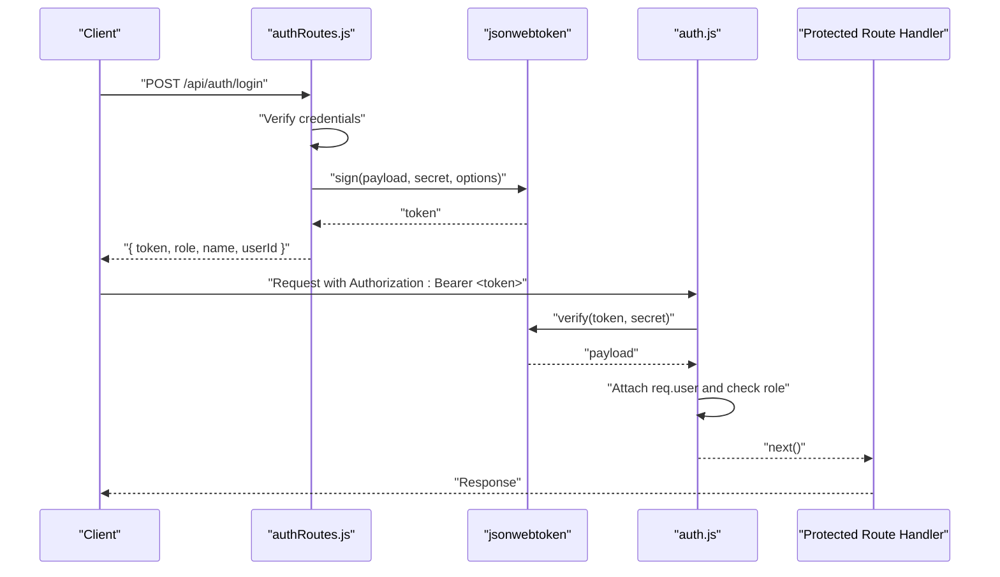
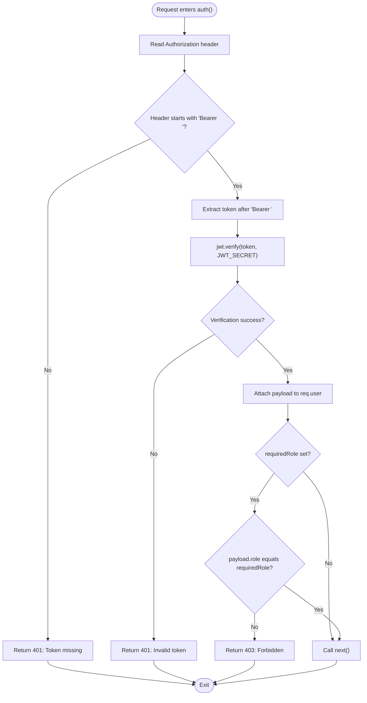
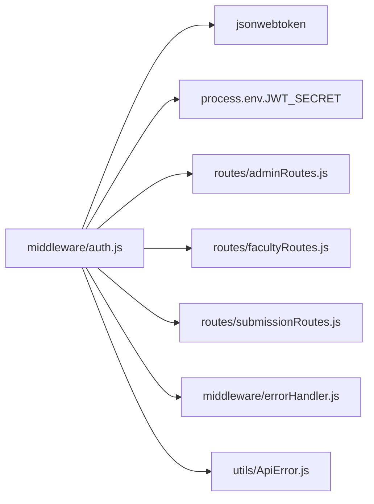

# Authentication Middleware

<cite>
**Referenced Files in This Document**
- [auth.js](file://middleware/auth.js)
- [authRoutes.js](file://routes/authRoutes.js)
- [User.js](file://models/User.js)
- [adminRoutes.js](file://routes/adminRoutes.js)
- [facultyRoutes.js](file://routes/facultyRoutes.js)
- [submissionRoutes.js](file://routes/submissionRoutes.js)
- [errorHandler.js](file://middleware/errorHandler.js)
- [ApiError.js](file://utils/ApiError.js)
- [catchAsync.js](file://utils/catchAsync.js)
- [validate.js](file://middleware/validate.js)
- [server.js](file://server.js)
</cite>

## Table of Contents
1. [Introduction](#introduction)
2. [Project Structure](#project-structure)
3. [Core Components](#core-components)
4. [Architecture Overview](#architecture-overview)
5. [Detailed Component Analysis](#detailed-component-analysis)
6. [Dependency Analysis](#dependency-analysis)
7. [Performance Considerations](#performance-considerations)
8. [Troubleshooting Guide](#troubleshooting-guide)
9. [Conclusion](#conclusion)
10. [Appendices](#appendices)

## Introduction
This document explains the JWT authentication middleware implementation used across the backend. It covers how the auth() factory function creates role-based authentication middleware, how JWT tokens are extracted from Authorization headers, and how the token payload is verified. It documents the role-based access control mechanism, error handling for missing tokens and invalid credentials, and integration with protected routes. Practical examples show middleware usage for different roles (student, faculty, admin), token format requirements, and common authentication scenarios. Security considerations, token expiration handling, and debugging tips are included.

## Project Structure
The authentication system spans middleware, routes, models, and utilities:
- Authentication middleware: middleware/auth.js
- Routes: routes/authRoutes.js, routes/adminRoutes.js, routes/facultyRoutes.js, routes/submissionRoutes.js
- User model: models/User.js
- Error handling: middleware/errorHandler.js, utils/ApiError.js, utils/catchAsync.js
- Validation: middleware/validate.js
- Server bootstrap: server.js

**Diagram sources**
- [auth.js](file://middleware/auth.js#L1-L25)
- [authRoutes.js](file://routes/authRoutes.js#L1-L85)
- [adminRoutes.js](file://routes/adminRoutes.js#L1-L184)
- [facultyRoutes.js](file://routes/facultyRoutes.js#L1-L172)
- [submissionRoutes.js](file://routes/submissionRoutes.js#L1-L159)
- [User.js](file://models/User.js#L1-L20)
- [errorHandler.js](file://middleware/errorHandler.js#L1-L53)
- [ApiError.js](file://utils/ApiError.js#L1-L17)
- [catchAsync.js](file://utils/catchAsync.js#L1-L8)
- [validate.js](file://middleware/validate.js#L1-L120)
- [server.js](file://server.js#L1-L92)

**Section sources**
- [server.js](file://server.js#L1-L92)

## Core Components
- JWT authentication middleware factory: Creates per-request handlers that extract and verify tokens, attach user payload to the request, enforce role checks, and handle errors.
- Token signing during login: Produces JWT with user identity and role, sets expiration.
- Protected routes: Apply auth("student"), auth("faculty"), or auth("admin") to restrict access.
- Error handling: Centralized error handler maps JWT errors to appropriate HTTP status codes.

Key implementation references:
- Middleware factory and role enforcement: [auth.js](file://middleware/auth.js#L3-L23)
- Token creation on login: [authRoutes.js](file://routes/authRoutes.js#L42-L46)
- Protected routes usage: [adminRoutes.js](file://routes/adminRoutes.js#L10-L18), [facultyRoutes.js](file://routes/facultyRoutes.js#L11-L13), [submissionRoutes.js](file://routes/submissionRoutes.js#L49-L51)
- Error mapping for JWT errors: [errorHandler.js](file://middleware/errorHandler.js#L28-L37)

**Section sources**
- [auth.js](file://middleware/auth.js#L1-L25)
- [authRoutes.js](file://routes/authRoutes.js#L29-L55)
- [adminRoutes.js](file://routes/adminRoutes.js#L10-L18)
- [facultyRoutes.js](file://routes/facultyRoutes.js#L11-L13)
- [submissionRoutes.js](file://routes/submissionRoutes.js#L49-L51)
- [errorHandler.js](file://middleware/errorHandler.js#L28-L37)

## Architecture Overview
The authentication flow integrates with Express routes and middleware. On successful login, the server signs a JWT containing user identity and role. Subsequent requests include the token in the Authorization header. The middleware extracts the token, verifies it, attaches the payload to the request, enforces role checks, and passes control to the route handler.

**Diagram sources**
- [authRoutes.js](file://routes/authRoutes.js#L29-L55)
- [auth.js](file://middleware/auth.js#L3-L23)

## Detailed Component Analysis

### JWT Authentication Middleware Factory
The auth() factory returns a middleware function that:
- Reads the Authorization header and extracts the token if it starts with "Bearer ".
- Verifies the token using the configured secret.
- Attaches the decoded payload to req.user.
- Enforces role-based access if a required role is specified.
- Handles missing tokens and invalid/expired tokens with appropriate HTTP responses.

**Diagram sources**
- [auth.js](file://middleware/auth.js#L3-L23)

**Section sources**
- [auth.js](file://middleware/auth.js#L3-L23)

### Token Extraction and Verification
- Header parsing: The middleware expects "Authorization: Bearer <token>".
- Verification: Uses the secret stored in the environment variable to verify the token signature.
- Payload attachment: On success, the decoded payload is attached to req.user for downstream use.

References:
- Header extraction and token parsing: [auth.js](file://middleware/auth.js#L6-L7)
- Token verification and payload attachment: [auth.js](file://middleware/auth.js#L11-L12)

**Section sources**
- [auth.js](file://middleware/auth.js#L6-L12)

### Role-Based Access Control
- Admin-only routes: Require auth("admin").
- Faculty-only routes: Require auth("faculty").
- Student-only routes: Require auth("student").
- Public routes: May use auth() without a role to authenticate only.

Examples:
- Admin routes: [adminRoutes.js](file://routes/adminRoutes.js#L10-L18)
- Faculty routes: [facultyRoutes.js](file://routes/facultyRoutes.js#L11-L13)
- Student routes: [submissionRoutes.js](file://routes/submissionRoutes.js#L49-L51)

**Section sources**
- [adminRoutes.js](file://routes/adminRoutes.js#L10-L18)
- [facultyRoutes.js](file://routes/facultyRoutes.js#L11-L13)
- [submissionRoutes.js](file://routes/submissionRoutes.js#L49-L51)

### Integration with Protected Routes
- Routes import the auth middleware and apply it to specific endpoints.
- Some routes accept a role argument; others accept no argument for general authentication.
- Route handlers can access req.user.userId and req.user.role to enforce additional permission checks.

Examples:
- Admin dashboard: [adminRoutes.js](file://routes/adminRoutes.js#L151-L182)
- Faculty assigned submissions: [facultyRoutes.js](file://routes/facultyRoutes.js#L136-L170)
- Student uploads: [submissionRoutes.js](file://routes/submissionRoutes.js#L48-L83)

**Section sources**
- [adminRoutes.js](file://routes/adminRoutes.js#L151-L182)
- [facultyRoutes.js](file://routes/facultyRoutes.js#L136-L170)
- [submissionRoutes.js](file://routes/submissionRoutes.js#L48-L83)

### Token Format Requirements
- Header format: "Authorization: Bearer <token>"
- Token payload: Must include fields used by the middleware (e.g., userId, role, name).
- Expiration: Tokens are signed with an expiration period during login.

References:
- Header format requirement: [auth.js](file://middleware/auth.js#L6-L7)
- Token payload fields used: [authRoutes.js](file://routes/authRoutes.js#L42-L46)
- Expiration setting: [authRoutes.js](file://routes/authRoutes.js#L45)

**Section sources**
- [auth.js](file://middleware/auth.js#L6-L7)
- [authRoutes.js](file://routes/authRoutes.js#L42-L46)

### Error Handling for Missing Tokens and Invalid Credentials
- Missing token: Returns 401 with a "Token missing" message.
- Invalid token: Returns 401 with an "Invalid token" message.
- Role mismatch: Returns 403 with a "Forbidden: Role mismatch" message.
- Centralized error mapping: JWT errors are mapped to 401 status codes.

References:
- Missing/invalid token handling: [auth.js](file://middleware/auth.js#L9-L21)
- Role mismatch handling: [auth.js](file://middleware/auth.js#L14-L16)
- JWT error mapping: [errorHandler.js](file://middleware/errorHandler.js#L28-L37)

**Section sources**
- [auth.js](file://middleware/auth.js#L9-L21)
- [auth.js](file://middleware/auth.js#L14-L16)
- [errorHandler.js](file://middleware/errorHandler.js#L28-L37)

### Practical Middleware Usage Examples
- Admin-only endpoint:
  - Apply auth("admin") to protect endpoints that manage users and submissions.
  - Reference: [adminRoutes.js](file://routes/adminRoutes.js#L10-L18)
- Faculty-only endpoint:
  - Apply auth("faculty") to protect endpoints for reviewing submissions.
  - Reference: [facultyRoutes.js](file://routes/facultyRoutes.js#L84-L133)
- Student-only endpoint:
  - Apply auth("student") to protect endpoints for uploading reports.
  - Reference: [submissionRoutes.js](file://routes/submissionRoutes.js#L48-L83)
- General authentication:
  - Apply auth() to authenticate without enforcing a role (e.g., viewing a single submission with permission checks).
  - Reference: [submissionRoutes.js](file://routes/submissionRoutes.js#L125-L157)

**Section sources**
- [adminRoutes.js](file://routes/adminRoutes.js#L10-L18)
- [facultyRoutes.js](file://routes/facultyRoutes.js#L84-L133)
- [submissionRoutes.js](file://routes/submissionRoutes.js#L48-L83)
- [submissionRoutes.js](file://routes/submissionRoutes.js#L125-L157)

### Token Expiration Handling
- Tokens are signed with an expiration period during login.
- If a token expires, verification fails and the centralized error handler maps the error to a 401 response.

References:
- Expiration setting: [authRoutes.js](file://routes/authRoutes.js#L45)
- JWT error mapping: [errorHandler.js](file://middleware/errorHandler.js#L34-L37)

**Section sources**
- [authRoutes.js](file://routes/authRoutes.js#L45)
- [errorHandler.js](file://middleware/errorHandler.js#L34-L37)

### Debugging Authentication Issues
Common issues and resolutions:
- Missing Authorization header or malformed Bearer prefix:
  - Ensure the client sends "Authorization: Bearer <token>".
  - Reference: [auth.js](file://middleware/auth.js#L6-L7)
- Invalid or expired token:
  - Regenerate a token via login or refresh flow.
  - Reference: [authRoutes.js](file://routes/authRoutes.js#L29-L55)
- Role mismatch:
  - Verify the user's role in the database and ensure the route requires the correct role.
  - References: [User.js](file://models/User.js#L11), [auth.js](file://middleware/auth.js#L14-L16)
- Centralized error logging:
  - Errors are logged to the console and returned with structured messages.
  - Reference: [errorHandler.js](file://middleware/errorHandler.js#L8)

**Section sources**
- [auth.js](file://middleware/auth.js#L6-L7)
- [authRoutes.js](file://routes/authRoutes.js#L29-L55)
- [User.js](file://models/User.js#L11)
- [errorHandler.js](file://middleware/errorHandler.js#L8)

## Dependency Analysis
The authentication middleware depends on:
- jsonwebtoken for token verification.
- Environment variables for the JWT secret.
- Route handlers for attaching req.user and enforcing additional permissions.
- Centralized error handling for mapping JWT errors.

**Diagram sources**
- [auth.js](file://middleware/auth.js#L1-L25)
- [adminRoutes.js](file://routes/adminRoutes.js#L1-L184)
- [facultyRoutes.js](file://routes/facultyRoutes.js#L1-L172)
- [submissionRoutes.js](file://routes/submissionRoutes.js#L1-L159)
- [errorHandler.js](file://middleware/errorHandler.js#L1-L53)
- [ApiError.js](file://utils/ApiError.js#L1-L17)

**Section sources**
- [auth.js](file://middleware/auth.js#L1-L25)
- [errorHandler.js](file://middleware/errorHandler.js#L1-L53)

## Performance Considerations
- Token verification occurs on every protected request; keep the JWT_SECRET secure and avoid unnecessary re-signing.
- Use short-lived tokens and implement refresh mechanisms if needed.
- Ensure route handlers do not perform heavy computations after authentication.

[No sources needed since this section provides general guidance]

## Troubleshooting Guide
- Symptom: 401 Unauthorized with "Token missing"
  - Cause: Missing Authorization header or missing "Bearer " prefix.
  - Fix: Send "Authorization: Bearer <token>".
  - Reference: [auth.js](file://middleware/auth.js#L9)
- Symptom: 401 Unauthorized with "Invalid token"
  - Cause: Signature mismatch or tampered token.
  - Fix: Re-authenticate to obtain a new token.
  - Reference: [auth.js](file://middleware/auth.js#L20)
- Symptom: 403 Forbidden with "Role mismatch"
  - Cause: User role does not match required role.
  - Fix: Ensure the user has the correct role or adjust the route's required role.
  - Reference: [auth.js](file://middleware/auth.js#L15)
- Symptom: 401 Unauthorized due to expiration
  - Cause: Token expired.
  - Fix: Re-login to acquire a new token.
  - Reference: [errorHandler.js](file://middleware/errorHandler.js#L34-L37)

**Section sources**
- [auth.js](file://middleware/auth.js#L9-L21)
- [auth.js](file://middleware/auth.js#L15)
- [errorHandler.js](file://middleware/errorHandler.js#L34-L37)

## Conclusion
The JWT authentication middleware provides a clean, reusable mechanism for protecting routes with role-based access control. It extracts tokens from Authorization headers, verifies them using a shared secret, and enforces role checks. Combined with centralized error handling and route-level permission checks, it offers a robust foundation for securing APIs.

[No sources needed since this section summarizes without analyzing specific files]

## Appendices

### Appendix A: How the Server Initializes Authentication
- Routes are mounted under /api/*.
- Authentication middleware is applied to protected endpoints.
- Error handling is registered globally.

References:
- Route mounting: [server.js](file://server.js#L63-L66)
- Global error handler: [server.js](file://server.js#L82)

**Section sources**
- [server.js](file://server.js#L63-L66)
- [server.js](file://server.js#L82)