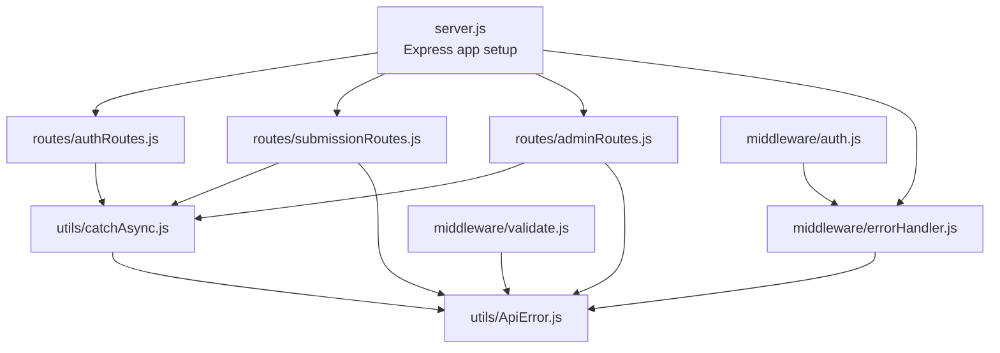
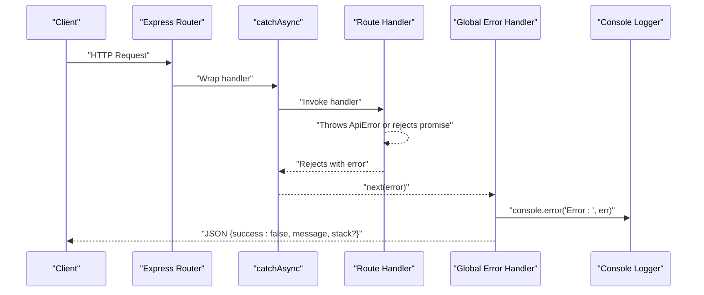
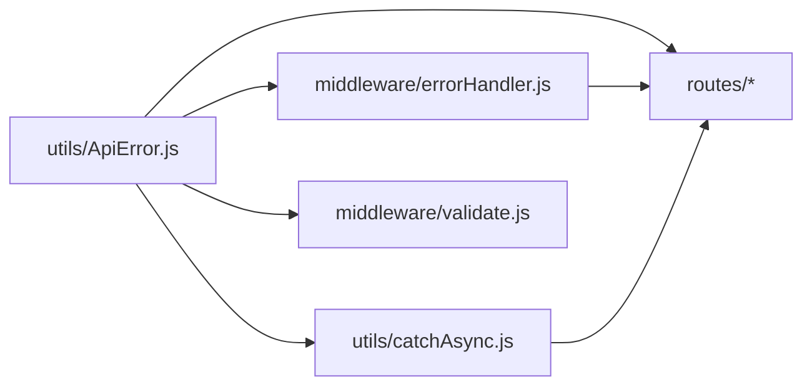

# Error Handling Middleware

<cite>
**Referenced Files in This Document**
- [ApiError.js](file://utils/ApiError.js)
- [catchAsync.js](file://utils/catchAsync.js)
- [errorHandler.js](file://middleware/errorHandler.js)
- [server.js](file://server.js)
- [authRoutes.js](file://routes/authRoutes.js)
- [submissionRoutes.js](file://routes/submissionRoutes.js)
- [adminRoutes.js](file://routes/adminRoutes.js)
- [validate.js](file://middleware/validate.js)
- [auth.js](file://middleware/auth.js)
</cite>

## Table of Contents
1. [Introduction](#introduction)
2. [Project Structure](#project-structure)
3. [Core Components](#core-components)
4. [Architecture Overview](#architecture-overview)
5. [Detailed Component Analysis](#detailed-component-analysis)
6. [Dependency Analysis](#dependency-analysis)
7. [Performance Considerations](#performance-considerations)
8. [Troubleshooting Guide](#troubleshooting-guide)
9. [Conclusion](#conclusion)
10. [Appendices](#appendices)

## Introduction
This document describes the centralized error handling system used across the backend application. It covers the custom error class ApiError, the async error handling utility catchAsync, and the global error middleware that standardizes error responses. It also documents practical usage patterns in routes, validation, and authentication, along with logging strategies, debugging techniques, and best practices for consistent error responses.

## Project Structure
The error handling system is organized around three core modules:
- utils/ApiError.js: Defines a custom error class extending the native Error with HTTP status semantics and operational flags.
- utils/catchAsync.js: Wraps async route handlers so thrown/rejected errors are forwarded to Express’s error-handling middleware.
- middleware/errorHandler.js: A global Express error handler that converts various error types into standardized JSON responses, logs errors, and sets appropriate HTTP status codes.

These modules integrate with the application server and route handlers to ensure consistent error behavior across the API.

**Diagram sources**
- [server.js](file://server.js#L1-L92)
- [errorHandler.js](file://middleware/errorHandler.js#L1-L53)
- [catchAsync.js](file://utils/catchAsync.js#L1-L8)
- [ApiError.js](file://utils/ApiError.js#L1-L17)
- [authRoutes.js](file://routes/authRoutes.js#L1-L85)
- [submissionRoutes.js](file://routes/submissionRoutes.js#L1-L159)
- [adminRoutes.js](file://routes/adminRoutes.js#L1-L184)
- [validate.js](file://middleware/validate.js#L1-L120)
- [auth.js](file://middleware/auth.js#L1-L25)

**Section sources**
- [server.js](file://server.js#L1-L92)

## Core Components
- ApiError: A custom error class that carries HTTP status codes, operational flags, and derived status strings. It captures stack traces and supports optional manual stacks.
- catchAsync: A wrapper that turns async route handlers into synchronous-looking functions while ensuring uncaught exceptions are passed to the error handler.
- errorHandler: A global Express error handler that:
  - Logs errors to the console.
  - Normalizes known database, validation, JWT, and file-upload errors into ApiError instances.
  - Responds with a consistent JSON envelope containing success flag, message, and optional stack in development mode.

Practical usage patterns:
- Route handlers wrap async logic with catchAsync to ensure thrown errors propagate to the global handler.
- Validation middleware throws ApiError on validation failures.
- Route handlers may throw ApiError directly for domain-specific errors (e.g., not found, forbidden, invalid input).
- Authentication middleware returns 401 responses directly for missing/expired/invalid tokens; JWT errors are normalized by the global handler.

**Section sources**
- [ApiError.js](file://utils/ApiError.js#L1-L17)
- [catchAsync.js](file://utils/catchAsync.js#L1-L8)
- [errorHandler.js](file://middleware/errorHandler.js#L1-L53)
- [validate.js](file://middleware/validate.js#L1-L120)
- [auth.js](file://middleware/auth.js#L1-L25)

## Architecture Overview
The error handling pipeline follows a predictable flow:
- Route handlers are wrapped with catchAsync.
- Errors thrown or promises rejected inside route handlers are caught and forwarded to the global error handler.
- The global error handler:
  - Logs the error.
  - Converts known error categories into ApiError instances.
  - Sends a standardized JSON response with success=false, message, and optional stack in development.

**Diagram sources**
- [catchAsync.js](file://utils/catchAsync.js#L1-L8)
- [errorHandler.js](file://middleware/errorHandler.js#L1-L53)

## Detailed Component Analysis

### ApiError Class
Purpose:
- Standardize error representation with HTTP status semantics.
- Provide operational/non-operational classification for observability.
- Derive a human-readable status label based on the HTTP status code.

Key behaviors:
- Inherits from the native Error class.
- Stores statusCode and isOperational flags.
- Sets status to "fail" for 4xx and "error" for 5xx based on the numeric code.
- Captures stack traces automatically or accepts a provided stack.
- Exports as a module for reuse across the application.

Implementation highlights:
- Constructor signature: statusCode, message, isOperational, stack.
- Conditional assignment of status derived from statusCode.
- Stack capture via Error.captureStackTrace when no explicit stack is provided.

Usage examples:
- Validation failures: validation middleware throws ApiError with 400.
- Domain errors: routes throw ApiError with 404/403/400 depending on context.
- File upload constraints: multer fileFilter throws ApiError with 400.

Best practices:
- Prefer ApiError for all application-level errors to ensure consistent handling.
- Use isOperational=true for user-triggered errors (validation, not found, forbidden).
- Use isOperational=false for infrastructure or unexpected errors.

**Section sources**
- [ApiError.js](file://utils/ApiError.js#L1-L17)

### catchAsync Utility
Purpose:
- Wrap async route handlers so thrown exceptions and rejected promises are forwarded to Express’s error-handling middleware.
- Prevent unhandled promise rejections and keep error handling centralized.

Behavior:
- Returns a function that invokes fn with req, res, next.
- Uses Promise.resolve(fn(...)) to normalize sync/async returns.
- Catches any error and forwards it to next, which routes to the global error handler.

Integration:
- Applied around route handlers in auth, submission, and admin routes.
- Ensures all async logic benefits from centralized error handling.

**Section sources**
- [catchAsync.js](file://utils/catchAsync.js#L1-L8)
- [authRoutes.js](file://routes/authRoutes.js#L1-L85)
- [submissionRoutes.js](file://routes/submissionRoutes.js#L1-L159)
- [adminRoutes.js](file://routes/adminRoutes.js#L1-L184)

### Global Error Handler
Responsibilities:
- Normalize known error categories into ApiError instances.
- Log all errors to the console.
- Send a standardized JSON response with success=false, message, and optional stack in development.

Normalization rules:
- CastError (Mongoose ObjectId parsing): maps to 404 "Resource not found".
- Duplicate key error (MongoDB 11000): maps to 400 "Duplicate field value entered".
- Mongoose ValidationError: maps to 400 with combined error messages.
- JsonWebTokenError and TokenExpiredError (JWT): maps to 401 "Invalid token" or "Token expired".
- Multer file size limit exceeded: maps to 400 with a fixed message.

Response shape:
- success: false
- message: error.message or fallback "Server Error"
- stack: included only in development mode

Logging:
- Errors are logged to the console with a prefix for easy filtering.

**Section sources**
- [errorHandler.js](file://middleware/errorHandler.js#L1-L53)

### Validation Middleware (Standardized Validation Errors)
Purpose:
- Aggregate validation errors from express-validator and convert them into ApiError instances with 400 status.

Behavior:
- Runs all provided validations.
- Collects messages from validation errors.
- Calls next(new ApiError(400, combinedMessages)) on failure.

Integration:
- Used in auth routes and submission routes to enforce input constraints.
- Ensures consistent error responses for malformed requests.

**Section sources**
- [validate.js](file://middleware/validate.js#L1-L120)

### Authentication Middleware (JWT Handling)
Purpose:
- Extract and verify JWT tokens; enforce role checks.
- Return 401 responses for missing or invalid tokens directly.
- Rely on the global error handler for JWT error normalization.

Behavior:
- Verifies token and attaches user payload to req.user.
- Enforces role requirement when specified.
- On token verification errors, returns 401 with a message.

Integration:
- Applied as middleware in routes requiring authentication.
- JWT errors are normalized by the global error handler.

**Section sources**
- [auth.js](file://middleware/auth.js#L1-L25)
- [errorHandler.js](file://middleware/errorHandler.js#L28-L37)

## Dependency Analysis
The error handling system exhibits low coupling and high cohesion:
- ApiError is a standalone class consumed by catchAsync, validation middleware, and route handlers.
- catchAsync depends only on Express’s next callback and wraps route handlers.
- errorHandler depends on ApiError and normalizes known error categories.
- Routes depend on catchAsync and may throw ApiError directly or indirectly via validation middleware.

Potential circular dependencies:
- None observed among the error handling modules.

External dependencies:
- Mongoose error types (CastError, ValidationError).
- JWT library error types (JsonWebTokenError, TokenExpiredError).
- Multer error codes (LIMIT_FILE_SIZE).

**Diagram sources**
- [ApiError.js](file://utils/ApiError.js#L1-L17)
- [catchAsync.js](file://utils/catchAsync.js#L1-L8)
- [errorHandler.js](file://middleware/errorHandler.js#L1-L53)
- [validate.js](file://middleware/validate.js#L1-L120)
- [authRoutes.js](file://routes/authRoutes.js#L1-L85)
- [submissionRoutes.js](file://routes/submissionRoutes.js#L1-L159)
- [adminRoutes.js](file://routes/adminRoutes.js#L1-L184)

**Section sources**
- [ApiError.js](file://utils/ApiError.js#L1-L17)
- [catchAsync.js](file://utils/catchAsync.js#L1-L8)
- [errorHandler.js](file://middleware/errorHandler.js#L1-L53)
- [validate.js](file://middleware/validate.js#L1-L120)
- [authRoutes.js](file://routes/authRoutes.js#L1-L85)
- [submissionRoutes.js](file://routes/submissionRoutes.js#L1-L159)
- [adminRoutes.js](file://routes/adminRoutes.js#L1-L184)

## Performance Considerations
- Logging: Console logging is synchronous and can block the event loop under heavy error loads. Consider integrating structured logging (e.g., Winston) for production environments.
- Response size: Avoid sending stack traces in production; the current implementation conditionally includes stack only in development mode.
- Error normalization: The global handler performs simple checks; ensure MongoDB and JWT libraries remain up-to-date to minimize unexpected error types.

[No sources needed since this section provides general guidance]

## Troubleshooting Guide
Common issues and resolutions:
- Uncaught exceptions in async handlers:
  - Ensure all async route handlers are wrapped with catchAsync.
  - Verify catchAsync is imported and applied consistently across routes.
- Validation errors not returning 400:
  - Confirm validation middleware is invoked before route logic.
  - Ensure validation errors are aggregated and next(new ApiError(400, ...)) is called.
- JWT errors not normalized:
  - If authentication middleware returns 401 directly, ensure the global error handler is registered after all routes.
  - Confirm JWT error types are present in the error handler’s normalization rules.
- Mongoose CastError not mapped to 404:
  - Ensure the error handler runs after routes and Mongoose middleware.
  - Verify the error name is CastError and not altered by upstream transformations.
- Multer file size errors not handled:
  - Confirm the error code is LIMIT_FILE_SIZE and the global error handler includes this case.

Debugging techniques:
- Enable development mode to receive stack traces in error responses for easier debugging.
- Add targeted console logs in errorHandler for specific error categories during local testing.
- Use a debugger to inspect error objects and their properties (name, code, message).

**Section sources**
- [catchAsync.js](file://utils/catchAsync.js#L1-L8)
- [errorHandler.js](file://middleware/errorHandler.js#L1-L53)
- [validate.js](file://middleware/validate.js#L1-L120)
- [auth.js](file://middleware/auth.js#L1-L25)

## Conclusion
The centralized error handling system provides a robust, consistent mechanism for managing errors across the application. By standardizing error representation with ApiError, normalizing known error categories in a global handler, and ensuring all async handlers are wrapped with catchAsync, the system improves maintainability, observability, and user experience. Validation and authentication middleware complement the system by throwing ApiError for user-triggered errors and delegating JWT errors to the global handler.

[No sources needed since this section summarizes without analyzing specific files]

## Appendices

### Practical Usage Scenarios

- Throwing ApiError in routes:
  - Submission not found: throw new ApiError(404, "Submission not found").
  - Forbidden access: throw new ApiError(403, "You can only view your own submissions").
  - Invalid input: throw new ApiError(400, "Invalid PDF file").

- Using catchAsync in routes:
  - Wrap async handlers with catchAsync to ensure thrown errors reach the global handler.

- Validation-driven errors:
  - Validation middleware aggregates messages and throws ApiError(400, combinedMessages).

- JWT error normalization:
  - Missing or invalid tokens are handled by authentication middleware; JWT errors are normalized to 401 by the global error handler.

- Consistent error response format:
  - All errors return JSON with success=false, message, and optional stack in development.

**Section sources**
- [submissionRoutes.js](file://routes/submissionRoutes.js#L124-L145)
- [adminRoutes.js](file://routes/adminRoutes.js#L120-L147)
- [authRoutes.js](file://routes/authRoutes.js#L58-L83)
- [validate.js](file://middleware/validate.js#L4-L16)
- [errorHandler.js](file://middleware/errorHandler.js#L28-L37)