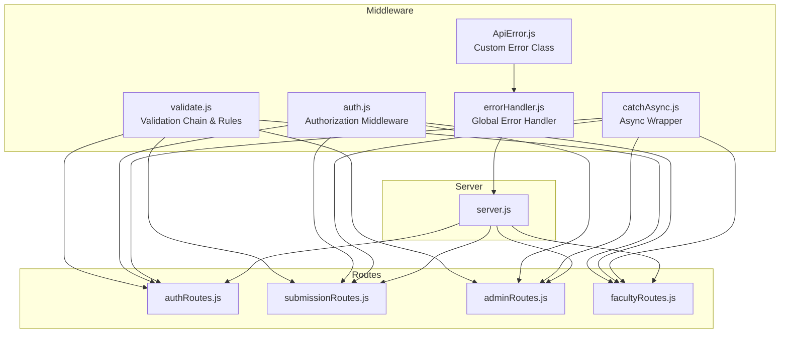
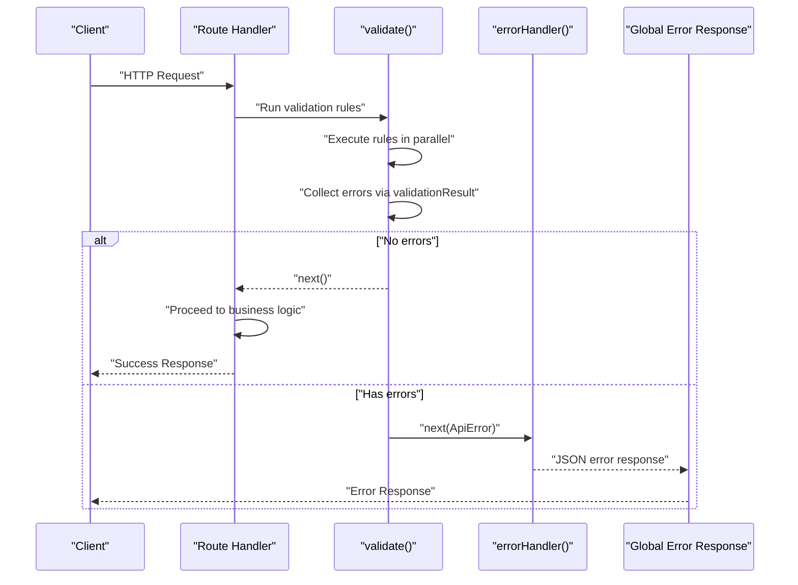
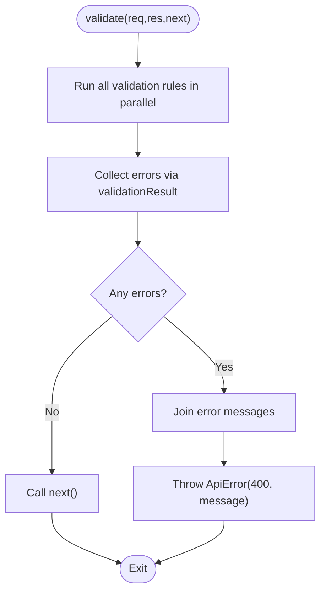
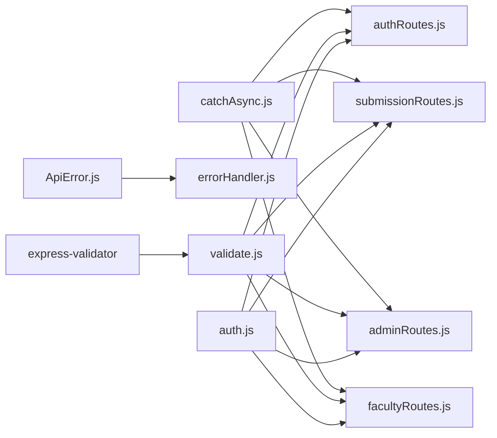

# Input Validation Middleware

<cite>
**Referenced Files in This Document**
- [validate.js](file://middleware/validate.js)
- [errorHandler.js](file://middleware/errorHandler.js)
- [ApiError.js](file://utils/ApiError.js)
- [catchAsync.js](file://utils/catchAsync.js)
- [auth.js](file://middleware/auth.js)
- [authRoutes.js](file://routes/authRoutes.js)
- [submissionRoutes.js](file://routes/submissionRoutes.js)
- [adminRoutes.js](file://routes/adminRoutes.js)
- [facultyRoutes.js](file://routes/facultyRoutes.js)
- [server.js](file://server.js)
- [package.json](file://package.json)
</cite>

## Table of Contents
1. [Introduction](#introduction)
2. [Project Structure](#project-structure)
3. [Core Components](#core-components)
4. [Architecture Overview](#architecture-overview)
5. [Detailed Component Analysis](#detailed-component-analysis)
6. [Dependency Analysis](#dependency-analysis)
7. [Performance Considerations](#performance-considerations)
8. [Troubleshooting Guide](#troubleshooting-guide)
9. [Conclusion](#conclusion)

## Introduction
This document explains the input validation middleware built with express-validator and how it integrates across the backend. It covers the validation chain pattern, rule definitions for different input types, error collection mechanisms, and how validation integrates with route handlers and the global error handling system. Practical examples demonstrate validating user registration inputs, submission data, and administrative operations. We also address validation rule chaining, conditional validation, and debugging validation issues.

## Project Structure
The validation system is centralized in a dedicated middleware module and consumed by route handlers. Supporting utilities standardize error handling and asynchronous execution.

**Diagram sources**
- [validate.js](file://middleware/validate.js#L1-L120)
- [errorHandler.js](file://middleware/errorHandler.js#L1-L53)
- [ApiError.js](file://utils/ApiError.js#L1-L17)
- [catchAsync.js](file://utils/catchAsync.js#L1-L8)
- [auth.js](file://middleware/auth.js#L1-L25)
- [authRoutes.js](file://routes/authRoutes.js#L1-L85)
- [submissionRoutes.js](file://routes/submissionRoutes.js#L1-L159)
- [adminRoutes.js](file://routes/adminRoutes.js#L1-L184)
- [facultyRoutes.js](file://routes/facultyRoutes.js#L1-L172)
- [server.js](file://server.js#L1-L92)

**Section sources**
- [server.js](file://server.js#L1-L92)
- [package.json](file://package.json#L1-L28)

## Core Components
- Validation Chain Pattern: A reusable validator factory composes express-validator rules and aggregates messages into a single error response.
- Rule Definitions: Predefined validation arrays target specific endpoints (registration, login, submission upload, admin assignment, faculty review, pagination).
- Error Collection Mechanism: Validation errors are collected and transformed into a custom error object passed to the global error handler.
- Route Integration: Validation middleware is chained before route handlers and async wrappers to ensure early failure and consistent error formatting.

Key implementation references:
- Validation factory and rule sets: [validate.js](file://middleware/validate.js#L4-L119)
- Error formatting and global handler: [errorHandler.js](file://middleware/errorHandler.js#L3-L50), [ApiError.js](file://utils/ApiError.js#L1-L17)
- Async wrapper: [catchAsync.js](file://utils/catchAsync.js#L1-L8)
- Authorization middleware: [auth.js](file://middleware/auth.js#L1-L25)

**Section sources**
- [validate.js](file://middleware/validate.js#L1-L120)
- [errorHandler.js](file://middleware/errorHandler.js#L1-L53)
- [ApiError.js](file://utils/ApiError.js#L1-L17)
- [catchAsync.js](file://utils/catchAsync.js#L1-L8)
- [auth.js](file://middleware/auth.js#L1-L25)

## Architecture Overview
The validation middleware sits between route handlers and business logic. It validates incoming requests, short-circuits on failure, and forwards errors to the global error handler.

**Diagram sources**
- [validate.js](file://middleware/validate.js#L4-L16)
- [errorHandler.js](file://middleware/errorHandler.js#L3-L50)
- [ApiError.js](file://utils/ApiError.js#L1-L17)

## Detailed Component Analysis

### Validation Chain Pattern Implementation
The validation factory accepts an array of express-validator rules, runs them in parallel, and checks for errors. On success, it calls next(); otherwise, it constructs a single error message and passes it to the error handler.

**Diagram sources**
- [validate.js](file://middleware/validate.js#L4-L16)
- [ApiError.js](file://utils/ApiError.js#L1-L17)

**Section sources**
- [validate.js](file://middleware/validate.js#L4-L16)

### Rule Definitions for Different Input Types
- Registration: Validates name, email, password, optional role, department, and year.
- Login: Validates email and password.
- Upload: Validates title, type, optional domain, and optional company/guide.
- Admin Assignment: Validates MongoDB ObjectIds for submission and faculty.
- Faculty Review: Validates submission ObjectId, decision enum, optional marks, and optional remarks.
- Pagination: Validates page and limit query parameters.

Examples of rule usage:
- Registration: [registerValidation](file://middleware/validate.js#L19-L44)
- Login: [loginValidation](file://middleware/validate.js#L46-L53)
- Upload: [uploadValidation](file://middleware/validate.js#L56-L72)
- Admin Assignment: [assignFacultyValidation](file://middleware/validate.js#L75-L82)
- Faculty Review: [reviewValidation](file://middleware/validate.js#L85-L99)
- Pagination: [paginationValidation](file://middleware/validate.js#L102-L109)

**Section sources**
- [validate.js](file://middleware/validate.js#L19-L109)

### Error Collection Mechanisms
- Aggregation: All validation messages are joined into a single string and passed as the error message.
- Standardization: Errors are wrapped in a custom error class with appropriate status codes and operational flags.
- Global Handling: The global error handler converts validation errors into a consistent JSON response.

References:
- Message aggregation: [validate.js](file://middleware/validate.js#L13)
- Custom error class: [ApiError.js](file://utils/ApiError.js#L1-L17)
- Global error handler: [errorHandler.js](file://middleware/errorHandler.js#L3-L50)

**Section sources**
- [validate.js](file://middleware/validate.js#L13-L14)
- [ApiError.js](file://utils/ApiError.js#L1-L17)
- [errorHandler.js](file://middleware/errorHandler.js#L3-L50)

### Integration with Route Handlers
Validation is integrated by composing the validation middleware with route handlers and an async wrapper. This ensures that validation errors are caught and formatted consistently.

Examples:
- Registration endpoint: [authRoutes.js](file://routes/authRoutes.js#L9-L26)
- Login endpoint: [authRoutes.js](file://routes/authRoutes.js#L29-L55)
- Upload endpoint: [submissionRoutes.js](file://routes/submissionRoutes.js#L48-L83)
- Admin assignment: [adminRoutes.js](file://routes/adminRoutes.js#L120-L148)
- Faculty review: [facultyRoutes.js](file://routes/facultyRoutes.js#L83-L133)

**Section sources**
- [authRoutes.js](file://routes/authRoutes.js#L9-L26)
- [authRoutes.js](file://routes/authRoutes.js#L29-L55)
- [submissionRoutes.js](file://routes/submissionRoutes.js#L48-L83)
- [adminRoutes.js](file://routes/adminRoutes.js#L120-L148)
- [facultyRoutes.js](file://routes/facultyRoutes.js#L83-L133)

### Error Formatting for Validation Failures
- Validation errors are aggregated and passed to the global error handler.
- The handler logs the error and responds with a structured JSON object containing the message and optional stack trace in development mode.

Reference:
- Error formatting: [errorHandler.js](file://middleware/errorHandler.js#L3-L50)

**Section sources**
- [errorHandler.js](file://middleware/errorHandler.js#L3-L50)

### Custom Validation Rules
- MongoDB ObjectId validation: Used for submissionId and facultyId in admin and faculty routes.
- Enum validation: Decision values restricted to specific choices.
- Length constraints: Enforced for strings and numeric ranges.
- Optional fields: Controlled via optional() to enable conditional validation.

References:
- ObjectId validation: [adminRoutes.js](file://routes/adminRoutes.js#L127-L136), [facultyRoutes.js](file://routes/facultyRoutes.js#L89-L124)
- Enum validation: [validate.js](file://middleware/validate.js#L89-L91)
- Optional fields: [validate.js](file://middleware/validate.js#L33-L43), [validate.js](file://middleware/validate.js#L64-L71), [validate.js](file://middleware/validate.js#L92-L98)

**Section sources**
- [adminRoutes.js](file://routes/adminRoutes.js#L127-L136)
- [facultyRoutes.js](file://routes/facultyRoutes.js#L89-L124)
- [validate.js](file://middleware/validate.js#L33-L43)
- [validate.js](file://middleware/validate.js#L64-L71)
- [validate.js](file://middleware/validate.js#L89-L91)
- [validate.js](file://middleware/validate.js#L92-L98)

### Practical Examples

#### Validating User Registration Inputs
- Endpoint: POST /api/auth/register
- Validation: Name, email, password, optional role, department, year
- Integration: Chained with authorization and async wrapper

References:
- Route: [authRoutes.js](file://routes/authRoutes.js#L9-L26)
- Rules: [registerValidation](file://middleware/validate.js#L19-L44)

**Section sources**
- [authRoutes.js](file://routes/authRoutes.js#L9-L26)
- [validate.js](file://middleware/validate.js#L19-L44)

#### Validating Submission Data
- Endpoint: POST /api/submissions/upload
- Validation: Title, type, optional domain, optional companyOrGuide
- Integration: Combined with file upload middleware and pagination validation

References:
- Route: [submissionRoutes.js](file://routes/submissionRoutes.js#L48-L83)
- Rules: [uploadValidation](file://middleware/validate.js#L56-L72)

**Section sources**
- [submissionRoutes.js](file://routes/submissionRoutes.js#L48-L83)
- [validate.js](file://middleware/validate.js#L56-L72)

#### Administrative Operations
- Assign Faculty: POST /api/admin/assign
- Validation: submissionId, facultyId as MongoDB ObjectIds
- Integration: Admin-only authorization and async wrapper

References:
- Route: [adminRoutes.js](file://routes/adminRoutes.js#L120-L148)
- Rules: [assignFacultyValidation](file://middleware/validate.js#L75-L82)

**Section sources**
- [adminRoutes.js](file://routes/adminRoutes.js#L120-L148)
- [validate.js](file://middleware/validate.js#L75-L82)

### Conditional Validation
- Optional fields: Use optional() to conditionally apply rules when present.
- Role-based validation: Combine authorization middleware with validation to tailor rules per role.

References:
- Optional fields: [validate.js](file://middleware/validate.js#L33-L43), [validate.js](file://middleware/validate.js#L64-L71), [validate.js](file://middleware/validate.js#L92-L98)
- Authorization: [auth.js](file://middleware/auth.js#L3-L23)

**Section sources**
- [validate.js](file://middleware/validate.js#L33-L43)
- [validate.js](file://middleware/validate.js#L64-L71)
- [validate.js](file://middleware/validate.js#L92-L98)
- [auth.js](file://middleware/auth.js#L3-L23)

### Integration with Error Handling System
- Validation errors are thrown as custom errors and handled by the global error handler.
- The handler standardizes responses, logs errors, and returns consistent JSON.

References:
- Validation to error: [validate.js](file://middleware/validate.js#L13-L14)
- Global handler: [errorHandler.js](file://middleware/errorHandler.js#L3-L50)
- Custom error class: [ApiError.js](file://utils/ApiError.js#L1-L17)

**Section sources**
- [validate.js](file://middleware/validate.js#L13-L14)
- [errorHandler.js](file://middleware/errorHandler.js#L3-L50)
- [ApiError.js](file://utils/ApiError.js#L1-L17)

## Dependency Analysis
The validation middleware depends on express-validator for rule composition and on a custom error class for standardized error responses. Route handlers depend on the validation middleware and the async wrapper.

**Diagram sources**
- [validate.js](file://middleware/validate.js#L1-L2)
- [errorHandler.js](file://middleware/errorHandler.js#L1)
- [ApiError.js](file://utils/ApiError.js#L1-L17)
- [catchAsync.js](file://utils/catchAsync.js#L1-L8)
- [authRoutes.js](file://routes/authRoutes.js#L1-L85)
- [submissionRoutes.js](file://routes/submissionRoutes.js#L1-L159)
- [adminRoutes.js](file://routes/adminRoutes.js#L1-L184)
- [facultyRoutes.js](file://routes/facultyRoutes.js#L1-L172)
- [auth.js](file://middleware/auth.js#L1-L25)

**Section sources**
- [validate.js](file://middleware/validate.js#L1-L2)
- [errorHandler.js](file://middleware/errorHandler.js#L1)
- [ApiError.js](file://utils/ApiError.js#L1-L17)
- [catchAsync.js](file://utils/catchAsync.js#L1-L8)
- [authRoutes.js](file://routes/authRoutes.js#L1-L85)
- [submissionRoutes.js](file://routes/submissionRoutes.js#L1-L159)
- [adminRoutes.js](file://routes/adminRoutes.js#L1-L184)
- [facultyRoutes.js](file://routes/facultyRoutes.js#L1-L172)
- [auth.js](file://middleware/auth.js#L1-L25)

## Performance Considerations
- Parallel Execution: Validation rules are executed in parallel to minimize latency.
- Early Exit: Validation errors short-circuit to prevent unnecessary downstream processing.
- Minimal Overhead: The validation factory avoids synchronous blocking and leverages built-in express-validator batching.

References:
- Parallel execution: [validate.js](file://middleware/validate.js#L6)
- Early exit: [validate.js](file://middleware/validate.js#L9-L11)

**Section sources**
- [validate.js](file://middleware/validate.js#L6-L11)

## Troubleshooting Guide
Common validation issues and resolutions:
- Validation fails silently: Ensure the validation middleware is placed before route handlers and the async wrapper.
- Mixed error types: Confirm that validation errors are thrown as custom errors and handled by the global error handler.
- Debugging tips:
  - Enable development mode to receive stack traces in error responses.
  - Temporarily log raw validation results to inspect individual rule outcomes.

References:
- Error logging and response: [errorHandler.js](file://middleware/errorHandler.js#L7-L49)
- Async wrapper behavior: [catchAsync.js](file://utils/catchAsync.js#L1-L8)

**Section sources**
- [errorHandler.js](file://middleware/errorHandler.js#L7-L49)
- [catchAsync.js](file://utils/catchAsync.js#L1-L8)

## Conclusion
The input validation middleware provides a robust, reusable mechanism for enforcing input correctness across the application. By leveraging express-validator’s validation chain pattern, collecting and standardizing errors, and integrating seamlessly with route handlers and the global error handling system, it ensures consistent validation behavior and predictable error responses. The modular design allows easy extension and maintenance of validation rules tailored to different roles and operations.