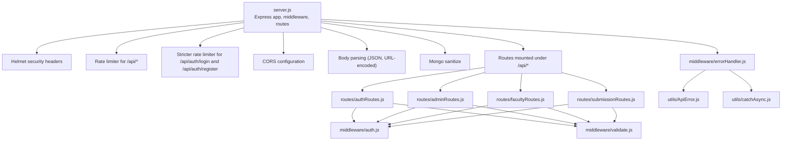
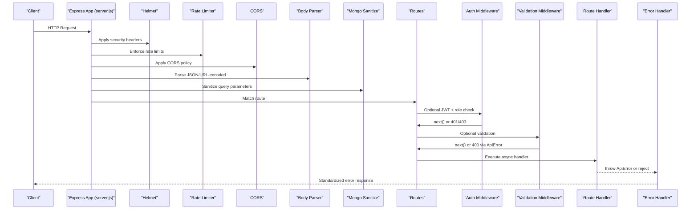
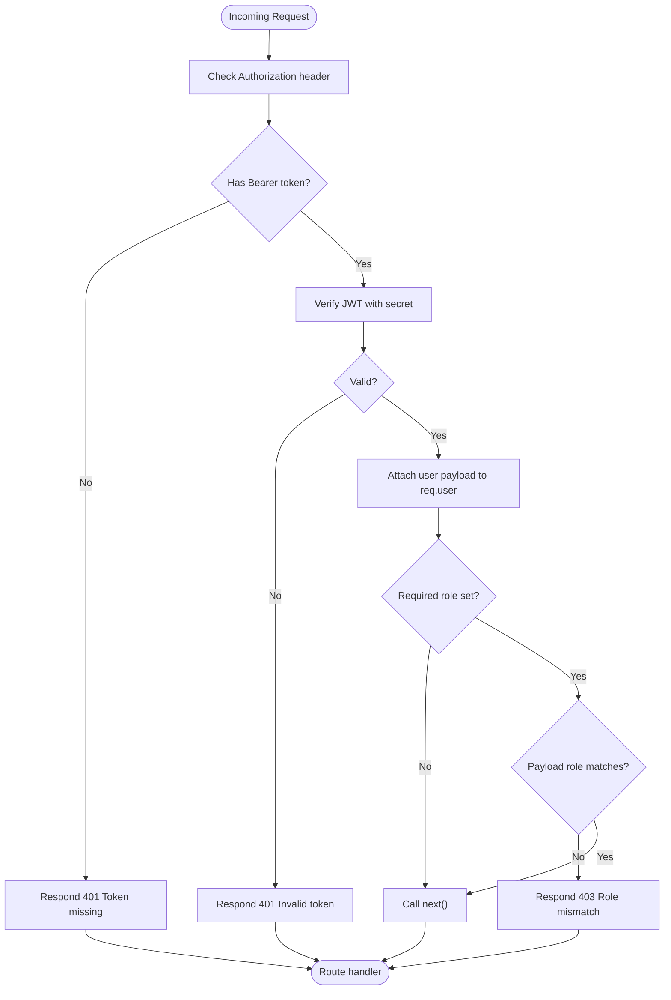
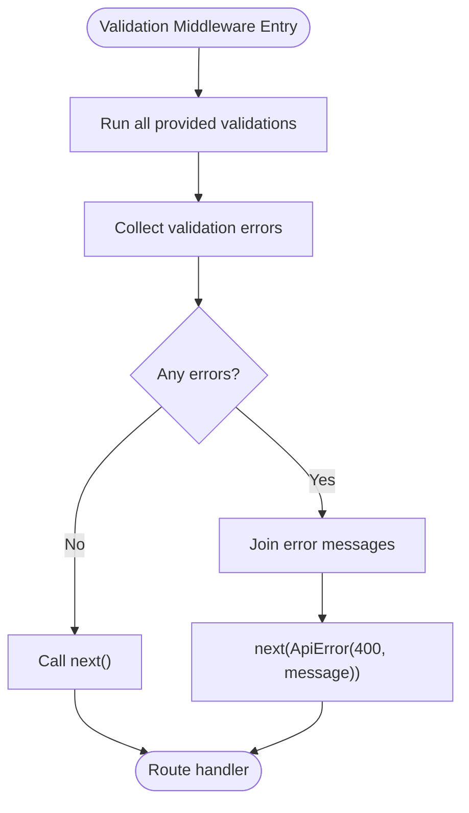
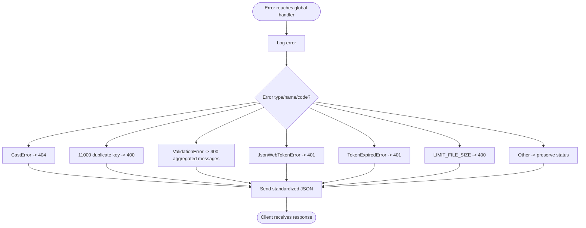
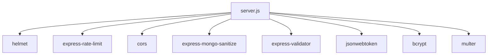

# Middleware & Security

<cite>
**Referenced Files in This Document**
- [server.js](file://server.js)
- [middleware/auth.js](file://middleware/auth.js)
- [middleware/validate.js](file://middleware/validate.js)
- [middleware/errorHandler.js](file://middleware/errorHandler.js)
- [utils/ApiError.js](file://utils/ApiError.js)
- [utils/catchAsync.js](file://utils/catchAsync.js)
- [routes/authRoutes.js](file://routes/authRoutes.js)
- [routes/adminRoutes.js](file://routes/adminRoutes.js)
- [routes/facultyRoutes.js](file://routes/facultyRoutes.js)
- [routes/submissionRoutes.js](file://routes/submissionRoutes.js)
- [package.json](file://package.json)
</cite>

## Table of Contents
1. [Introduction](#introduction)
2. [Project Structure](#project-structure)
3. [Core Components](#core-components)
4. [Architecture Overview](#architecture-overview)
5. [Detailed Component Analysis](#detailed-component-analysis)
6. [Dependency Analysis](#dependency-analysis)
7. [Performance Considerations](#performance-considerations)
8. [Troubleshooting Guide](#troubleshooting-guide)
9. [Conclusion](#conclusion)
10. [Appendices](#appendices)

## Introduction
This document explains the middleware and security architecture of the Express.js backend. It covers:
- Authentication middleware for JWT validation and role verification
- Input validation middleware using express-validator
- Centralized error handling middleware
- Helmet security headers configuration
- Rate limiting implementation
- Input sanitization against NoSQL injection
- Practical usage examples and custom error handling
- Security best practices, common attack prevention measures, and debugging techniques

## Project Structure
The application initializes middleware and routes in a central server file, then applies middleware stacks around route handlers. Validation and error handling are encapsulated in dedicated modules, while authentication middleware enforces JWT and role checks.

**Diagram sources**
- [server.js](file://server.js#L1-L92)
- [routes/authRoutes.js](file://routes/authRoutes.js#L1-L85)
- [routes/adminRoutes.js](file://routes/adminRoutes.js#L1-L184)
- [routes/facultyRoutes.js](file://routes/facultyRoutes.js#L1-L172)
- [routes/submissionRoutes.js](file://routes/submissionRoutes.js#L1-L159)
- [middleware/auth.js](file://middleware/auth.js#L1-L25)
- [middleware/validate.js](file://middleware/validate.js#L1-L120)
- [middleware/errorHandler.js](file://middleware/errorHandler.js#L1-L53)
- [utils/ApiError.js](file://utils/ApiError.js#L1-L17)
- [utils/catchAsync.js](file://utils/catchAsync.js#L1-L8)

**Section sources**
- [server.js](file://server.js#L1-L92)
- [package.json](file://package.json#L1-L28)

## Core Components
- Authentication middleware: Validates Authorization header, verifies JWT, attaches user payload to request, and enforces role checks.
- Input validation middleware: Uses express-validator to validate request bodies, params, and query strings, aggregates errors, and throws a custom error.
- Centralized error handler: Normalizes errors from various sources (validation, JWT, database, file upload) and responds consistently.
- Utilities: ApiError for structured error objects and catchAsync for wrapping async route handlers to forward exceptions to the error handler.

Key responsibilities:
- Enforce JWT-based authentication and role-based access control
- Sanitize inputs and enforce strict validation rules
- Provide consistent error responses and logging
- Apply security headers and rate limiting

**Section sources**
- [middleware/auth.js](file://middleware/auth.js#L1-L25)
- [middleware/validate.js](file://middleware/validate.js#L1-L120)
- [middleware/errorHandler.js](file://middleware/errorHandler.js#L1-L53)
- [utils/ApiError.js](file://utils/ApiError.js#L1-L17)
- [utils/catchAsync.js](file://utils/catchAsync.js#L1-L8)

## Architecture Overview
The middleware chain is applied globally before routes. Route handlers then apply:
- Optional authentication middleware (per route)
- Optional validation middleware (per route)
- Optional file upload middleware (per route)
- Async route handler wrapper
- Centralized error handling

**Diagram sources**
- [server.js](file://server.js#L18-L51)
- [middleware/auth.js](file://middleware/auth.js#L3-L23)
- [middleware/validate.js](file://middleware/validate.js#L4-L16)
- [middleware/errorHandler.js](file://middleware/errorHandler.js#L3-L50)
- [utils/ApiError.js](file://utils/ApiError.js#L1-L17)
- [utils/catchAsync.js](file://utils/catchAsync.js#L1-L8)

## Detailed Component Analysis

### Authentication Middleware (JWT + Role Verification)
Purpose:
- Extract Bearer token from Authorization header
- Verify JWT signature and decode payload
- Attach user info to request object
- Optionally enforce role-based access

Behavior:
- If no token present: respond with 401
- On invalid token: respond with 401
- On role mismatch: respond with 403
- On success: call next()

Usage examples:
- Admin-only endpoints: wrap route with auth("admin")
- Faculty-only endpoints: wrap route with auth("faculty")
- Student-only endpoints: wrap route with auth("student")
- Public endpoints: omit auth middleware

**Diagram sources**
- [middleware/auth.js](file://middleware/auth.js#L3-L23)

**Section sources**
- [middleware/auth.js](file://middleware/auth.js#L1-L25)
- [routes/adminRoutes.js](file://routes/adminRoutes.js#L10-L18)
- [routes/facultyRoutes.js](file://routes/facultyRoutes.js#L10-L42)
- [routes/submissionRoutes.js](file://routes/submissionRoutes.js#L48-L83)

### Input Validation Middleware (express-validator)
Purpose:
- Define reusable validation rules per endpoint
- Run validations asynchronously
- Aggregate errors and convert to a custom error

Behavior:
- Execute all provided validations
- If no errors: call next()
- If errors: collect messages and call next with ApiError(400)

Validation sets:
- Registration: name, email, password, optional role, optional department/year
- Login: email, password
- Upload: title, type, optional domain/companyOrGuide
- Admin assignment: submissionId, facultyId (MongoId)
- Faculty review: submissionId (MongoId), decision, optional marks, optional remarks
- Pagination: page (positive int), limit (bounded)

**Diagram sources**
- [middleware/validate.js](file://middleware/validate.js#L4-L16)

**Section sources**
- [middleware/validate.js](file://middleware/validate.js#L1-L120)
- [routes/authRoutes.js](file://routes/authRoutes.js#L9-L26)
- [routes/submissionRoutes.js](file://routes/submissionRoutes.js#L48-L83)
- [routes/adminRoutes.js](file://routes/adminRoutes.js#L120-L148)
- [routes/facultyRoutes.js](file://routes/facultyRoutes.js#L83-L133)

### Centralized Error Handler
Purpose:
- Normalize errors from validation, JWT, database, and file upload
- Log error details
- Respond with standardized JSON including success flag, message, and optional stack in development

Handled conditions:
- CastError (resource not found)
- Duplicate key (duplicate field)
- Validation errors (aggregate messages)
- JWT errors (invalid/expired)
- Multer file size limit exceeded

Response shape:
- success: false
- message: error message
- stack: included only in development

**Diagram sources**
- [middleware/errorHandler.js](file://middleware/errorHandler.js#L3-L50)
- [utils/ApiError.js](file://utils/ApiError.js#L1-L17)

**Section sources**
- [middleware/errorHandler.js](file://middleware/errorHandler.js#L1-L53)
- [utils/ApiError.js](file://utils/ApiError.js#L1-L17)

### Helmet Security Headers
Purpose:
- Harden HTTP headers to mitigate common attacks (XSS, clickjacking, MIME sniffing, etc.)

Applied configuration:
- Cross-Origin Resource Policy set to cross-origin

Effect:
- Improves defense-in-depth posture for static assets and API endpoints

**Section sources**
- [server.js](file://server.js#L18-L21)

### Rate Limiting
Purpose:
- Prevent brute force and abuse of endpoints

Configurations:
- General API rate limiter: 100 requests per 15 minutes per IP for /api/*
- Stricter limiter for auth endpoints: 5 requests per 15 minutes per IP for /api/auth/login and /api/auth/register

Scope:
- Applied to specific paths to balance usability and protection

**Section sources**
- [server.js](file://server.js#L23-L38)

### Input Sanitization (NoSQL Injection)
Purpose:
- Sanitize query parameters to prevent MongoDB operator injection

Applied middleware:
- express-mongo-sanitize

Effect:
- Removes potentially malicious keys from incoming query objects

**Section sources**
- [server.js](file://server.js#L50-L51)

### Practical Middleware Usage Examples
- Admin-only route with role enforcement and pagination:
  - Route: GET /api/admin/users
  - Middleware chain: auth("admin") -> validate(paginationValidation) -> catchAsync -> handler
  - Reference: [routes/adminRoutes.js](file://routes/adminRoutes.js#L21-L61)

- Faculty-only review endpoint with validation:
  - Route: POST /api/faculty/review
  - Middleware chain: auth("faculty") -> validate(reviewValidation) -> catchAsync -> handler
  - Reference: [routes/facultyRoutes.js](file://routes/facultyRoutes.js#L83-L133)

- Student-only upload with file handling, validation, and JWT:
  - Route: POST /api/submissions/upload
  - Middleware chain: auth("student") -> upload.single("report") -> validate(uploadValidation) -> catchAsync -> handler
  - Reference: [routes/submissionRoutes.js](file://routes/submissionRoutes.js#L48-L83)

- Authentication endpoints with validation:
  - POST /api/auth/register: validate(registerValidation) -> handler
  - POST /api/auth/login: validate(loginValidation) -> handler
  - Reference: [routes/authRoutes.js](file://routes/authRoutes.js#L9-L55)

**Section sources**
- [routes/adminRoutes.js](file://routes/adminRoutes.js#L21-L61)
- [routes/facultyRoutes.js](file://routes/facultyRoutes.js#L83-L133)
- [routes/submissionRoutes.js](file://routes/submissionRoutes.js#L48-L83)
- [routes/authRoutes.js](file://routes/authRoutes.js#L9-L55)

### Custom Error Handling
- ApiError class wraps standard Error with statusCode, operational flag, and status classification
- catchAsync wraps async route handlers so rejections and thrown errors are forwarded to the error handler
- errorHandler maps known error types to appropriate HTTP status codes and messages

References:
- [utils/ApiError.js](file://utils/ApiError.js#L1-L17)
- [utils/catchAsync.js](file://utils/catchAsync.js#L1-L8)
- [middleware/errorHandler.js](file://middleware/errorHandler.js#L1-L53)

**Section sources**
- [utils/ApiError.js](file://utils/ApiError.js#L1-L17)
- [utils/catchAsync.js](file://utils/catchAsync.js#L1-L8)
- [middleware/errorHandler.js](file://middleware/errorHandler.js#L1-L53)

## Dependency Analysis
External packages used for middleware and security:
- helmet: security headers
- express-rate-limit: rate limiting
- cors: cross-origin policy
- express-mongo-sanitize: NoSQL injection prevention
- express-validator: input validation
- jsonwebtoken: JWT signing/verification
- bcrypt: password hashing
- multer: file upload handling

**Diagram sources**
- [server.js](file://server.js#L1-L8)
- [package.json](file://package.json#L10-L22)

**Section sources**
- [package.json](file://package.json#L10-L22)

## Performance Considerations
- Rate limiting reduces load during bursts and protects sensitive endpoints
- Validation runs before heavy operations; early exit prevents unnecessary work
- Error normalization avoids expensive stack traces in production
- Body size limits reduce memory pressure
- Mongo sanitize adds minimal overhead while improving safety

[No sources needed since this section provides general guidance]

## Troubleshooting Guide
Common issues and resolutions:
- Missing Authorization header or malformed Bearer token:
  - Symptom: 401 Unauthorized
  - Resolution: Ensure Authorization header starts with "Bearer " followed by a valid JWT
  - Reference: [middleware/auth.js](file://middleware/auth.js#L9-L10)

- Invalid or expired JWT:
  - Symptom: 401 Unauthorized
  - Resolution: Regenerate token or extend expiration; verify JWT_SECRET correctness
  - Reference: [middleware/errorHandler.js](file://middleware/errorHandler.js#L28-L37)

- Role mismatch:
  - Symptom: 403 Forbidden
  - Resolution: Ensure user role matches required role for endpoint
  - Reference: [middleware/auth.js](file://middleware/auth.js#L14-L16)

- Validation errors:
  - Symptom: 400 Bad Request with aggregated messages
  - Resolution: Fix input according to validation rules
  - Reference: [middleware/validate.js](file://middleware/validate.js#L13-L14)

- Duplicate field error:
  - Symptom: 400 Bad Request indicating duplicate
  - Resolution: Change unique field value
  - Reference: [middleware/errorHandler.js](file://middleware/errorHandler.js#L16-L20)

- File upload size exceeded:
  - Symptom: 400 Bad Request about file size
  - Resolution: Reduce file size or adjust limits
  - Reference: [middleware/errorHandler.js](file://middleware/errorHandler.js#L39-L43)

- Database CastError:
  - Symptom: 404 Not Found for invalid ObjectId
  - Resolution: Verify resource IDs passed by clients
  - Reference: [middleware/errorHandler.js](file://middleware/errorHandler.js#L10-L14)

Debugging techniques:
- Enable development mode to include stack traces in error responses
- Inspect logs for error timestamps and stack traces
- Use Postman or curl to reproduce and capture exact request/response payloads
- Temporarily remove or relax rate limits to isolate endpoint issues

**Section sources**
- [middleware/auth.js](file://middleware/auth.js#L9-L21)
- [middleware/errorHandler.js](file://middleware/errorHandler.js#L10-L49)
- [middleware/validate.js](file://middleware/validate.js#L13-L14)

## Conclusion
The middleware and security layer provides robust protection and predictable error handling:
- JWT-based authentication with role enforcement
- Comprehensive input validation and sanitization
- Centralized error handling with normalized responses
- Helmet headers and rate limiting for resilience
- Utilities to streamline async error propagation

These patterns ensure secure, maintainable, and user-friendly APIs.

[No sources needed since this section summarizes without analyzing specific files]

## Appendices

### Security Best Practices
- Use HTTPS in production and configure Helmet appropriately
- Store secrets in environment variables and rotate them periodically
- Enforce strong password policies and hashing
- Validate and sanitize all inputs, including query parameters
- Apply rate limiting to all public endpoints, especially authentication
- Use role-based access control consistently across routes
- Log errors securely without exposing sensitive stack traces in production

[No sources needed since this section provides general guidance]