# Project Overview

<cite>
**Referenced Files in This Document**
- [package.json](file://package.json)
- [server.js](file://server.js)
- [models/User.js](file://models/User.js)
- [models/Submission.js](file://models/Submission.js)
- [models/Review.js](file://models/Review.js)
- [routes/authRoutes.js](file://routes/authRoutes.js)
- [routes/submissionRoutes.js](file://routes/submissionRoutes.js)
- [routes/adminRoutes.js](file://routes/adminRoutes.js)
- [routes/facultyRoutes.js](file://routes/facultyRoutes.js)
- [middleware/auth.js](file://middleware/auth.js)
- [middleware/validate.js](file://middleware/validate.js)
- [middleware/errorHandler.js](file://middleware/errorHandler.js)
- [utils/ApiError.js](file://utils/ApiError.js)
- [utils/catchAsync.js](file://utils/catchAsync.js)
</cite>

## Table of Contents
1. [Introduction](#introduction)
2. [Project Structure](#project-structure)
3. [Core Components](#core-components)
4. [Architecture Overview](#architecture-overview)
5. [Detailed Component Analysis](#detailed-component-analysis)
6. [Dependency Analysis](#dependency-analysis)
7. [Performance Considerations](#performance-considerations)
8. [Troubleshooting Guide](#troubleshooting-guide)
9. [Conclusion](#conclusion)

## Introduction
This academic submission portal backend is a Node.js/Express-based system designed to manage student academic submissions including internships, projects, and research papers. The platform implements role-based access control (RBAC) with three distinct roles: student, faculty, and admin. Students can submit PDF reports, faculty members can review and evaluate submissions, and administrators can manage users, assignments, and system statistics.

The system emphasizes security through JWT authentication, comprehensive input validation, rate limiting, and data sanitization. It provides a RESTful API with clear separation of concerns across middleware, models, routes, and utilities, making it maintainable and extensible for academic institution needs.

## Project Structure
The backend follows a modular architecture organized by functional domains:

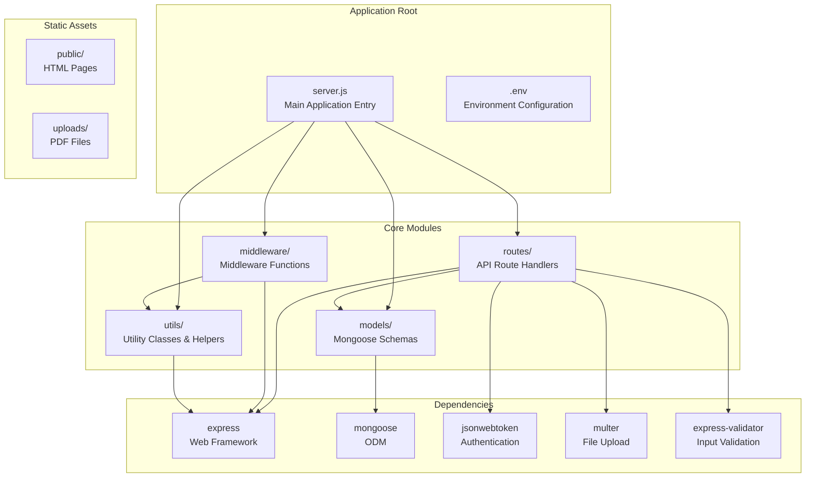

**Diagram sources**
- [server.js](file://server.js#L1-L92)
- [package.json](file://package.json#L10-L26)

The project is structured with clear separation of concerns:
- **server.js**: Central application configuration and middleware setup
- **routes/**: Role-specific API endpoints organized by functionality
- **models/**: Mongoose schemas defining the data structure
- **middleware/**: Cross-cutting concerns like authentication and validation
- **utils/**: Reusable utility classes and error handling

**Section sources**
- [server.js](file://server.js#L1-L92)
- [package.json](file://package.json#L1-L28)

## Core Components
The system consists of three primary data models that form the foundation of the academic submission workflow:

### User Model
The User model defines the authentication and authorization structure with three distinct roles:

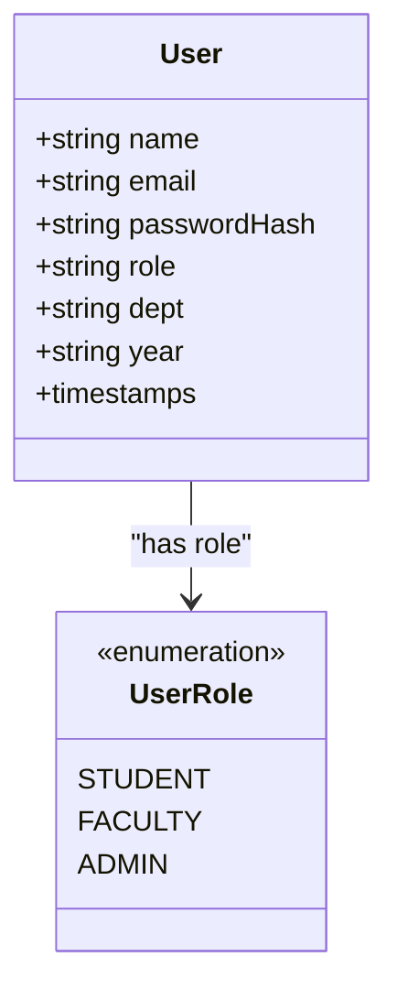

**Diagram sources**
- [models/User.js](file://models/User.js#L3-L18)

### Submission Model
The Submission model captures academic work with comprehensive metadata and workflow tracking:

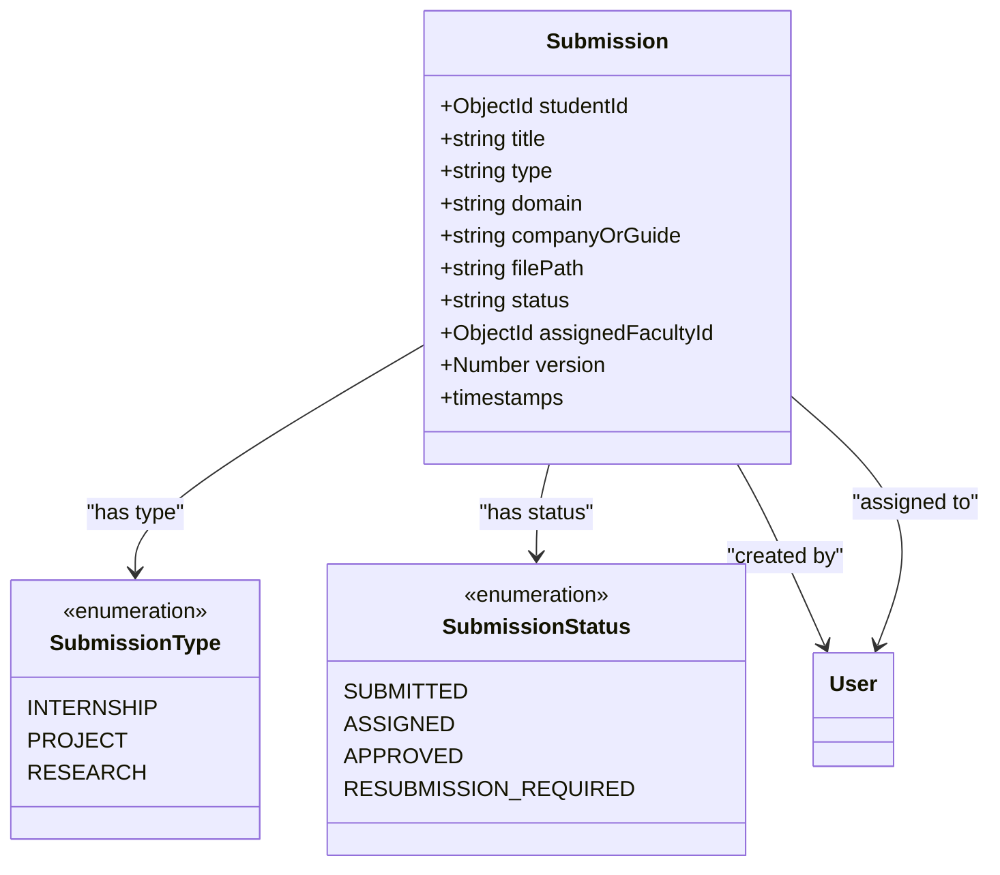

**Diagram sources**
- [models/Submission.js](file://models/Submission.js#L3-L28)

### Review Model
The Review model handles faculty evaluations with grading and feedback mechanisms:

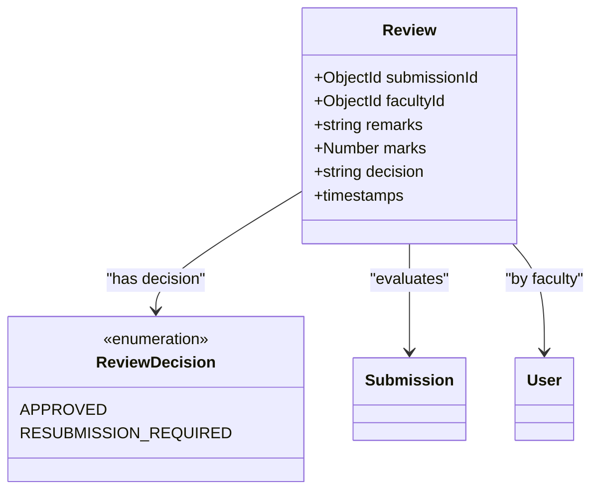

**Diagram sources**
- [models/Review.js](file://models/Review.js#L3-L16)

**Section sources**
- [models/User.js](file://models/User.js#L1-L20)
- [models/Submission.js](file://models/Submission.js#L1-L30)
- [models/Review.js](file://models/Review.js#L1-L18)

## Architecture Overview
The system implements a layered architecture with clear boundaries between presentation, business logic, and data access layers:

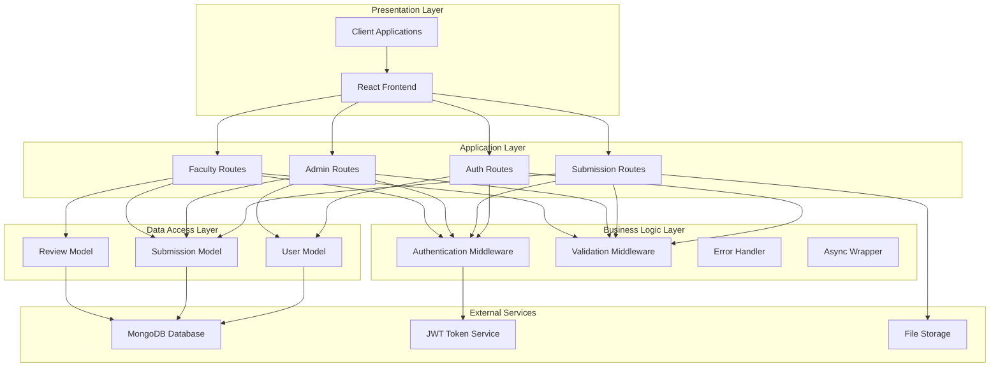

**Diagram sources**
- [server.js](file://server.js#L10-L66)
- [middleware/auth.js](file://middleware/auth.js#L3-L23)
- [middleware/validate.js](file://middleware/validate.js#L4-L16)

The architecture enforces several key principles:
- **Separation of Concerns**: Each layer has distinct responsibilities
- **Security First**: Authentication and authorization are enforced at route level
- **Validation Pipeline**: Input validation occurs before business logic
- **Error Management**: Centralized error handling with meaningful responses
- **Extensibility**: Modular design allows easy addition of new features

## Detailed Component Analysis

### Authentication and Authorization System
The authentication system implements JWT-based stateless authentication with role-based access control:

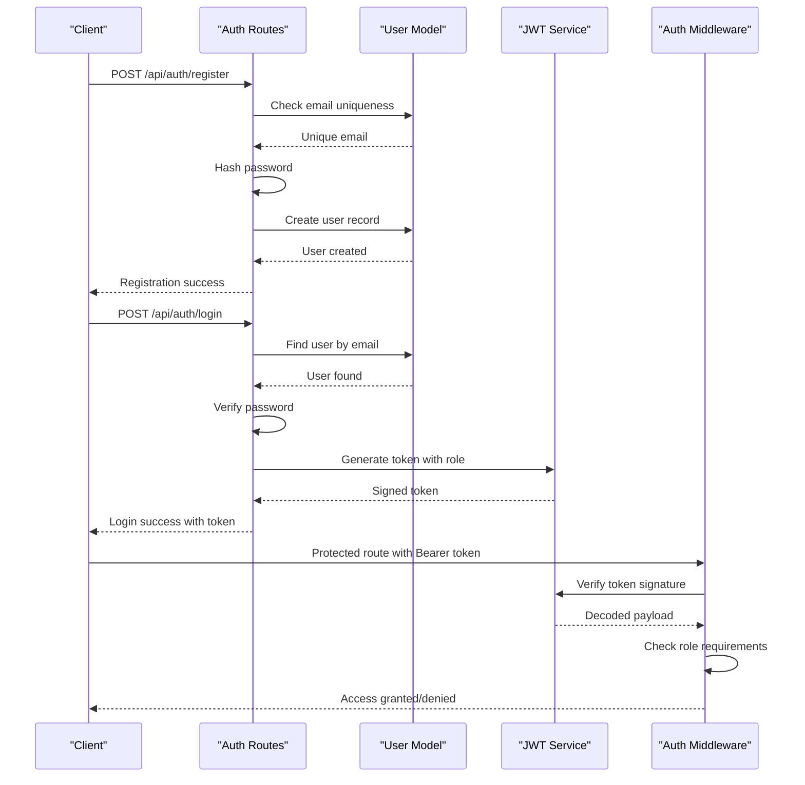

**Diagram sources**
- [routes/authRoutes.js](file://routes/authRoutes.js#L8-L55)
- [middleware/auth.js](file://middleware/auth.js#L3-L23)

Key security features include:
- **Password Hashing**: bcrypt with configurable cost factor
- **JWT Token Management**: Secure token generation with expiration
- **Role-Based Access Control**: Middleware enforces role requirements
- **Input Sanitization**: Protection against NoSQL injection attacks
- **Rate Limiting**: Prevents brute force authentication attempts

**Section sources**
- [routes/authRoutes.js](file://routes/authRoutes.js#L1-L85)
- [middleware/auth.js](file://middleware/auth.js#L1-L25)

### File Upload and PDF Validation System
The submission system implements secure PDF file handling with comprehensive validation:

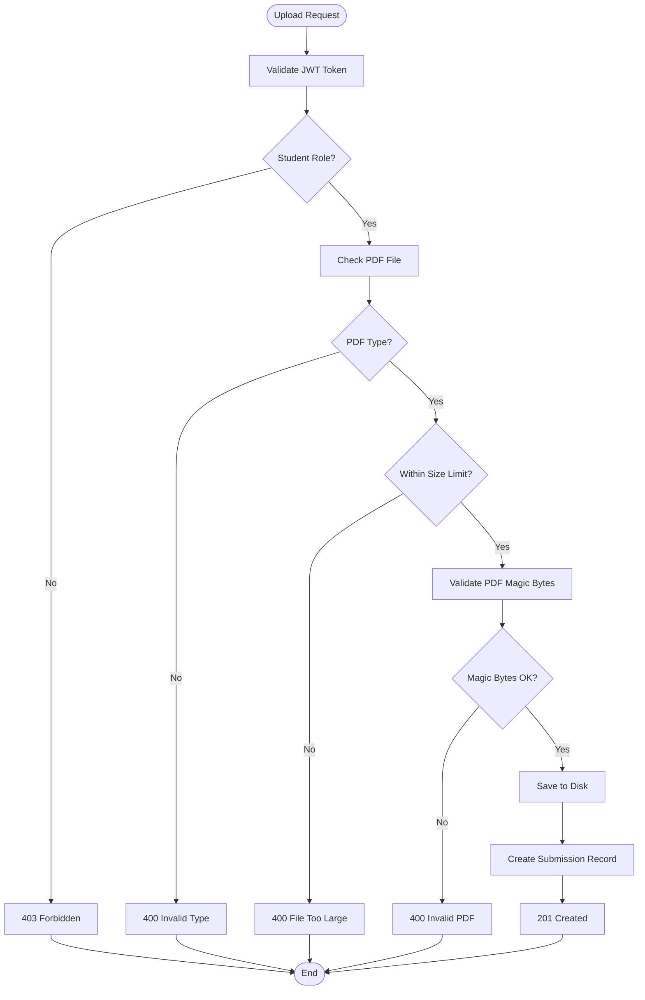

**Diagram sources**
- [routes/submissionRoutes.js](file://routes/submissionRoutes.js#L47-L83)

The file upload system ensures:
- **Type Safety**: Only PDF files are accepted
- **Size Limits**: Maximum 10MB file size enforcement
- **Content Validation**: Actual PDF magic number verification
- **Unique Naming**: UUID-based filename generation
- **Secure Storage**: Files stored in dedicated uploads directory

**Section sources**
- [routes/submissionRoutes.js](file://routes/submissionRoutes.js#L17-L45)

### Multi-Role Workflow Implementation
The system implements distinct workflows for each role with appropriate permissions and capabilities:

#### Student Workflow
Students can create submissions, track their progress, and view associated reviews:

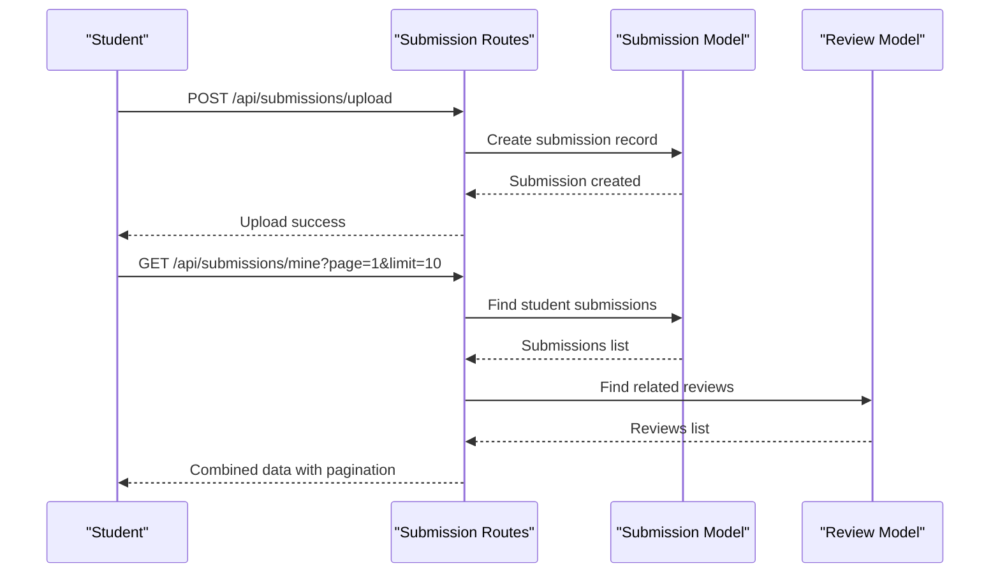

**Diagram sources**
- [routes/submissionRoutes.js](file://routes/submissionRoutes.js#L85-L121)

#### Faculty Workflow
Faculty members can manage assigned submissions, provide reviews, and track their evaluation history:

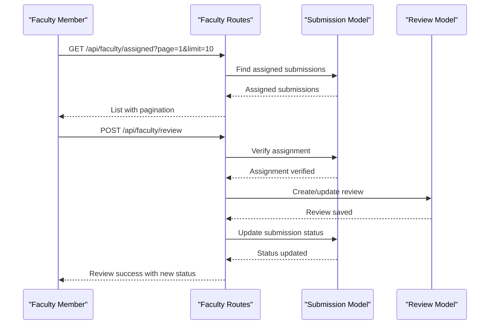

**Diagram sources**
- [routes/facultyRoutes.js](file://routes/facultyRoutes.js#L82-L133)

#### Administrator Workflow
Administrators have comprehensive oversight capabilities including user management, submission monitoring, and system statistics:

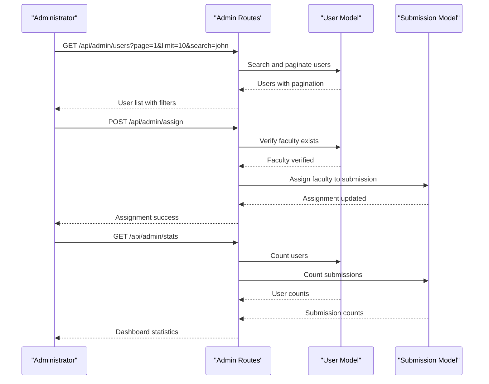

**Diagram sources**
- [routes/adminRoutes.js](file://routes/adminRoutes.js#L20-L182)

**Section sources**
- [routes/submissionRoutes.js](file://routes/submissionRoutes.js#L1-L159)
- [routes/facultyRoutes.js](file://routes/facultyRoutes.js#L1-L172)
- [routes/adminRoutes.js](file://routes/adminRoutes.js#L1-L184)

### Data Validation and Error Handling
The system implements comprehensive validation and error handling across all request paths:

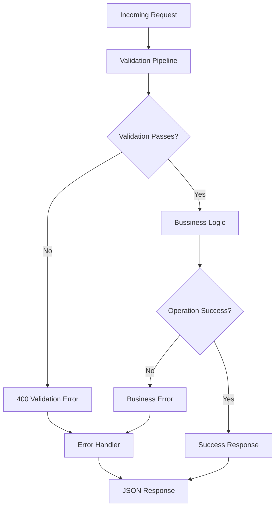

**Diagram sources**
- [middleware/validate.js](file://middleware/validate.js#L4-L16)
- [middleware/errorHandler.js](file://middleware/errorHandler.js#L3-L50)

The validation system covers:
- **Input Sanitization**: Removal of dangerous characters and patterns
- **Format Validation**: Email, password, and ID format checks
- **Business Rule Validation**: Domain-specific validation rules
- **Pagination Validation**: Page and limit parameter validation
- **Comprehensive Error Handling**: Consistent error responses across all layers

**Section sources**
- [middleware/validate.js](file://middleware/validate.js#L1-L120)
- [middleware/errorHandler.js](file://middleware/errorHandler.js#L1-L53)
- [utils/ApiError.js](file://utils/ApiError.js#L1-L17)
- [utils/catchAsync.js](file://utils/catchAsync.js#L1-L8)

## Dependency Analysis
The system maintains clean dependency relationships with minimal coupling between components:

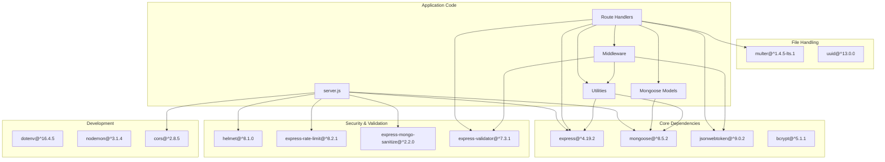

**Diagram sources**
- [package.json](file://package.json#L10-L26)

Key dependency characteristics:
- **Minimal External Dependencies**: Only essential packages for functionality
- **Security Focused**: Comprehensive security middleware and validation
- **Modern JavaScript**: ES6+ features with proper async/await patterns
- **Environment Configuration**: Flexible configuration through environment variables
- **Development Friendly**: Hot reload support and development scripts

**Section sources**
- [package.json](file://package.json#L1-L28)

## Performance Considerations
The system incorporates several performance optimization strategies:

### Database Optimization
- **Indexing Strategy**: Proper indexing on frequently queried fields (email, role, timestamps)
- **Population Efficiency**: Selective population of only required fields
- **Aggregation Pipelines**: Efficient counting and filtering operations
- **Connection Pooling**: Optimized MongoDB connection management

### Request Optimization
- **Rate Limiting**: Configured limits prevent abuse while maintaining responsiveness
- **Response Caching**: Strategic caching of static assets and frequently accessed data
- **Pagination**: Built-in pagination prevents large result sets
- **Selective Field Loading**: Minimal data transfer through selective field selection

### File Handling Optimization
- **Asynchronous Processing**: Non-blocking file operations
- **Memory Management**: Proper cleanup of temporary files
- **Concurrent Operations**: Parallel database queries where safe
- **Compression**: Optional compression for large responses

## Troubleshooting Guide
Common issues and their solutions:

### Authentication Issues
- **Token Missing**: Ensure Bearer token is included in Authorization header
- **Invalid Credentials**: Verify email/password combination and account activation
- **Role Mismatch**: Check user role matches required permissions
- **Token Expiration**: Implement automatic token refresh mechanisms

### File Upload Problems
- **File Type Errors**: Only PDF files are accepted
- **Size Limit Exceeded**: Files must be under 10MB
- **Permission Denied**: Verify user has student role
- **Storage Issues**: Check disk space and write permissions

### Database Connectivity
- **Connection Failures**: Verify MongoDB URI and network connectivity
- **Authentication Errors**: Check database credentials and user privileges
- **Timeout Issues**: Optimize queries and add appropriate indexes
- **Memory Leaks**: Monitor for proper resource cleanup

### API Error Responses
The system provides structured error responses with:
- **HTTP Status Codes**: Standardized response codes
- **Error Messages**: Descriptive messages for debugging
- **Stack Traces**: Development-only stack traces for debugging
- **Consistent Format**: Uniform error response structure

**Section sources**
- [middleware/errorHandler.js](file://middleware/errorHandler.js#L1-L53)
- [utils/ApiError.js](file://utils/ApiError.js#L1-L17)

## Conclusion
This academic submission portal backend provides a robust, secure, and scalable foundation for managing student academic submissions. The implementation demonstrates excellent architectural principles with clear separation of concerns, comprehensive security measures, and thoughtful error handling.

Key strengths include:
- **Security-First Design**: Multi-layered security with JWT, validation, and rate limiting
- **Role-Based Access Control**: Clear permission boundaries between student, faculty, and admin
- **Modular Architecture**: Clean separation enabling easy maintenance and extension
- **Comprehensive Validation**: End-to-end input validation and sanitization
- **Professional Error Handling**: Consistent and informative error responses

The system is well-suited for academic institutions requiring a centralized platform for managing various types of student academic work while maintaining strict security and access controls. Its modular design allows for future enhancements such as additional submission types, advanced analytics, or integration with external systems.