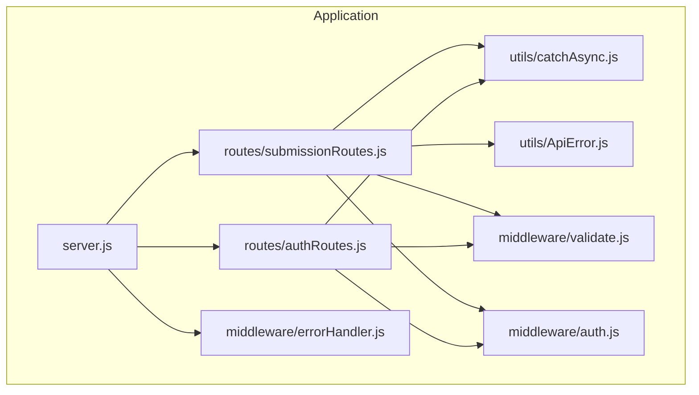
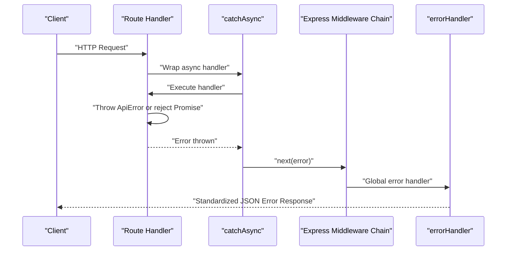
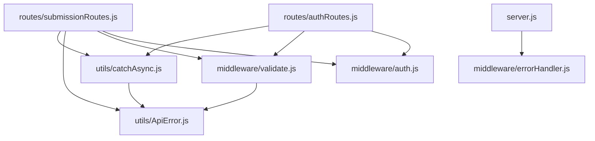

# Utility Functions & Helpers

<cite>
**Referenced Files in This Document**
- [catchAsync.js](file://utils/catchAsync.js)
- [ApiError.js](file://utils/ApiError.js)
- [errorHandler.js](file://middleware/errorHandler.js)
- [server.js](file://server.js)
- [authRoutes.js](file://routes/authRoutes.js)
- [submissionRoutes.js](file://routes/submissionRoutes.js)
- [auth.js](file://middleware/auth.js)
- [validate.js](file://middleware/validate.js)
</cite>

## Table of Contents
1. [Introduction](#introduction)
2. [Project Structure](#project-structure)
3. [Core Components](#core-components)
4. [Architecture Overview](#architecture-overview)
5. [Detailed Component Analysis](#detailed-component-analysis)
6. [Dependency Analysis](#dependency-analysis)
7. [Performance Considerations](#performance-considerations)
8. [Troubleshooting Guide](#troubleshooting-guide)
9. [Conclusion](#conclusion)

## Introduction
This document provides comprehensive documentation for the utility functions and helper modules that support the application's error handling and asynchronous operation management. It focuses on two primary utilities:
- An async error handling wrapper that simplifies promise error management
- A custom error class with proper HTTP status code mapping and error response formatting

The document also covers practical usage examples across the application, error handling patterns, debugging support, and integration with the middleware layer. It addresses common use cases for async operations, error propagation, and graceful error handling in API endpoints.

## Project Structure
The utility and helper modules are organized under dedicated folders:
- utils: Contains reusable utility functions and error classes
- middleware: Houses middleware components for authentication, validation, and error handling
- routes: Defines API endpoints that utilize the utilities for robust error management

**Diagram sources**
- [server.js](file://server.js#L1-L92)
- [authRoutes.js](file://routes/authRoutes.js#L1-L85)
- [submissionRoutes.js](file://routes/submissionRoutes.js#L1-L159)
- [errorHandler.js](file://middleware/errorHandler.js#L1-L53)
- [catchAsync.js](file://utils/catchAsync.js#L1-L8)
- [ApiError.js](file://utils/ApiError.js#L1-L17)
- [auth.js](file://middleware/auth.js#L1-L25)
- [validate.js](file://middleware/validate.js#L1-L120)

**Section sources**
- [server.js](file://server.js#L1-L92)
- [authRoutes.js](file://routes/authRoutes.js#L1-L85)
- [submissionRoutes.js](file://routes/submissionRoutes.js#L1-L159)
- [errorHandler.js](file://middleware/errorHandler.js#L1-L53)
- [catchAsync.js](file://utils/catchAsync.js#L1-L8)
- [ApiError.js](file://utils/ApiError.js#L1-L17)
- [auth.js](file://middleware/auth.js#L1-L25)
- [validate.js](file://middleware/validate.js#L1-L120)

## Core Components
This section introduces the two core utilities and their roles in the application.

- Async Error Handling Wrapper (catchAsync): A higher-order function that wraps async route handlers to automatically catch thrown errors and pass them to Express error-handling middleware.
- Custom Error Class (ApiError): A specialized error class extending the native Error with HTTP status code mapping, operational error classification, and stack trace capture.

These utilities enable consistent error propagation and standardized error responses across the application.

**Section sources**
- [catchAsync.js](file://utils/catchAsync.js#L1-L8)
- [ApiError.js](file://utils/ApiError.js#L1-L17)

## Architecture Overview
The error handling architecture integrates the async wrapper and custom error class with middleware and route handlers. The global error handler transforms various error types into structured JSON responses.

**Diagram sources**
- [catchAsync.js](file://utils/catchAsync.js#L1-L8)
- [errorHandler.js](file://middleware/errorHandler.js#L1-L53)
- [ApiError.js](file://utils/ApiError.js#L1-L17)

## Detailed Component Analysis

### Async Error Handling Wrapper (catchAsync)
The catchAsync wrapper simplifies error management for async route handlers by catching thrown errors and forwarding them to the next middleware function. This ensures consistent error propagation without repetitive try-catch blocks in route handlers.

Key characteristics:
- Accepts an async route handler function
- Returns a function compatible with Express middleware signature
- Wraps execution in Promise.resolve(fn(...)) and catches rejections
- Passes caught errors to next(next) for centralized handling

Usage patterns:
- Applied around async route handlers to centralize error handling
- Enables throwing errors directly within async handlers
- Integrates seamlessly with validation and authentication middleware

Common scenarios:
- Database operations that may fail
- File uploads with validation
- JWT verification and token-related operations

**Section sources**
- [catchAsync.js](file://utils/catchAsync.js#L1-L8)
- [authRoutes.js](file://routes/authRoutes.js#L9-L26)
- [authRoutes.js](file://routes/authRoutes.js#L29-L55)
- [authRoutes.js](file://routes/authRoutes.js#L58-L83)
- [submissionRoutes.js](file://routes/submissionRoutes.js#L48-L83)
- [submissionRoutes.js](file://routes/submissionRoutes.js#L85-L121)
- [submissionRoutes.js](file://routes/submissionRoutes.js#L124-L157)

### Custom Error Class (ApiError)
The ApiError class extends the native Error with HTTP status code mapping and operational error classification. It provides a standardized way to represent application-level errors with consistent formatting.

Core features:
- Status code mapping: Automatically sets status based on HTTP status code (4xx vs 5xx)
- Operational error flag: Distinguishes between operational and programming errors
- Stack trace capture: Captures stack traces for debugging in development
- Extends native Error: Maintains compatibility with standard error handling patterns

Status code mapping:
- 4xx series mapped to "fail" status
- 5xx series mapped to "error" status

Stack trace behavior:
- Uses provided stack if supplied
- Captures stack trace using Error.captureStackTrace otherwise

Integration points:
- Thrown directly in route handlers for immediate error propagation
- Used by validation middleware for input validation failures
- Consumed by the global error handler for consistent response formatting

**Section sources**
- [ApiError.js](file://utils/ApiError.js#L1-L17)
- [validate.js](file://middleware/validate.js#L4-L16)
- [submissionRoutes.js](file://routes/submissionRoutes.js#L33-L39)
- [submissionRoutes.js](file://routes/submissionRoutes.js#L54-L62)
- [submissionRoutes.js](file://routes/submissionRoutes.js#L132-L145)

### Global Error Handler (errorHandler)
The global error handler transforms various error types into standardized JSON responses. It handles database, validation, authentication, and file upload errors, ensuring consistent error reporting across the application.

Error type handling:
- CastError (Mongoose ObjectId): Converts to 404 resource not found
- Duplicate key errors (Mongoose): Converts to 400 duplicate field value
- Validation errors (Mongoose): Aggregates messages into 400 validation error
- JWT errors: Converts invalid token and expired token to 401
- Multer file size limits: Converts to 400 file size exceeded

Response structure:
- Always includes success: false
- Includes message from error
- Conditionally includes stack trace in development mode
- Sets appropriate HTTP status code

Logging:
- Logs error details to console for debugging

**Section sources**
- [errorHandler.js](file://middleware/errorHandler.js#L1-L53)
- [server.js](file://server.js#L82-L82)

### Authentication Middleware (auth)
The authentication middleware validates JWT tokens and attaches user information to the request object. It handles token extraction, verification, and role-based access control.

Key functionality:
- Extracts Bearer token from Authorization header
- Verifies JWT using secret key
- Attaches decoded user payload to req.user
- Supports optional role-based restrictions
- Returns 401 for missing or invalid tokens

Integration:
- Used as route-level middleware for protected endpoints
- Combined with catchAsync for error handling
- Works with ApiError for consistent error responses

**Section sources**
- [auth.js](file://middleware/auth.js#L1-L25)
- [authRoutes.js](file://routes/authRoutes.js#L58-L83)
- [submissionRoutes.js](file://routes/submissionRoutes.js#L125-L157)

### Validation Middleware (validate)
The validation middleware integrates with express-validator to validate request data and convert validation failures into ApiError instances.

Features:
- Runs validation rules asynchronously
- Collects validation errors
- Throws ApiError with aggregated messages on failure
- Allows next middleware to continue on success

Validation rules:
- Registration form validation (name, email, password, optional role, department, year)
- Login form validation (email, password)
- Upload form validation (title, type, optional domain, company/guide)
- Admin assignment validation (submissionId, facultyId)
- Faculty review validation (submissionId, decision, optional marks, remarks)
- Pagination validation (page, limit)

**Section sources**
- [validate.js](file://middleware/validate.js#L1-L16)
- [validate.js](file://middleware/validate.js#L18-L44)
- [validate.js](file://middleware/validate.js#L46-L53)
- [validate.js](file://middleware/validate.js#L55-L72)
- [validate.js](file://middleware/validate.js#L75-L82)
- [validate.js](file://middleware/validate.js#L85-L99)
- [validate.js](file://middleware/validate.js#L102-L109)

## Dependency Analysis
The error handling utilities form a cohesive dependency chain that ensures consistent error management across the application.

**Diagram sources**
- [catchAsync.js](file://utils/catchAsync.js#L1-L8)
- [ApiError.js](file://utils/ApiError.js#L1-L17)
- [validate.js](file://middleware/validate.js#L1-L120)
- [auth.js](file://middleware/auth.js#L1-L25)
- [errorHandler.js](file://middleware/errorHandler.js#L1-L53)
- [server.js](file://server.js#L1-L92)
- [authRoutes.js](file://routes/authRoutes.js#L1-L85)
- [submissionRoutes.js](file://routes/submissionRoutes.js#L1-L159)

**Section sources**
- [catchAsync.js](file://utils/catchAsync.js#L1-L8)
- [ApiError.js](file://utils/ApiError.js#L1-L17)
- [validate.js](file://middleware/validate.js#L1-L120)
- [auth.js](file://middleware/auth.js#L1-L25)
- [errorHandler.js](file://middleware/errorHandler.js#L1-L53)
- [server.js](file://server.js#L1-L92)
- [authRoutes.js](file://routes/authRoutes.js#L1-L85)
- [submissionRoutes.js](file://routes/submissionRoutes.js#L1-L159)

## Performance Considerations
- Error handling overhead: The catchAsync wrapper adds minimal overhead by wrapping handlers in Promise.resolve(fn(...))
- Validation performance: express-validator runs validations asynchronously; batching reduces overhead
- Error logging: Console logging in errorHandler is synchronous; consider structured logging for production
- Memory usage: ApiError instances are lightweight; stack trace capture can be disabled in production for performance
- Response size: Error responses include stack traces only in development mode to reduce payload size in production

## Troubleshooting Guide

### Common Error Scenarios and Solutions
- Database connection failures: Check MongoDB URI and network connectivity
- JWT verification errors: Verify JWT_SECRET environment variable and token expiration
- Validation failures: Review express-validator rules and input data format
- File upload errors: Check file size limits and MIME type filters
- Authentication failures: Verify token format and user existence

### Debugging Strategies
- Enable development mode to include stack traces in error responses
- Use console.error in errorHandler for detailed error logging
- Leverage ApiError.isOperational flag to distinguish between recoverable and unrecoverable errors
- Monitor rate limiting configurations for excessive 429 responses

### Error Response Format
All error responses follow a consistent structure:
- success: false
- message: Error message
- stack: Stack trace (development mode only)
- statusCode: HTTP status code

### Middleware Integration Tips
- Place errorHandler after all routes and middleware
- Ensure catchAsync wraps all async route handlers
- Use ApiError for consistent error propagation
- Combine validation middleware with catchAsync for comprehensive error handling

**Section sources**
- [errorHandler.js](file://middleware/errorHandler.js#L45-L49)
- [validate.js](file://middleware/validate.js#L13-L14)
- [auth.js](file://middleware/auth.js#L19-L21)

## Conclusion
The utility functions and helper modules provide a robust foundation for error handling and asynchronous operation management in the application. The catchAsync wrapper eliminates repetitive error handling boilerplate, while the ApiError class ensures consistent error representation and response formatting. Together with the global error handler and supporting middleware, they create a comprehensive error management ecosystem that enables graceful error handling, clear debugging support, and predictable API responses across all endpoints.

The modular design allows for easy extension and customization of error handling behavior while maintaining consistency and reliability throughout the application.